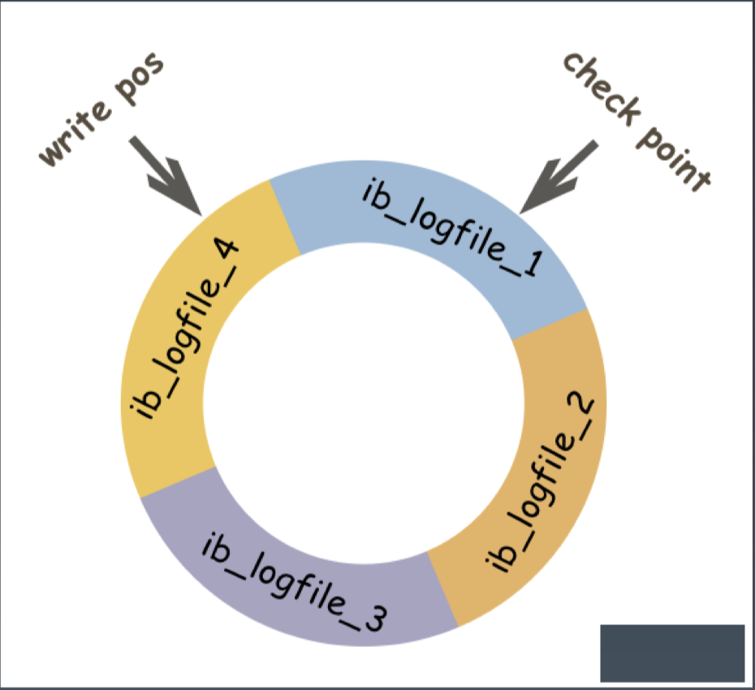
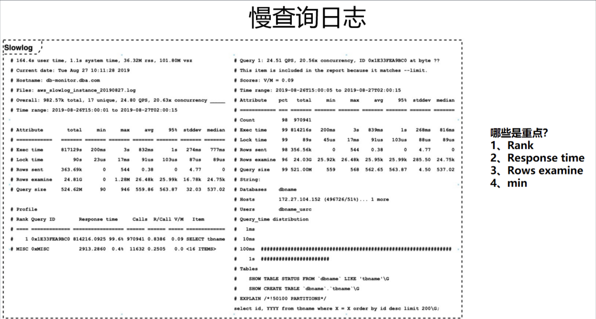
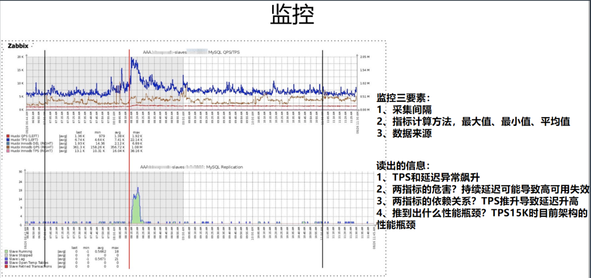
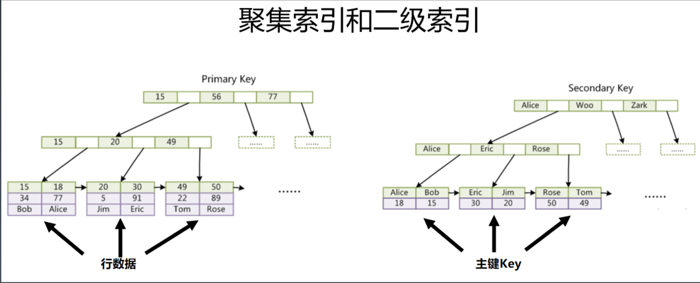
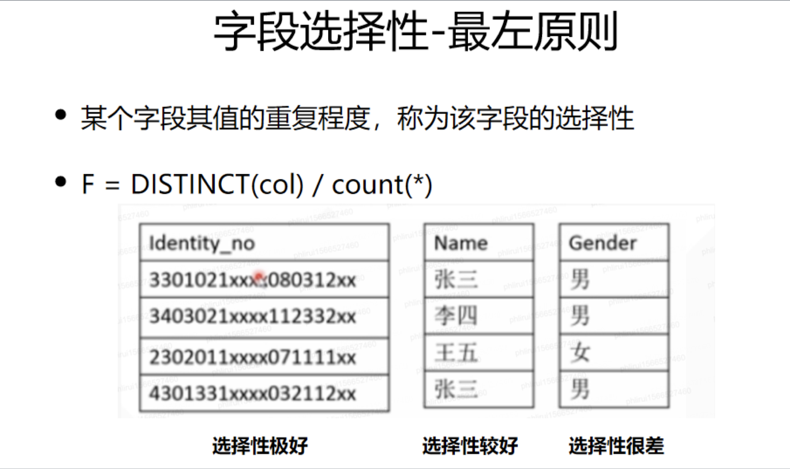

# 性能与SQL优化（二）

[toc]

## 一、MySQL事务与锁

### 1.1 事务可靠性模型 ACID

- Atomicity: 原子性, 一次事务中的操作要么全部成功, 要么全部失败
- Consistency: 一致性, 跨表、跨行、跨事务, 数据库始终保持一致状态
- Isolation: 隔离性, 可见性, 保护事务不会互相干扰, 包含4种隔离级别
- Durability:, 持久性, 事务提交成功后,不会丢数据。如电源故障, 系统崩溃

> MySQL的事务，主要由InnoDB来保证


### 1.2 锁

### （1）表级锁

意向锁: 表明事务稍后要进行哪种类型的锁定

•共享意向锁(IS): 打算在某些行上设置共享锁

排他意向锁(IX): 打算对某些行设置排他锁

Insert 意向锁: Insert 操作设置的间隙锁

其他
自增锁(AUTO-IN)

LOCK TABLES/DDL

查看锁的状态：

```
SHOW ENGINE INNODB STATUS;
```


### （2）行级锁(InnoDB)

记录锁(Record): 始终锁定索引记录，注意隐藏的聚簇索引;

间隙锁(Gap):
临键锁(Next-Key): 记录锁+间隙锁的组合; 可“锁定”表中不存在记录

谓词锁(Predicat): 空间索引

> 间隙锁：锁的是范围。  update、delete 尽量不要加范围，否则产生间隙锁。

### （3）死锁

-阻塞与互相等待

-增删改、锁定读

-死锁检测与自动回滚

-锁粒度与程序设计

### 1.3 四种常见的隔离级别

-  读未提交: READ UNCOMMITTED

- 读未提交: READ UNCOMMITTED

- 可重复读: REPEATABLE READ
- 可串行化: SERIALIZABLE

事务隔离是数据库的基础特征。

> 隔离级别的选择，影响“并发性、可靠性、一致性、可重复性”。

MySQL:

- 可以设置全局的默认隔离级别

- 可以单独设置会话的隔离级别

- InnoDB 实现与标准之间的差异

  > MySQL默认的隔离级别是 REPEATABLE READ， 而其他数据库默认隔离级别是 READ UNCOMMITTED。

### （1）读未提交: READ UNCOMMITTED

- 很少使用

- 不能保证一致性
- 脏读(dirty read) : 使用到从未被确认的数据(例如: 早期版本、回滚)

锁:

- 以非锁定方式执行
- 可能的问题: 脏读、幻读、不可重复读

### （2）读已提交: READ COMMITTED

- 每次查询都会设置和读取自己的新快照。
- 仅支持基于行的 bin-log
- UPDATE 优化: 半一致读(semi-consistent read)
- 不可重复读: 不加锁的情况下, 其他事务 UPDATE 或 DELETE 会对查询结果有影响
- 幻读(Phantom): 加锁后, 不锁定间隙, 其他事务可以 INSERT。

锁:

- 锁定索引记录, 而不锁定记录之间的间隙
- 可能的问题: 幻读、不可重复读

### （3） 可重复读: REPEATABLE READ

- MySQL InnoDB 的默认隔离级别
- 使用事务第一次读取时创建的快照
- 多版本技术

锁:

- 使用唯一索引的唯一查询条件时, 只锁定查找到的索引记录, 不锁定间隙。

- 其他查询条件, 会锁定扫描到的索引范围, 通过间隙锁或临键锁来阻止其他会话在这个 范围中插入值
- 可能的问题: InnoDB 不能保证没有幻读, 需要加锁

### （4）串行化: SERIALIZABLE

最严格的级别，事务串行执行，资源消耗最大；


问题回顾:

- 脏读(dirty read) : 使用到从未被确认的数据(例如: 早期版本、回滚)
- 不可重复读: 不加锁的情况下, 其他事务 update 或 delete 会对结果集有影响
- 幻读(Phantom): 加锁之后, 相同的查询语句, 在不同的时间点执行时, 产生不同的 结果集

怎么解决?

>  提高隔离级别、使用间隙锁或临键锁

### 1.4 事务的支撑

### （1）undo log: 撤消日志

> 分布式事务的原理也是这个

- 保证事务的原子性
- 用处: 事务回滚, 一致性读、崩溃恢复。
- 记录事务回滚时所需的撤消操作
- 一条 INSERT 语句，对应一条 DELETE 的 undo log
- 每个 UPDATE 语句，对应一条相反 UPDATE 的 undo log

保存位置:

- system tablespace (MySQL 5.7默认)  系统表空间
- undo tablespaces (MySQL 8.0默认)  单独放置

回滚段(rollback segment) ：后面会说

### （2）redo log: 重做日志

> 保证数据即持久化，又速度比较快

- 确保事务的持久性，防止事务提交后数据未刷新到磁盘就掉电或崩溃。
- 事务执行过程中写入 redo log,记录事务对数据页做了哪些修改
- 提升性能: WAL(Write-Ahead Logging) 技术, 先写日志, 再写磁盘
- 日志文件: ib_logfile0, ib_logfile1
- 日志缓冲: innodb_log_buffer_size
- 强刷: fsync()



### （3）MVCC 多版本并发控制

- 使 InnoDB 支持一致性读: READ COMMITTED 和 REPEATABLE READ
- 让查询不被阻塞、无需等待被其他事务持有的锁，这种技术手段可以增加并发性能
- InnoDB 保留被修改行的旧版本
- 查询正在被其他事务更新的数据时，会读取更新之前的版本
- 每行数据都存在一个版本号, 每次更新时都更新该版本
- 这种技术在数据库领域的使用并不普遍。 某些数据库, 以及某些 MySQL 存储引擎都不支持


聚簇索引的更新 = 替换更新

二级索引的更新 = 删除+新建


#### MVCC 实现机制

- 隐藏列

  > 每个事务需要有一个不断变化的版本号（时钟），比我版本高的数据，我不应该看到。

- 事务链表， 保存还未提交的事务，事务提交则会从链表中摘除

- Read view: 每个 SQL 一个, 包括 rw_trx_ids, low_limit_id, up_limit_id, low_limit_no 等

- 回滚段: 通过 undo log 动态构建旧版本数据

  > 类比：每个事务都是git上的一个commit，通过commit先后确定数据版本


### 1.5 事务和锁的演示

#### 第一个客户端

```
create table test.lockt(
id int(11) primary key,
col1 int(11),
col2 int(11)
) engine=InnoDB;

insert into lockt(id, col1, col2) values(1,1,1),(2,2,2),(3,3,3),(4,4,4),(5,5,5),(6,6,6),(7,7,7),(8,8,8);

-- 将自动事务关掉
set autocommit=0;
-- 开启一个事务
begin;

-- 第一个客户端先执行，查询上锁
select * from lockt where id=8 for update;

-- rollback, 去掉锁
rollback;

-- 第二次
update lockt set col2=133 where col2<5;

select from lockt;

-- 第三次，尝试锁范围
select * from lockt where id>7 for update;

-- 死锁演示
select * from lockt where id=8 for update;
update lockt set id=11 where id=7;
```

#### 第二个客户端

```
set autocommit=0;

begin;
--第二个客户端执行，发现被锁住了
update lockt set id=10 where id=8;

-- 第二次，同样被卡住
update lockt set col2=131 where col2<5;

-- 第三次
update locket set id=11 where id=8;

-- 死锁演示
select * from lockt where id=7 for update;
update lockt set id=12 where id=8;
```

#### 第三个客户端

```
-- 查看锁的状态
show engine innodb status\G;


```

## 二、两个问题

### 2.1 什么是复杂的SQL

- 连了巨多个表，10+；
- 条件非常复杂

### 2.2 now和sysDate的区别

- now() 取sql执行的时间；
- sysDate()取的是动态的实时时间

```mysql
SELECT NOW(),SYSDATE(),SLEEP(3),NOW(),SYSDATE();
```

## 三、SQL优化案例

### 3.1 从一个异类排序开始

前几行倒序，后几行正序，只需要在order by 后面添加函数。

**这样写，性能不行。**

```mysql
select * from lockt order by if(id<4, -id, id);
```

### 3.2 模拟一个需求

增加可以保存用户信息的数据表，必要的用户信息包含：

表名：t_user_info

| 字段      | 描述     |
| --------- | -------- |
| username  | 用户名   |
| password  | 密码     |
| name      | 姓名     |
| gender    | 性别     |
| id_number | 身份证号 |
| age       | 年龄     |
| state     | 状态     |

### 3.3 如何设计该表？

建议阅读《mysql规范》/dbaprinciples

#### （1）如何选择数据类型？

**数据类型是否越大越好？**

常规的数据类型有三类：Number、String、Time。

int(11),bigint(20) 括号里面的数字没有实际意义，主要用来显示用的，不影响这个类型本身存储的长度。


##### 串数据类型

有两种基本的串类型，分别为定长串和变成串。

- 定长串：接受长度固定的字符串，其长度是在创建表时指定的。

  > 定长列不允许多于指定的字符数目。它们分配的存储空间与指定的一样多。

  - char 0～255 个字符的定长串。它的长度必须在创建时指定，否则MySQL假定为CHAR(1)

- 变长串：存储可变长度的文本

  - varchar 0~65,535的变长字符串。如果在创建时指定为varchar(n), 则可以存储0到n个字符的变长串
  
  `char` 和`varchar` 最大的区别是：都需要前缀索引，当指定的长度不超过255时，需要1个字节长度作为前缀索引；当指定的长度超过255时，需要2个字节长度作为前缀索引。

**MySQL处理定长列远比处理变长列快得多。此外MySQL不允许对变长列（或一个列的可变部分）进行索引，这也将极大影响性能。**

选择合适数据类型的好处：

1. 总的数据，最终存储和网络传输的数据，数据量小；

   ```
   1row  =>4 字节  ==》 如果一行节省4字节
   100亿row=40G==》100亿行，就节省40G
   1GB/年=1.8$
   40G * 1.8$  = $72/年
   ```

2. 数据类型越合适，索引的类型也就越合适，相同内存，相同的B+树结构放入的数据就会更多，这样带来的容量和性能就会更好。

**数据类型也不是越小越好，可以适当增加容量。比如一开始，就用bigint，而不是使用int，这样，如果有一天容量变大，也可以应对。**

#### （2）存储引擎如何选择？

**没有其他特别因素就用InnoDB。**

| InnoDB                                                       | TokuDB                                                       |
| ------------------------------------------------------------ | ------------------------------------------------------------ |
| 1. 聚集索引；<br />2.锁力度时行锁；<br />3. InnoDB支持事务； | 1. 高压缩比，尤其适用于压缩与归档（1:12）；<br />2. 在线添加索引，不影响读写操作；<br />3. 支持完整的ACID特性和事务机制； |

#### （3）设计示例

```mysql
drop table if exists t_user_info;
create table if not exists t_user_info(
f_id     bigint(20)       not null auto_increment comment '自增ID',
f_username   varchar(20)  not null default '' comment '用户名',
f_password   varchar(20)  not null default '' comment '密码',
f_gender     tinyint(11)  not null default 0  comment '性别',
f_idno       char(19)     not null default '' comment '身份证号',
f_age        smallint(11) not null default 0  comment '年龄',
f_state      tinyint(11)  not null default 0  comment '状态',
f_created_at bigint(20)   not null default 0  comment '创建时间',
f_updated_at bigint(20)   not null default 0  comment '更新时间',
primary key(f_id)
)engine=InnoDB DEFAULT CHARSET=utf8mb4;
```

### 3.4 需求升级（二）

这三个SQL或数据库有什么坑？

- 根据身份证号查询用户详情信息

```mysql
select f_id,f_username,f_password,f_gender,f_idno,f_age,f_state,f_created_at,f_updated_at from t_user_info
where f_idno='xx';
```

- 可根据用户密码登陆

```muysql
select f_id,f_username,f_password,f_gender,f_idno,f_age,f_state,f_created_at,f_updated_at from t_user_info where f_username='xx' and f_password='xx';
```

- 可统计当日新增用户数

  如果数据量特别大，这条SQL会执行得比较慢，count(1) 是最快的。

```mysql
select count(*) from t_user_info where f_created_at>=1636790603 and f_created_at<=1636890603;
```

#### （1）隐式转换

> postgreSQL 不会隐式转换，这是很多开发人员喜欢的原因。

**MySQL隐式转换，查询条件类型写错照样运行，不报错，但隐式转换的时候不走索引。**

#### （2）不应该把密码等敏感信息写到SQL中

密码是敏感信息

小结：简单的SQL可能带来大的问题，where条件注意数据类型，避免类型转换。

### 3.5 需求升级（三）：定位问题的方法

系统经过一个月的运行，用户表增长约100万，DBA接到告警，CPU升高，查询越来越慢，请定位问题并给出解决方案。

定位问题的方法：

#### （1）慢查询日志；

> 参考：[MySQL慢查询日志总结](https://www.cnblogs.com/kerrycode/p/5593204.html)

慢查询日志的重点关注字段：

1. rank范围；
2. response time  响应时间；
3. rows examine   查询的行数；
4. min 运行时间的最小值；



慢查询日志基础：

1. 是否记录慢查询日志的功能，默认是关闭状态；

   ```shell
   mysql> show variables like '%slow_query_log%';
   +---------------------+---------------------------------------------------+
   | Variable_name       | Value                                             |
   +---------------------+---------------------------------------------------+
   | slow_query_log      | OFF                                               |
   | slow_query_log_file | /usr/local/mysql/data/lifeideMacBook-Pro-slow.log |
   +---------------------+---------------------------------------------------+
   2 rows in set (0.00 sec)
   ```

   开启慢查询日志功能：

   

2. 开启慢查询日志功能；

   - 临时方式，只对当前数据库生效，如果mysql服务重启，将会失效：`set global slow_query_log=1;`

   ```shell
   mysql> set global slow_query_log=1;
   Query OK, 0 rows affected (0.00 sec)
   
   mysql> show variables like '%slow_query_log%';
   +---------------------+---------------------------------------------------+
   | Variable_name       | Value                                             |
   +---------------------+---------------------------------------------------+
   | slow_query_log      | ON                                                |
   | slow_query_log_file | /usr/local/mysql/data/lifeideMacBook-Pro-slow.log |
   +---------------------+---------------------------------------------------+
   2 rows in set (0.00 sec)
   ```

   - 如果要永久生效，必须修改my.cnf 配置文件

     ```
     slow_query_log=1
     ```

3. `long_query_time`参数控制什么样的SQL会被记录

   默认为10秒，mysql源码里是**大于**`long_query_time` 会被记录，小于等于`long_query_time` 的不会别记录

   > 从MySQL 5.1开始，long_query_time开始以微秒记录SQL语句运行时间，之前仅用秒为单位记录。如果记录到表里面，只会记录整数部分，不会记录微秒部分。

   同一个会话下，设置完参数后，查看并没有变化，可以重新开启一个会话，或者使用`show global variables ` 命令

   ```shell
   mysql> show variables like 'long_query_time';
   +-----------------+-----------+
   | Variable_name   | Value     |
   +-----------------+-----------+
   | long_query_time | 10.000000 |
   +-----------------+-----------+
   1 row in set (0.00 sec)
   
   mysql> set global long_query_time=2;
   Query OK, 0 rows affected (0.00 sec)
   
   mysql> show variables like 'long_query_time';
   +-----------------+-----------+
   | Variable_name   | Value     |
   +-----------------+-----------+
   | long_query_time | 10.000000 |
   +-----------------+-----------+
   1 row in set (0.00 sec)
   
   mysql> show global variables like 'long_query_time';
   +-----------------+----------+
   | Variable_name   | Value    |
   +-----------------+----------+
   | long_query_time | 2.000000 |
   +-----------------+----------+
   1 row in set (0.01 sec)
   ```

4. 测试`select sleep(3)`;

   > 注意：设置完参数后，需要重新开一个会话，运行这条命令才会生效

5. 开启慢查询日志功能后，记录慢查询日志的方式有两种：记录文件，记录到表`mysql.slow_log`，这两种记录方式可以同时开启

   > log_output='FILE,TABLE'

   ```shell
   mysql> show variables like '%log_output%';
   +---------------+-------+
   | Variable_name | Value |
   +---------------+-------+
   | log_output    | FILE  |
   +---------------+-------+
   1 row in set (0.00 sec)
   
   mysql> set global log_output='TABLE';
   Query OK, 0 rows affected (0.00 sec)
   
   mysql> select * from mysql.slow_log;
   ```

6. 日志分析工具：`mysqldumpslow`

   ```
   得到返回记录集最多的10个SQL。
   mysqldumpslow -s r -t 10 /database/mysql/mysql06_slow.log
   得到访问次数最多的10个SQL
   mysqldumpslow -s c -t 10 /database/mysql/mysql06_slow.log
   得到按照时间排序的前10条里面含有左连接的查询语句。
   mysqldumpslow -s t -t 10 -g “left join” /database/mysql/mysql06_slow.log
   另外建议在使用这些命令时结合 | 和more 使用 ，否则有可能出现刷屏的情况。
   mysqldumpslow -s r -t 20 /mysqldata/mysql/mysql06-slow.log | more
   ```

#### （2）看应用和运维的监控：TPS

- zabbix
- orzdba  （DBA 的工具）



## 四、索引

针对上面问题，需求二是慢查询，解决方案时添加索引

### 4.1 添加索引

添加索引的语法：

> alter table table_name add index index_name(column_list);

#### （1）索引的类型

- Hash

  > 和HashTable的数据结构是一样的

- B-Tree/B+Tree

  > B+Tree是针对目前磁盘结构最合理的方式

**添加索引，会锁表。**

#### （2）主键为什么要单调递增？

**页分裂**，类比集合的扩容，非常消耗性能。

对MySQL的主键来说，主键用单调递增的值，对B+树调整，调整的幅度时最小的。

> 一个测试：
>
> 向单调递增主键的表插入1W条数据，需要99秒；
>
> 向不规则主键的表插入1W条数据，需要193秒；

### 4.2 索引的思考

#### （1）为什么不使用hash索引？

1. Hash索引仅仅能满足“=”，“IN”，不能支持范围查询

2. 对于排序操作Hash索引也满足不了

3. Hash索引不能避免表扫描

4. 当有大量数据的Hash值相等的时候Hash索引的性能大打折扣;

5. Hash 索引不能利用部分索引键查询；

   > 哈希索引也不支持多列联合索引的最左匹配规则;

#### （2）为什么B+Tree更适合做索引？

####  （3）为什么主键长度不能过大？

主键长度变大，会导致B+Tree上单节点放的索引个数变少；

#### （4）使用主键索引和非主键索引查询，那个查询速度快？

```
select * from t_user_info where f_id=xxx;  //f_id  primary： key
select * from t_user_info where f_user_name=xxx; // f_user_name： index
```

主键索引时聚集索引。除了主键之外的索引，都是二级索引。

- 聚集索引，指针指向数据；
- 二级索引，指针指向主键；

> 应用：对分库分表查询，建议先查询出主键，再根据主键进行查询。



### 4.3 字段选择性——最左原则

选择性好，就是区分度高；选择性不好，就是区分度不高。

F（区分度）= count(distinct col)/count(col);

> 所以，建索引，尽量建在区分度高的上面。




### 4.4 索引冗余

举个例子，建立三个索引：

- (username, namge, age)  : (username)、(username, name)

  > age区分度不高，不适合建索引

- (username, name) ： (username)、(name, username)、(name)

  > 比较好的方案

- (username)：(username,id)

  > 关联主键

### 4.5 修改表结构的危害

1. 索引重建；
2. 锁表；
3. 抢占资源；
4. 主从延时；

### 4.6 变更表结构的情况

- 业务初期考虑不周，字段类型使用不合适，需要变更数据类型；

- 随着业务的发展，需要增加新的字段；

  > 建议添加子表，不建议添加字段；

- 在无索引字段增加的业务查询，需要添加索引

  > 索引的调整，对DBA来说时比较常见的。

## 五、优化经验

### 5.1 大批量写入的优化

- PreparedStatement   add batch  减少 SQL 解析  （推荐）

- 多值

  > 关系代数中的元组，insert into table_name values(),()
  >
  > 好处；可以加快批量插入的速度；
  >
  > 坏处：对SQL解析引擎不友好；

  **扩展：**查询中，也可以使用元组：

  > select * from lockt where (id,col1)=(1,1);

- Load Data 直接导入

  > 最快的方式还是使用mysql的命令

- 索引和约束问题

  批量导入的时候，可以先把索引和约束都去掉。数据导入完之后，再把索引加上去，效率会更高一些。

### 5.2 数据更新（update/delete）

- 一定控制数据更新的范围，尽量精确到id
- 注意GAP锁（间隙锁）

### 5.3 模糊查询

like问题：

- like支持前缀匹配

  > 把%放后面，或不用%，否则不走索引

- 数据量大，考虑使用全文检索

  > solr/ES

  当我们有太多字段也需要高效查询的时候，建议走全文检索，不要加太多索引。

  索引只加在个别区分度高的字段上。

### 5.4 连接查询

####（1）驱动表选择问题

 在sql优化中，永远是以小表驱动大表。

参考：[mysql驱动表与被驱动表及join优化](https://www.cnblogs.com/JonaLin/p/11392613.html)]

[掌握MySQL连接查询到底什么是驱动表 ](https://www.cnblogs.com/sy270321/p/12760211.html)

- MySQL连接缓冲区，只有无法使用索引时才会使用连接缓冲区

- 查询时最好不要把 * 作为查询的字段，而是需要什么字段查询什么字段，这样缓冲区能够缓冲足够多的行

```
驱动表与被驱动表
当连接查询没有where条件时
   先了解在join连接时哪个表是驱动表，哪个表是被驱动表：
    1.当使用left join时，左表是驱动表，右表是被驱动表
    2.当使用right join时，右表是驱动表，左表是被驱动表
    3.当使用join时，mysql会选择数据量比较小的表作为驱动表，大表作为被驱动表
    join查询如何选择驱动表与被驱动表
　　     在sql优化中，永远是以小表驱动大表。
当连接查询有where条件时，带where条件的表是驱动表，否则是被驱动表
```

#### （2）避免笛卡尔积

### 5.5 索引失效

索引失效的情况汇总：

参考：[索引失效的情况](https://www.cnblogs.com/wdss/p/11186411.html)

- NULL、not、not in ，函数等。

- 在索引字段上使用not，<>，!=。不等于操作符是永远不会用到索引的，因此对它的处理只会产生全表扫描。 优化方法： key<>0 改为 key>0 or key<0

  > 在索引列上使用 IS NULL 或 IS NOT NULL操作

  表和SQL越简单越好。

- 减少使用or，可以使用union ，以及前面使用的like

  > or语句前后没有同时使用索引。当or左右查询字段只有一个是索引，该索引失效，只有当or左右查询字段均为索引时，才会生效。

  ```
  expain select * from emp where empno='13' or sal=800;
  ```

- 组合索引，不使用第一列索引，索引失效

  [MySQL复合索引](https://www.begtut.com/mysql/mysql-composite-index.html)。

  > MySQL允许您创建一个最多包含16列的复合索引

  ```
  -- 创建索引方法一：
  CREATE TABLE table_name (
      c1 data_type PRIMARY KEY,
      c2 data_type,
      c3 data_type,
      c4 data_type,
      INDEX index_name (c2,c3,c4)
  ); 
  
  -- 创建索引方法二：
  CREATE INDEX index_name 
  ON table_name(c2,c3,c4); 
  
  -- 如果您在（c1，c2，c3）上有复合索引，则您将在以下列组合之一上建立索引搜索功能
  (c1)
  (c1,c2)
  (c1,c2,c3) 
  ```

- 数据类型出现隐式转换，索引失效

**大数据量下，放弃所有条件组合都走索引的幻想，建议用全文索引；**

**必要时，使用force index 来强制查询走某个索引。**

> mysql的执行计划有时候不按照我们的预期走。


### 5.6 查询SQL到底怎么设计

- 查询数据量和查询次数的平衡

- 避免不必须的大量重复数据传输

  > 数据量太大的时候就比较慢

- 避免使用临时文件排序或临时表

  > 一次操作的数据量太大，mysql会用到临时文件，mysql原本的缓存不够用，需要用到本地空间，这就会很慢。

- 分析类需求，可以用汇总表

  中间表

## 六、实战：常见场景分析

### 6.1 怎么实现主键ID

- 自增

  > 使用表自身的自增 mysql auto_increment 可以设置初始值和步长

- sequence

  > db2 和oracel  全库级别的自增

- 自己写代码模拟sequence

  通过可以估算出数据量（比较危险）

  思路：每次拿一个ID段

  1. 在数据库中建议一张表，里面只有两个字段：key和value， key就是sequence 的id，value就是bigint，还可以再加一个字段，叫步长（步长也可以写到代码中）；
  2. 提供一个接口，每次拿一批id，一次更新2000；

  优点：非常高性能，因为它的步长可以调整；

  缺点：id不连续

- UUID

  好处：唯一性有保证

  坏处：不连续，太长

- 时间戳/随机数

- snowflaake 雪花算法

  前八位代表机器码，中间时间

  好处：1. 真正分布式，不依赖中心点；2. 在每台机器上，基本都是递增的；3. 不再泄漏数据的量；

### 6.2 高校的分页

数据量大的时候，非常不建议用分页插件：

- 常见实现-分页插件：使用查询 SQL，嵌套一个 count，性能的坑？

改进一：重写count；

大数量级分页的问题，limit 100000,20

改进二：反序

继续改进3，技术向：带 id

当正序和反序查询都很慢的时候，这个时候考虑使用非精确查询：

如果有100万条数据，没有精确分页的必要 ： where id>100_0000 limit 20

### 6.2 乐观锁和悲观锁

```
select * from xxx for update;
update xxx;
commit； 
```

意味着什么？

意味着：这行数据在整个事务过程中，会被一直锁定，只有当rollback或commit的时候，才会释放；

乐观锁：当并发没有那么高的时候，可以优化我们的性能。

> 注意ABA的问题，还有幂等

```
select oldvalue from xxx;
update xxx where value=oldvalue
```

## 七、实践

[进阶实战-SQL和性能优化（二）](https://github.com/hefrankeleyn/JAVARebuild/blob/main/Week_06_SQL%E6%80%A7%E8%83%BD%E4%BC%98%E5%8C%96/2021-12-27-%E8%BF%9B%E9%98%B6%E5%AE%9E%E6%88%98-SQL%E5%92%8C%E6%80%A7%E8%83%BD%E4%BC%98%E5%8C%96%EF%BC%88%E4%BA%8C%EF%BC%89.md)。

