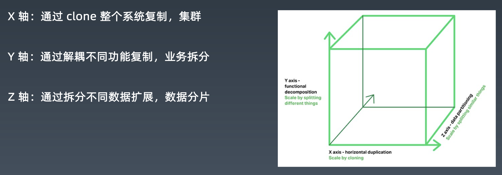
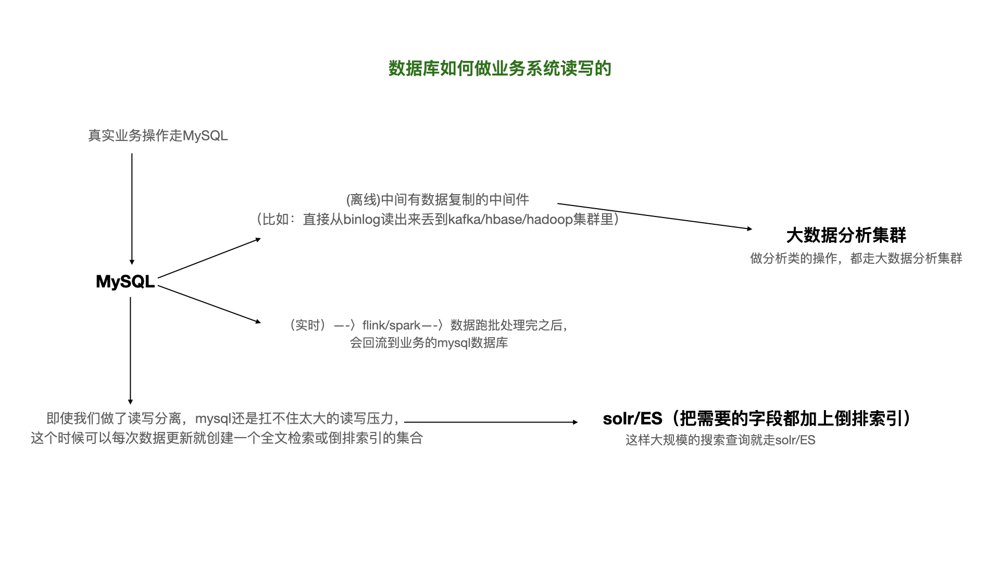
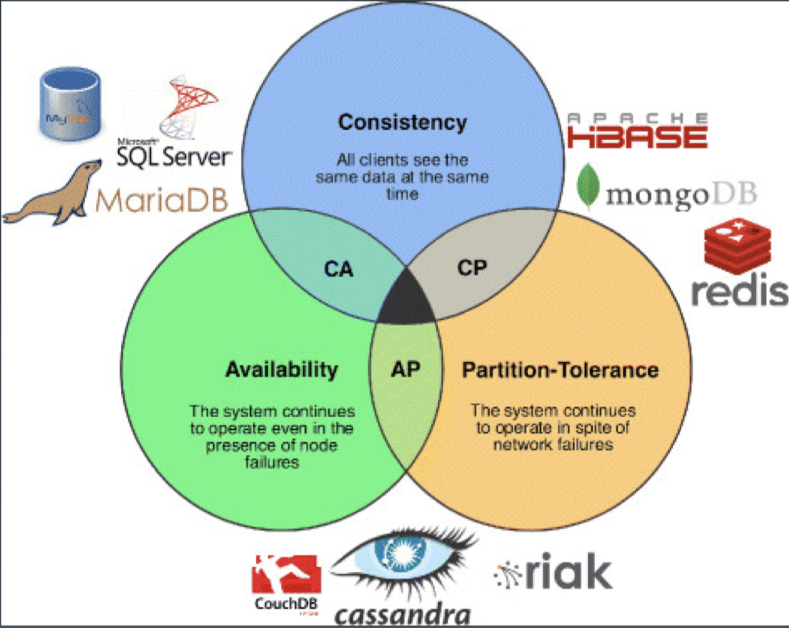
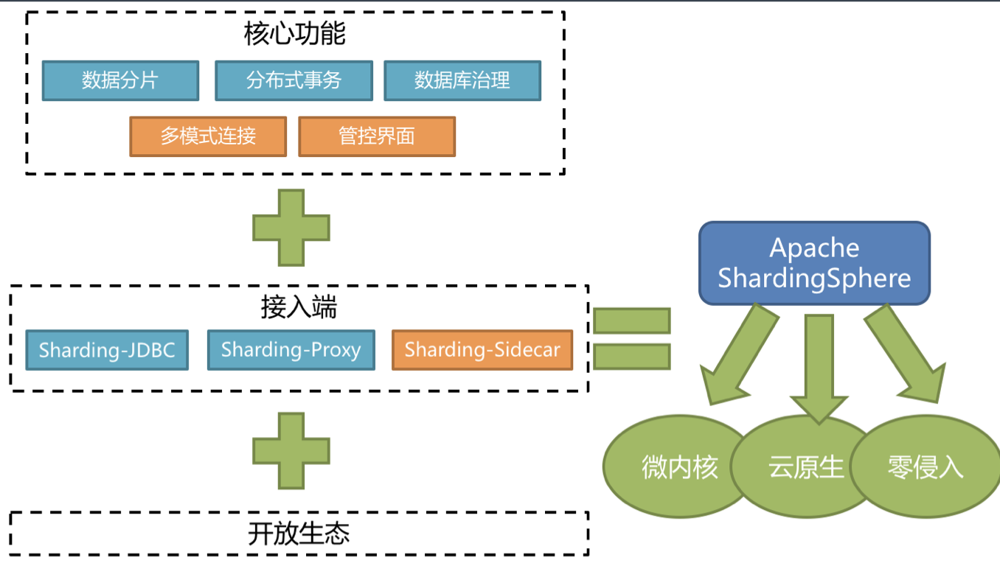

# MySQL分库分表

[toc]

## 一、为什么要做数据库拆分

### 1.1 数据量过大，带来的问题：

1. 性能：单库单表数据量过超过一定容量水位的情况下，索引树层级增加，磁盘IO也和可能出现压力，会导致很多问题；
2. 应用：单机数据库，一旦挂掉，会导致应用都不能使用；
3. 运维：单机数据量太大，会导致备份和恢复的时间成本变大；
4. 数据量大，主从数据同步的延迟时间会变大；

思考：主从复制是否能解决容量问题？

> 主从复制解决了读写压力的问题，不能解决容量问题。
>
> 主从复制，每个节点上，数据都是全量的，并没有把数据本身减小。

### 1.2 例子

（1）无法执行 DDL，比如添加一列，或者增加索引，都会直接影响线上业务，导致长时 间的数据库无响应。

DDL修改，会导致锁表、索引重建。

>  案例：有个金融业务，有个很大的表，默认分了150个库，每个库一张表。150个表，现在要把表中某个字段的类型从int改为bigint。评估了一下，每改一张表，需要执行2小时，把这些表都执行完需要300多个小时。这是件非常恐怖的事情。

（2）无法备份，与上面类似，备份会自动先 lock 数据库的所有表，然后导出数据，量 大了就没法执行了。

MySQL dump的原理：先锁表，再导出数据。保证数据一致性。数据量大，锁表的时间就非常长。

（3）影响性能与稳定性，系统越来越慢，随时可能会出现主库延迟高，主从延迟很高， 且不可控，对业务系统有极大的破坏性影响

数据量大了，影响性能，稳定性也会受到影响，高可用也会受到影响。

最简单粗暴的方式是升级内存、磁盘，但这种方式，瓶颈很快就会出现。

### 1.3 总结

数据库拆分，主要帮我们解决容量问题，顺带提升了写的能力。

### 1.4 扩展立方体

X轴：集群

Y轴：业务拆分

> 按照业务数据领域来拆分。

Z轴：partiton

分区（partition）、分片（sharding）

### 1.5 数据库/数据的扩展

主从结构、备份与高可用：能够顺便解决读写压力的问题。

分布式服务化、微服务：解决容量、以及部分读写压力的问题。**改变了库的结构和表的结构**

分布式结构、任意扩展：不改变库和表结构，只是把同一个库，同一个表一部分数据拿出来，丢在另一个库、表里（这个库、表的结构和前面的一模一样）

## 二、数据库垂直拆分

没有做服务化之前，出现的问题：

1. 数据库连接数不够；

   都需要用户数据。

2. 各种服务相互之间不能服用

   因为没有封装成服务，比如用户功能，写到jar里，jar包里面是直接调用数据库的。如果业务升级，需要引用心的jar包，所有的业务系统真的要配合他去引用心的jar包。

针对这两个问题，做了分布式的服务化。

为了做分布式服务化，就要做两件事情：

1. 把不同的数据给拆了；

   用户中心UC（user）、产品中心IC（item）、交易中心TC（trade）

   拆成三个，每个都是单独的一套数据库。

2. 在这个基础上，通过接口和RPC（远程调用）的方式暴露出去，这就是所谓的分布式服务化。再进一步就是服务治理，就变成微服务架构了。

### 2.1 （垂直拆分）拆库

垂直拆分（拆库）：将一个数据库，拆分成多个提供不同业务数据处理能力的数据库。

> 需要修改程序，对业务系统又很大的侵入性。

例如拆分所有订单的数据和产品的数据，变成两个独立的库，这种方式对业务系统有极大的影 响，因为数据结构本身发生了变化，SQL 和关联关系也必随之发生了改变。原来一个复杂 SQL 直接把一批订单和相关的产品都查了出来，现在这个 SQL 不能用了，得改写 SQL 和程序。先 查询订单库数据，拿到这批订单对应的所有产品 id，再根据产品 id 集合去产品库查询所有的 产品信息，最后再业务代码里进行组装。

### 2.2 （垂直拆分）拆表

垂直拆分（拆表）：如果单表数据量过大，还可能需要对单表进行拆分。

> 将一个宽表，拆成很多子表。缩小了出故障需要修复的爆炸半径。

比如一个 200 列的订单主表，拆分成十几个子表：订单表、订单详情表、订单收件信息表、订 单支付表、订单产品快照表等等。这个对业务系统的影响有时候可能会大到跟新作一个系统差 不多。对于一个高并发的线上生产系统进行改造，就像是给心脑血管做手术，动的愈多，越核 心，出现大故障的风险越高。所以，我们一般情况下，尽量少用这种办法。

### 2.3 垂直拆分的优缺点

优点：

（1）单库（单表）变小，便于管理和维护；

（2）对性能和容量有提升作用

（3）改造后，系统和数据复杂度降低

（4）可以作为微服务改造的基础

缺点：

（1）库、表变多，管理变复杂；

（2）对业务系统有较强的侵入性；

订单和用户分别放到两个库，以前需要一个SQL，现在需要两个SQL。

（3）改造过程复杂，容易出故障；

（4）拆分到一定程度就无法继续拆分；

### 2.4 垂直拆分的一般做法

（1）梳理清楚拆分范围和影响范围

梳理拆分影响了哪些东西；

（2）检查评估和重构影响到的服务

和研发负责人、需求负责人沟通

（3）准备新的数据库集群复制数据；

（4）修改系统配置并发布新版上线

注意： 1、先拆分系统，还是先拆分数据库？ 2、先拆分多大范围？

这两个问题在行动之前一定要认真考虑。

CICD：持续集成(CI)、持续交付(CD)

> 滚动、灰度、蓝绿、金丝雀

## 三、补充：数据库如何做业务系统读写的

大公司做法：

小公司做法：一个mysql打天下。

了解：数据孤岛、数据仓库、数据集市、数据湖。

数据治理：DAMA

架构：TOGAF

项目：PMP

## 四、水平拆分

### 4.1 什么是水平拆分

不动库结构和表结构，只动数据。

分为三类：分库、分表、分库+分表。

- 分库：只分库、不分表

  简单的路由：根据id%2判断查哪个库。尽量写简单SQL，便于拆分。

- 分表：只分表

  单个库的数据量不减少。

- 分库、分表

### 4.2 一般做法

（1）第一种常见的做法：按照id取模。

1. 做了分库分表后，我们所有SQL都需要带上分库、分表的分片键；

   > 如果没有分片键，就不知道具体操作哪个子表

2. 精确指定id

   范围查询，就需要在数据库集群上进行广播。否则对数据库集群影响太大。

（2）第二种常见做法：按照时间分库、分表

更智能、更好处理。

思考：为什么有些 DBA 不建议分表，只建议分库？

1. 只分表不分库，不解决容量和IO问题；

2. 可以用分库代替分表；

   db0、db1、db2 ===>  t0、t1、t2

mysql5.7 支持partition，其实就是内分表。

### 4.3 分库分表的优缺点

优点：

1. 解决容量问题
2. 比垂直拆分对系统影响小
3. 部分提升性能和稳定性

缺点：

1. 集群规模大，管理复杂
2. 复杂 SQL 支持问题（业务侵入性、性能）
3. 数据迁移问题
4. 一致性问题

### 4.4 数据异构

异构：对同一份数据，采用不同的数据结构存储。

场景举例：一个电子商务网站，对订单数据有两个需求——1. 根据买家ID查询；2.根据卖家ID查询；

> 对这个场景，方案一：将数据存在一个表结构中，进行广播的方式查询；方案二：将数据异常成两份，分别以买家ID分库分表、卖家ID分库分表。

常见的异构方式：

- 不同的数据库；
- 分库规则不同，表结构相同；
- 表结构都不相同

### 4.5 分库、分表演示

以 ShardingSphere-Proxy 为例。

1. 选用两个库；

2. 配置分库分表的规则；

3. 启动中间件；

   >  启动zookeeper

可以动态修改规则，不用重启中间件。

> 虚拟的数据库。

思考一下，分库分表条件写成：

分库 user_id % 2

分表 user_id % 2

会发生什么？

这样，奇数一定会进：db1、t1表；偶数一定会进：db0、t0表。其他表永远没有数据。

## 五、数据的分类管理

1. 定义一周内下单但未支付的数据为**热数据**，同时放到数据库和内存；
2. 定义三个月内的数据为**温数据**，放到数据库，提供正常的查询操作；
3. 定义 3 个月到 3 年的数据，为**冷数据**，从数据库删除，归档到一些便宜的磁盘，用压缩的 方式（比如 MySQL 的 tokuDB 引擎，可以压缩到几十分之一）存储，用户需要邮件或者提 交工单来查询，我们导出后发给用户；
4. 定义 3 年以上的数据为**冰数据**，备份到磁带之类的介质上，不提供任何查询操作。

## 六、框架和中间件

### 6.1 Java框架层面

- TDDL 不开源
- Apache ShardingSphere-JDBC 开源

Java框架缺点：

1. Java框架，只能Java用；
2. 需要引入框架，配置分库、分表的规则，需要修改业务系统；

### 6.2 中间件（可以不修改业务系统）

- DRDS（商业闭源）
- Apache ShardingSphere-Proxy
- MyCat/DBLE
- Cobar
- Vitness
- KingShard

中间件的好处：

1. 对应用系统透明；
2. 可以给任何系统语言和平台做对系统来用；

## 七、数据库中间件技术的演进

摩尔定律失效（单机不满足）--------〉分布式-------〉出现CPA定理

Consistency: 一致性

> 在[分布式系统](https://baike.baidu.com/item/分布式系统/4905336)中的所有数据备份，在同一时刻是否同样的值。（等同于所有节点访问同一份最新的数据副本）

Availability：可以用性

> 保证每个请求不管成功或者失败都有响应。

Partition tolerance：分区容错性（Partition tolerance）

> 系统中任意信息的丢失或失败不会影响系统的继续运作

CAP 原则指的是，这三个[要素](https://baike.baidu.com/item/要素/5261200)最多只能同时实现两点，不可能三者兼顾。

单机：不是分布式的

分布式：至少三台机器（高可用），加入机器越多，高可用程度越高。

> 加入机器越多，各个机器间为了达成共识（比如，一半机器可用，才可用），此时网络的延迟，网络不可靠的程度也越高。

## 八、Sharding-sphere

Apache ShardingSphere 是一套开源的分布式数据库中间件解决方案组成的生态圈， 它由 JDBC、Proxy 和 Sidecar（规划中）这 3 款相互独立，却又能够混合部署配合使用 的产品组成。 它们均提供标准化的数据分片、分布式事务和数据库治理功能，可适用于 如 Java 同构、异构语言、云原生等各种多样化的应用场景。

- ShardingSphere-JDBC

  框架 ShardingSphere-JDBC， 直接在业务代码使用，支持常见的数据库和 JDBC，只能用于Java。

- ShardingSphere-Proxy

  作为中间件，独立部署，对业务端透明。目前支持 MySQL 和 PostgreSQL，任何语言平台的系统都可以接入，可以使 用 mysql 命令或者 IDE 操作，对业务系统侵入性小。

## 九、如何做数据库迁移

数据库迁移是我们在做系统大规模重构、分布式改造、微服务架构的改造里非常常见的事情。当我们对老的大数据库进行拆分，或水平上做分库分表，都意味着我们要把原本单库单表里的一部分数据挪出去。

分库分表基本都是在老的系统上做的。

- 怎么能更平滑的迁移旧数据到新的数据库和系统
- 特别是在异构的数据库结构情况下
- 达到数据准确，迁移速度快，减少停机，对业务影响小

**迁移是最容易出故障的一个点**

### 9.1 方式一：数据迁移的方式：全量

全量数据导出和导入

1. 业务系统停机

2. 数据库迁移，校验一致性

   导入数据的时候，先在老数据库中把索引、约束、外键禁用掉（删掉），数据导入完之后重新建立索引、约束。

   一次性建索引、约束 比分批次建索引、约束的效率高很多。

   校验数据一致性的做法：使用校验和(checksum)。

   >  把数据库里，每一行的做一个记录（指纹），再将所有记录（指纹）相加，得到checksum。将新库和老库的checksum对比，看是否一致。

   数据太大，可以分片做校验。

3. 然后业务系统升级，接入新数据库

直接复制的话，可以 dump 后全量导入。（如果是）异构数据，需要用程序来处理

这种方式的优缺点：

好处：简单；

坏处：停机的时间特别长，数据导出，导入都需要停机。

### 9.2 方式二：数据迁移的方式：全量 + 增量

如果数据库所有的变更都能通过时间来识别，比如有updateTime和createTime字段，我们不依赖任何外部的东西。我们用jdbc就可以把某段时间内变更的数据提取出来。

**依赖于数据本身的时间戳**：

1. 先同步数据到最近的某个时间戳
2. 然后在发布升级时停机维护
3. 再同步最后一段时间（通常是一天）的变化数据。
4. 最后升级业务系统，接入新数据库

好处：极大降低了停机的时间

### 9.3 方式三：数据迁移的方式：binlog+全量 + 增量

通过主库或者从库的 binlog 来解析和重新构造数据，实现复制。

一般需要中间件等工具的支持。

可以实现多线程，断点续传，全量历史和增量数据同步。

继而可以做到：

1. 实现自定义复杂异构数据结构；
2. 实现自动扩容和缩容，比如分库分表到单库单表，单库单表到分库分表，分4个库表 到分64个库表。

> 先用备份数据，在新系统中恢复出来，再把最新数据恢复过来。

好处：几乎不用停机。

## 十、迁移工具 ShardingSphere-scaling

### 10.1 ShardingSphere-scaling

需要启动一个服务（server），然后它就能进行数据库全量和增量的同步。

1. 需要先判断一下我们要迁移数据库的哪些表，这些表有多少数据；
2. 然后根据既定规则，对这些数据进行分片（分片就可以做多线程了）；

特点：

- 支持数据全量和增量同步；

- 支持断点续传和多线程数据同步；

  > 需要启动一个zookeeper，将传输的进程信息写到zookeeper上。

- 支持数据库异构复制和动态扩容；

  异构复制意味着两边可以是不同的数据结构。

  动态扩容：将`4*4` 的表数据，复制到 `8*8`的表中（还可以反过来做）；

- 具有 UI 界面，可视化配置。

### 10.2 演示数据异构复制和迁移

以 ShardingSphere-Scaling 为例。

分库分表的 逻辑数据库（多个库表） -> 单库单表（master） -> 单库单表（slave）

有趣的简写：ccily
