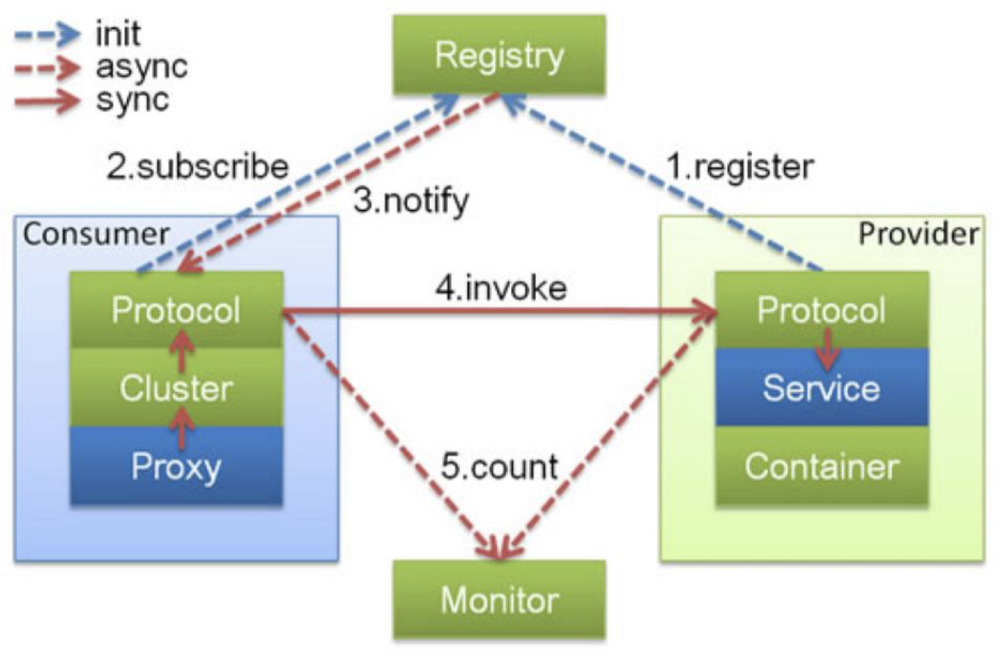
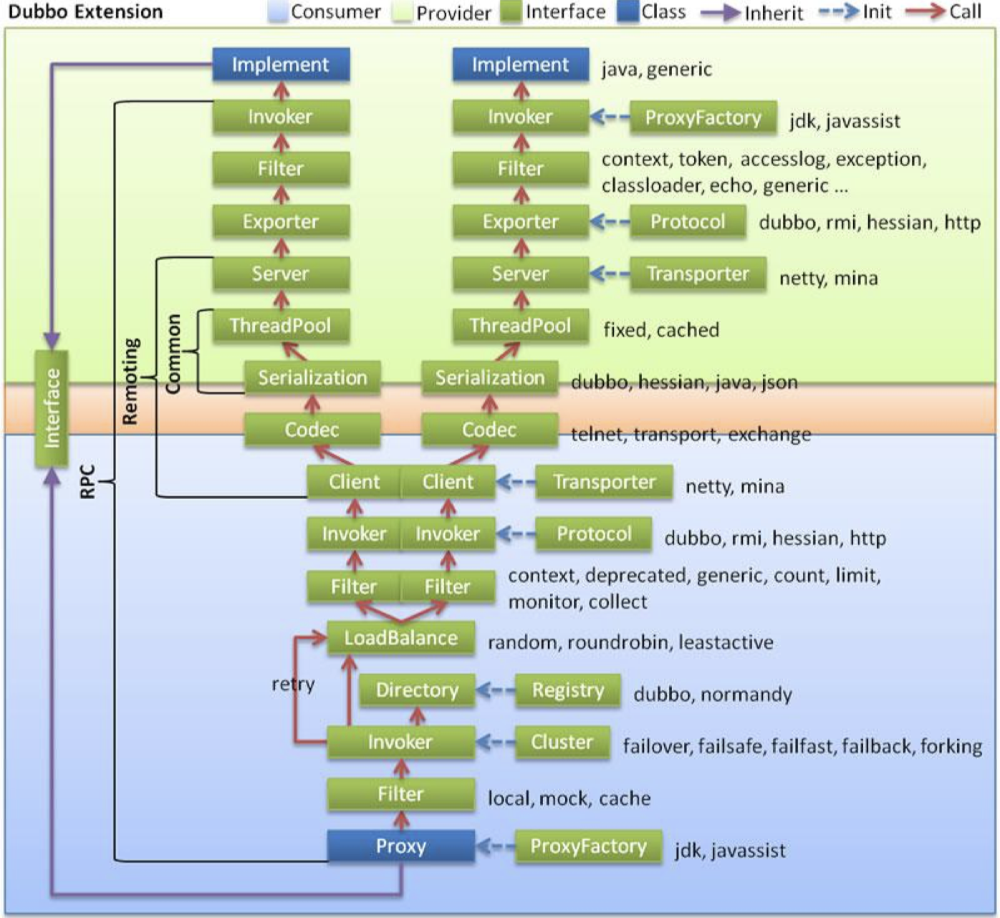

# 分布式服务：Dubbo技术详解

[toc]

## 一、先看一个使用Dubbo的案例

## 二、Dubbo框架介绍

Dubbo存量用户比较多。在增量系统中，大量用Spring Cloud。

京东JSF用的就是Dubbo。

Dubbo六个功能：

- 高性能RPC
- 负载均衡
- 服务自动注册与发现
- 高度可扩展能力：做得非常好
- 运行期流量调度
- 服务治理和运维

Dubbo的基础功能：

基础功能的内核是服务化（或者我们叫RPC）。主要就是下面这张图：

- 客户端的消费者可以调用服务端的提供者：可以直接调，也可以通过注册中心去找服务端在哪里再去调；

  > 和ESB中的SOA相比，Dubbo效率更高。

- 下面这个图，虚线都是异步的；

Dubbo的扩展功能：集群、高可用、管控

Dubbo成功的秘诀：灵活易用+简单易用。

## 三、Dubbo技术原理

### 3.1  整体架构

横的分层。

API：在Dubbo中直接调用；

SPI：需要先实现，塞到服务中；

Service层：是业务

Config层：ServiceConfig服务暴露时的配置，ReferenceConfig是服务引用时的配置；

proxy层：代理层，

Registry层：注册

Cluster层：分为查找目录（查找所有机器）、路由（从机器中找服务调用的范围）、负载均衡（最终决定调用哪个机器）

Monitor层：

Protocol层：协议

Exchange层

Transport层

Serialize层

最后三层时网路传输层。

Dubbo中三个核心概念：

- Invoker：暴露服务本身。是Dubbo里面核心东西，代表一次服务调用。

- Protocol：协议，
- URL：在Dubbo内部，所有东西的流转都是通过URL实现的。包含描述服务的信息。

Dubbo中另一个重要的东西是Filter。

### 3.2 架构设计

集群的功能都是在客户端实现。

### 3.3 SPI的应用

API：在Dubbo中直接调用；

SPI：需要先实现，塞到服务中；

SPI的实现方式：通过[JDK里面ServiceLoader机制](https://blog.csdn.net/hefrankeleyn/article/details/123218329?spm=1001.2014.3001.5502)实现。

因为Dubbo中实现的类特别多，Dubbo里面重新实现了ServiceLoader机制，不同的地方在于：

（shadingSphere中也有类似的应用。）

- 将配置路径改为：`META-INF/dubbo/internal`
- 配置文件中改为：`名称=实现类`

这样做的好处是：实现依赖反转?。例如，在只有接口模块中调用另一个模块的实现，但接口模块中又没有引入实现模块。

还有两种机制可以达到同样的效果：Callback和EventBus。

**在dubbo中，SPI实现的加载是通过ExtensionLoader来实现的，SPI实现在Dubbo中默认是单例的。**

> 在dubbo中我们能找到多少个文件名为org.apache.dubbo.rpc.*的文件，就有多少个RPC的实现。

### 3.4 服务如何暴露

最外面的服务通过代理包装一下，变成一个代理的invoker，然后再走协议。最关键的就是协议。

Invoker 是通过代理工厂创建的真实服务代理，调用Invoker就等于调用真实服务的实现类。

#### （1）最简单的一个协议：InJvmProtocol

InJvmProtocol，服务的创建和调用双方在同一个JVM进程，这样就不用走网络。

如果将一个Invoker导出去？

InjvmExporter类中，将invoker和一个key（key就是url）放到一个map中。

怎么用这个Invoker？

调用方通过url到map中找，找到对应的invoker，就可以进行调用了。

#### （2）DubboProtocol，走网路

除了需要有一个map存所有的对象外，还需要有在DubboProtocol中做一堆额外的事情。

- 创建Server，这个server绑定到处理器和对外暴露的URL上；

- 处理器：就是当有请求来的时候，我们如何处理——找服务，找方法，去调用；

- Dubbo中的Invocation代表着具体的方法调用信息；

- Dubbo修改了内部的协议：如果是Http，修改报文信息，如果是二进制，修改二进制信息。这样做是为了传递自定义的参数信息。

  比如：Dubbo中的dubbo-rpc-thrift是修改后的thrift，dubbo-rpc-native-thrift是原来的thrift。

### 3.5 服务如何引用

先找协议，在找invoker，再去做调用。这个过程和服务调用刚好反过来。

再去看看代码。

### 3.6 集群与路由

#### 集群：

- Directory：目录，列出当前注册中心有多少个这个服务Proxy的实例。`return List<Invoker>`

接下来是两个核心的东西：

- Router

  从一堆`List<Invoker>`中选出一小部分`Invoker`。

  条件路由、脚本路由、标签路由

- LoadBalance

  从Route过滤后的Invoker集合中，选出一个Invoker。

  根据权重随机：RandomLoadBalance：使用`ThreadLocalRandom.current().nextIn(totalWeight)`函数。

  > 根据权重进行随机，这个代码值得看看。

  轮询，需要记录状态：RoundRobinLoadBalance

  

### 3.7 泛化调用

 有些时候我们需要通过一个方法调用所有服务端端接口，相当于反射。

Dubbo提供了两种方法：好处是不用有真实的接口。

一般不建议使用泛化：因为怕坏了面向对象。

### 3.8 隐式传参

Dubbo修改了内部的协议：如果是Http，修改报文信息，如果是二进制，修改二进制信息。这样做是为了传递自定义的参数信息。

### 3.9 Mock

将`mock='true'`，再在本地写一个`HelloServiceMock`，就会自动找这个Mock服务类。

## 四、Dubbo的应用场景

### 4.1  分布式服务化改造

将一个大系统拆成小系统，它们之间通过RPC调用。

关键点有：

- 数据相关改造： 分库分表
- 服务设计：微服务
- 不同团队的配合：比较难的一件事儿
- 开发、测试运维：变复杂了

### 4.2 开放平台

平台发展有两个模式：开放平台（API模式）、容器模式（SPI模式）

> 容器模式，就像一个大商场，里面提供很多格子，你想干什么事儿，来格子里干。

将公司的业务能力开发出来，形成开发平台，对外输出业务或技术能力。

### 4.3 直接作为前端使用的后端（BFF）

直接作为BFF给前端（Web或Mobile）提供服务。

> 这里的服务是指提供完整的业务功能。

### 4.4 通过服务化建设中台

将公司的所有业务服务能力，包装成API，形成所谓的业务中台。

前端业务服务，各个业务线，通过调用中台的业务服务，灵活组织自己的业务。

从而实现服务的服用能力，以及对于业务变化的快速响应。

## 五、Dubbo的最佳实践

### 5.1 开发分包

- 建议将服务接口、服务模型、服务异常等均放在 API 包中，因为服务模型和异常也是 API 的一部分，这样做也符合分包原则：重用发布等价原则(REP)，共同重用原则 (CRP)。
- 服务接口尽可能大粒度，每个服务方法应代表一个功能，而不是某功能的一个步骤，否 则将面临分布式事务问题，Dubbo 暂未提供分布式事务支持。
- 服务接口建议以业务场景为单位划分，并对相近业务做抽象，防止接口数量爆炸。
- 不建议使用过于抽象的通用接口，如：Map query(Map)，这样的接口没有明确语义， 会给后期维护带来不便。

### 5.2 环境隔离和分组

如何做到多环境隔离？

1. 部署多套；
2. 多注册中心机制；
3. group机制；
4. 版本机制：渐进过度，是一种好的方案。

服务接口增加方法，或服务模型增加字段，可向后兼容，删除方法或删除字段，将不兼 容，枚举类型新增字段也不兼容，需通过变更版本号升级。

### 5.3 参数配置

首先以Consumer端为准，再以Provider端为准，最后以默认为准。

建议在 Provider 端配置的 Consumer 端属性有：

- timeout：方法调用的超时时间
- retries：失败重试次数，缺省是 2 2
- loadbalance：负载均衡算法 3，缺省是随机 random。
- actives：消费者端的最大并发调用限制，即当 Consumer 对一个服务的并发调用到上限后，新 调用会阻塞直到超时，可以配置在方法或服务上。

建议在 Provider 端配置的 Provider 端属性有：

- threads：服务线程池大小
- executes：一个服务提供者并行执行请求上限，即当 Provider 对一个服务的并发调用达到上限 后，新调用会阻塞，此时 Consumer 可能会超时。可以配置在方法或服务上。

### 5.4 容器化部署

容器化部署的IP问题，比如用docker部署后，在注册中心拿到的IP是容器IP，容器能访问外面，但外面访问不了里面。

解决办法一：

1. 修改容器配置，直接使用宿主机的IP；

解决办法二：

1. docker参数指定注册的IP和端口, -e

> 主要是前面两个

DUBBO_IP_TO_REGISTRY — 注册到注册中心的IP地址 

DUBBO_PORT_TO_REGISTRY — 注册到注册中心的端口 

DUBBO_IP_TO_BIND — 监听IP地址 

DUBBO_PORT_TO_BIND — 监听端口

### 5.5 运维和监控

Admin功能较简单，大规模使用需要定制开发，整合自己公司的运维监控系统。

可观测性：tracing、metrics、logging

- APM
- Promethus+Grafana

### 5.6 分布式事务

### 5.7 重试与幂等

服务调用失败默认重试2次，如果接口不是幂等的，会造成业务重复处理。

如何设计幂等接口？

1、去重：（bitmap）

2、类似乐观锁机制

### 5.8 dubbo源码调试

1. provider看Protocol 的export；
2. consumer看ReferenceConfig；
3.  provider的执行逻辑看DubboProtocol；

## 六、实践

[Dubbo实战](https://github.com/hefrankeleyn/JAVARebuild/blob/main/Week_09_%E5%88%86%E5%B8%83%E5%BC%8F%E6%9C%8D%E5%8A%A1/2022-03-02-%E8%BF%9B%E9%98%B6%E5%AE%9E%E8%B7%B5-Dubbo.md)
