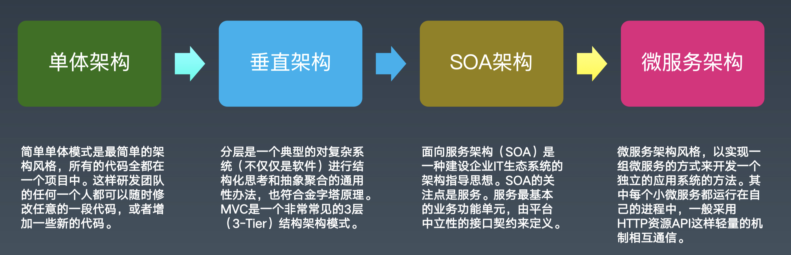
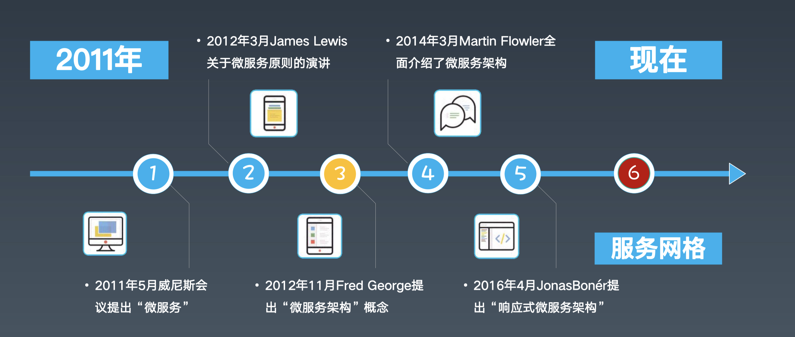
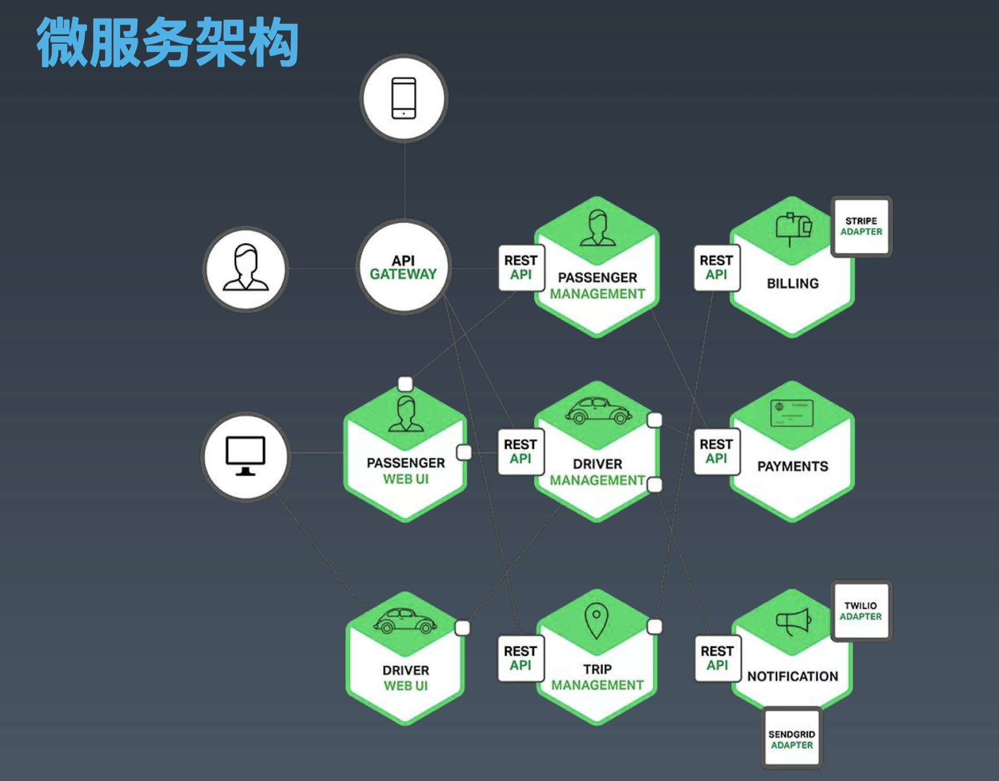
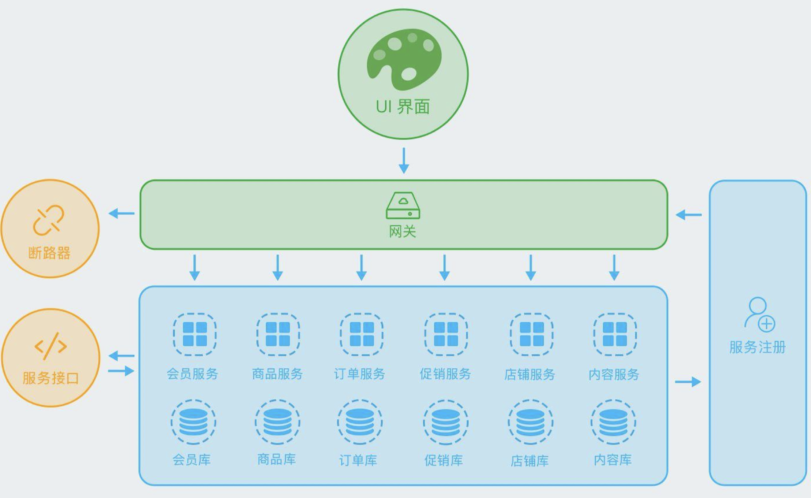
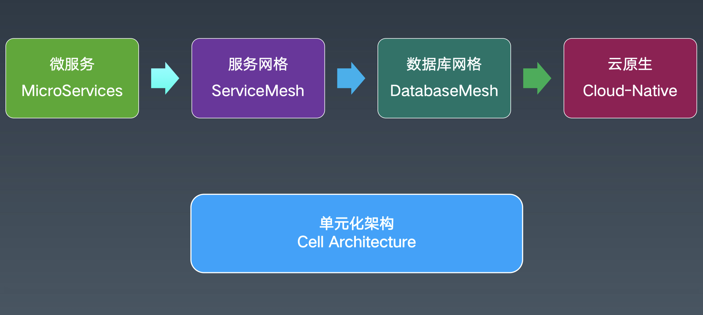
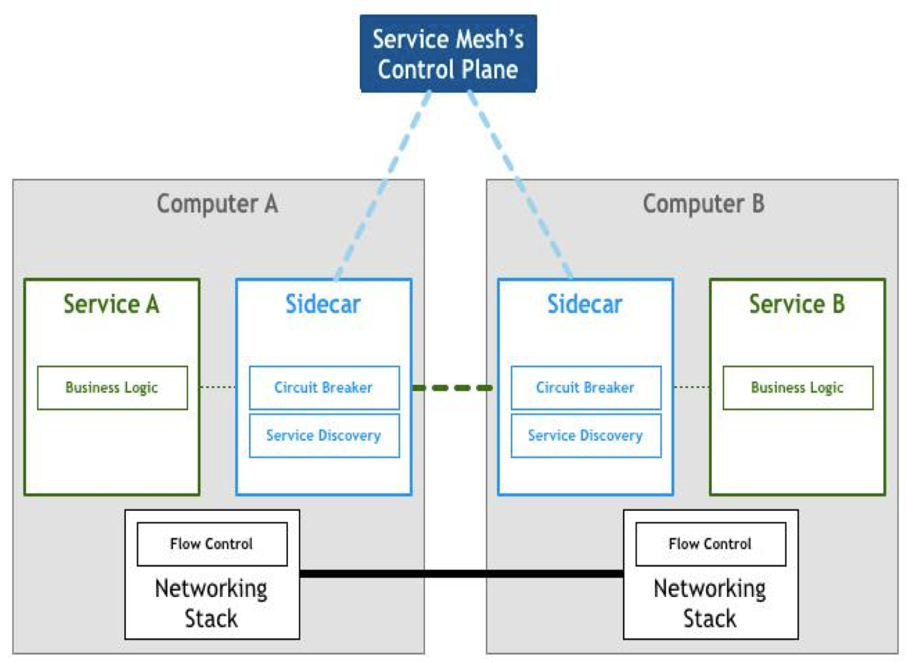
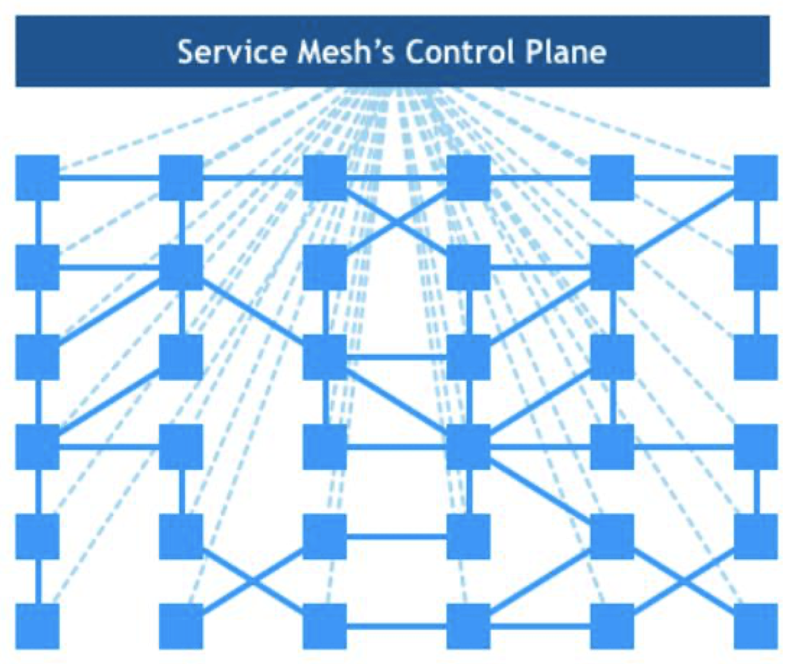
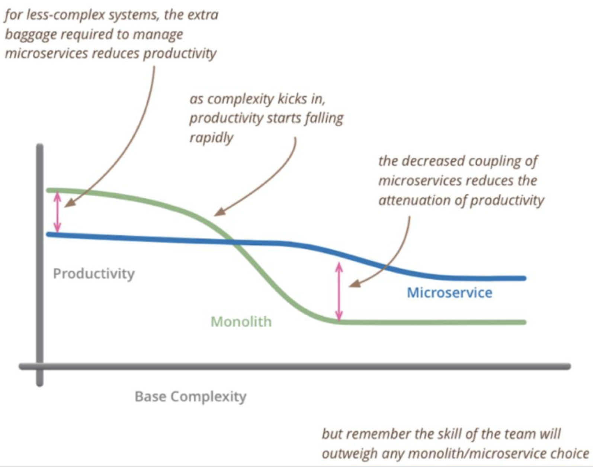
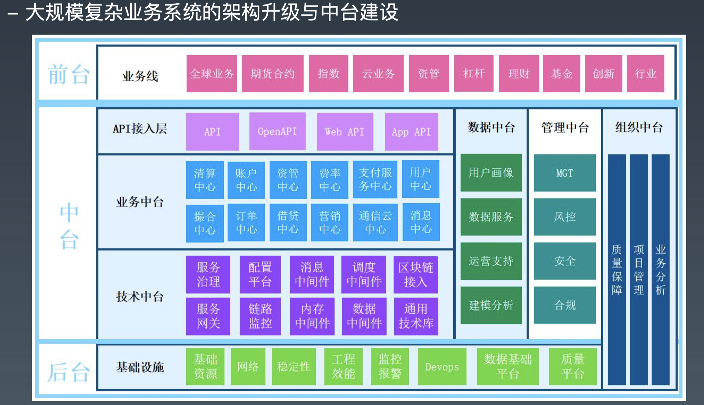
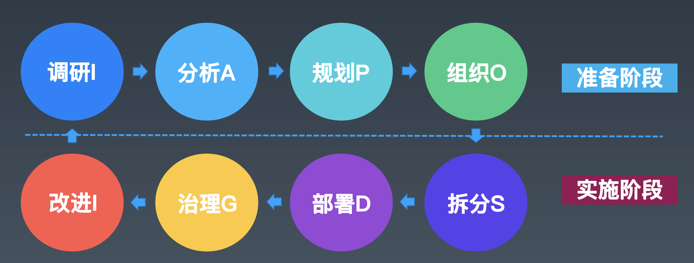

# 分布式服务：SpringCloud与微服务架构

[toc]

## 一、概述

（1）微服务架构发展历程；

微服务是怎么来的？你不知道它是怎么来的，你就不知道它现在是什么样子。

（2）微服务架构的应用场景；

（3）微服务架构的最佳实践；

六个微服务的最佳实践。

（4）SpringCloud技术体系；

（5）微服务相关框架与工具；

## 二、历史：微服务架构发展历程

### 2.1 微服务的发展历程

- 1999～2008 是国内大公司（别是金融、银行、证券、保险）这些业务的电子信息化时代；

  在之前都是手工记账。

  所谓的电子化，就是取代手工操作的事情。

- 2008～2014 是网络化和移动化的时代

  很多大的公司在04到08年，或再晚点到10年，基本实现了IT系统的全部大集中。

  随着手机、pad的普及，把网络迁移到手机端和移动端。让几乎所有的人都接入互联网。

- 2014年至今  数字化智能化

  目前最常用的词儿”数字化转型“——数据驱动业务。用IT技术本身，驱动业务的变化。

在这个发展的过程中，发现我们的业务越来越复杂，数据越来越多。同时，很多业务系统，对各种非功能需求要求越来越高、越来越严（比如对性能要求，一致性）：性能、稳定性、一致性、可用性、扩展性、可维护性（可以不断在上面改）。

当这些业务的需求不断升级，而在之前架构基础上进行开发又做不到的时候，矛盾就出来了。这些矛盾和这些实际的需求在推动IT架构的整体变革。特别是软硬件的发展，推动者架构的发展。

- 单体架构：早期的单体架构，简单，打一个war就可以部署运行；
- 垂直架构：当引入Spring之后，开始对系统分层，部署的时候还是一个单体，但我们在开发过程中就有了一个开发拆分的层级；
- SOA架构：再往后，对于大公司，有了很多孤立的子系统，它们相互之间没有连通，形成了“数据孤岛”。就有了基于ESB的SOA架构，将各个系统打通。
- 微服务架构：不按照系统划分，而是按照业务服务划分，每个服务开发成单独的项目，部署成一个进程，然后它可以独立扩展，并且使用独立的数据库，由一个团队或一个人来维护它。每个人只需要维护一小片业务。

- 2014年是微服务爆发的一个时间点；
- 当前比较新的概念是：服务网格、云原生；

### 2.2  微服务架构图

#### （1）微服务架构图：出行

- 在下面的图中：每个六边形代表一个服务
- billing（计费）、passenger（乘客）、driver（司机）、payments（支付）等这些微服务通过RESTAPI对外提供服务‘；
- 服务和服务之间是可以相互调用的；
- 服务通过一个APIGATEWAY（网关）对终端外部提供服务；
- 在内部可以直接通过Web系统访问微服务（不需要经过网关）；
- Web系统可以访问微服务；

#### （2）微服务架构图：银行

####（3）微服务架构图：电商

- 将业务划分成各种微服务，UI界面经过网关访问微服务；
- 在两侧加上服务治理：注册发现、服务控制（断路器、限流等）

### 2.4 现在正在发展的四种微服务趋势

#### （1）响应式微服务

“响应式微服务”这个词儿来源于“响应式编程”，“响应式编程”这个词儿来源于“响应式宣言”。

- 响应式编程

响应式编程或反应式编程是一种面向**数据流**和**变化传播**的声明式编程范式

- 响应式宣言

**即时响应性**：系统任何时候都应该对用户的输入产生响应，而不是死掉；

**回弹性（可恢复性）**：当压力大的时候，可能服务能力需要降级。当压力消耗得差不多的时候，整个系统能恢复到当初的健康状态；

**弹性**：就是伸缩性，当系统压力特别大的时候，可以通过添加机器来解决，表示系统的可扩展性。

**消息驱动**：通过消息触发请求，屏蔽了线程池等技术细节。

常见的响应式编程框架：[vert.x](https://vertx.io/)、webflux等。

#### （2）服务网格与云原生

微服务如何从微服务演变成服务网格的？

> 详细可以参考：[预习材料：Spring-03.pdf](https://github.com/hefrankeleyn/JAVARebuild/blob/main/Week_09_%E5%88%86%E5%B8%83%E5%BC%8F%E6%9C%8D%E5%8A%A1/document/%E9%A2%84%E4%B9%A0%E6%9D%90%E6%96%99%EF%BC%9ASpring-03.pdf)。

1. 形成Sidecar

关键的原因是，在我们的业务系统里，不管我们用的是Spring Cloud还是其他框架，在我们部署并运行起来的java进程里，这个进程里不仅有业务代码、框架代码、处理网络通信代码、以及网络通信策略相关代码（熔断、限流等策略）都在这个进程里，这样的话，我们有没有什么办法可以让业务系统变得简单？

一个很自然的想法是：我们把网络的下沉，把业务无关的策略下沉，然后将下沉的东西放到我们的基础设施里，让其和我们部署的服务进程没有关系。

这样我们就引入了一个Sidecar（边车）的东西——把服务的发现、服务的注册等这些网络间的调用关系（谁连接谁，权限，限流/断路器/熔断等控制策略）放到Sidecar里。把业务服务本身保护起来。

可以把Sidecar想象成nginx（更具体的，我们将Sidecar称之为代理），外面访问业务服务等时候，不直接访问服务，都只能连接sidecar。这样我们的业务模块只有业务逻辑（Business Logic）本身的代码。

2. side组成服务网格

下面图中，每一个蓝色小方块都是一个Sidecar。Sidecar之间可以相关调用，这样就变成一个服务网格。

- 默认每个Sidecar都是空的，是对等的，具体能干什么是由上面的控制面板分发的；
- 控制面板控制它们，并给他们特定的策略；
- 所以，在下面图切一刀，上面是**控制面板**，下面是**数据面板**；
- 服务网格更进一步，就是Faas（函数即服务）：在Sidecar上直接部署业务代码。

3. 云原生

我们将“微服务、容器化、持续集成和交付、Devops”这四个概念合在一起就叫**云原生**。

基于**容器**做**微服务**，基于**Devops**的方式开发运维，同时所有的工作都是**持续集成和交付**。

#### （3）数据库网格

在数据网格种的数据面板和控制面板基础之上形成数据库网格。

我们所有的服务还需要访问和找自己的数据库，特别是当我们线上业务服务能力特别强的时候，我们一个服务需要连接很多个数据库。这个时候我们可以类似的在里面加一个数据库的Sidecar，干的事情和服务的sidecar一样：

所有的服务找数据，不用再跟任何其他的数据库通信，只需要找自己本地数据库的Sidecar，不是Oracle、MySQL、DB2、Redis、mongoDB等，还是文本文件、分布式存储上的数据，不再需要连接它们，只需要本地数据库Sidecar要数据。

数据库网格中的Sidecar的策略也是通过控制面板实现。

#### （4）单元化架构

以机房为维度进行流量调度。

四大行、交通、邮储，都在做类似的东西。

这些被称为中台。

技术中台：Pass，数据同步等

业务中台：业务相关

### 2.5 问答

- 大的金融机构（比如四大行）为什么要做单元化架构？

它们想通过把业务数据打碎、打散的方式（比如拆成1024个单元），然后去掉Oracle和DB2。这其实是传统金融机构去IOE的过程。

然后把核心业务从大机弄到小机上来，使用国产数据库、国产服务器。

它们搞这个中台的项目是为了搞基础软件的国产化。

大机下移是为了彻底用国产硬件。

> 大机mainframe

注意：无论我们如何搞单元，一个用户的数据有且只能出现在一个单元里。在一个单元内都可以做到本地事务。

厉害的系统，一定是单机。（比如Orcal一体机）

不了解一个东西，不要轻易评论，因为那叫“小马过河”。

## 三、微服务架构应用场景

### 3.1 什么时候使用微服务

下面的图：

- 横轴代表业务的复杂度；
- 纵轴代表团队的生产力；
- 绿色这条线代表我们使用单体的架构模式；
- 深蓝色这条线代表我们采用微服务的架构模式；

可以得出结论：

- 在达到某个系统服务度之前，单体的生产效率比微服务架构的生产效率高；
- 当业务复杂度变得越来越高的时候，单体就变得复杂了；
- 随着复杂度升高，单体架构的生产 力快速下降，而微服务相对平稳；

99%的情况下，我们是改造一个老系统把它变为微服务架构。

案例：微服务改造的经验

（1）先把业务梳理清楚，将系统分为前台、中台、后台；

（2）前台是业务线，各干各的；

（3）中台是共用的东西，主要有三大层：API接入层（其实就是网关，有多个不同的网关），技术中台（就是共用的技术设施，主要是服务治理和一些中间件）、业务中台（是基于技术中台里的内容，设计出的具有某种业务能力的大的模块，独立成一个微服务，对外提供服务能力，再通过网关把这些服务能力透出去）。

（4）这样，业务中台是复用的，而且很稳定。业务中台里微服务的稳定性、高可用、性能、扩展性主要是由技术中台里的技术设施来保障的。

（5）业务线上的业务：基础能力通过调用中台来实现，特殊需求需要自己单独做（比如：每个月都做活动，这个活动每月只用一次，而且每月都在变）。

（6）做了上面这些内容之后，再去做基础设施。

**微服务里的服务是指业务服务，需要业务方、运营、产品等贯穿整个系统角色的人一起参与。**

（7）另外，还有数据中台，用来做数据驱动的运营：出报表、跑批等。

（8）管理中台，封控、安全、合规等

（9）组织中台：为前面所有东西提供支撑，质量保障、项目管理（PMO）、业务分析师（BA）；

（10）基础设施交给SRE团队维护。

SER：系统稳定性工程师，对稳定性负责。

DevOPS：开发运维（业务谁干的，谁维护）。

### 3.2 怎么应用微服务架构——I6I

一个通用的方法论I6I：以I开头，以I结尾，中间还有6步。

- 前四步是准备阶段，后四步是实施阶段；

第一步：调研，分清目前系统的现状（从业务，到技术，到基础设施）。也就是上面那张图从上到下分析清楚打通；

第二步：分析A，分析出来每一层又哪些东西组成，细节定下来；

第三步：规划P，根据分析做规划。先动哪一层，层与层如何关联；

第四步：组织O，组织人员进行配合：从市场、运营、客服、产品、研发、测试、运维，所有人员在哪些时间点做哪些事情，怎么交付，和别人如何对齐；

**因此，可以看出微服务系统的改造不是一个人能完成的。**

第五步：拆分S，按照规划的步骤，进行拆分。看先拆哪部分，去做开发测试；

第六步：部署D

第七步：治理G，在实际的应用中看是否达到拆分后的预期。

第八步：改进，根据治理，提出改进方案。然后从第一步进行循环。

### 3.3 问答

非常反感，一上来就给大家讲如何用dubbo或Spring cloud做微服务的人。因为讲这些技术的人，可能都不知道微服务是个什么。

