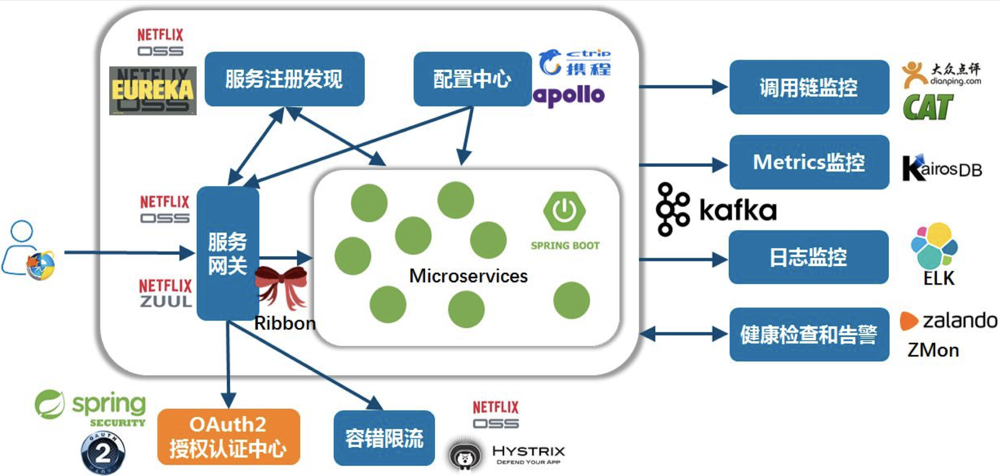

# 分布式服务：SpringCloud与微服务架构

[toc]

## 一、概述

（1）微服务架构发展历程；

微服务是怎么来的？你不知道它是怎么来的，你就不知道它现在是什么样子。

（2）微服务架构的应用场景；

（3）微服务架构的最佳实践；

六个微服务的最佳实践。

（4）SpringCloud技术体系；

（5）微服务相关框架与工具；

## 二、历史：微服务架构发展历程

### 2.1 微服务的发展历程

- 1999～2008 是国内大公司（别是金融、银行、证券、保险）这些业务的电子信息化时代；

  在之前都是手工记账。

  所谓的电子化，就是取代手工操作的事情。

- 2008～2014 是网络化和移动化的时代

  很多大的公司在04到08年，或再晚点到10年，基本实现了IT系统的全部大集中。

  随着手机、pad的普及，把网络迁移到手机端和移动端。让几乎所有的人都接入互联网。

- 2014年至今  数字化智能化

  目前最常用的词儿”数字化转型“——数据驱动业务。用IT技术本身，驱动业务的变化。

在这个发展的过程中，发现我们的业务越来越复杂，数据越来越多。同时，很多业务系统，对各种非功能需求要求越来越高、越来越严（比如对性能要求，一致性）：性能、稳定性、一致性、可用性、扩展性、可维护性（可以不断在上面改）。

当这些业务的需求不断升级，而在之前架构基础上进行开发又做不到的时候，矛盾就出来了。这些矛盾和这些实际的需求在推动IT架构的整体变革。特别是软硬件的发展，推动者架构的发展。

- 单体架构：早期的单体架构，简单，打一个war就可以部署运行；
- 垂直架构：当引入Spring之后，开始对系统分层，部署的时候还是一个单体，但我们在开发过程中就有了一个开发拆分的层级；
- SOA架构：再往后，对于大公司，有了很多孤立的子系统，它们相互之间没有连通，形成了“数据孤岛”。就有了基于ESB的SOA架构，将各个系统打通。
- 微服务架构：不按照系统划分，而是按照业务服务划分，每个服务开发成单独的项目，部署成一个进程，然后它可以独立扩展，并且使用独立的数据库，由一个团队或一个人来维护它。每个人只需要维护一小片业务。

- 2014年是微服务爆发的一个时间点；
- 当前比较新的概念是：服务网格、云原生；

### 2.2  微服务架构图

#### （1）微服务架构图：出行

- 在下面的图中：每个六边形代表一个服务
- billing（计费）、passenger（乘客）、driver（司机）、payments（支付）等这些微服务通过RESTAPI对外提供服务‘；
- 服务和服务之间是可以相互调用的；
- 服务通过一个APIGATEWAY（网关）对终端外部提供服务；
- 在内部可以直接通过Web系统访问微服务（不需要经过网关）；
- Web系统可以访问微服务；

#### （2）微服务架构图：银行

####（3）微服务架构图：电商

- 将业务划分成各种微服务，UI界面经过网关访问微服务；
- 在两侧加上服务治理：注册发现、服务控制（断路器、限流等）

### 2.4 现在正在发展的四种微服务趋势

#### （1）响应式微服务

“响应式微服务”这个词儿来源于“响应式编程”，“响应式编程”这个词儿来源于“响应式宣言”。

- 响应式编程

响应式编程或反应式编程是一种面向**数据流**和**变化传播**的声明式编程范式

- 响应式宣言

**即时响应性**：系统任何时候都应该对用户的输入产生响应，而不是死掉；

**回弹性（可恢复性）**：当压力大的时候，可能服务能力需要降级。当压力消耗得差不多的时候，整个系统能恢复到当初的健康状态；

**弹性**：就是伸缩性，当系统压力特别大的时候，可以通过添加机器来解决，表示系统的可扩展性。

**消息驱动**：通过消息触发请求，屏蔽了线程池等技术细节。

常见的响应式编程框架：[vert.x](https://vertx.io/)、webflux等。

#### （2）服务网格与云原生

微服务如何从微服务演变成服务网格的？

> 详细可以参考：[预习材料：Spring-03.pdf](https://github.com/hefrankeleyn/JAVARebuild/blob/main/Week_09_%E5%88%86%E5%B8%83%E5%BC%8F%E6%9C%8D%E5%8A%A1/document/%E9%A2%84%E4%B9%A0%E6%9D%90%E6%96%99%EF%BC%9ASpring-03.pdf)。

1. 形成Sidecar

关键的原因是，在我们的业务系统里，不管我们用的是Spring Cloud还是其他框架，在我们部署并运行起来的java进程里，这个进程里不仅有业务代码、框架代码、处理网络通信代码、以及网络通信策略相关代码（熔断、限流等策略）都在这个进程里，这样的话，我们有没有什么办法可以让业务系统变得简单？

一个很自然的想法是：我们把网络的下沉，把业务无关的策略下沉，然后将下沉的东西放到我们的基础设施里，让其和我们部署的服务进程没有关系。

这样我们就引入了一个Sidecar（边车）的东西——把服务的发现、服务的注册等这些网络间的调用关系（谁连接谁，权限，限流/断路器/熔断等控制策略）放到Sidecar里。把业务服务本身保护起来。

可以把Sidecar想象成nginx（更具体的，我们将Sidecar称之为代理），外面访问业务服务等时候，不直接访问服务，都只能连接sidecar。这样我们的业务模块只有业务逻辑（Business Logic）本身的代码。

2. side组成服务网格

下面图中，每一个蓝色小方块都是一个Sidecar。Sidecar之间可以相关调用，这样就变成一个服务网格。

- 默认每个Sidecar都是空的，是对等的，具体能干什么是由上面的控制面板分发的；
- 控制面板控制它们，并给他们特定的策略；
- 所以，在下面图切一刀，上面是**控制面板**，下面是**数据面板**；
- 服务网格更进一步，就是Faas（函数即服务）：在Sidecar上直接部署业务代码。

3. 云原生

我们将“微服务、容器化、持续集成和交付、Devops”这四个概念合在一起就叫**云原生**。

基于**容器**做**微服务**，基于**Devops**的方式开发运维，同时所有的工作都是**持续集成和交付**。

#### （3）数据库网格

在数据网格种的数据面板和控制面板基础之上形成数据库网格。

我们所有的服务还需要访问和找自己的数据库，特别是当我们线上业务服务能力特别强的时候，我们一个服务需要连接很多个数据库。这个时候我们可以类似的在里面加一个数据库的Sidecar，干的事情和服务的sidecar一样：

所有的服务找数据，不用再跟任何其他的数据库通信，只需要找自己本地数据库的Sidecar，不是Oracle、MySQL、DB2、Redis、mongoDB等，还是文本文件、分布式存储上的数据，不再需要连接它们，只需要本地数据库Sidecar要数据。

数据库网格中的Sidecar的策略也是通过控制面板实现。

#### （4）单元化架构

以机房为维度进行流量调度。

四大行、交通、邮储，都在做类似的东西。

这些被称为中台。

技术中台：Pass，数据同步等

业务中台：业务相关

### 2.5 问答

- 大的金融机构（比如四大行）为什么要做单元化架构？

它们想通过把业务数据打碎、打散的方式（比如拆成1024个单元），然后去掉Oracle和DB2。这其实是传统金融机构去IOE的过程。

然后把核心业务从大机弄到小机上来，使用国产数据库、国产服务器。

它们搞这个中台的项目是为了搞基础软件的国产化。

大机下移是为了彻底用国产硬件。

> 大机mainframe

注意：无论我们如何搞单元，一个用户的数据有且只能出现在一个单元里。在一个单元内都可以做到本地事务。

厉害的系统，一定是单机。（比如Orcal一体机）

不了解一个东西，不要轻易评论，因为那叫“小马过河”。

## 三、微服务架构应用场景

### 3.1 什么时候使用微服务

下面的图：

- 横轴代表业务的复杂度；
- 纵轴代表团队的生产力；
- 绿色这条线代表我们使用单体的架构模式；
- 深蓝色这条线代表我们采用微服务的架构模式；

可以得出结论：

- 在达到某个系统服务度之前，单体的生产效率比微服务架构的生产效率高；
- 当业务复杂度变得越来越高的时候，单体就变得复杂了；
- 随着复杂度升高，单体架构的生产 力快速下降，而微服务相对平稳；

99%的情况下，我们是改造一个老系统把它变为微服务架构。

案例：微服务改造的经验

（1）先把业务梳理清楚，将系统分为前台、中台、后台；

（2）前台是业务线，各干各的；

（3）中台是共用的东西，主要有三大层：API接入层（其实就是网关，有多个不同的网关），技术中台（就是共用的技术设施，主要是服务治理和一些中间件）、业务中台（是基于技术中台里的内容，设计出的具有某种业务能力的大的模块，独立成一个微服务，对外提供服务能力，再通过网关把这些服务能力透出去）。

（4）这样，业务中台是复用的，而且很稳定。业务中台里微服务的稳定性、高可用、性能、扩展性主要是由技术中台里的技术设施来保障的。

（5）业务线上的业务：基础能力通过调用中台来实现，特殊需求需要自己单独做（比如：每个月都做活动，这个活动每月只用一次，而且每月都在变）。

（6）做了上面这些内容之后，再去做基础设施。

**微服务里的服务是指业务服务，需要业务方、运营、产品等贯穿整个系统角色的人一起参与。**

（7）另外，还有数据中台，用来做数据驱动的运营：出报表、跑批等。

（8）管理中台，封控、安全、合规等

（9）组织中台：为前面所有东西提供支撑，质量保障、项目管理（PMO）、业务分析师（BA）；

（10）基础设施交给SRE团队维护。

SER：系统稳定性工程师，对稳定性负责。

DevOPS：开发运维（业务谁干的，谁维护）。

### 3.2 怎么应用微服务架构——I6I

一个通用的方法论I6I：以I开头，以I结尾，中间还有6步。

- 前四步是准备阶段，后四步是实施阶段；

第一步：调研，分清目前系统的现状（从业务，到技术，到基础设施）。也就是上面那张图从上到下分析清楚打通；

第二步：分析A，分析出来每一层又哪些东西组成，细节定下来；

第三步：规划P，根据分析做规划。先动哪一层，层与层如何关联；

第四步：组织O，组织人员进行配合：从市场、运营、客服、产品、研发、测试、运维，所有人员在哪些时间点做哪些事情，怎么交付，和别人如何对齐；

**因此，可以看出微服务系统的改造不是一个人能完成的。**

第五步：拆分S，按照规划的步骤，进行拆分。看先拆哪部分，去做开发测试；

第六步：部署D

第七步：治理G，在实际的应用中看是否达到拆分后的预期。

第八步：改进，根据治理，提出改进方案。然后从第一步进行循环。

### 3.3 问答

非常反感，一上来就给大家讲如何用dubbo或Spring cloud做微服务的人。因为讲这些技术的人，可能都不知道微服务是个什么。

## 四、六大最佳实践

最佳实践的六个方面：

1. 遗留系统改造；

2. 恰当粒度拆分；

3. 扩展立方体；

   哪些需要扩展，哪些不需要

4. 自动化管理；

5. 分布式事务；

6. 完善监控体系；

### 4.1 最佳实践一：遗留系统的改造

（1）功能隔离，数据隔离；

不仅要拆分业务，还要拆分数据；每个微服务使用自己的数据库。

拆分数据很难，因为数据是有状态的；

（2）自然演进，逐步拆分

怎么拆分？

如果现在系统没有问题，就不要拆分。如果现在系统不复杂，性能足够用了，TPS是一千，实际只有一百，那就不需要拆分。

如果现在不需要拆分，还是去拆分了，这个事情做得就没有意义。

（3）小步快跑，快速迭代

不要做一个大目标，做一个小目标，一点点来。

比如说，我们这个系统，可以直接拆成十几块或二十几块，那么我们就可以设计一下，一小块一小块进行拆分。并在拆分后看看效果，需要付出多大的成本代价。

每拆出一小块，这一小块就单独维护，独立出来，跟别的耦合性，中间的连线全切断，那么它就固定对外提供几个对外服务的接口。这几个接口稳定住不要动，它内部就可以做新功能，重构内部的实现，或优化自己的各种东西（这个小模块在没有抽出之前，在老系统里有十万行代码，抽出来之后发现八千行代码就搞定了）。终于甩掉了历史包袱，如果你想搞新的系统，可以采取这种方法来做。而不是直接新建一个系统。

（4）灰度发布，谨慎试错

因为我们的改动是有很大风险的。发布的时候，先让少量的人访问。然后再把人群放大，让更多的人去试。最后再放大一些，到最后全放开。

在这个过程中，把所有东西都考虑进去，用一个过度的方案，把东西一点点挪上去。

（5）提质量线，还技术债

搞一个新的东西，把这一小块从原先的里面挪出来，变成你重新设计，重新搞的。那这样，说是重构，其实相当于你在重新做这一小模块的东西。可以把这一小块的质量标准定得很高。

如果老系统里面，根本没有单元测试，那么挪出来一小块，把这一小块的单元测试覆盖率设置到90%。

### 4.2 最佳实践二：恰当粒度的拆分

拆分原则：

1. 高内聚，低耦合；（指导性的框架意见）

有一个A对象，如果每次对A修改，百分之八九十的情况下会修改B对象。那么A和B放在一起就是内聚性特别高的。

举例：订单表，和订单详情。如果每次修改订单，都会修改订单详情，那么订单和订单详情就应该放在一块。

2. 不同阶段拆分要点不同。

比如，现阶段我们有二十个模块，其中支付模块天天出问题，大家对这个模块一件很大。这个时候，就可以把这个模块挪出来。

**不建议一下子拆的特别碎。**

### 4.3 最佳实践三：扩展立方体

怎么扩展？所有系统的扩展都离不开扩展立方体的三个轴：

1. 水平复制：复制系统

水平的X轴，直接克隆，不拆分，整体克隆。这就是我们说的集群。

> 早期，一个tomcat不行，就部署两个tomcat，用nginx将请求分发到不同的tomcat上。

2. 功能解耦：拆分业务；

我们做的分布式服务化，就是在干这个事情。

3. 数据分区：切分数据；

对数据进行拆分。比如：分库分表。

比如：将VIP数据单独放到一个集群中获取，非VIP数据放到另外的集群。

前面讲的单元化架构，也是在干这些事情。

从“整机-->功能模块--->数据区分"改造的改造，有两个特别好的经验：

加**特定开关**，加容错设计；

我在上线新功能的时候，同时保证老功能也在系统里，也就是新功能和老功能并存。甚至可以让一部分流量走老接口，一部分流量走新的接口。

为什么这样做？**非常重要的机制（用来救命）**

如果新的流量有问题，我们只需要把流量全部切入老的系统就可以了。

如果新的没问题，就可以把老的流量慢慢挪到新的上面，同时用**特定开关**把老系统功能关了。这个时候老的系统还不下线，等观察一段时间之后，如果新的系统稳定了。再把老系统下线。如果这个过程出现任何问题，还可以把开关打开，把流量再切回老系统。

### 4.4 最佳实践四：自动化管理

系统拆碎以后，以前三五个系统，变成三五十个了，应该怎么搞。

使用自动化代表手工，主要就是使用**容器**+自动化脚本。

### 4.5 最佳实践五：分布式事务

拆完之后就面临分布式事务。建议大家慎用分布式事务。

中间的风险：一定要做**幂等**/去重/补偿。

因为中间的失败，有可能是真的，也有可能不是真的。

### 4.6 最佳实践六：运维监控

这块也非常重要。

了解系统的状态，就是都是监控知道的。如何用好监控？

（1）业务监控

除了做系统内部的技术指标监控外。还要做业务指标的监控。

**血淋淋的教训**：之前只有系统指标监控（系统、磁盘等），业务监控（订单数、在线客户数等）。

> 如果业务监控出问题，那技术上肯定有问题。

如果没有办法拿到直接的数据，是否有变通的方案。

N----->I

（2）系统监控

（3）容量规划

跟报警息息相关。

（4）报警预警

如果报警不及时，也会出现问题。

不光是我们自己的报警预警，有时候我们把报警预警透漏给客户，也是很重要的。

比如：提供给客户发通知，说某个时间点停机维护。这样就能从事故变成故事。

（5）运维流程

如果上线的这些操作，也是有开发人员去处理，或者去配合，参与这件事，那么上线的过程中有异常，开发人员一般都有种习惯。就是能不能在线上通过debug，花几分钟把这个问题解决掉，让这次成功，不返工。

可以很负责的告诉大家，这种做法打错特错。**稳妥的方法**是直接在线上定好一个规则，上线过程中发生超出我们未知的任何异常和情况，第一时间回滚。会滚到发生这次情况的好的版本。然后保留这次出问题的环境，让其线下研究。

线上是越等越糟糕。

所谓的运维一定是无脑的，谁都可以操作，详细到任何一个参数，配置文件详细到一个字符。干不到这一点都存在着风险。

SOP：标准操作流程。

> 标准操作流程不能保证每次都是最高效率，但从长期来看，流程本身是靠得住的。去除人为因素。

（6）故障处理

故障处理一定要写详细点根因分析报告，我们叫COE。把这些故障积累起来，深入挖掘，到底是什么产生的问题：是人的问题、流程的问题、bug的问题、天灾的问题。

这些东西合在一块就叫“**稳定性建设**”。

### 4.7 问答

- 什么是制度，什么是流程

制度管人，流程管事。

体制内可以生产效率低下，但绝不能出事故。

- 为什么强调，用制度和流程

根据流程和制度来了，可以免责。

- 责任的分类

人的因素、组织的因素

> 为啥流程中，人都特别死板，因为流程就是这样的。

- COE：根因分析

来源于丰田。是谷歌、亚马逊，把它发扬广大的。

## 五、Spring Cloud技术体系

### 5.1 Spring Cloud 生态

Spring Cloud是做一套做微服务的技术上解决方案。

其中有一大部分是Netflex公司提供的。

- Spring Cloud Config ：做配置管理，做配置中心
- Eureka：服务的注册和发现
- Zuul： 网关
- Feign：封装RPC接口
- Ribbn：做负载均衡

### 5.2 一个微服务系统设计

从微服务的内部看，我们需要：服务注册和发现、服务网关、负载均衡（Ribbon）、配置中心、中间使用Spring暴露REST接口

### 5.3 配置中心、服务的注册和发现

#### （1）配置中心

以Spring Cloud Config举例，我们可以把配置都放在Git仓库中。多套环境拉取不同的配置，这样就可以做到不同环境服务的配置加载。

#### （2）服务的注册和发现

服务启动的时候，把信息注册到Eureka上；

服务调用者从Eureka上获取要调用的信息，去调用服务；

新的服务注册，或旧的服务下线，Eureka会更新列表；

### 5.4 网关

Zuul/Zuul2/Spring Cloud Getway

网关早期的有Zuul，是BIO，链接能力有限。

Zuul2 是NIO ， 基于Netty。

Spring Cloud Getway  基于webflux, webflux基于netty。

先有Zuul，再有Spring Cloud Getway，最后有了Zuul2.

BIO网关：

NIO网关：

### 5.5 客户端

Feign/Ribbn

#### （1）Feign

Feign 的核心功能是，做为HTTP Client 访问REST服务接口。

优势：

1. 全都基于注解，简单方便；
2. 跟XXXTemplate一样，内置简化操作，OOP；
3. 跟其他组件，ribbn，hytix联合使用；

#### （2）Ribbn

Ribbn，相当于Dubbo的Cluster行为。

Ribbn是用于云环境的一个客户端内部通信（IPC）库。

特点：

1. 负载均衡；
2. 容错；
3. 支持多协议（Http、TCP、UDP），特点是异步和反应式（响应式）下；
4. 缓存和批处理。

### 5.6 限流和熔断

Hystrix/Alibaba Sentinel

在Spring Cloud里，用SpringBoot的方式，开启几个参数，配置上就生效了。

> 在kimmking仓库中能找到zull2、spring Cloud、自定义网关例子。

### 5.7 问答

- [shenyu](https://shenyu.apache.org/zh/) 网关
- spring cloud getway 配置非常灵活

- 组件的选择
- 尝试画微服务的：技术架构图、业务架构图

## 六、微服务相关框架与工具

### 6.1 云原生里可观测性的三大块内容

云原生里可观测性里面有三大块内容：日志（Logging）、跟踪（Tracing）、指标度量（Metries）。

APM属于跟踪（Tracing）这一块的内容。

- Logging， ELK用的最多（没有那么多分叉），没有那么多分叉

- Tracing，有两个标准。

  标准一：OpenTracing，只做trace，是CNCF社区搞得。

  标准二：OpenCensus，谷歌、微软定义的标准。不仅有Trace，还有metrics。设计的更合理

  后来，经过发展，出来了一个OpenTelemetry，将OpenTracing和OpenCensus整合到一块。

  OpenTelemetry里面有了可观测性的所有东西。

### 6.2 相关工具：APM（应用性能监控）

APM：应用性能监控

- Apache Skywalking
- Pinpoint
- Zipkin
- Jaeger

#### （1）我们一般称APM为全链路跟踪。为什么？

云原生里可观测性里面有三大块内容：日志（Logging）、跟踪（Tracing）、指标度量（Metries）。

APM属于跟踪（Tracing）这一块的内容。

#### （2）如何跟踪？

一个请求进入系统，走一个很长的调用链（不断调用方法），然后出来，如果我们像AOP一样，从方法的调用开始和调用结束这两个口上各打一个时间戳，这两个时间戳减一下，我们就知道了这个方法调用执行的时间。

基于这个原理，APM软件就做了这样的设计，每次从头到尾的调用过程，我们叫它为一次跟踪。用一个全局的traceID来聚合它们。

- 对于里面每一个方法的进入和出来（返回）这两个点，这两个点组成的这样一个小的步骤叫span。
- 整个调用流程（到返回），用一个traceID表示；

一次调用链（可能会调用多个方法）用一个traceID表示，一个方法（从这个方法进入到出来）调用称为一个span。这样APM就能通过调用链（traceID）和调用链上的点（span）来还原整个调用过程。

#### （3）怎么干？

利用字节码增强（Java Agent）的方式：在系统启动的时候，要通过一个Java Agent。Java Agent上写好了我们要通过哪几个包和哪几个类。把那些包和类全部通过字节码增强，然后注入打点跟踪的代码。

背后打点的数据，需要通过多线程的异步，也会通过类似kafka消息队列，将日志收集到我们的存储设备里（比如：放入ES）。

### 6.3 相关工具：监控

监控：

- ELK  （用得最多）： Elasticsearch（收集日志）、Logstash（查询分析） 和 Kibana（展示）

- promethus + Grafana：promethus里面内置了一个类似时序数据库的东西（像那些打点的数据都是根据时间点来的）

  将时序数据打入promethus里，再用Grafana来做可视化的展示面板。

类似的时序数据库有：InfluxDB和openTSDB

> TS: Time series

### 6.4 相关工具：权限控制

权限控制最核心的东西3A（其它：资源管理，安全加密等）：

- Authc：Authentication   认证，看有没有权限
- Authz：Authorization     授权，赋予权限
- Audit（审计上的东西）

前两个是功能，后一个是审计。

#### （1）常规的：CAS+SSO（TGT、ST）

CAS：统一认证中心。

我们的系统多了，不可能每一个系统都设置一套用户管理系统的东西。所以我们常规的软件都可以支持集成CAS。统一的去一个集中的地方获取用户信息、用户权限信息、权限认证信息，这被称为CAS。

SSO单点登录系统。

有了统一认证中心之后，我们就可以做单点登录，比如整个公司有50套系统，这50套系统的用户都是由一套系统（CAS，统一认证中心）来管。那么就可以做一套SSO（单点登录系统），用单点登录，大家统一去CAS上认证来做登录（验证有没有这个用户，用户名和密码对比对）。如果权限也是由CAS管的，不同用户访问一个网页，还是访问一个资源，可以去CAS上拿有没有这个权限（或者第一次登录完了，就把权限传给SSO）

TGT：用户授权的Token。我们一般称前面一个Token叫“用户授权的Token”。

ST：Service Token， 验证用户有没有权限。

#### （2）Java中：JWT/Token，OAuth2.0

在JAVA中，我们可以通过JWT、Token或OAuth2.0来做跨系统的认证，权限处理。

#### （3）系统内部：SpringSecurity、Apache Shiro

在系统内部我们管理，我们管理用户的安全和权限这块：SpringSecurity、Apache Shiro。

特别推荐用：Apache Shiro。

实践：建议自己实现一个SSO。

### 6.5 相关工具：数据处理

1. 读写分离与高可用HA；
2. 分库分表Sharding；
3. 分布式事务DTX；
4. 数据迁移Migration；
5. 数据集群扩容Scaling；
6. 数据操作审计Audit；

数据操作审计Audit：涉及到数据治理。在大公司对数据管理非常严格。在金融机构，数据更要从严管理。对数据的任何操作、查看、使用，都是需要严格的流程和审计、留痕。

### 6.6 相关工具：网关和通信

#### （1）流量网关与WAF(Nginx/[OpenResty](https://openresty.org/cn/)/Kong/Apisix)

> WAF：Web Application Firewall 

流量网关基本都基于Nginx。

OpenResty 是在Nginx基础之上，加了Lua引擎，这样可以用Lua脚本操作Nginx。

Kong是在OpenResy基础上做到。

Apisix是Apache的项目，是一个类似于Kong的东西。

#### （2）业务网关：Zuul/Zuul2/Spring Cloud Getway/shenyu

#### （3）REST与 其他协议之争（websocket、actor、rsocket、mq...）

整个微服务体系对Web端或移动端通过API提供接口，这个没问题的。

但是在内部相互调用的时候，我们走REST、JSON、HTTP，一般性能和效率不是最好的，有时候我们需要往页面上轮询或需要有一个持续的状态，比如K线图，每分钟刷新，我们用轮询的方式，有时候并不合适。而在http基础上，升级到webSocket协议（借用HTTP底层的通道，实际上走的是http+二进制协议）效率是最高的，实时性也是最好的。

所以很多时候，我们可以对外提供微服务的接口有两种形态：一种是RESTAPI（让大家不停的调用，每次调用的时候加一个token），另外一种方式是WebSocket。

跨进程的actor

阿里推荐的（Spring也在推荐）：rsocket，底层可以切TCP、UDP等，这样它的性能、延迟特别低。

MQ：如果不着急，可以先放到MQ中，异步处理，让内部线程更高效。

### 6.7 问答

- 全链路监控怎么覆盖到客户端

  波测

