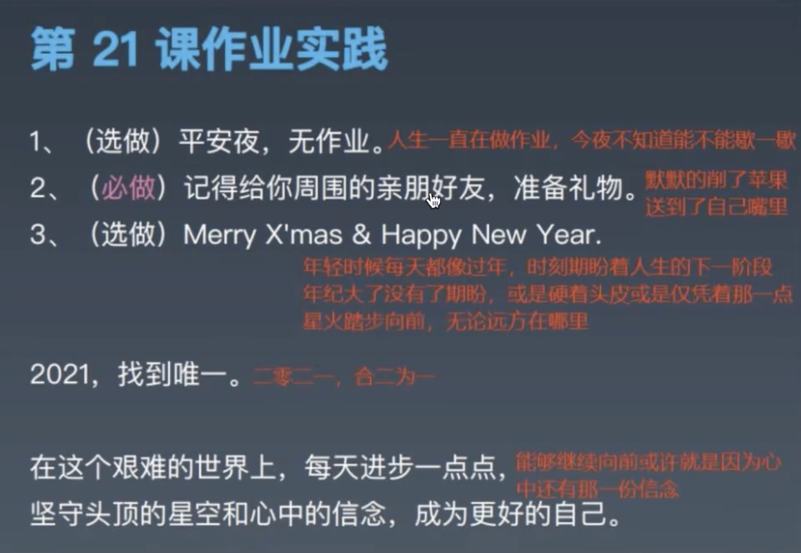

# 分布式缓存

[toc]

## 一、缓存

从为什么有缓存说起：从数据的使用说起。

两种常见的缓存：本地缓存、远程缓存。

再到常见的缓存策略，随后讲Redis会详细再讲缓存策略。

最后一个话题是（面试经常会问）——缓存世界的三大难题：缓存的穿透、缓存的击穿、缓存的雪崩。

学会背后的东西：技术在变，但背后的思想和方法永远不会变。

## 二、从数据的使用说起

### 2.1 我们把数据的使用频率和方式分个类

我们的业务系统越来越复杂，数据量越来越大，这样我们就可以对我们的业务数据进行 不同程序的分类，之前提到过，我们通过使用频率可以把数据分为：热数据、冷数据、温数据、冰数据。

#### （1）通过使用频率，我们还可以采用有一点点差异的方式进行分类：

- 静态数据：类似于字典表，长期不会变。

  比如性别数据。

- 准静态数据：变化频率很低

  比如：部门结构设置，全国行政区划数据（平均一年变一次）等

- 中间状态数据：一些计算的可复用的中间数据。一般不是原始数据，通过基础数据计算出来的中间状态的结果

  我们的流水数据是原始数据，我们可以根据流水数据计算出一个大的店铺的某个品类交易了多少钱。

  甚至我们可以说是，一个业务方法调用后返回的结构。这样的数据是中间状态数据。

  一般情况下，丢了无所谓，因为可以重新计算出来。但有时候计算的成本比较大。

  举例，变量副本：前面讲的JVM中的变量，每个线程都有其副本，它也是一个中间数据。

  举例，配置中心：配置中心可以配置一个本地的缓存文件夹，这样就可以放一些缓存的文件，把从配置中心拉取到的配置在本地缓存一份。如果配置中心宕机了，可以先用本地的。

- 变化中的动态数据（本文中不具体讲）

#### （2）这些需要缓存的数据特点：

- 热数据：虽然变动少，但它们是热数据，使用频率高。

  比如字典表，几乎所有的业务都在使用它们。

- 读写比大："读（n）/写（1）"非常大。读的频率>>写的频率

这些数据就特别适合做缓存。

#### （3）什么是缓存？

从广义上来讲，为了**加速**数据处理（降低数据库的压力）,让业务更快访问的**临时存放冗余数据**，都是缓存。

> 缓存本质上相当于原始数据的某种快照，如果跟原始数据一致的快照，那他就是对等快照。如果是中间状态，都是它加工映射过的快照。

狭义上，现在我们一般在分布式系统里把缓存到内存的数据叫内存缓存，有时候我们简称它为缓存。

> 放到内存中，加速访问，不走网络IO，磁盘IO，这些IO等慢操作，直接从内存里拿。

再狭义些，有些人把缓存称为Redis。

### 2.2  缓存无处不在

#### （1） 常见的缓存场景

缓存比我们平时在Java分布式系统下的语义要大得多：

场景一：

比如：内存本身可以看作是CPU和磁盘之间的缓存。因为CPU太快了，磁盘太慢了，内存的速度处于CPU和磁盘之间。

当CPU全速跑的时候，内存也会跟不上，这个时候就出现了CPU的缓存：L1&L2 cache。

场景二：

在网络处理、数据库引擎中有各种Buffer，这些Buffer我们称之为缓冲区，这些缓冲区就是用来放数据的，也是缓存。

场景三：

甚至在更早的时候，GUI画界面中有一个Double Buffer（双缓存），比如要画一个图，这个图需要用到10万个点，如果每画一个点就渲染一次，就会把页面卡死。优化的方案是：在内存区域，我们每1000次把点连起来。

场景四：

包括三大前端框架，用到虚拟DOM。

#### （2） 缓存的本质

**系统各级处理速度不匹配，导致利用空间换时间。**

系统里多个不同处理节点，这些处理节点处理速度是不匹配的，比如CPU和磁盘，CPU和内存，CPU的计算和实际屏幕的渲染等，这种相互之间速度是不匹配的。

为了加速这种处理，我们采用“空间换时间”的办法，把数据缓存一下。

因此，缓存是**提升系统性能**的一个简单有效的办法。

### 2.3 缓存的加载时机

通常来说，有两种缓存加载时机：

#### （1）启动时的全量缓存加载

全局有效，使用简单。

比如：Shardingsphere-jdbc、Shardingsphere-proxy启动的时候会把我们配置的多个数据源的元数据（多个数据库的表、表的列、索引）加载进来。

metadata-check的参数可以把这个加载关掉，会减少一部分的元数据的加载。

#### （2）懒加载

懒加载分为两种：

一种是：**同步使用加载**（最常见）

调用业务方法的时候，先去缓存里看一下，缓存里有就直接返回。没有的话，就去数据库里读，然后做业务操作，计算完之后把元数据和结果数据放到内存的某个地方，然后返回给调用方。

Shardingsphere 默认会缓存1024个SQL，这样就能减少对SQL的解析。

注意：Shardingsphere会根据不同的SQL作为key，匹配缓存。所以比较推荐使用占位符来拼接SQL，而不是动态拼接SQL。用占位符的方式，这个SQL就和参数没有关系，和SQL没有关系，意味着多次执行，尽管每次传的参数不一样，也没关系，SQL只需解析一次，以后不需要解析。

一种是：**延迟异步加载**

很多时候，我们不希望我们都每次调用：如果没有命中缓存，我们就去读数据库，或者中间经过一步非常复杂的操作。这样的话很慢，我的系统和我的线程都在这里卡死了。特别是我们的系统对一致性要求不那么高的情况下。或者我们调用特别频繁。

这个时候可以采取两种策略：

从缓存中获取数据，不管是否为空直接返回：

策略一（异步）：同时发布一个异步的请求线程，让其在后台慢慢加载缓存的数据。这样下次请求访问，就能命中了。

策略二（解耦）：（每次连异步线程都没有了）直接把缓存当作这块业务查询的数据库用，不发起线程。同时用额外的一套机制来维护我的缓存。这块机制对使用方来说是透明看得见的（不如：系统启动的时候，就把全量数据加载到缓存里。然后每次修改数据的操作都拦截掉，把涉及的数据更新到缓存里）。

### 2.4 缓存的有效性和数据同步

缓存的一致性和有效性。

#### （1）变动频率大、一致性要求高的数据，不太适合用缓存

变化大就意味着原始数据（数据库这边）和缓存数据一直有差异，这个时候数据来回同步的成本就比较高了。

一致性要求高，意味着只有使用**原始数据**，甚至加了**事务**，才是保险的。

> 一致性要求高，我们就要考虑每个线程不能使用一致性的副本。最好读主从读数据，而且加上同步的锁，才是保险的。这个时候也没办法用缓存。

#### （2） 如何评价缓存的有效性？

如果评价缓存用的对不对，有两个指标（有些人容易把这两个指标搞混，但这两者的差异非常大）：

**读写比**（N:1）：对数据的写操作导致数据变动，意味着维护成本。

读写比高，就意味着相关的这一批数据，它们改动的频率远远比读取的频率小。那么我们用缓存维护的成本就低（做中间频繁同步的频率就比较低）。一般我们要求这个比率为10:1以上。

这个与我们的数据量和频率有关。我们要求在一般的物理机上数据库的TPS在3000～5000，可以按照这个估计我们的QPS

**命中率**（也要高，90%以上）：命中缓存意味着缓存数据被使用，意味着有价值。

如果数据没有被命中，就是占地方。

缓存虽然有好处，但也有问题。

计算机只存在两个难题：失效和命名。

**对与数据一致性、性能、成本的综合衡量，是引入缓存的必须指标。**

到底要不要引入缓存，怎么引入缓存，哪些数据放入缓存，都需要我们做一些分析调用，最后做一个设计方案的。

### 2.5 缓存使用不当导致的问题

#### （1）系统预热导致系统启动比较慢

试想一下，一个系统启动需要预热半个小时。导致系统不能做到快速应对故障宕机等问题。

对现在来说，我们对系统的性能和稳定性要求这么高。假如，我们的系统宕机了，需要我们立刻拉起新的系统顶上。这个时候你给所有人说，需要半小时，大家可能会崩溃。

所以，我们现在对服务的业务系统，特别是做了微服务化以后，我们上容器化，上K8s Docker，有一个强的要求（包括我们在环境工程和系统稳定性建设里）——所有的系统都应该启动非常快。比如在一分钟或20秒内把单个系统的节点拉起来。这样的话，我们的系统崩溃了，我们找到前一个可用的版本，不管是拉取镜像还是把原来的版本拉起来，都可以快速恢复我们的业务，或降低业务恢复的时间。

#### （2）系统内存资源耗尽

只加入数据，不清理旧数据。旧数据处理不及时，或者不能有效识别无用数据。

跟我们的系统GC一摸一样。容量有限，不管是我们的缓存数据放在JVM内部做本地缓存，还是单独有一台机器用来做缓存。它的内存都是有限的。假如我们的数据使用不当，不断的往里面丢数据，这就跟GC一样，最后发生OOM（Out of Memory），系统就崩了。



## 三、本地缓存

### 3.1 最简单的本地缓存

```java
public static final Map<String, Object> CACHE = new HashMap<>();
CACHE.put("beijing", "100001");
String cityCode = (String)CACHE.get("beijing");
```

在当前的代码里，定义一个全局的静态Map。然后再读取到的数据库数据的时候，把一个key的数据塞到一个缓存里。当我们需要的时候，我们就不需要读数据库了。当我们需要这个数据的时候，根据key去拿这个数据就可以了。

思考：还缺什么？如何改进？

1. 并发问题；
2. 容量；
3. 过期策略；

### 3.2 Hibernate/Mybatis 都有Cache

Hibernate和Mybatis里面都有缓存，而且都有一级缓存和二级缓存。

一级缓存（session级别）：在一个大的事务所在的Session，一次操作从开始到结束，我们称这为一个会话。在这个会话中，它是有缓存的。它把这个期间，如果前面读取到了数据，如果需要复用的话，在后面就可以复用掉。**在这次会话结束掉之后，这次缓存就没了。**所以这个缓存的生命周期比较短。而且现在我们提倡用短的事务，那么这个缓存就华而不实，用处不大。

二级缓存（sessionFactory级别）：（默认没有开启，需要显式的开启）开完之后，就相当于有一个全局的缓存。这次操作中，用到的对象，根据我们的主键标识的ID等把这个数据对象缓存起来，下次用到的时候，如果缓存没有失效，就可以直接从这里面拿了。

Mybatis：

```xml
<cache type="org.mybatis.caches.ehcache.LoggingEhcache" >
<property name="memoryStoreEvictionPolicy" value="LRU"/></cache>
<select id="selectArticleListPage" resultMap="resultUserArticleList" useCache="false">
```

Hibernate:

```xml
<propery name ="hibernate.cache.provider_class"> org.hibernate.cache.EhCacheProvider</property>
<ehcache><diskStore path ="/tmp/cache" /></ehcache>
<cache usage ="read-write" />
<class name ="Student" table ="t_student" ><cache usage ="read-write" /> </class >
```


在Mybatis和Hibernate中都有各种缓存实现，但大家一般都默认使用一个叫Ehcache的缓存的类库，它有控制超时、容量等参数。Hibernate里面的配置相对麻烦和多一些。

我们可以手动将一些Mapper的缓存关掉。

其实我们可以不用这一套缓存，Mybatis里面的Mapper，在上面封装一个service方法。可以自己定义一些缓存的注解，来实现缓存。

Hibernate里面有一个特殊的，查询的数据缓存。Hibernate的一二级缓存，都是实际对象这一层（Entity这一层），那就意味着Hivernate在做OR Mapper，它每次把行数据捞出来，它还有一个行数据的缓存。这块的缓存，如果对数据库有操作，就会直接失效掉。

### 3.3 Guave Cache

在我们自己JVM的内存里，或者我们叫当前系统的应用侧，我们的业务代码里，当我们需要使用缓存的时候，我们可以简单的使用`HashMap`或`CurrentHashMap`之类的方式做缓存。同时我们还有两个常见的缓存框架（其实有三个，Ehcache也是一个）：

很灵活，可以配置各种策略：

- 缓存的大小
- 超时策略
- 使用弱引用：当没有引用的时候，就会被清理掉。

同时，还可以显式清除，还可以获取调用信息（调用了多少次，命中率），还可以添加一个移除事件的监听器，自动加载（当我们要拿一个key，这个key没有的时候，从数据库拿，返回，同时放到缓存里）等功能。

```java
Cache<String,String> cache = CacheBuilder.newBuilder()
  .maximumSize(1024)
  .expireAfterWrite(60,TimeUnit.SECONDS)
  .weakValues()
  .build(); 
cache.put("word","Hello Guava Cache"); 
System.out.println(cache.getIfPresent("word"));
```

### 3.4 Spring Cache

另外一个常用的缓存Spring Cache，最重要的特点有：

1. 基于注解和AOP，使用非常方便；

   核心功能：@Cacheable（让一个方法的返回值，放到Cache中）、@CachePut（方法执行完了，返回给调用方，同时将返回值在缓存中放一份，类似Guave自动加载功能）、@CacheEvict （让缓存失效）

2. 可以配置Condition和SPEL，非常灵活；

   很多时候，我们希望做复杂的Cache，不通过编码，我们怎么搞，在Spring Cache中，我们通过使用Condition和SPEL表达式。

3. 特别需要注意：绕过Spring的话，注解无效；

   如果某个调用的本身绕过Spring本身，注解就会失效。

## 四、远程缓存

### 4.1 本地缓存的缺点

在应用侧用缓存，那么缓存就在当前的进程（当前的JVM里）。这样的话，有什么缺点？

缺点有很多，简单题几个：

（1）在多个集群环境同步？当集群规模增加，缓存的读写放大。

每个JVM里，每个进程里都有一份缓存数据，都会更新。所有我们的读写就会被缓存数据的读写放大。假如我们的每个系统需要从数据库加载一份数据缓存起来，那么假设我们部署10个系统（比如十个用户中心应用server），那么就会有10份数据从数据库加载并缓存起来的数据。如果有100个系统服务，就需要从数据库加载100份数据放到缓存中。**集群的规模越大，从数据库拉取数据的规模越大。**所以说缓存的数据是被放大的。

假如我们有一个集中式的缓存，也就是远程缓存，不在本地了，放在远处，用一台机器专门做缓存的处理（存储、管理），那么它只需要从数据库里拉取一份数据缓存起来，别的应用系统只需要从这里拿就行了。

这个东西像Mysql的主从，比如，一主一从。如果添加新的从库，如图它不对主库造成影响，其实可以把新加的从库放到上一个从库后面，变成从库的从库。

（2）在JVM中长期占用内存？如果是堆内存，总是会影响GC

通常情况下，在本地做缓存，那么它就真的用到了JVM内存（通常是堆内存），这样每次GC都会涉及到它，同时缓存是长期存在的，而且一般情况下，缓存里面的生命周期是由我们自己管理的，这就意味着GC每次都要扫描它，标记它，但又干不掉它。总归会影响GC。

（3）缓存数据的调度处理，影响执行业务的线程，抢资源

缓存需要自己管理，需要异步的线程去扫描它，更新它、过期干掉它。这样的线程也会占用CPU资源，和我们的业务处理抢资源。

### 4.2 集中式缓存处理的优缺点（远程缓存）

- 优点

基于本地缓存的问题，发明出来了集中式的缓存处理。

以前我们的缓存都在业务侧的本地，在JVM里开启一小块做缓存，这样会导致我们缓存的数据不会特别特别的大。如果太大就会把JVM内存占太多了，现在我们可以单独搞一台机器，专门用来做缓存，这样它的容量就可以比较大了。而且我们用非JAVA语言做，它就没有GC这些东西了。我们很多机器，大家需要使用缓存的时候，读写都操作它。

- 缺点

这样的方式有什么坏处？

第一：多了一跳；

第二：如果集中式的缓存出问题，那么所有的缓存都用不了；

第三：甚至一台机器由于缓存慢，卡住了，其它机器也会受影响；

以上是加了中心节点后产生的问题。

### 4.3 Redis/Memcached 缓存中间件

常见的缓存中间件（用来做缓存Server的），或分布式缓存技术，最早是Memcached，现在已经用的不多了。现在一提到缓存，大家想的就是Redis，因为Redis基本已经是分布式，或集中式缓存、独立的缓存Server的事实标准。绝大部分用缓存，大家都会用Redis。

Redis是一个奇葩的缩写：REmote DIcionary Server （Redis）远程字典服务。前面两个单词，每个取前两个字母，后面一个单词取第一个字母，使用C语言，早期是单线程。

早期Redis是单线程，为什么还那么快？

关键是CPU跑的快，只要没有任何的阻塞，那么就可以很快，所以**Redis怕阻塞**。

> Redis有一种类似数据库存储过程的用法，那种用法跟我们大范围操作Redis的key一样，有可能会阻塞掉Redis的线程，导致Redis卡住。中间会有几十毫秒或一百毫秒不提供任何服务，这种事情非常可怕。

强烈推荐一本书，《Redis设计与实现》：http://redisbook.com/

Redis官网：https://redis.io/

Redis在线测试：https://try.redis.io/

Redis在线参考命令：http://doc.redisfans.com/

Memcached：https://memcached.org/

### 4.4 Hazelcast/Apache Lgnite 内存网格

另外最近几年，在原先的Redis、Memcached等内存中间件基础上，发展出来了更神奇的技术，叫内存网格。

Hazelcast和Apache Lgnite都是Java的

第一：它们可以当作原先的Redis之类的缓存服务器（Server）来用，本身有支持分布式、一致性（全局一致性）、多副本等；

第二：它们也可以直接用在客户端，像我们前面讲的本地可以用，可以作为jar包直接放在业务系统里。（不管是堆内存，还是堆外的，来做本地缓存。）

> 如果只做到上面两步，还不牛逼。

第三：可以让我们在一个的集群里，把我们所有的各个不同节点里的缓存，大家做成一个缓存，拼起来，做成一个大的分布式的网格，这也是“内存网格”的来历。

> 这个机制和ClickHouse的机制类似。

内存网格会实现我们现在的各种数据结构，比如Map、List、Set。试想一下在服务器A和服务器B上创建各创建一个名称为map01的Map对象（`Map<String,String> map01 = new HashMap<>();`），在服务器B上为map01添加一个键值对`map01.put("name", "apple")`，在服务器A上就可以获取到刚刚在服务器B上添加的值：`map01.get("name")`。用散列的map组成一个超级大的map。

redis有弱化版的Hazelcast。

## 五、缓存策略

### 5.1 容量

资源有限。一个系统是有容量限制的。

> 不考虑容量，也是在耍流氓。

所以：

（1）缓存数据容量是必须考虑的问题；

（2）思考系统的设计容量、使用容量、峰值。这是我们做架构涉及的常识。

- 设计容量：到底能承受多少，到底多少数据能放到我们的缓存里；
- 使用容量：用起来的时候，水位到底是什么，是高了，是低了；
- 峰值：突然一下子流量来了，峰值大概是平时的几倍；

容量不仅涉及到系统的稳定性，还需要我们评估整体的规模，还涉及到成本（内存还是比较贵的）。

> 如果我们的数据都放在磁盘里，它的成本比我们放在内存里低。

### 5.2 过期策略

第二个我们要考虑过期策略，这个也特别重要。**容量有限，我们怎么才能最大化的使用我们现有的容量。**

> 就像我们每个人的时间、生命、精力、是有限的，你怎么来最大化的使用你的时间和精力。这就是我们说的过期策略。

#### （1） 按照固定时间过期：最简单的策略是按照我们的时间去淘汰

定时清掉旧的东西，并更新。

#### （2）按照FIFO或LRU：按照队列的方式

FIFO先进先出（不是最好的方案）。LRU（最近、最少使用），最近使用了，预计它还会被使用。

#### （3） 按照业务时间加权（自定义的淘汰策略），3+5x

实际在应用过程中，量不大或这业务没有强烈的特点，一般就配成LRU。实际工作中，发现业务是很有特点的，那么就可以采用自定义的淘汰策略。

例如：3+5x，航行系统的机票业务。通过调用IBE接口，获取机票信息，如果不做任何控制，一天会调用130万次（也就是一天10万块钱）。如何可以保证数据有效，又可以少调用这些接口，就需要一个好策略。

把数据取出来之后，因为机票信息一直是变化的（现在订票，过一会儿，可能没票了），所以如果采用固定的时间超时机制是不行的，因为在固定时间段内是否有票我们不知道。如果每次调用太频繁，付出的钱又太多了。

为了保证数据有效，又能保证有票时真的有票，绝大多数人订的机票是今天或明天的。

> 补充一点额外的知识：如果你订的机票，没有去坐，这张票是不是就浪费了？
>
> 是没有的。机票是分仓位的，头等舱F仓、商务舱C仓、经济舱Y仓，剩下仓位都是Y仓的变种，每订一个机票，可以查到当前是什么仓位。机票如果没有值机、没有去坐，这张机票的有效期是——在你乘坐这张机票的有效期时间往后反推一年都有效。可以要求航空公司，只要有这个航班，有那个仓位，现在有余票，都可以补给你。如果飞机没赶上，改签又来不及，这张机票可以攒着，下次有需要再用就可以了。

因为大家查询机票搜索这块跟时间是严格往后递减的。越远的数据，缓存的时间越长，如果一个客户查询是12天之后的，那么这个信息可以额缓存一个小时，如果查询的是当天或第二天的，默认就缓存几分钟（比如3分钟），往后每隔一天加5分钟。就有了3+5x。

今天机票，缓存3分钟，明天缓存8分钟，后天机票缓存13分钟……用户下单的时候，把新的数据更新到缓存，这样就从每天10万块下降到每天9千块。

> 后来发现，使用缓存策略之后，查询仍然很频繁，因此继续优化：区分爬虫流量，如果是爬虫流量，直接把缓存返回给对方。

## 六、缓存常见问题

常见缓存的三个问题：穿透、击穿、雪崩。

### 6.1 缓存穿透

> 穿透是透传的意思。

#### 问题：大量并发查询不存在的Key，导致都直接讲压力透传到数据库

一般我们采用同步策略，如果缓存没有，我们就去查询数据库。这样如果有人要攻击我们，它估计传一个不存在的Key来调用我们，每次都要查询数据库，去查又查不到，所以缓存里还是没有，这样段时间内就会创造大量这样的请求，大量的请求压数据库，可能会把数据库压垮。

简单来说，就是被人利用产生了一个对数据库的DDOS攻击。

#### 分析：为什么会透传？不存在一直为空

第一次调用的时候，这个Key真的没有。去数据库查也没有，没有往缓存里写，或往缓存里写也是空值。我们从缓存里拿数据判断也是拿到的是一个空值。这样的话，哪怕我们往数据库里写一个key，它是个空值，我们还是认为这是没有的。

所以，我们需要注意的是：让缓存能够区分KEY不存在和查询到一个空值。

#### 解决办法：

1. 缓存空值Key，这样第一次不存在，也会被加载记录，下次拿到有这个Key；

   把这些不存在的Key也放到缓存里，记录一个真的空值（或者人为定义一个代表空值的特殊值），我们就可以判断这个值是空值，直接返回给调用方，不去数据库里面查询了。

2. 使用Bloom过滤（布隆过滤器）或RoaringBitmap判断Key是否存在；

   我们记录下来哪些key是在我们缓存里存在的，使用Bitmap（经常提，用它做幂等、做去重）

3. （万能的方法）完全以缓存为准，使用延迟异步加载的策略，这样就不会触发更新

   将缓存和更新缓存的操作完全解耦，所有的查询都会直接打到缓存上，那么它跟数据库就没任何关系。只有一个单独的线程池来对缓存进行更新，这个地方是由我们自己控制，这样就和外来的流量没有关系了。

### 6.2 缓存击穿

跟穿透很像，它两个都有一个“穿”。

#### 问题：某个Key失效的时候，正好有大量并发请求访问这个Key

#### 分析：这样的后果和“缓存穿透”的后果一样。

这东西特别巧，一般发现不了，属于比较偶然的。

#### 解决办法：

1. KEY的更新操作添加全局互斥锁；

   使用锁对一个全局的更新卡住，使对key的更新，每次正好有一个线程去做。它做完，别的线程去拿它更新的数据就好了。

2. （万能公式）完全以缓存为准，使用延迟异步加载的策略，这样就不会触发更新

### 6.3 缓存的雪崩

如果“缓存击穿”不断出现，就会像滚雪球一样，出现缓存雪崩。

#### 问题：当某一个时刻发生大规模的缓存失效的情况，会有大量的请求进来直接打到数据库，导致数据库压力过大升值宕机

#### 分析：一般来说，由于更新策略、或数据热点、缓存服务宕机等原因，可能会导致缓存数据同一时间点大规模不可用，或者都更新。所以，需要我们的更新策略要在时间上合适，数据要均匀分布，缓存服务器更多台高可用。

场景一：当更新多策略有问题，假如线上部署了一万台机器，每天12点整把静态数据失效掉，所有的数据重新从数据库加载最新静态数据。12点整大家一块干，马上一百倍的压力打到数据库上，或者系统每次启动，系统预热数据加大。假如没有做滚动升级，一下子push线上二十多台机器，大家同步做启动，每个都连上数据库，同步做数据库的预热，情况会跟这个一摸一样。

场景二：或者有数据热点，所有数据都打在一个缓存上。

场景三：再或者，缓存服务器宕机了，刚才从缓存拿数据那一块就全部完蛋了。这个时候所有流量就打到数据库上。

这三种情况，都会导致缓存雪崩。

#### 解决办法：

1. 更新策略在时间上做到比较均匀；

   不要傻乎乎的，每天固定时间点，大家一起更新。

2. 使用的热数据尽量分散到不同的机器上；

3. 多台机器做主从复制或多副本，实现高可用；

4. 实现熔断限流机制，对系统进行负载能力控制。


