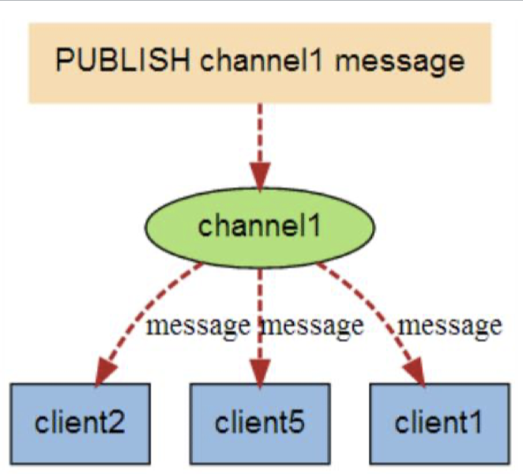
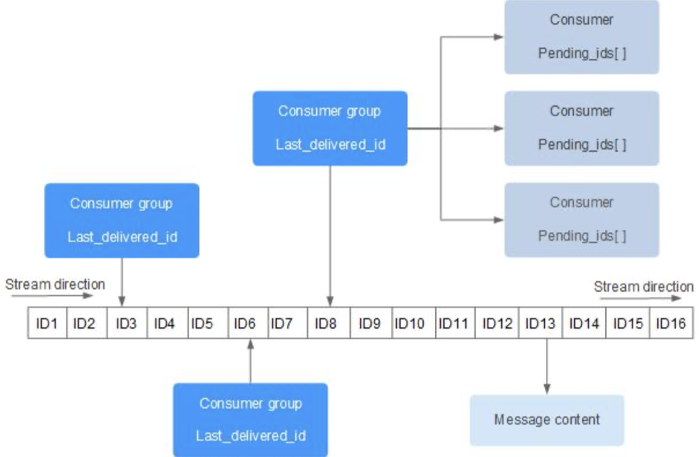

# 分布式缓存：Redis详解

[toc]

## 一、概述

1. Redis基本功能；
2. Redis六大使用场景；
3. Redis的Java客户端；
4. Redis与Spring整合；
5. Redis高级功能；
6. Redis集群与高可用+redisson+hazelcast；

## 二、Redis基本功能

### 2.1 Redis安装

三种安装方式：

- 下载安装、编译源码安装（Windows：微软提供3.X/Memurai提供5.X）

  官方只有Linux版本和Mac版本，没有Windows版本（Redis一开始就不支持Windows），后来微软一看这玩意太流行了，微软内部就有一个小组在做windows兼容的版本（但是版本比较老，版本只更新到了3.x），有一帮人做了一个商业化的版本Memurai（同时有一个简单的社区版，社区版很恶心，需要每个礼拜重启一次。目前最高到5.X版本）

  官方做了一个测试6.X的版本，啥也不动，整个性能比5.X的读写性能提供30%～50%，比再之前的版本提升的更高。所以一般来说，升级Redis还是有好处的。而且，Redis的兼容性还非常好。虽然升级的很多版本，但Redis的功能一直在做“加法”（在做增量），没有改以前的，以前的东西基本都还能用。

- brew、apt、yum安装

- docker方式启动（比较推荐）

  用docker方式，可以规避windows上没有的尴尬处境。

使用docker安装redis示例：

```shell
-- 拉取一个redis镜像，默认拉取最新版本
sudo docker pull redis
-- 运行一个redis示例
sudo docker run -itd --name redis-test -p 6379:6379 redis
-- 查看docker的版本
$ sudo docker image inspect redis | grep -i 'version'
                "GOSU_VERSION=1.12",
                "REDIS_VERSION=6.2.6",
        "DockerVersion": "20.10.7",
                "GOSU_VERSION=1.12",
                "REDIS_VERSION=6.2.6",

-- 测试执行：先进入当前的redis容器，再执行redis命令
$ sudo docker exec -it redis-test /bin/bash
root@72747f9c59eb:/data# redis-cli
127.0.0.1:6379> set one_name aa
OK
127.0.0.1:6379> get one_name
"aa"
127.0.0.1:6379>
```

可以看到上面docker启动redis没有配置任何的Redis本身参数（除了映射一个容器内到我本地的端口外，没有配置任何redis本身的操作），假如我们启动的时候要指定一些自定义的配置，应该怎么搞？

### 2.2 Redis安装——Docker

#### （1）新手入门注意到坑

Redis的docker镜像，这里面有一个新上手的时候，特别容易踩的一个坑，就是默认启动的时候，没有任何的配置文件，也没有任何可以配置参数的选项，那怎么搞呢？

Docker推荐我们在run一个镜像实例的时候（启动一个容器的时候），我们通过文件映射或文件夹映射的方式，把我们当前机器上的配置文件或一个文件夹映射到docker容器里面去。这样就可以让我们启动的Docker容器使用我们给定的配置里的参数，它作为启动时的配置文件，这个文件夹作为redis我们后面操作数据备份的文件夹。以这种方式来启动。

> 作为演示，就不再演示这样方式了。

```shell
$ sudo docker run -p 6379:6379 --name redis01 -v /etc/redis/redis.conf:/etc/redis/redis.conf -v /etc/redis/data:/data -d redis redis-server /etc/redis/redis.conf --appendonly yes
```

#### （2）基本命令演示

redis默认有16个库，默认用的是“0”，从0到15.

- dbsize 查看key个数

- flushdb 清空Redis的key

```shell
$ sudo docker exec -it redis-test /bin/bash
Password:
root@72747f9c59eb:/data# redis-cli
-- 查看当前数据库有多少个key
127.0.0.1:6379> dbsize
(integer) 1
-- redis 默认有16个库，默认用的是“0”，通过select命令进行切换
127.0.0.1:6379> select 1
OK
127.0.0.1:6379[1]> select 0
OK
127.0.0.1:6379> select 15
OK
-- 默认库，从0到15，切换16会报错
127.0.0.1:6379[15]> select 16
(error) ERR DB index is out of range
--  查看所有的key
127.0.0.1:6379> get lua-key
"lua-value"
127.0.0.1:6379> keys *
 1) "key:__rand_int__"
 2) "mylist"
 3) "counter:__rand_int__"
 4) "list01"
 5) "lua-key"
 6) "name"
 7) "set01"
 8) "zset01"
 9) "map01"
10) "set02"
11) "myhash"
12) "one_num"
13) "bm01"
127.0.0.1:6379> dbsize
(integer) 14
127.0.0.1:6379> flushdb
OK
127.0.0.1:6379> dbsize
(integer) 0
```

### 2.3 Redis 性能测试

**可以使用自带的命令：redis-benchmark**

我们一般都说Redis这种基于内存的缓存，性能特别好，它的性能到底有多好，有没有简单办法去测试一下。可以简单执行一个`redis-benchmark`

> benchmark 是基线的意思。

```shell
-- 查看CPU的核数
# cat /proc/cpuinfo | grep -i 'cpu cores' |uniq
cpu cores	: 1
# cat /proc/meminfo|grep 'MemTotal'
MemTotal:        2035400 kB
```

在我启动的docker里（4Core，2G）：


#### （1）测试指定的操作

```shell
-- 测试10000次，指定的几次有限操作,使用32个连接去测试
# redis-benchmark -n 100000 -c 32 -t SET,GET,INCR,HSET,LPUSH,MSET -q

-- 测试的结果如下：可以看到一秒钟的操作，SET可以到达11万，GET可以到达12万
root@72747f9c59eb:/data# redis-benchmark -n 100000 -c 32 -t SET,GET,INCR,HSET,LPUSH,MSET -q
SET: 116959.06 requests per second, p50=0.135 msec
GET: 120627.27 requests per second, p50=0.135 msec
INCR: 121654.50 requests per second, p50=0.135 msec
LPUSH: 124688.28 requests per second, p50=0.135 msec
HSET: 118483.41 requests per second, p50=0.135 msec
MSET (10 keys): 127877.23 requests per second, p50=0.167 msec
```

#### （2）测试所有操作，并打印更详细信息

如果想看更详细的操作，可以只保留跑100000次和32个连接：

这样就会打印出很多详细的信息，里面有延迟信息，可以看到99%的请求都在1毫秒返回，延迟非常低。

```shell
root@72747f9c59eb:/data# redis-benchmark -n 100000 -c 32
====== HSET ======
  100000 requests completed in 0.92 seconds
  32 parallel clients
  3 bytes payload
  keep alive: 1
  host configuration "save": 3600 1 300 100 60 10000
  host configuration "appendonly": no
  multi-thread: no

Latency by percentile distribution:
0.000% <= 0.047 milliseconds (cumulative count 1)
50.000% <= 0.143 milliseconds (cumulative count 57726)
75.000% <= 0.167 milliseconds (cumulative count 75159)
87.500% <= 0.207 milliseconds (cumulative count 88137)
93.750% <= 0.263 milliseconds (cumulative count 94179)
96.875% <= 0.335 milliseconds (cumulative count 96975)
98.438% <= 0.439 milliseconds (cumulative count 98477)
99.219% <= 0.599 milliseconds (cumulative count 99257)
99.609% <= 0.703 milliseconds (cumulative count 99615)
99.805% <= 0.871 milliseconds (cumulative count 99811)
99.902% <= 1.191 milliseconds (cumulative count 99903)
99.951% <= 1.823 milliseconds (cumulative count 99953)
99.976% <= 43.839 milliseconds (cumulative count 99976)
99.988% <= 44.191 milliseconds (cumulative count 99988)
99.994% <= 44.351 milliseconds (cumulative count 99994)
99.997% <= 44.415 milliseconds (cumulative count 99997)
99.998% <= 44.511 milliseconds (cumulative count 99999)
99.999% <= 44.671 milliseconds (cumulative count 100000)
100.000% <= 44.671 milliseconds (cumulative count 100000)

Cumulative distribution of latencies:
8.863% <= 0.103 milliseconds (cumulative count 8863)
88.137% <= 0.207 milliseconds (cumulative count 88137)
96.076% <= 0.303 milliseconds (cumulative count 96076)
98.172% <= 0.407 milliseconds (cumulative count 98172)
98.832% <= 0.503 milliseconds (cumulative count 98832)
99.302% <= 0.607 milliseconds (cumulative count 99302)
99.615% <= 0.703 milliseconds (cumulative count 99615)
99.766% <= 0.807 milliseconds (cumulative count 99766)
99.837% <= 0.903 milliseconds (cumulative count 99837)
99.874% <= 1.007 milliseconds (cumulative count 99874)
99.896% <= 1.103 milliseconds (cumulative count 99896)
99.904% <= 1.207 milliseconds (cumulative count 99904)
99.921% <= 1.303 milliseconds (cumulative count 99921)
99.932% <= 1.407 milliseconds (cumulative count 99932)
99.945% <= 1.503 milliseconds (cumulative count 99945)
99.949% <= 1.607 milliseconds (cumulative count 99949)
99.951% <= 1.703 milliseconds (cumulative count 99951)
99.956% <= 1.903 milliseconds (cumulative count 99956)
99.960% <= 2.007 milliseconds (cumulative count 99960)
99.965% <= 2.103 milliseconds (cumulative count 99965)
99.968% <= 3.103 milliseconds (cumulative count 99968)
99.985% <= 44.127 milliseconds (cumulative count 99985)
100.000% <= 45.119 milliseconds (cumulative count 100000)

Summary:
  throughput summary: 109051.26 requests per second
  latency summary (msec):
          avg       min       p50       p95       p99       max
        0.172     0.040     0.143     0.279     0.551    44.671
```

### 2.4 Redis的5种基本数据结构

我们都知道Redis是一个缓存，之前我们了解了缓存的技术，从本地缓存到远程的集中式缓存这样的发展过程。

> 最开始我们定义一个缓存，就是一个HashMap对象；
>
> 然后考虑到安全性，我们会用到ConcurrentHashMap；
>
> 再复杂一些，我们在上面加了更多的策略，就有了Ehcache或Guave Cache这种本地JVM内部的Java库；
>
> 再进一步发展就有了Spring Cache这种，它把缓存封装起来，让我们很方便使用的缓存框架。
>
> 缓存底层的技术：Ehcache或Guave，或者我们直接用ConcurrentHashmap，在应用里我们为了更方便的使用，就有了Spring Cache这种缓存本身的框架。

JVM里的缓存，我们一般定义一个Map的结构，key一般是一个字符串，value是一个Object的对象，存什么都可以。因为在JVM内存，存什么都可以，反正都是一个JVM对象，不会涉及到对象（数据本身）的序列化过程。

但是我们使用远程的缓存，这一块就完全不一样了。我们想一下，现在我们用了一台Redis的Server作为我们的缓存，我们部署了10台应用系统，我们的应用系统每当需要向缓存里写数据的时候，或从缓存里读数据的时候，都要经过网络传输，传输到当前的应用系统，跟数据库一样，来回的数据交互。拿到之后，再把它还原成我们想要的对象。这个时候就涉及到序列化这些东西。

另一方面，我们都知道，如果我们所有的处理、访问、使用的时候，定义的数据结构是Object结构或字节数组这种类型，那么就意味着我们没有办法去很好的区分它们不同特点，针对它们进行不同的优化。相当于我们做了一个很宽泛、很通用的东西。那我们就没法在知道它是特定类型的时候去很好的处理它们。

> 比如，就像病毒和细菌一样，我们没有很好的区分它们的不同，我们就没法去很好的针对它们去治疗它们。
>
> 比如，人类已经完全解决了丙肝，但对乙肝还是没有办法。

我们解决这些问题，遇到一些很复杂的问题的时候，我们从最开始到逐渐深入到干一件事，我们逐渐把一个复杂的问题拆解成一个个小的问题，然后针对不同小问题的特点，把它们分为几种不同类型的问题。挨个的用不同的方法去解决它们。而不要试图用一个大的方法把它们都解决掉。

前面提到的内容，都有这种思路，比如我们对数据使用的方式、频率进行分类，分成热数据、温数据、冷数据、冰数据，然后对它们进行不同的处理，从而达到我们系统的性能和成本的最大化。

基于这些想法，**Redis就把我们的数据类型定义为五种基本的数据类型，一般会加上三种高级数据类型，一共是八种Redis对外提供的数据类型**。很巧合Redis实现的那一层数据类型也是八种。

#### （1）字符串（string）～简单来说就是三种，int、string、byte[]（二进制）

> 当我们没有自定义JSON序列化的时候，使用的Java自己的序列化方式，往Redis里面写的就是一个字符串类型，但实际往里面存的是Java序列化的二进制的字节数组。

字符串类型是Redis种最为基础的数据存储类型，它在Redis中是二进制安全的，这便意味着该类型可以接受任何格式的数据，如JPEG图像数据或JSON对象描述信息等。在Redis中字符串类型的value最多可以容纳的数据长度为512M。

> 它叫字符串，你可以把它叫做字符串，其实它是二进制。这样的话，它就可以用来保存任何的数据，包括二进制的、int等。最多可容纳512M数据。也就是说，不管怎么存，最大不能超过512M。

在Redis中，我们的默认操作，都可以把它当作字符串处理。

常用的命令：

- set  设置值
- getset（组合操作，把两个操作组成和一个原子操作）
- del（删掉一个key）
- exists（1 代表存在，0代表不存在）
- append（追加字符串）

如果我们将其当作整数类型，就可以使用这几种操作：

- incr（把值加1）
- decr（把值减1）
- incrby（加指定值）
- decrby（减指定值）

```shell
# redis-cli
-- 发现有5个key， 因为刚刚做性能测试的时候，往里面添加了key
127.0.0.1:6379> dbsize
(integer) 5
-- 查看有哪些key
127.0.0.1:6379> keys *
1) "counter:__rand_int__"
2) "myhash"
3) "mylist"
4) "one_name"
5) "key:__rand_int__"
-- 可以就像HashMap一样使用
127.0.0.1:6379> set name lifei
OK
127.0.0.1:6379> get name
"lifei"
-- 获取原来旧的值，并设置了新值
127.0.0.1:6379> getset name feifei
"lifei"
-- 这样再获取值的时候，就是一个新值
127.0.0.1:6379> get name
"feifei"
-- 判断key是否存在
127.0.0.1:6379> exists name
(integer) 1
127.0.0.1:6379> exists name1
(integer) 0
-- 删除一个字符串
127.0.0.1:6379> del one_name
(integer) 1
127.0.0.1:6379> exists one_name
(integer) 0
-- 向字符串后面进行追加
127.0.0.1:6379> append name -1993-12
(integer) 14
127.0.0.1:6379> get name
"feifei-1993-12"
-- 当作int类型进行处理
127.0.0.1:6379> set one_num 12
OK
127.0.0.1:6379> incr one_num
(integer) 13
127.0.0.1:6379> incr one_num
(integer) 14
127.0.0.1:6379> get one_num
"14"
-- 减1
127.0.0.1:6379> decr one_num
(integer) 13
-- 直接加3
127.0.0.1:6379> incrby one_num 3
(integer) 16
-- 直接 减 5
127.0.0.1:6379> decrby one_num 5
(integer) 11
```

注意三个问题：

1. 字符串append（性能问题）：会使用更多的内存

   Redis的底层在我们往里面set一个新的值，比如`set b bbb`，它实际存的是“bbb\0”（头信息都不要）。一旦我们执行了`append b ccc`，实际上新产生的（或使用的内存）不再是“bbbccc\0”七个字节，而是会开启很大一块空内存，作为它还未使用的空的空间，如果后面不再频繁的append操作，这块空间就会被浪费掉。

   Redis的作者，在设计这块的时候，假设一个字符串不断的被在上面改（进行append操作)，那么这个append操作是比较频繁的。为此多给它分配块大的缓冲区，比每次额外分配，能减少很多分配的次数。所以，假设我们不是在一个字符串上频繁的append，就不要在一个字符串上append，我们可以这样做，直接在旧值上采用set操作：`set b bbbccc`，就能够提升我们操作字符串的性能。

2. 整数共享（的性能问题）：**如果能使用整数，就尽量使用整数**，限制了Redis内存+LRU

   默认情况下，Redis会把自己使用的整数，都变成一个共享的对象。多个引用它的，大家就会复用它。相当于它上面的引用计数加1。这样的话，我们就可以减少一些对象。相当于有一个大字典，把一些常用的整数都放进去了。使用的时候只需要记录下它的标号，然后引用它就可以了。

   这样可以充分利用它的整数共享，就像我们在JVM上，默认的在255以内的整数，都会被缓存起来共享，后面重新定义的对象（比如25、26）就会复用原先的对象。

   这边有个使用限制，如果我们配置的Redis参数里面限制了Redis内存大小，或者我们配置了LRU的淘汰策略。都**会使这个整数共享的策略失效**。

   > 由于配置了LRU之后，使用整数共享会导致引用混乱，所以整数共享的策略失效。

3. 整数精度问题：redis大概能保证16位，17-18～位的大整数就会丢失精度

   精度问题是所有的系统里，大家除了使用大数（BigInteger，BigDecimal等）都会遇到的问题。Redis的精度大概能保证16位，17-18位的大整数就会丢失精度。不精确

   比如，有些系统里，使用雪花算法生成的key特别长，超过16位，这样的话，这样的值塞到redis，再从redis中拿出来，就和它之前的数值是不一样的。这样就会导致一直命不中，或从内存中取错了。

#### （2）散列 （hash）— Map ～ Pojo Class

> 简单来说，就是我们的Map或HashMap。它所有的操作就对应着我们Map的操作。Map除了是一个Map外，还像一个对象本身的结构（POJO的 Class），比如一个学生（Student）有几个不同的属性：姓名、年龄等，可以拼做我们的数据对象。Student有几个属性，并有getter、setter方法，同时我们可以用map来表示一个Student对象，用key来代表对象的属性。

Redis中的Hash类型可以看成具有String key 和String value的map容器。所以该类型非常适合用于存储对象的信息，如username、password、age。如果Hash中包含少量的字段，那么该类型的数据也将仅占用很少的磁盘空间。

hash类型的操作基本上相当于string类型操作上加了前缀“h”：

- hset  向hash中塞入值
- hget 从hash中取出值
- hmset （批量设置）：批量的设置值
- hmget（批量获取）：批量获取值
- hgetall ：直接获取全部的值，将key和value按照“1、2、3、4……”的顺序显示出来
- hdel ：从hash中删除一个键值对
- hincrby：将hash中的某个整数值加上某个值
- hexists：判断hash中是否存在某个属性
- hlen：查看hash的属性个数
- hkeys ：获取hash的所有key集合
- hvals：获取hash中所有value集合

这些操作基本能和Java中的HashMap操作对应上。

```shell
-- 创建一个名称为map01的hash，并塞进去一个name属性，值为aaa
127.0.0.1:6379> hset map01 name aaa
(integer) 1
-- 向一个叫map01的hash中塞进去一个age属性，值为18
127.0.0.1:6379> hset map01 age 18
(integer) 1
-- 从名称为map01的hash中获取name 的值
127.0.0.1:6379> hget map01 name
"aaa"
-- 从名称为map01的hash中获取age 的值
127.0.0.1:6379> hget map01 age
"18"
-- 为名称为map01的hash批量设置多个属性：username=xiaoming, password=123456
127.0.0.1:6379> hmset map01 username xiaoming password 123456
OK
127.0.0.1:6379> hget map01 username
"xiaoming"
127.0.0.1:6379> hget map01 password
"123456"
127.0.0.1:6379> hmget map01 username password
1) "xiaoming"
2) "123456"
-- 获取map01的所有键值对
127.0.0.1:6379> hgetall map01
1) "name"
2) "aaa"
3) "age"
4) "18"
5) "username"
6) "xiaoming"
7) "password"
8) "123456"
-- 从map01 中删除一个键值对
127.0.0.1:6379> hdel map01 age
(integer) 1
127.0.0.1:6379> hgetall map01
1) "name"
2) "aaa"
3) "username"
4) "xiaoming"
5) "password"
6) "123456"
-- 向map01中添加一个score属性
127.0.0.1:6379> hset map01 score 2
(integer) 1
-- 将 map01中的score加5
127.0.0.1:6379> hincrby map01 score 5
(integer) 7
127.0.0.1:6379> hget map01 score
"7"
-- 判断map01中是否存在name属性
127.0.0.1:6379> hexists map01 name
(integer) 1
127.0.0.1:6379> hexists map01 name01
(integer) 0
-- 查看属性的个数
127.0.0.1:6379> hlen map01
(integer) 4
-- 获取map01所有key的集合
127.0.0.1:6379> hkeys map01
1) "name"
2) "username"
3) "password"
4) "score"
-- 获取map01中所有value集合
127.0.0.1:6379> hvals map01
1) "aaa"
2) "xiaoming"
3) "123456"
4) "7"
```

#### （3）列表（list）～Java的LinkedList

在Redis中，List类型是按照插入顺序排序的字符串链表，和数据结构中的普通链表一样。我们可以在其头部（left）和尾部（right）添加新的元素。在插入时，如果该键并不存在，Redis将为该键创造一个新的链表。与此相反，如果该链表中的所有元素均被移除，那么该键也会被从数据库中删除。

> 相当于Java中的LinkedList，一个链表。

- lpush：向链表的左边插入数据；
- rpush：向链表的右边插入数据；
- lrange：范围查询，从0开始，-1代表结束
- lpop：从链表的左边弹出数据；
- rpop：从链表的右边弹出数据；

这些操作和堆列和栈的操作很像。它定义了头和尾，所以就有了从头和从尾操作。

> 比较邪门的事情：插入的顺序和它在工具上显示的顺序完全相反。

```shell
127.0.0.1:6379> lpush list01 a b c
(integer) 3
127.0.0.1:6379> lrange list01 0 -1
1) "c"
2) "b"
3) "a"
127.0.0.1:6379> lrange list01 0 1
1) "c"
2) "b"
127.0.0.1:6379> rpush list01 4 5
(integer) 5
127.0.0.1:6379> lrange list01 0 -1
1) "c"
2) "b"
3) "a"
4) "4"
5) "5"
127.0.0.1:6379> lpush list01 x y
(integer) 7
127.0.0.1:6379> lrange list01 0 -1
1) "y"
2) "x"
3) "c"
4) "b"
5) "a"
6) "4"
7) "5"
127.0.0.1:6379> lpop list01
"y"
127.0.0.1:6379> lrange list01 0 -1
1) "x"
2) "c"
3) "b"
4) "a"
5) "4"
6) "5"
```

#### （4）集合（set）～java的set，不重复的list

> 和Java中的set类似，和list一样时线性数据结构，区别在于，set是不重复的list。集合不仅是编程的概念，也是数据上的概念。

在Redis中，可以把set类型看作是没有排序的字符集合，和list类型一样的。我们也可以在该类型的数值上执行添加、删除和判断某一个元素是否存在等操作，这些操作的时间复杂度为O(1)，即常量时间内完成依次操纵。

和list类型不同的是，Set集合中不允许出现重复的元素。

类似java中set的操作：

- sadd ：相当于java中的`add()`方法
- srem：相当于java中的`remote()`方法
- smembers：列出集合中所有元素
- sismember：相当于java中的`contains()`方法
- scard：获取集合中元素个数

类似数学中元素运算的概念：

- sdiff：求两个集合的差集
- sinter：求两个集合的交集
- sunion：求两个集合的并集

```shell
127.0.0.1:6379> sadd set01 a
(integer) 1
127.0.0.1:6379> sadd set01 b c
(integer) 2
127.0.0.1:6379> srem set01 b
(integer) 1
127.0.0.1:6379> smembers set01
1) "a"
2) "c"
127.0.0.1:6379> sismember set01 a
(integer) 1
127.0.0.1:6379> sadd set02 a e f
(integer) 3
127.0.0.1:6379> sdiff set01 set02
1) "c"
127.0.0.1:6379> sinter set01 set02
1) "a"
127.0.0.1:6379> sunion set01 set02
1) "f"
2) "a"
3) "e"
4) "c"
127.0.0.1:6379> scard set01
(integer) 2
```

#### （5）有序集合（sorted set），前缀是z

sorted和set极为相似，它们都是字符串的集合，都不允许重复的元素出现在一个set中。它们之间主要的差别是sortedset中每个成员都有一个分数与之关联。redis正是通过分数来为集合的成员进行从小到大的排序。sortedset中分数是可以重复的。

>和第四种基本数据结构的集合本质上没有太大的区别，所有的操作上多了一个东西，每个key里面的元素可以带一个数值，这个数值可以看作元素的分数（或元素的权重）。然后放进去的东西都是根据这个权重来排序的。这样的话，我们就可以从这个集合里面按照一定的范围、条件来获取一部分的数据。因为它默认是按照权重来排序的，既然排好序了，我们就可以取一部分。
>
>这些元素都是可变的，我们可以动态的，可以在程序运行的过程中修改元素的权重。这样就可以达到我们的排序一直在动态的变化。

- zadd key score member score2 member2... : 将成员以及该成员的分数存放到sortedset中
- zscore key member : 返回指定成员的分数
- zcard key : 获取集合中成员数量
- zrem key member [member...] : 移除集合中指定的成员，可以指定多个成员
- zrange key start end [withscores] : 获取集合中脚注为start-end的成员，[withscores]参数表明返回的成员 包含其分数
- zrevrange key start stop [withscores] : 按照分数从大到小的顺序返回索引从start到stop之间的所有元素 （包含两端的元素）
- zremrangebyrank key start stop : 按照排名范围删除元素

```shell
127.0.0.1:6379> zadd zset01 1 a3 2 a1 3 b1
(integer) 3
127.0.0.1:6379> zscore zset01 a1
"2"
127.0.0.1:6379> zcard zset01
(integer) 3
127.0.0.1:6379> zrem zset01 b1 a3
(integer) 2
127.0.0.1:6379> zadd zset01 2 b3 3 b1 2 b2
(integer) 3
127.0.0.1:6379> zcard zset01
(integer) 4
127.0.0.1:6379> zrange zset01 0 -1 withscores
1) "a1"
2) "2"
3) "b2"
4) "2"
5) "b3"
6) "2"
7) "b1"
8) "3"
127.0.0.1:6379> zrevrange zset01 0 -1 withscores
1) "b1"
2) "3"
3) "b3"
4) "2"
5) "b2"
6) "2"
7) "a1"
8) "2"
127.0.0.1:6379> zrevrange zset01 0 1 withscores
1) "b1"
2) "3"
3) "b3"
4) "2"
127.0.0.1:6379> zadd zset01 2 b3 3 b1 2 b2
(integer) 3
127.0.0.1:6379> zrange zset01 0 -1 withscores
1) "a1"
2) "2"
3) "b2"
4) "2"
5) "b3"
6) "2"
7) "b1"
8) "3"
127.0.0.1:6379> zremrangebyrank zset01 2 2
(integer) 1
127.0.0.1:6379> zrange zset01 0 -1 withscores
1) "a1"
2) "2"
3) "b2"
4) "2"
5) "b1"
6) "3"
```

### 2.5 Redis的3种高级数据结构

这三种数据结构都是封装前面的三种数据结构，基础的数据结构只有五种。这三种是组合、封装了基础的数据结构。针对特定的使用方式，进行了优化。

#### （1）Bitmaps（位图）

是一个精确度，而bloom过滤是一个非精确的。

bitmaps不是一个真实的数据结构。而是string类型上的一组面向bit操作的集合。由于strings是二进制安全的blob，并且它的最大长度为512M，所以bitmaps最大可以设置2^32个不同的bit。

>Bitmap，我们经常用幂等、去重。Bitmap最简单的是在Java的`java.util`。其实我们自己可以用byte数组来定义一个简单的Bitmap。
>
>很多时候我们需要一个全局的，多个服务器大家能够共用的、分布式的bitmap，就可以用Redis了。
>
>Redis中支持一个叫Bitmaps的数据结构。但是它不是一个真实的数据结构，它是封装在前面的数据结构基础之上。
>
>Bitmaps（位图）是做什么的？
>
>位图是基于位操作的，位操作比较快。这样我们就可以把数据压缩到一个比较小的范围内。在早期我们使用掩码来表示一些状态。比如一批id在1到4这个范围内，现在做一个计数或去重，我们就可以用四个二进制的bit位，获取到一个1的id，就把第一位置1，其他位设置为0。id是否处理了，就看某一位是否为0。这样4个id，就可以压缩在一个bit里，就极大节约了空间。
>
>利用bit为可以压缩存储空间。

常用的操作有：

- setbit
- getbit
- bitop
- bitcount
- bitpos

#### （2）Hyperloglogs，简称（华丽丽，HLL）

在redis实现中，以使用标准错误小于1%的估算量值为结束。这个算法的神奇在于不再需要与需要统计的项目对应的内存，取而代之，使用的内存一直恒定不变，最坏的情况下，只需要12k，就可以计算接近2^64个不同元素的基数。

>一种更高级的数据结构，和bloom过滤类似。
>
>用概率的方式表示一批元素的基数（和比特币挖矿计算特定模式的哈希比较类似），它假设出现0001这种概率的模式时，这是个小概率事件，一定有足够多的元素写进来，才能产生这样的结果。所以就通过概率推算当前的数据有多大。
>
>类似于，一个硬币，抛起来，连续抛四次，出现“0 0 0 1”的概率是2^4，是十六分之一，那么如果真出现这样的情况，那么我就推算刚刚抛硬币的次数大概是16次。
>
>量越小，偏差越大。量越大，越符合规律。所以当量级非常大的时候，推算出的量级就非常的准确。

常用的操作：

- pfadd
- pfcount
- pfmerge

#### （3）GEO 专门用来存储经纬度（地理信息的）

Redis 的GEO特性在Redis3.2 版本推出，这个功能可以将用户给定的地理位置（经度和纬度）信息存储起来，并对这些信息进行操作。

> 我们现在经常为LBS的服务，来存储经纬度信息，计算经纬度的距离，在特定半径的范围内找特定相关的数据。

### 2.6 Redis到底是单线程，还是多线程

这个问题本身就是个坑。

> 这个问题单独回答单线程或多线程不对。

**Redis作为一个进程，一直是多线程的**。作为进程，它从来都是多线程的，它有好多个线程。比如：

- 接受IO请求这一块是一个线程；
- 处理内存数据结构的是一个线程；
- 做数据备份，存数据文件也是一个线程；

所以，作为一个进程，Redis一直是多线程的。但是在6.X之前，Redis的每一块就是单线程的。这样的话它在网络IO这一块性能就不高。

Redis 6之前（2020年5月之前），IO这一块一直是**单线程**；

> 可以想象成，它没有用NIO，没有用Netty相应的技术；

Redis 6 之后，把NIO这块的模型（接受数据处理，网络这一块）改成了**多线程**。

> 所以，Redis 6 的性能主要提升点是这一块。

**内存（数据）处理还是单线程**（这一块改不了）。**它是高性能的核心。**

> 这个是Redis整个顶层设计的基础。

## 三、Redis六大使用场景

### 3.1 业务数据缓存*（经典用法）

#### （1）通用数据缓存，string，int，list，map等

做通用的业务数据缓存。把数据库里的数据，或服务方法返回（经过我们处理运算出来）的中间结果数据。

#### （2）实时热数据，最新500条数据

缓存一些热数据，比如常见的“最新500条数据”，做交易系统，一千条k线。

#### （3）会话的缓存，token缓存等

会话缓存，比如多个tomcat做session共享，大家统一把session写入redis中。多个tomcat同样共享一个redis缓存。一个用户过来带一个sessionID来获取这个session，大家统一去Redis里拿，就可以了。做到了所有的session可以共享。

类似，登录验证的token都可以用Redis做一个集中式的缓存，使得我们多个业务的节点可以复用这块的信息。

### 3.2 业务数据处理

第二个使用Redis的地方是业务数据的简单处理。

#### （1）非严格一致性要求的数据：评论、点击等

假如我们有一些信息，不要求准确，甚至不要求严格实时性的存储要求，量又比较大。我们最好的办法就是丢到Redis里面去查。然后异步的往数据库里存，甚至连数据库里面存都不存（假如掉了信息影响不大），比如点击信息。

假如对一致性要求没那么高，丢几条没那么严重。**简单把Redis当作内存数据库来用。**

> 可以自己查一下，Redis第三方模块，Redis有自己的jdbc驱动。

#### （2）业务数据的去重：订单处理的幂等校验等

将订单数据丢到Redis的set里面，然后再拿出来就可以了。最关键的是，它可以做跨节点的去重。

Java 的Set也可以去重，但它的缺点是，它只能在单个节点内的去重。

#### （3）业务数据的排名：排名，排行榜等

使用Redis端sortedset。

### 3.3 全局一致性计数*（最常用）

#### （1）全局流控计数

比如我们做流控的时候，默认用Zuul、Kong、Nginx，假设都有多台的话，在每台上面部署时写的Rul脚本或做限流配置的参数只对单个机器起作用。

假如我们想对一个token或一个用户，每秒访问不超过60次。但是我们有十台机器，用户每次访问哪台机器不确定，我们每台机器配置60，有可能内部是通过轮询的策略，用户每台机器都访问到了。那么对用户来说，总的限流就是600（60 * 10）了。大大超出我们限流的数据量。

就做不到一个全局限流。这个时候，就可以用Redis的办法。使用全局一致性的方式计数。

（全局一致性）计数跟秒杀、抢红包都一样：记录调用了多少次，累加；或者记录库存数量，一直减，直到为零；抢红包也是类似。

#### （2）秒杀库存计数

#### （3）抢红包

#### （4）全局的ID生成

可以在Redis上做一个全局的分布式的计数器。通过不停的自增、返回，就实现了一个全局的ID生成。

### 3.4 高效统计计数

#### （1） id去重，记录访问ip等全局bitmap操作

使用bitmap操作来做id去重，或者访问记录的ip。一个ip一天可能访问一百次，但我们只需要记录它一次。

#### （2）UV、PV等访问量（非严格一致要求）

非精确的一些统计，对于UV和PV知道量级就可以了（到底是103000还是102000，没有太大区别），这个时候就可以用Redis的HLL（华丽丽）的数据结构。

### 3.5 发布订阅与Stream

#### （1）Pub-Sub 模拟队列

订阅主题：`subscribe comments`

发布消息：`publish comments java`



演示发布订阅，需要用两个Redis客户端：

第一个Redis客户端，订阅一个主题：

```shell
$ sudo docker exec -it redis-test /bin/bash
root@72747f9c59eb:/data# redis-cli
127.0.0.1:6379> subscribe lifei
Reading messages... (press Ctrl-C to quit)
1) "subscribe"
2) "lifei"
3) (integer) 1
```

第二个Redis客户端，发布消息：

```shell
root@72747f9c59eb:/data# redis-cli
127.0.0.1:6379> publish lifei helloLF
(integer) 1
127.0.0.1:6379> publish lifei jiayou
(integer) 1
```

发现第一个Redis客户端就能收到信息：

```shell
root@72747f9c59eb:/data# redis-cli
127.0.0.1:6379> subscribe lifei
Reading messages... (press Ctrl-C to quit)
1) "subscribe"
2) "lifei"
3) (integer) 1
1) "message"
2) "lifei"
3) "helloLF"
1) "message"
2) "lifei"
3) "jiayou"
```

#### （2）Redis Stream （是 Redis 5.0 版本新增加的数据结构）

Redis Stream主要用于消息队列（MQ，Message Queue）

> 基于发布订阅，就实现了Redis Stream，一个真的消息队列。

具体参考：https://www.runoob.com/redis/redis-stream.html

在上面沿着我们整个消息流，定义到什么位置，发消息，消息不断在上面累加。可以定义一个消费者组，大家共同来消费。就真的是一个消息队列。

还可以确认：发送完消息后发送确认指令。



### 3.6 分布式锁*（面试的时候，特别喜欢问）

#### （1）怎么才能做一个分布式锁？

第一：独占（或者叫互斥）

> 有人占上了，其他人就占不了了。

第二：原子性操作（获取锁和操作锁的过程是原子性的，最好不要拆分成多个操作）

> 如果是多个操作，中间可能被别人插入某些操作，导致我失效。

第三：在一定条件下，不能形成死锁，或者这个锁长期占用不消失

> 在某种条件下，系统出错了，锁上了，却没有释放，这个锁就永远卡那儿了。别人干不了，也拿不到。

所以关键点：原子性、互斥、超时

#### （2）Redis早期实现锁的方式

setnx中的“nx”表示不存在（not exists）。返回0表示失败，返回1表示成功。

**`setnx lock1 1`，这句话本身是个乐观锁操作：如果这个key不存在就set它，如果key存在就不set它。**

这就相当于实现了一个独占写。

```shell
root@72747f9c59eb:/data# redis-cli
-- 值可以是任何数值
127.0.0.1:6379> setnx lock1 1
(integer) 1
-- 设置30秒超时
127.0.0.1:6379> expire lock1 30
(integer)
-- 30秒内再执行一次，这次值为0
127.0.0.1:6379> setnx lock1 1
(integer) 0
```

如果执行完`senx lock1 1`，返回1。不执行`expire locak1 30`设置超时时间，lock1 就永远不会失效。

如果在Java里，通过代码的方式先后执行`setnx`和`expire`操作，那就有意思了。因为我们这两个操作，中间可能会出问题。因为它不是原子性的。

#### （3）Redis实现锁（原子性）

**获取锁**：`set dlock my_random_value NX PX 30000`

> 在最初没有这单条命令进行操作的时候，同样是用lua脚本。把`set dlock 1` 和`expire dlock 30`两句话放到lua脚本中去执行。

- NX：就是not exists
- PX：超时

```shell
-- 获取锁，并设置超时时间30毫秒
127.0.0.1:6379> set lock2 2 NX PX 30000
OK
127.0.0.1:6379> set lock2 2 NX PX 30000
OK
127.0.0.1:6379> get lock2
"2"
--  30秒后执行
127.0.0.1:6379> get lock2
(nil)
```

```shell
127.0.0.1:6379> set lock2 2 NX PX 30000
OK
127.0.0.1:6379> set lock2 2 NX PX 30000
(nil)
127.0.0.1:6379> set lock2 2 NX PX 30000
(nil)
127.0.0.1:6379> get lock2
"2"
```

**释放锁**：写lua脚本（lua脚本保证原子性+单线程，从而具有事务性）

假如我们的拿到锁后操作完了，不想等到超时时间，想立马释放锁，这个时候就没有原子性操作了，我们需要写一个lua脚本。

> 类似一个存储过程，或mongodb里面的js脚本

```lua
if redis.call("get",KEYS[1]) == ARGV[1] then
  return redis.call("del",KEYS[1]) 
else
  return 0 
end
```

Redis对内存数据的操作，是由一个单线程进行操作的。那么执行这段lua脚本，也是这个单线程来操作。那么在操作这个脚本的过程中，别的脚本想来改数据，根本不可能。

Redis里的事务性：Redis可以保证在lua脚本中，如果有多个改的操作，它们在一个事务里。

> 为什么能做到这一点，还是因为它是单线程的。

**因为Redis内置了一个lua的JIT的脚本引擎**，类似“open resty = nginx + lua jit”

> open resty 是kong 、Apisix的底层框架

### 问答

#### （1）操作在执行超时时间内没做完，是否需要续期

当然需要续期，如果不续期，锁就会被抢走。

#### （2）Redis通过单线程操作内存数据

Redis通过单线程操作存储数据，规避了很多问题：并发问题、线程调度切换问题。因为是单线程，不用考虑原子性、事务的事情。

前面我们将Eventloop，也是单线程的，只要不被阻塞，它就快。Redis也一样。

Redis实现机制：确定性系统。就怕阻塞，如果不阻塞就非常快。

#### （3）业务中怎么判断改续期

使用redission，redission已经封装好了。

或者增加一个守护线程来续期，在过期之前，把过期时间改掉。

#### （4）Redis阻塞

阻塞有两种场景：

第一：范围操作；

第二：lua脚本里，写了一些费时操作，不管是否是范围操作，比如`sleep`]。

#### （5）并发量大，使用Redis

Rerdis做了连接池。

#### （6）六七万评论，存到Redis？

把核数和内存数调高一些，Redis就扛住了。

## 四、Redis的Java客户端

### 4.1 Redis的Java客户端——Jedis（官方的）

官方客户端，类似于JDBC，可以看作是对redis命令的包装。

**功能特别全**，Redis命令能做到事情，它基本都能干。

> 简单来讲，是把前面Redis的命令做了包装。所以它的**功能特别全**，Redis命令能做到事情，它基本都能干。

问题：

- 基于BIO，所以性能不高；
- 线程不安全，需要配置线程池管理连接；

一批操作放到一个连接上干，相互之间就混掉了。会话是不安全的。

### 4.2 Redis的Java客户端——Lettuce

目前主流推荐的驱动，基于Netty NIO，API线程安全。

是各种框架，包括Spring推荐使用的，最主流的Java Redis驱动。

这样的话就不用配置线程池，自己管理，保证我们所有操作线程安全。而且和Spring集成的特别好，官方支持。

### 4.3 Redis的Java客户端——Redission（另一条路）

基于Netty NIO，API线程安全。

亮点：

- 加了大量丰富的分布式功能特性

  比如：高可用的分布式锁、（并发编程里的）JUC里的线程安全集合和工具（各种类）都封装出来了一个分布式的线程安全的版本，分布式的基本数据类型和锁等。

  > 有好多东西，在不同的系统里，大家只要复用一个Redis，大家就可以全局线程协调一致。类似于读写锁、信号量。

## 五、Redis与Spring整合

具体看示例代码Demo

### 5.1 Spring Data Redis

- 核心是RedisTemplate（可以配置基于Jedis、Lettuce、Redisson）

首先Redis作为一个读写数据的组件，封装整合到了Spring Data里面去了。这样就可以用RedisTemplate来读写Redis。RedisTemplate可以基于Jedis、Lettuce、Redisson来配置使用。

> RedisTemplate 是工具，底层的驱动可以选任何一个。这样就和Spring的体系打通了。

- 使用方法和MongoDBTemplate，JDBCTemplate或JPA类型。

- 封装了基本Redis命令操作。

  简单的get、set都可以直接调用。

### 5.2 Spring Boot与Redis集成

引入`spring-boot-starter-data-redis`

再进一步，SpringBoot也和Spring Data Redis做了集成。这样就可以非常方便的使用SpringBoot自动配置的方式。默认基本什么都不用做，就可以用。

### 5.3 Spring Cache 与Redis集成

- 默认使用全局的CacheManager自动集成

- 使用ConcurrentHashMap或ehcache时，不需要考虑序列化问题。

可以在本地的内存里使用Spring Cache。但Spring Cache除了支持ConcurrentHashMap或ehcache的本地缓存之外，还可以配置成Redis。

- 还可以配置成Redis

配置Redis需要注意：

1. 默认使用Java序列化，对象需要实现Serializable（序列化成二进制）；

2. 自定义配置，可以修改为其他序列化方式

   可以自定义一些序列化的定义器，比如把对象序列化成JSON。

### 5.4 MyBatis项目集成cache示例

[08cache](https://github.com/JavaCourse00/JavaCourseCodes/tree/main/08cache)。

#### （1）演示

为了运行这个Demo，需要：

第一步：在本地启动一个MySQL，在MySQL上创建一个test数据库，在test库上创建user表

> 直接执行`test.sql`文件。

第二步：先把缓存的配置都注释掉（没有缓存）

- `@EnableCaching` 注解注释掉
- `CacheConfig.java` 代码都注释掉
- `application.yml` 中cache 和redis注释掉
- `@Cacheable`业务方法上的注解注释掉

第三步：启动项目，并访问

```shell
-- 访问所有用户
curl http://localhost:8080/user/list
-- 访问单个用户
curl http://localhost:8080/user/find\?id=2

-- 压测
wrk http://localhost:8080/user/list
Requests/sec:  9315.18
```

第四步：（第一次改进）加缓存，打开MyBatis的缓存

- `ehcache.xml`

- `UserMapper.xml` 配置了一个ehcache

  > mybatis 默认有一级缓存和二级缓存，一级缓存只在当前会话有效，二级缓存全局有效。但二级缓存需要手动打开

第五步：再次压测

```shell
-- 压测
wrk http://localhost:8080/user/list
Requests/sec:  22276.08
```

第六步：（第二次改进）使用SpringBoot+ehcache

- 把Mybatis缓存注释掉；

- 在启动类入口打开`@EnableCaching`

- 业务方法上添加`@Cacheable`

  注意：SpringCache作用在方法上，MyBatis作用在Mapper上

- 先演示使用默认key，和默认序列化方式

第七步：压测（和MyBatis缓存效果差不多）

```
-- 压测
wrk http://localhost:8080/user/list
Requests/sec:  22276.08
```

第八步：把ehcache替换成Redis

- `application.yml`中打开redis和cache配置

  注意，这里配置了一个lettuce

- 把redis清空：`flushdb`

第九步：继续测试，压测（发现性能变差）

```shell
-- 访问所有用户
curl http://localhost:8080/user/list
-- 访问单个用户
curl http://localhost:8080/user/find\?id=2
-- 压测
wrk http://localhost:8080/user/list
Requests/sec:  2568.85
```

发现Redis里面多了两个key：

> 里面存放的是二进制

```
userCache::1
userCache::list
```

这是因为我们的配置：

`@Cacheable(key="#id", value="userCache")`

`@Cacheable(key="methodName", value="userCache")`

第十步：改变序列化方式（改成JSON序列化）

- 配置一个`CacheConfig.java`,核心在`cacheManager()`,使用JSON序列化

第十步：测试

- 清除Redis的key
- 调用接口

这个时候，就发现是一个JSON字符串。

第十一步：改变key

- 定义一个KeyGenerator，“用类名+方法名”拼接
- 将`@Cacheable`的参数注释掉

第十二步：（演示缓存穿透）演示业务方法`find()`中的`System.out.println()`， 是否命中缓存

发现命中缓存，就不走进来`find()`方法

每次查询id=4，id=4在数据库不存在，结果每次都进入find()方法

解决方法在报错里（配置允许缓存为空）

```
1、集成spring boot与mybatis，实现简单单表操作，配置成rest接口 
2、配置ehcache+mybatis集成，实现mybatis二级缓存 
3、配置spring cache+ehcache缓存，实现方法级别缓存 
4、修改spring cache使用redis远程缓存代替ehcache本地缓存 
5、修改spring cache使用jackson json序列化代替java序列化 
6、整个过程中，使用wrk压测rest接口性能，并分析为什么? 
7、尝试调整各种不同的配置和参数，理解cache原理和用法。
```

#### （2）为什么配置Redis缓存，性能反而没有本地序列化性能高

这两个都是远程的缓存，集中式的Redis服务器，所带来的额外东西。就跟RPC代替本地调用，多加的副作用一样。

因为：

- 多了序列化和反序列化；

- 多了IO

- 案例的太简单

  mysql的缓存，调用mysql，都相当于直接访问内存

#### （3）什么情况下，我们应该把业务数据放到缓存中

简单的讲：业务很复杂，或者这块的数据库操作很复杂，很慢，对资源系统消耗很大。

如果业务很简单，数据库那块也很简单，再去多加那两块开销，性能反而会慢。

业务复杂的时候，我们采用微服务是有价值的；业务非常简单，单体才是好办法。

**新引入的技术，带来的价值一定要远远大于不引入所带来的成本。**

--

## 六、Redis高级功能

### 5.1 概述

Reids 调优

Redis key命名规范

Redis特别大的时候，要不要分片分区

是否允许多个系统（数据没有关联）混在一块用一个大的Redis，还是分成几个小的，各自使用各的

### 5.2 Redis Lua

- 类似于数据库的存储过程，mongodb的js脚本。

  > 存储过程在数据库那头是可以预编译的，后面每次调用的时候都引用前面那个预编译的存储过程。

Redis内置了一个lua的JIT的脚本引擎。类似于“open resty = nginx + lua jit”。

> open resty 是kong 、Apisix的底层框架

#### （1）直接执行（使用eval执行执行lua代码片段）

演示：可以使用`eval`命令执行一段lua编写的代码，

```shell
-- 0 代表参数个数
127.0.0.1:6379> eval "return 'hello java'" 0
"hello java"
-- 通过执行lua脚本设置值
127.0.0.1:6379> eval "redis.call('set',KEYS[1],ARGV[1])" 1 lua-key lua-value
(nil)
127.0.0.1:6379> get lua-key
"lua-value"
```

#### （2）预编译

可以让Redis脚本预编译（或加载），这样我们就可以把脚本当作一个函数来调用。

稍微不同的是，我们需要用一个SHA签名代表这个函数，来引用它。

执行：script load script脚本片段 

> 返回一个SHA-1签名 shastring 

调用：evalsha shastring keynum [key1 key2 key3 ...] [param1 param2 param3 ...]

```shell
127.0.0.1:6379> script load "redis.call('set',KEYS[1],ARGV[1])"
"7cfb4342127e7ab3d63ac05e0d3615fd50b45b06"
127.0.0.1:6379> evalsha 7cfb4342127e7ab3d63ac05e0d3615fd50b45b06 1 dd 2
(nil)
127.0.0.1:6379> get dd
"2"
```

### 5.3 Redis的备份和恢复

#### （1）RDB（相当于Mysql的frm文件）

> 如果我们把RDB的方式看作是mysql的frm文件（frm拷贝走放到另一mysql中，这个表就能被加载进来），frm存着这个表的所有数据。或者相当于我们dump导出的数据文件。

我们希望Redis下次启动的时候，不完全从数据库里拿数据，如果能保存一部分的Redis的数据和状态。下次启动的时候，把这些加载上来，先用着。在一致性要求不是很高的时候，这是个好的策略。

- save 备份
- bgsave 异步备份

然后在redis的数据文件夹下出现一个`dump.rdb`文件。

Redis默认，启动的时候会把数据文件夹下的`dump.rdb`作为初始数据。

#### （2）AOF（相当于Mysql的binlog）

> 如果我们把RDB的方式看作是mysql的frm文件（frm拷贝走放到另一mysql中，这个表就能被加载进来），frm存着这个表的所有数据。或者相当于我们dump导出的数据文件。
>
> AOF相当于mysql的binlog。

如果我们配置了Redis的conf配置文件，可以把Redis的另外一种数据备份和恢复机制打开，叫：AOF。追加日志文件的方式。

可以配置两个参数：

`appendfsync no`   AOF，默认是NO，没有打开

`appendfsync always` （对系统性能影响很大）每次写入，数据同步到磁盘，再返回。保证了备份数据记录和redis内存数据完全一样。

`appendfsync everysrc` 每秒flush一次，有可能哪一秒对数据掉了，但性能会高很多。

数据恢复和RDB类似：

如果我们把开关打开，启动时回去找`appendonly.aof`文件，相当于回放binlog。把数据都回放出来。

