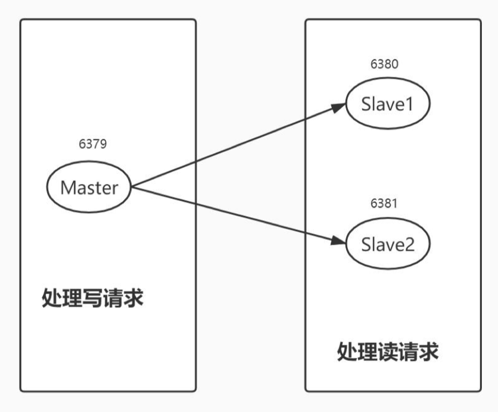
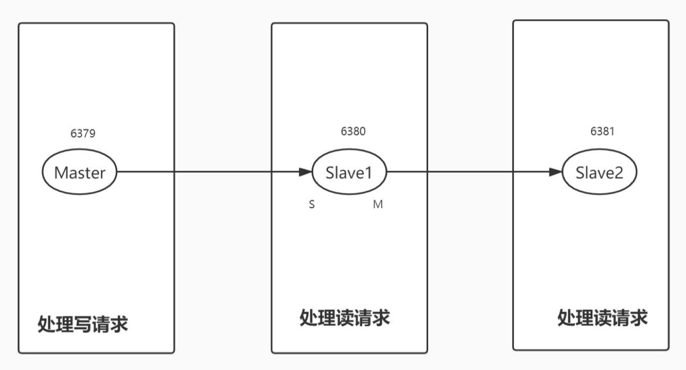

# 分布式缓存：Redis高可用/Redisson/Hazelcast

[toc]


## 一、概述

- 着重讲Redis的复制、高可用、分片；
- 简单说一下Redisson；（是个过渡）
- 然后到内存网格（Hazelcast）；

因为技术就是这么发展的。

## 二、Redis 的集群和高可用

### 2.1 Redids 主从复制：从单机到多节点

> 相当于MySQL传统的主从。

慢慢的从单机走到多机：第一步先从单机走到多节点。

极简风格，从节点执行：`slaveof 127.0.0.1 6379`。

也可以在配置文件中设置。

注意：从节点只读、异步复制。

#### （1）现在本地启动两个Redis

准备，下载编译Redis，参考：https://redis.io/topics/quickstart

```shell
wget http://download.redis.io/redis-stable.tar.gz
tar xvzf redis-stable.tar.gz
cd redis-stable
make
```


先通过`flushdb`把redis数据都清空掉

```
lifeideMacBook-Pro:~ lifei$ sudo docker exec -it redis-test /bin/bash
root@72747f9c59eb:/data# redis-cli
127.0.0.1:6379> flushdb
OK
127.0.0.1:6379> dbsize
(integer) 0
127.0.0.1:6379>
```

##### 第一步：准备两个Redis配置文件

下面是配置文件的关键点

第一个配置文件`redis6379.conf`：

```shell
# 绑定当前的ip，默认是 127.0.0.1 ，有其他ip了，可以绑定别的
bind 127.0.0.1 -::1

# 当前的端口 6379 （默认的）
port 6379

# pid的文件放在哪里，
pidfile /var/run/redis_6379.pid

# 默认有多少个数据库，用select 0 到 15， 来回切换不同数据库
databases 16

# 凡是涉及打快照的程序里都有这样的配置（比如，redis、hazelcast、mq、或自己做的交易系统。）如果操作太频繁了，打快照就不能太频繁，因为如果内存太大，打快照很耗时间（太频繁打快照，影响性能）。我们还要保证在一个大的时间窗口内，只要有操作，我们一定打个快照（防止长时间不打快照，丢失数据）。这个机制很通用
# 如果在60秒内，我们修改了10000个key，那么我们60秒内做一次save；
# 如果在300秒（5分钟）内，修改了10个key，也做一次save
# （原来是3600秒）如果在900秒（15分钟）内，修改了1个key，我们也做一次save
save 900 1
save 300 100
save 60 10000

# rdb 操作，是否压缩，默认是压缩的
rdbcompression yes

# 我们做RDB的时候，文件名叫什么，在这里配置
dbfilename dump.rdb

# 配置我们的数据存在哪里，这里
dir "/Users/lifei/Documents/opt/logs/redis0"

# 如果当前的库是副本，那它的主库是哪个。现在不动这配置，一会儿通过命令行操作
# replicaof <masterip> <masterport>


# 控制连接数，如果在生产环境，这个值要配置高一些
# maxclients 10000


# 最大内存
# maxmemory <bytes>

# 淘汰策略
# maxmemory-policy noeviction
```

第二个配置文件`redis6380.conf`:

和上一个配置文件的区别如下

```shell
port 6380

dir /Users/lifei/Documents/opt/logs/redis1

pidfile /var/run/redis_6380.pid
```

##### 第二步：启动两个Redis

配置完成之后，就可以启动两个Redis了。

```shell
$ src/redis-server ./redis6379.conf 1>log6379.log 2>&1 &
[1] 22770

$ src/redis-server ./redis6380.conf 1>log6380.log 2>&1 &
[2] 22964
```

进入redis客户端：

```shell
$ src/redis-cli -h 127.0.0.1 -p 6379
127.0.0.1:6379> dbsize
(integer) 0
127.0.0.1:6379>
```

```shell
$ src/redis-cli -h 127.0.0.1 -p 6380
127.0.0.1:6380> dbsize
(integer) 0
127.0.0.1:6380>
```

##### 第三步：在其中一台redis客户端进行操作（比如在redis6379上操作）

```shell
127.0.0.1:6379> set LF 93
OK
127.0.0.1:6379> set AA 94
OK
127.0.0.1:6379> set BB 93
OK
127.0.0.1:6379> keys *
1) "BB"
2) "AA"
3) "LF"
```

##### 第五步：将redis 6380 配置成从库

当我们用了一个slaveof的命令的时候：

1. 我们6380从库 会给 6379主库发送一个sync的命令；

2. 主库会在后台执行一下BGSAVE，把当前数据存一个全量备份，然后把全量的备份数据整个发送给从库；

3. 从库拿到这个数据后，就会把它作为相当于自己启动时，加载的数据；

   把RDB文件，全量加载了。

4. 再然后，当主库有数据的时候，做增量更新；

可以看到，从库除了连接一个主库外，啥也没干。它现在已经有三个key了，这三个key是主库上的三个key。

同时，我们如果在从库上做`set`操作，会报错。

```
127.0.0.1:6380> dbsize
(integer) 0
127.0.0.1:6380> slaveof 127.0.0.1 6379
OK
127.0.0.1:6380> dbsize
(integer) 3
127.0.0.1:6380> keys *
1) "BB"
2) "AA"
3) "LF"
127.0.0.1:6380> get BB
"93"
127.0.0.1:6380> get AA
"94"
127.0.0.1:6380> get LF
"93"
127.0.0.1:6380> set KK 01
(error) READONLY You can't write against a read only replica.
127.0.0.1:6380>
```

但是我们可以在主库上进行`set`操作(`set KK k01`)，之后，能在从库上查到：

```shell
127.0.0.1:6379> set KK k01
OK
```

```shell
127.0.0.1:6380> get KK
"k01"
```

这样一个主从，就配置好了，非常简单，只需要一条命令。

为什么这么简单，因为它都是基于内存的。

#### （2）注意事项

这种情况下，我们如果把从库的服务kill掉，再重启的时候，可能这个状态已经丢失了。怎么才能保持这个状态呢？

办法就是在我们的配置参数里，配置一下（你是哪个主库的从库）:

```shell
# replicaof <masterip> <masterport>
```

这样的话，从库启动的时候，会自动执行同步操作，不需要手动执行了。

**主从之间没办法保证数据一致**。

> 相当于MySQL传统的主从，因为是异步的。

从库只读，异步复制



还可以像mysql一样，做多级的从库：



#### （3）问答

- 往从库读数据是什么时候

  有数据写入时

- 可以同时配置多个从库吗

  多少个都成

- 线上配置，由脚本实现

- 主从延迟，要关注吗？

  需要关注，但一般情况如果网络抖动不厉害，不需要太关注。如果一致性要求比较严格，就不要用缓存了。

- 高可用

  高可用走的是哨兵

### 2.2 Redis Sentinel 主从切换：走向高可用

我们怎么才能让主宕掉掉时候，让从变成主。

#### （1）手工切换

假如什么也不做，我们可以使用手工切换的方式。

##### 第一步：把主节点6379干掉

```shell
127.0.0.1:6379> shutdown
not connected>
not connected>
not connected> exit
[1]-  Done                    src/redis-server ./redis6379.conf > log6379.log 2>&1
```

主干掉之后，从库会不断尝试连接主库。

```shell
127.0.0.1:6380> info Replication
# Replication
role:slave     # 表明是从库
master_host:127.0.0.1
master_port:6379
master_link_status:down   # 主已经宕掉了
master_last_io_seconds_ago:-1
master_sync_in_progress:0
slave_read_repl_offset:2769
slave_repl_offset:2769
master_link_down_since_seconds:106
slave_priority:100
slave_read_only:1
replica_announced:1
connected_slaves:0
master_failover_state:no-failover
master_replid:c90559f2c88c92f5d336d22487a3a0c8c92b5364
master_replid2:0000000000000000000000000000000000000000
master_repl_offset:2769
second_repl_offset:-1
repl_backlog_active:1
repl_backlog_size:1048576
repl_backlog_first_byte_offset:1
repl_backlog_histlen:2769
127.0.0.1:6380>
```

##### 第二步：让从6380变成主

```shell
127.0.0.1:6380> slaveof no one
OK
127.0.0.1:6380> info Replication
# Replication
role:master
connected_slaves:0
master_failover_state:no-failover
master_replid:7b8eb0a6865dfb4ed4c4b6d6fe8de61b6c4434d4
master_replid2:c90559f2c88c92f5d336d22487a3a0c8c92b5364
master_repl_offset:2769
second_repl_offset:2770
repl_backlog_active:1
repl_backlog_size:1048576
repl_backlog_first_byte_offset:1
repl_backlog_histlen:2769
127.0.0.1:6380>
```

这个时候，就可以在写数据了：

```shell
127.0.0.1:6380> set lf01 lf-1
OK
127.0.0.1:6380> get lf01
"lf-1"
127.0.0.1:6380> keys *
1) "BB"
2) "KK"
3) "lf01"
4) "AA"
5) "LF"
127.0.0.1:6380>
```

##### 第三步：把6379再启动起来

```shell
lifeideMacBook-Pro:redis-6.2.6 lifei$ src/redis-server ./redis6379.conf 1>log6379.log 2>&1 &
[3] 32363
lifeideMacBook-Pro:redis-6.2.6 lifei$ src/redis-cli -h 127.0.0.1 -p 6379
127.0.0.1:6379> info Replication
# Replication
role:master
connected_slaves:0    # 是 0 ， 代表没有从库了
master_failover_state:no-failover
master_replid:8bd5d13e7d0495eb128e6993be850dc2e44248f3
master_replid2:0000000000000000000000000000000000000000
master_repl_offset:0
second_repl_offset:-1
repl_backlog_active:0
repl_backlog_size:1048576
repl_backlog_first_byte_offset:0
repl_backlog_histlen:0
127.0.0.1:6379>
```

##### 第四步：将6379变成新主库（6380）的从库

```shell
127.0.0.1:6379> slaveof 127.0.0.1 6380
OK
127.0.0.1:6379> get lf01
"lf-1"
127.0.0.1:6379> set lf02 aa
(error) READONLY You can't write against a read only replica.
127.0.0.1:6379>
```

这个时候，能获取到刚刚写入的数据。此时`set`数据，就set不进去了。

##### 手动操作不好的地方

1. 需要人工干预（不能自动干）；

2. 数据以主库为准；（这个问题在redis中解决不了）

   因为所有的主从复制都是异步的，也就是说主库宕的时候，主库还没把数据同步过来。假如从库差了几条数据，从库变成新的主库，原来的主库变为从库后，原本差的几条数据就找不回来了。

#### （2）自动切换

##### 第一步：为了主从切换，先把上面主从关系还原回去

```shell
127.0.0.1:6379> slaveof no one
OK
```

```shell
127.0.0.1:6380> slaveof 127.0.0.1 6379
OK
127.0.0.1:6380>
```

现在6379是主库，6380是从库。

##### 第二步：配置哨兵Sentinel

Sentinel 可以单独运行，也可以在一个redis内部运行。

作用：相当于一个哨兵站岗，时刻在守护着我们当前某个或多个主库。检查它们的状态，是否宕了，

因为在主库上执行`info Replication`，就可以看到从库的数据，从库的ip端口，从库的状态。

所以只要这个哨兵连到主库上，就可以拿到主库，已经它上面从库的所有信息。所以它只要配置主库信息，不需要配置从库信息。

```shell
127.0.0.1:6379> info Replication
# Replication
role:master
connected_slaves:1
slave0:ip=127.0.0.1,port=6380,state=online,offset=3455,lag=1
master_failover_state:no-failover
master_replid:4bde44a4209cf8fe05d616be039a9256db607ec4
master_replid2:7b8eb0a6865dfb4ed4c4b6d6fe8de61b6c4434d4
master_repl_offset:3455
second_repl_offset:3442
repl_backlog_active:1
repl_backlog_size:1048576
repl_backlog_first_byte_offset:2826
repl_backlog_histlen:630
127.0.0.1:6379>
```

##### 第三步：了解Sentinel的配置：

`sentinel.conf`的配置信息：

```
# sentinel 监视 mymaster是这个主库的名字，2 表示：每次主库发生变化，需要2个sentinel节点确认
sentinel monitor mymaster 127.0.0.1 6379 2
# 如何确认一个主库是否宕机了？60秒（一分钟）心跳没有了，或者心跳返回的结果状态不对
sentinel down-after-milliseconds mymaster 60000
# 还需要配置一个 整个集群状态 主库节点变更的超时时间（默认三分钟）
sentinel failover-timeout mymaster 180000
# 很多时候我们不希望，选出新的主库节点后，一下子让所有的从库节点都不能用了。配置下面的参数，让从库节点还可以读
# 并行同步从节点的数量：也就是说，假如有多个从库，它们会一个人接着一个的去主库复制数据
# 这样除了正在同步数据的节点，其他节点还可以提供服务
# 如果所有节点同时同步，这个集群段时间内就不提供服务了
sentinel parallel-syncs mymaster 1
```

当多个sentinel节点觉得主宕掉了，会使用REST协议重新选择一个主库，也就是把某个从库变成主。

然后集群会被配置成，其他从库节点连接这个新库的节点。

包括原先宕掉掉主库，重新启动了，sentinel发现了，会把它强制转化为最新主库的从节点。

##### 第四步：启动哨兵的方式一

创建一个`sentinel.conf`文件

`sentinel.conf`的内容如下：

```
sentinel monitor mymaster 127.0.0.1 6379 2
sentinel down-after-milliseconds mymaster 60000
sentinel failover-timeout mymaster 180000
sentinel parallel-syncs mymaster 1
```

然后用`redis-sentinel sentinel.conf`启动一个哨兵的节点。

##### 第四步：启动哨兵的方式二

把哨兵的内容写入`redis.conf`配置文件中：

```
sentinel monitor mymaster 127.0.0.1 6379 2
sentinel down-after-milliseconds mymaster 60000
sentinel failover-timeout mymaster 180000
sentinel parallel-syncs mymaster 1
```

然后启动Redis的时候，加`--sentinel`：`redis-server redis.conf --sentinel`

##### 第四步：为什么会有两种方式

这两个命令其实是一样的，只是参数不一样。

因为`redis-sentinel`和`redis-server`是一个东西。

redis-sentinel 是 redis-server的别名

##### 第五步：启动一个Redis哨兵

```shell
localhost:redis-6.2.6 lifei$ cat sentinel0.conf
sentinel monitor mymaster 127.0.0.1 6379 2
sentinel down-after-milliseconds mymaster 60000
sentinel failover-timeout mymaster 180000
sentinel parallel-syncs mymaster 1

localhost:redis-6.2.6 lifei$ src/redis-sentinel ./sentinel0.conf
40359:X 16 Mar 2022 23:04:11.930 # oO0OoO0OoO0Oo Redis is starting oO0OoO0OoO0Oo
40359:X 16 Mar 2022 23:04:11.930 # Redis version=6.2.6, bits=64, commit=00000000, modified=0, pid=40359, just started
40359:X 16 Mar 2022 23:04:11.930 # Configuration loaded
40359:X 16 Mar 2022 23:04:11.931 * Increased maximum number of open files to 10032 (it was originally set to 256).
40359:X 16 Mar 2022 23:04:11.931 * monotonic clock: POSIX clock_gettime
                _._
           _.-``__ ''-._
      _.-``    `.  `_.  ''-._           Redis 6.2.6 (00000000/0) 64 bit
  .-`` .-```.  ```\/    _.,_ ''-._
 (    '      ,       .-`  | `,    )     Running in sentinel mode
 |`-._`-...-` __...-.``-._|'` _.-'|     Port: 26379
 |    `-._   `._    /     _.-'    |     PID: 40359
  `-._    `-._  `-./  _.-'    _.-'
 |`-._`-._    `-.__.-'    _.-'_.-'|
 |    `-._`-._        _.-'_.-'    |           https://redis.io
  `-._    `-._`-.__.-'_.-'    _.-'
 |`-._`-._    `-.__.-'    _.-'_.-'|
 |    `-._`-._        _.-'_.-'    |
  `-._    `-._`-.__.-'_.-'    _.-'
      `-._    `-.__.-'    _.-'
          `-._        _.-'
              `-.__.-'

40359:X 16 Mar 2022 23:04:11.933 # Sentinel ID is 4a2bcf293ca343fb33722aff047cced881155b5e
40359:X 16 Mar 2022 23:04:11.933 # +monitor master mymaster 127.0.0.1 6379 quorum 2
40359:X 16 Mar 2022 23:04:11.934 * +slave slave 127.0.0.1:6380 127.0.0.1 6380 @ mymaster 127.0.0.1 6379

```

这样启动哨兵之后，sentinel会把我们的配置文件改掉，变成下面这个样子：

```
localhost:redis-6.2.6 lifei$ more sentinel0.conf
sentinel monitor mymaster 127.0.0.1 6379 2
sentinel down-after-milliseconds mymaster 60000

# Generated by CONFIG REWRITE
protected-mode no
port 26379
user default on nopass ~* &* +@all
dir "/Users/lifei/Downloads/redis-6.2.6"
sentinel myid 4a2bcf293ca343fb33722aff047cced881155b5e
sentinel config-epoch mymaster 0
sentinel leader-epoch mymaster 0
sentinel current-epoch 0
sentinel known-replica mymaster 127.0.0.1 6380
localhost:redis-6.2.6 lifei$
```

##### 第六步：基于第一个哨兵（启动后自动修改了配置）启动第二个哨兵

将上面配置文件改动一下：

- 修改`sentinel myid` 改为“4a2bcf293ca343fb33722aff047cced881155b5a”
- 修改`port`， 改为“26380”

```
sentinel monitor mymaster 127.0.0.1 6379 2
sentinel down-after-milliseconds mymaster 60000

# Generated by CONFIG REWRITE
protected-mode no
port 26380
user default on nopass ~* &* +@all
dir "/Users/lifei/Downloads/redis-6.2.6"
sentinel myid 4a2bcf293ca343fb33722aff047cced881155b5a
sentinel config-epoch mymaster 0
sentinel leader-epoch mymaster 0
sentinel current-epoch 0
sentinel known-replica mymaster 127.0.0.1 6380
```

然后启动第二个哨兵：

```shell
localhost:redis-6.2.6 lifei$ src/redis-sentinel ./sentinel1.conf
41933:X 16 Mar 2022 23:12:20.380 # oO0OoO0OoO0Oo Redis is starting oO0OoO0OoO0Oo
41933:X 16 Mar 2022 23:12:20.380 # Redis version=6.2.6, bits=64, commit=00000000, modified=0, pid=41933, just started
41933:X 16 Mar 2022 23:12:20.380 # Configuration loaded
41933:X 16 Mar 2022 23:12:20.381 * Increased maximum number of open files to 10032 (it was originally set to 256).
41933:X 16 Mar 2022 23:12:20.381 * monotonic clock: POSIX clock_gettime
                _._
           _.-``__ ''-._
      _.-``    `.  `_.  ''-._           Redis 6.2.6 (00000000/0) 64 bit
  .-`` .-```.  ```\/    _.,_ ''-._
 (    '      ,       .-`  | `,    )     Running in sentinel mode
 |`-._`-...-` __...-.``-._|'` _.-'|     Port: 26380
 |    `-._   `._    /     _.-'    |     PID: 41933
  `-._    `-._  `-./  _.-'    _.-'
 |`-._`-._    `-.__.-'    _.-'_.-'|
 |    `-._`-._        _.-'_.-'    |           https://redis.io
  `-._    `-._`-.__.-'_.-'    _.-'
 |`-._`-._    `-.__.-'    _.-'_.-'|
 |    `-._`-._        _.-'_.-'    |
  `-._    `-._`-.__.-'_.-'    _.-'
      `-._    `-.__.-'    _.-'
          `-._        _.-'
              `-.__.-'

41933:X 16 Mar 2022 23:12:20.382 # Sentinel ID is 4a2bcf293ca343fb33722aff047cced881155b5a
41933:X 16 Mar 2022 23:12:20.382 # +monitor master mymaster 127.0.0.1 6379 quorum 2
41933:X 16 Mar 2022 23:12:21.460 * +sentinel sentinel 4a2bcf293ca343fb33722aff047cced881155b5e 127.0.0.1 26379 @ mymaster 127.0.0.1 6379

```

##### 第七步：往6039里多写入几条数据

```
127.0.0.1:6379> keys *
1) "KK"
2) "LF"
3) "BB"
4) "AA"
5) "lf01"
127.0.0.1:6379> set l2 lifei-02
OK
127.0.0.1:6379> set l3 lifei-03
OK
127.0.0.1:6379> keys *
1) "KK"
2) "LF"
3) "BB"
4) "AA"
5) "l3"
6) "lf01"
7) "l2"
```

#####  第八步：查看从库的数据

```
127.0.0.1:6380> get l1
"lifei-01"
127.0.0.1:6380> dbsize
(integer) 7
```

##### 第九步：把主库shutdown

```shell
127.0.0.1:6379> info Replication
# Replication
role:master
connected_slaves:1
slave0:ip=127.0.0.1,port=6380,state=online,offset=33391,lag=1
master_failover_state:no-failover
master_replid:13d19a99051d494b226d57f069c187697dc73e4d
master_replid2:0000000000000000000000000000000000000000
master_repl_offset:33524
second_repl_offset:-1
repl_backlog_active:1
repl_backlog_size:1048576
repl_backlog_first_byte_offset:1
repl_backlog_histlen:33524
127.0.0.1:6379> shutdown
not connected>
not connected> exit
[1]+  Done                    src/redis-server ./redis6379.conf > log6379.log 2>&1
lifeideMacBook-Pro:redis-6.2.6 lifei$
```

##### 第十步：查看sentinel的日志，发现其将6380变为主

```
lifeideMacBook-Pro:redis-6.2.6 lifei$ src/redis-sentinel ./sentinel0.conf
1770:X 16 Mar 2022 23:24:31.227 # oO0OoO0OoO0Oo Redis is starting oO0OoO0OoO0Oo
1770:X 16 Mar 2022 23:24:31.228 # Redis version=6.2.6, bits=64, commit=00000000, modified=0, pid=1770, just started
1770:X 16 Mar 2022 23:24:31.228 # Configuration loaded
1770:X 16 Mar 2022 23:24:31.228 * Increased maximum number of open files to 10032 (it was originally set to 256).
1770:X 16 Mar 2022 23:24:31.228 * monotonic clock: POSIX clock_gettime
                _._
           _.-``__ ''-._
      _.-``    `.  `_.  ''-._           Redis 6.2.6 (00000000/0) 64 bit
  .-`` .-```.  ```\/    _.,_ ''-._
 (    '      ,       .-`  | `,    )     Running in sentinel mode
 |`-._`-...-` __...-.``-._|'` _.-'|     Port: 26379
 |    `-._   `._    /     _.-'    |     PID: 1770
  `-._    `-._  `-./  _.-'    _.-'
 |`-._`-._    `-.__.-'    _.-'_.-'|
 |    `-._`-._        _.-'_.-'    |           https://redis.io
  `-._    `-._`-.__.-'_.-'    _.-'
 |`-._`-._    `-.__.-'    _.-'_.-'|
 |    `-._`-._        _.-'_.-'    |
  `-._    `-._`-.__.-'_.-'    _.-'
      `-._    `-.__.-'    _.-'
          `-._        _.-'
              `-.__.-'

1770:X 16 Mar 2022 23:24:31.232 # Sentinel ID is 4a2bcf293ca343fb33722aff047cced881155b5e
1770:X 16 Mar 2022 23:24:31.232 # +monitor master mymaster 127.0.0.1 6379 quorum 2
1770:X 16 Mar 2022 23:30:03.352 # +sdown master mymaster 127.0.0.1 6379
1770:X 16 Mar 2022 23:30:03.494 # +new-epoch 1
1770:X 16 Mar 2022 23:30:03.495 # +vote-for-leader 4a2bcf293ca343fb33722aff047cced881155b5a 1
1770:X 16 Mar 2022 23:30:04.280 # +config-update-from sentinel 4a2bcf293ca343fb33722aff047cced881155b5a 127.0.0.1 26380 @ mymaster 127.0.0.1 6379
1770:X 16 Mar 2022 23:30:04.280 # +switch-master mymaster 127.0.0.1 6379 127.0.0.1 6380
1770:X 16 Mar 2022 23:30:04.280 * +slave slave 127.0.0.1:6379 127.0.0.1 6379 @ mymaster 127.0.0.1 6380
1770:X 16 Mar 2022 23:31:04.302 # +sdown slave 127.0.0.1:6379 127.0.0.1 6379 @ mymaster 127.0.0.1 6380
```

```
lifeideMacBook-Pro:redis-6.2.6 lifei$ src/redis-sentinel sentinel1.conf
1845:X 16 Mar 2022 23:24:51.442 # oO0OoO0OoO0Oo Redis is starting oO0OoO0OoO0Oo
1845:X 16 Mar 2022 23:24:51.442 # Redis version=6.2.6, bits=64, commit=00000000, modified=0, pid=1845, just started
1845:X 16 Mar 2022 23:24:51.442 # Configuration loaded
1845:X 16 Mar 2022 23:24:51.443 * Increased maximum number of open files to 10032 (it was originally set to 256).
1845:X 16 Mar 2022 23:24:51.443 * monotonic clock: POSIX clock_gettime
                _._
           _.-``__ ''-._
      _.-``    `.  `_.  ''-._           Redis 6.2.6 (00000000/0) 64 bit
  .-`` .-```.  ```\/    _.,_ ''-._
 (    '      ,       .-`  | `,    )     Running in sentinel mode
 |`-._`-...-` __...-.``-._|'` _.-'|     Port: 26380
 |    `-._   `._    /     _.-'    |     PID: 1845
  `-._    `-._  `-./  _.-'    _.-'
 |`-._`-._    `-.__.-'    _.-'_.-'|
 |    `-._`-._        _.-'_.-'    |           https://redis.io
  `-._    `-._`-.__.-'_.-'    _.-'
 |`-._`-._    `-.__.-'    _.-'_.-'|
 |    `-._`-._        _.-'_.-'    |
  `-._    `-._`-.__.-'_.-'    _.-'
      `-._    `-.__.-'    _.-'
          `-._        _.-'
              `-.__.-'

1845:X 16 Mar 2022 23:24:51.444 # Sentinel ID is 4a2bcf293ca343fb33722aff047cced881155b5a
1845:X 16 Mar 2022 23:24:51.444 # +monitor master mymaster 127.0.0.1 6379 quorum 2
1845:X 16 Mar 2022 23:30:03.398 # +sdown master mymaster 127.0.0.1 6379
1845:X 16 Mar 2022 23:30:03.489 # +odown master mymaster 127.0.0.1 6379 #quorum 2/2
1845:X 16 Mar 2022 23:30:03.489 # +new-epoch 1
1845:X 16 Mar 2022 23:30:03.489 # +try-failover master mymaster 127.0.0.1 6379
1845:X 16 Mar 2022 23:30:03.492 # +vote-for-leader 4a2bcf293ca343fb33722aff047cced881155b5a 1
1845:X 16 Mar 2022 23:30:03.495 # 4a2bcf293ca343fb33722aff047cced881155b5e voted for 4a2bcf293ca343fb33722aff047cced881155b5a 1
1845:X 16 Mar 2022 23:30:03.555 # +elected-leader master mymaster 127.0.0.1 6379
1845:X 16 Mar 2022 23:30:03.555 # +failover-state-select-slave master mymaster 127.0.0.1 6379
1845:X 16 Mar 2022 23:30:03.614 # +selected-slave slave 127.0.0.1:6380 127.0.0.1 6380 @ mymaster 127.0.0.1 6379
1845:X 16 Mar 2022 23:30:03.614 * +failover-state-send-slaveof-noone slave 127.0.0.1:6380 127.0.0.1 6380 @ mymaster 127.0.0.1 6379
1845:X 16 Mar 2022 23:30:03.668 * +failover-state-wait-promotion slave 127.0.0.1:6380 127.0.0.1 6380 @ mymaster 127.0.0.1 6379
1845:X 16 Mar 2022 23:30:04.219 # +promoted-slave slave 127.0.0.1:6380 127.0.0.1 6380 @ mymaster 127.0.0.1 6379
1845:X 16 Mar 2022 23:30:04.219 # +failover-state-reconf-slaves master mymaster 127.0.0.1 6379
1845:X 16 Mar 2022 23:30:04.279 # +failover-end master mymaster 127.0.0.1 6379
1845:X 16 Mar 2022 23:30:04.279 # +switch-master mymaster 127.0.0.1 6379 127.0.0.1 6380
1845:X 16 Mar 2022 23:30:04.279 * +slave slave 127.0.0.1:6379 127.0.0.1 6379 @ mymaster 127.0.0.1 6380
1845:X 16 Mar 2022 23:31:04.354 # +sdown slave 127.0.0.1:6379 127.0.0.1 6379 @ mymaster 127.0.0.1 6380

```

```
127.0.0.1:6380> info Replication
# Replication
role:master
connected_slaves:0
master_failover_state:no-failover
master_replid:bbe58d3e396287884e5a5ac637995f8b3ee5cb68
master_replid2:13d19a99051d494b226d57f069c187697dc73e4d
master_repl_offset:60959
second_repl_offset:34736
repl_backlog_active:1
repl_backlog_size:1048576
repl_backlog_first_byte_offset:1
repl_backlog_histlen:60959
127.0.0.1:6380>
```

##### 第十一步：把原来的6379主库启动一下

```
lifeideMacBook-Pro:redis-6.2.6 lifei$ src/redis-server ./redis6379.conf 1>log6379.log 2>&1 &
[1] 3695
```

发现，6379变成了从库：

```
lifeideMacBook-Pro:redis-6.2.6 lifei$ src/redis-sentinel ./sentinel0.conf
1770:X 16 Mar 2022 23:24:31.227 # oO0OoO0OoO0Oo Redis is starting oO0OoO0OoO0Oo
1770:X 16 Mar 2022 23:24:31.228 # Redis version=6.2.6, bits=64, commit=00000000, modified=0, pid=1770, just started
1770:X 16 Mar 2022 23:24:31.228 # Configuration loaded
1770:X 16 Mar 2022 23:24:31.228 * Increased maximum number of open files to 10032 (it was originally set to 256).
1770:X 16 Mar 2022 23:24:31.228 * monotonic clock: POSIX clock_gettime
                _._
           _.-``__ ''-._
      _.-``    `.  `_.  ''-._           Redis 6.2.6 (00000000/0) 64 bit
  .-`` .-```.  ```\/    _.,_ ''-._
 (    '      ,       .-`  | `,    )     Running in sentinel mode
 |`-._`-...-` __...-.``-._|'` _.-'|     Port: 26379
 |    `-._   `._    /     _.-'    |     PID: 1770
  `-._    `-._  `-./  _.-'    _.-'
 |`-._`-._    `-.__.-'    _.-'_.-'|
 |    `-._`-._        _.-'_.-'    |           https://redis.io
  `-._    `-._`-.__.-'_.-'    _.-'
 |`-._`-._    `-.__.-'    _.-'_.-'|
 |    `-._`-._        _.-'_.-'    |
  `-._    `-._`-.__.-'_.-'    _.-'
      `-._    `-.__.-'    _.-'
          `-._        _.-'
              `-.__.-'

1770:X 16 Mar 2022 23:24:31.232 # Sentinel ID is 4a2bcf293ca343fb33722aff047cced881155b5e
1770:X 16 Mar 2022 23:24:31.232 # +monitor master mymaster 127.0.0.1 6379 quorum 2
1770:X 16 Mar 2022 23:30:03.352 # +sdown master mymaster 127.0.0.1 6379
1770:X 16 Mar 2022 23:30:03.494 # +new-epoch 1
1770:X 16 Mar 2022 23:30:03.495 # +vote-for-leader 4a2bcf293ca343fb33722aff047cced881155b5a 1
1770:X 16 Mar 2022 23:30:04.280 # +config-update-from sentinel 4a2bcf293ca343fb33722aff047cced881155b5a 127.0.0.1 26380 @ mymaster 127.0.0.1 6379
1770:X 16 Mar 2022 23:30:04.280 # +switch-master mymaster 127.0.0.1 6379 127.0.0.1 6380
1770:X 16 Mar 2022 23:30:04.280 * +slave slave 127.0.0.1:6379 127.0.0.1 6379 @ mymaster 127.0.0.1 6380
1770:X 16 Mar 2022 23:31:04.302 # +sdown slave 127.0.0.1:6379 127.0.0.1 6379 @ mymaster 127.0.0.1 6380
1770:X 16 Mar 2022 23:34:29.872 # -sdown slave 127.0.0.1:6379 127.0.0.1 6379 @ mymaster 127.0.0.1 6380
1770:X 16 Mar 2022 23:34:39.823 * +convert-to-slave slave 127.0.0.1:6379 127.0.0.1 6379 @ mymaster 127.0.0.1 6380
```

```
127.0.0.1:6379> info Replication
# Replication
role:slave
master_host:127.0.0.1
master_port:6380
master_link_status:up
master_last_io_seconds_ago:1
master_sync_in_progress:0
slave_read_repl_offset:79700
slave_repl_offset:79700
slave_priority:100
slave_read_only:1
replica_announced:1
connected_slaves:0
master_failover_state:no-failover
master_replid:bbe58d3e396287884e5a5ac637995f8b3ee5cb68
master_replid2:0000000000000000000000000000000000000000
master_repl_offset:79700
second_repl_offset:-1
repl_backlog_active:1
repl_backlog_size:1048576
repl_backlog_first_byte_offset:70935
repl_backlog_histlen:8766
127.0.0.1:6379> set L4 abc
(error) READONLY You can't write against a read only replica.
127.0.0.1:6379>
```

####   （3）sentinel的原理

> redis sentinel原理介绍：http://www.redis.cn/topics/sentinel.html
>
> redis复制与高可用配置：https://www.cnblogs.com/itzhouq/p/redis5.html

sentinel 当发现有主库宕了，把一个从库拉起来变成主库。当老的主库拉起来的时候，再把它变成从库。

相当于：MySQL的MHA

slaveof 命令相当于 MySQL的 `CHANGE MASTER TO`

>  和MySQL几乎一样。

**不需要给我们sentinel配置任何从节点信息，也不需要配置其他sentinel信息。**

为什么？因为master上面有所有的slave的信息：

```
127.0.0.1:6380> info Replication
# Replication
role:master
connected_slaves:1
slave0:ip=127.0.0.1,port=6379,state=online,offset=152556,lag=1
master_failover_state:no-failover
master_replid:bbe58d3e396287884e5a5ac637995f8b3ee5cb68
master_replid2:13d19a99051d494b226d57f069c187697dc73e4d
master_repl_offset:152556
second_repl_offset:34736
repl_backlog_active:1
repl_backlog_size:1048576
repl_backlog_first_byte_offset:1
repl_backlog_histlen:152556
127.0.0.1:6380>
```

可以用Redis直接连接sentinel，因为sentinel本身也是一个redis-server：

```
lifeideMacBook-Pro:redis-6.2.6 lifei$ src/redis-cli -h 127.0.0.1 -p 26379
127.0.0.1:26379> keys *
(error) ERR unknown command `keys`, with args beginning with: `*`,
127.0.0.1:26379> info Sentinel
# Sentinel
sentinel_masters:1
sentinel_tilt:0
sentinel_running_scripts:0
sentinel_scripts_queue_length:0
sentinel_simulate_failure_flags:0
master0:name=mymaster,status=ok,address=127.0.0.1:6380,slaves=1,sentinels=2

-- 还可以这样查看
127.0.0.1:26379> sentinel masters
1)  1) "name"
    2) "mymaster"
    3) "ip"
    4) "127.0.0.1"
    5) "port"
    6) "6380"
    7) "runid"
    8) "bc667e9cb22add8f00482cb533e9e96bb567dcb8"
    9) "flags"
   10) "master"
   11) "link-pending-commands"
   12) "0"
   13) "link-refcount"
   14) "1"
   15) "last-ping-sent"
   16) "0"
   17) "last-ok-ping-reply"
   18) "662"
   19) "last-ping-reply"
   20) "662"
   21) "down-after-milliseconds"
   22) "60000"
   23) "info-refresh"
   24) "4468"
   25) "role-reported"
   26) "master"
   27) "role-reported-time"
   28) "1209055"
   29) "config-epoch"
   30) "1"
   31) "num-slaves"
   32) "1"
   33) "num-other-sentinels"
   34) "1"
   35) "quorum"
   36) "2"
   37) "failover-timeout"
   38) "180000"
   39) "parallel-syncs"
   40) "1"
127.0.0.1:26379>
```

