# 分布式消息：消息队列基础

[toc]

## 一、概要

本次学习主要涉及两大部分：

第一部分：消息队列是怎么来的，是怎么会事。

- 从系统的通信方式入手；
- 讲到怎么有消息队列；
- 消息队列相关的模式和相关协议；（重点）

第二部分：最常见的消息中间件：ActiveMQ

- 简单讲一些，因为新项目用得不多了；
- 实际的看一下代码，运行一个activeMQ的实例；

## 二、系统间的通信方式（MQ是什么）

### 2.1 系统间通信方式

我们知道两个进程，相互之间想传递数据，有很多的方式，比如：

- 基于文件

- 基于共享内存

  在同一台机器上，有一块共享内存，这两个进程都可以读取这一块共享内存

- 基于（一些）IPC（的通道）

  **进程间通信**（**IPC**，*Inter-Process Communication*），指至少两个[进程](https://zh.wikipedia.org/wiki/进程)或[线程](https://zh.wikipedia.org/wiki/线程)间传送数据或信号的一些技术或方法。

  这些进程可以运行在同一计算机上或网络连接的不同计算机上。

  主要的IPC方法：

  | 方法                                                         | 提供方（操作系统或其他环境）                                 |
  | ------------------------------------------------------------ | ------------------------------------------------------------ |
  | [文件](https://zh.wikipedia.org/wiki/檔案)                   | 多数操作系统                                                 |
  | [信号](https://zh.wikipedia.org/wiki/信号_(计算机科学))      | 多数操作系统                                                 |
  | [Berkeley套接字](https://zh.wikipedia.org/wiki/Berkeley套接字) | 多数操作系统                                                 |
  | [消息队列](https://zh.wikipedia.org/wiki/消息队列)           | 多数操作系统                                                 |
  | [管道](https://zh.wikipedia.org/wiki/管道_(Unix))            | 所有的[POSIX 系统](https://zh.wikipedia.org/wiki/POSIX), Windows. |
  | [命名管道](https://zh.wikipedia.org/wiki/命名管道)           | 所有的POSIX系统, Windows.                                    |
  | [信号量](https://zh.wikipedia.org/wiki/信号量)               | 所有的POSIX系统, Windows.                                    |
  | [共享内存](https://zh.wikipedia.org/wiki/共享内存)           | 所有的POSIX系统, Windows.                                    |
  | [消息传递](https://zh.wikipedia.org/wiki/訊息傳遞_(軟體))    | 用于[MPI](https://zh.wikipedia.org/wiki/MPI)规范，[Java RMI](https://zh.wikipedia.org/wiki/Java_RMI)，[CORBA](https://zh.wikipedia.org/wiki/CORBA)，[MSMQ](https://zh.wikipedia.org/w/index.php?title=MSMQ&action=edit&redlink=1)，[MailSlot](https://zh.wikipedia.org/w/index.php?title=MailSlot&action=edit&redlink=1)以及其他. |
  | [内存映射文件](https://zh.wikipedia.org/wiki/内存映射文件)   | 所有的POSIX系统, Windows.                                    |

- 基于Socket

  如果跨了机器，不在一个系统上，我们两个不同的进程，分别在不同的机器上。

  这个时候我们可以：

  方法一，走网络的共享文件，或者定期把A机器上文件，定期拷贝到B机器上（基于共享的，复制文件的方式）

  基于文件的很不好。

  > 案例，在某行内部，由于两套系统是物理隔离的，一个系统想要另一个系统的数据，通过人工使用U盘用文件拷贝的方式实现。这样不可控的因素就比较多。

  方法二：基于网络

  想早期的C-S方式，将一台机器作为客户端，另一台机器作为服务端，两台机器进行通信就可以了。

- 基于数据库

  一个系统往数据库写数据，另一个系统把数据读出来。反过来，两台机器都可以对数据库进行写入和读取，这样就能通过数据库进行系统间的通信。

- 基于缓存

  甚至可以基于什么，把缓存当作一个简单的内存数据，通过缓存也是可以的。

- 基于RPC

### 2.2 各通信方式的优点和缺点

每个模式，有自己的优点，也有自己的缺点。

- 文件：明显不方便，不及时

  优点：最大的优点是，基于文件操作的API，几乎所有的环境都支持的。如果对实时性要求不高，从读文件开始，这就是一种简单实用的方式。甚至当我们的文件特别特别大（比如100G），都没关系。只要我们能同步，能拷贝过去，到另外一个系统上，都能用。

- Socket：使用麻烦，多数情况下不如RPC。

  Socket默认也是同步的。

  优点：通过网路，很高效，效率非常高。

  缺点：比较麻烦，比如我们基于TCP的通信，需要两边建立监听，自己维护连接，定义两遍传输的报文，还有报文的传输、序列化等。

- 数据库：不实时，

  数据库这种方式是异步的。

  优点：是一个好一点的办法，数据库本身对数据的持久化做得比较好。

  > 这次的作业里就有提这会儿事。

  在工作中的很多场景下，很多的系统里，很多研发团队里，真的见到过大家，在拿数据库模拟消息队列。

  > 比如，数据库里有一个下单表，把订单写进来，一条条新的订单，状态都是没有处理的，另外一个系统，我们定时的一百毫秒一次，从这张表中去捞取，所有状态为未处理（比如 0 是未处理，1是已处理）。拿所有状态为0的数据，处理完之后，把状态改过去，那么这条数据就是处理过的。
  >
  > 这个时候，相当于我们拿数据库，在模拟一个消息队列。本来是接收系统的业务A和处理系统的业务B。他两个之间要做一个通信的交互，现在我们没有用消息队列，我们用数据库。如果我们把每条信息，看作是一个消息的话，相当于A在不停的往里面写消息，B在获取消息，然后处理和消费它。最后处理完的，状态为完成或结束的订单，状态为1的，就是我们处理好的。
  >
  > 这种非常常见，在很多系统里都见到了。

  这种方式，会有一个轮询的时间间隔，数据库本身发生了变化，不会通知我们的业务系统（就是我们的业务系统是数据库的），数据库不会给我们发消息，发通知，只能我们自己去拿。所以我们就必须用轮询，常见的轮询方式有：定义100百毫。那么就意味着，所有订单，从下单到对订单的处理。光这一个窗口就需要延迟100毫秒以上，再加上业务自己处理的时间。所以这块非常的没有保障。假如我们处理一段业务超时了怎么办，下个时间窗口又来了，是推后延迟了，还是不管，就接着处理后面的。这样可能导致，我前面一批没有处理完，后面一批又被加载进来处理了。后面的可能先处理，后面的可能后处理。

  在一些需要强实时性，强保证顺序的业务场景里，这种方式非常的不合适。可以做，但是需要加很多的，比如异常处理策略、重试。怎么控制下一个时间窗口，比如这个时间窗口没有处理完，把它往后移动。每次把未处理的订单全量的加载进来，还是我只处理一批。

  全量处理有一个很大的问题，假如，这一瞬间，流量非常大，一下子来了一万条记录，我这100毫秒内，处理一万条记录是不实现的。那我怎么办，假如我只取一千条记录，能处理得完，还剩九千条数据，就被卡在另外一个个时间窗口里了。也就是说，我这一万条，一秒钟进来的，可能最终我需要经过10个100毫秒，也就是1秒的延迟，才能把它们处理完。

  所以，用这种方式，有很多的限制和制约因素。实时性不太好。很多策略需要我们手工的去做。

  我们学了MQ之后，我们会发现，把这些策略全部加上，其实相当于我们用数据库的方式，自己手写了一个所谓的消息队列。

- RPC：调用关系复杂，同步处理，压力大的时候无法缓存

  优点：就像下面这张图一样，很简单，很直接。这种方式中间没有额外的消耗性的点。所以实时性比较好，整体的性能损耗也比较低。

  缺点：问题在于，第一，会使系统与系统之间的关系特别复杂（依赖关系太复杂了）。第二，因为它的实时性非常高，也就是说，A去调E的话，这个时候E不在线（比如，和E提供相同服务的机器都不在线），那么现在A就永远失败。系统之间的传递信息就不成立（这也是个问题）。第三个问题，压力大的时候，无法做缓冲，因为所有的压力都是实时传送到服务端这头的。比如1万条1秒钟，全都压过来，它就得处理。假如它这一瞬间，处理不了，可能就把它压崩了。但可能下一秒压力是零，如果我们把压力平均一下，每秒处理5千，也许就可以了。

  RPC默认到访问都是同步的，

  所以我们要考虑，流控、限流、使用各种线程，和调用次数等一些限制来保护我们的系统。

  假如我们中间有一个缓冲，其实就不需要了。

  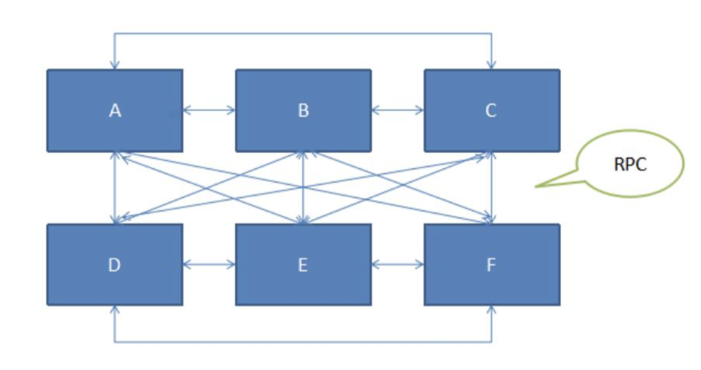

所以说，我们系统之间通信的方式有很多种。每种可能在某些条件下适合，但没有任何一种，可以适应我们所有条件下，所有缓环境下这种系统间的通信方式。

### 2.3 我们期望有一种通信方式

在一些我们对实时性要求比较高，但又没有RPC这么高（RPC要求，1毫秒以内都能访问），比如放宽到2毫秒。并且很多时候，异步也是很重要的（RPC默认是同步的，数据库是异步的，Socket默认是同步的）。所以我们期望又一种通信方式，能够在刚说的条件，特别有要求，限制得特别严格的要求下，还能够很好的支撑我们的业务场景。比如：

- 可以实现异步的消息通信

  能够实现异步的通信能力，我所有的A调用B，B调用E。是异步的调用。这种我们不需要所有的异步调用线程，都在那儿阻塞，等待我们的调用回来再处理。

  这对我们的大事物，或跑批大操作特别有意义。

  比如，我们发起一个任务，这个任务发起完了之后，需要半小时，才跑批跑完。到时候再个我们一个响应（回值）。我们就可以用这样一种东西，来实现我们刚说的，这种通信。

- 可以简化参与各方的复杂依赖关系

  像RPC那种调用关系，太复杂，如果A宕了，所有调用A的服务都会产生异常。

  因为是异步的调用和依赖，使得就算A不在线，使得我们在需要的时候，还能够让它不丢失。只要A再起来，还能再给它。

- 可以在请求量很大的时候，缓冲一下。（类比线程池里的Queue）

  所有系统都是有容量上线的。所以我们希望在一定的容量下，能够缓冲一下。类似于，我们前面讲并发的时候，线程池里的Queue（所有线程池都是自己带了一个Queue，比如Queue设置为1000，那么我们就可以做一下缓冲）

  这样它更像我们前面提到过的背压：流量来了，让它缓冲一下，然后我们这一秒，就按照我们当前的处理能力来处理。处理完再拿，处理完再拿。相当于把这一秒的流量平摊到后面的N秒。就可以保证我们系统平滑的去处理业务。

- 在某些情况下，能够保证消息的可靠性，甚至顺序

  像RPC的可靠性是不那么好保障的，要想保障真正的可靠性，要加一些分布式的事务，直接涉及到数据库那头，才能保证我们事务的可靠性。

  RPC、数据库，是保证不了顺序的，如果我们用轮询，后面的数据处理了，可能前面的数据没有处理。

  比如，我们做证劵交易，大家同时去下单，去买一个股票，它现在的价格，比如是10.1元，再上一刻的价格是10.5元，现在10.1 上有一百单，谁的订单先处理了，谁就能吃掉这100单，后处理了，就吃不到了。就没赚这笔钱。

  所以，很多时候，处理顺序非常重要。

  这个时候用RPC或数据库，都没办法直接保证我们的顺序。

所以，现在我们需要有一种机制，能够帮我们自动的把上面这些东西做好。那我们就可以非常愉快的玩耍，就像RPC封装了元辰调用成为本地调用这么方便一样。

我们希望有一种通讯机制，能够很方便的就有了这些特性。

前期没有这些内容的时候，大家都用数据库表去模拟，然后自己加了很多这种额外的机制和策略来上面说的那些东西都是成立的。如果有这种机制，我们就可以很简单的直接用它们就可以了。

这就是所谓的中间件，中间件的价值。

### 2.4 MQ：Message Queue/Messaging System/Message Middlewire

具备刚刚那些能力的中间件，我们一般叫它MQ。它有好多名字，消息队列。另外几个名字，比如：消息系统、消息中间件

> 叫消息系统的时候，这个消息（Messaging）和前面的消息（Message）不太一样，消息系统中的“消息”（Messaging）是个动名词。表示它是一个传递消息的系统。

它们都指的是MQ，所以我们一般把它叫做消息中间件或MQ就可以了。

这个东西的结构，如下图：

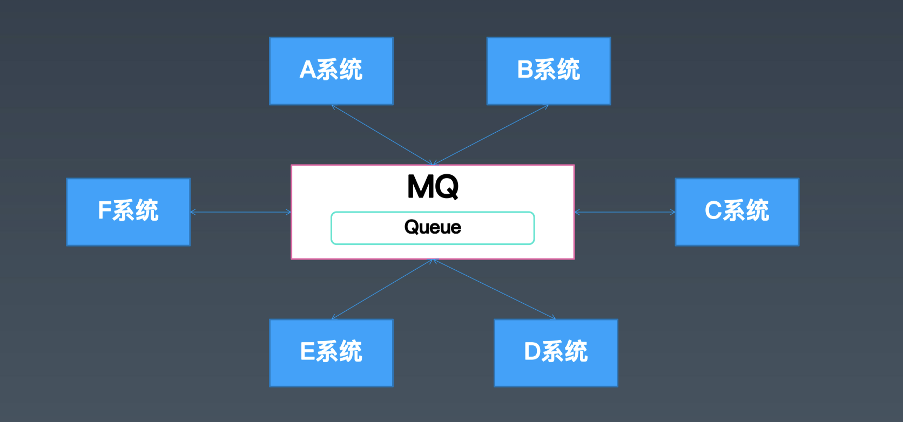

> 实现异步的消息通信

其实它跟ESB很像，很多时候，我们说MQ是一个退化的ESB。各个系统之间的通信，不直接连了，大家通过消息中间件MQ来通信。只要MQ自己是活的，没有宕机，那么A系统想跟D系统通信，它只需要把信息发给MQ，由MQ保证，它最终发给D系统，这样就算D系统不在线，也没问题。

> 可以简化参与各方的复杂依赖关系

同时，因为中间转发了一下，所以A系统和D系统之间是可以相互不知道的。只知道朝某个地址发消息就可以了。这个地址就是所谓的Q（Queue）。每个Q（Queue）相当于一个地址，发消息的这个系统相当于寄信人，MQ相当于邮局，D系统相当于收件人。所以消息接收这一块，我们有时候也就叫它订阅。或者叫投递。（MQ负责把这个消息作为一个信件，投递给D系统）

我们很多的架构图中，也会把消息画成一个小信封。（都是很形象的）

> 缓冲请求

之前A系统把所有的订单处理请求直接发给了D系统，一瞬间可能把D系统压垮了。现在相当于大家把信件和请求都发给了邮局，邮局再去派送。

邮局有多少个快递员，系统接收的速度有多快，根据这些缓缓的给他们信件。

比如双十一当前的快递处理不完，那我们可以在双十一之后的两周内，逐渐把信件处理完。后面处理会慢一点，但系统不会崩。

这种策略就是背压的思想，在各种要求稳定性、可靠性的环境下，都会使用。

> 可靠性、顺序

计算机的任何问题，都可以加一个中间层来解决。我们加了一个MQ之后，就可以在MQ上去加很多的策略，可以可靠的、按照顺序传递给D系统。

发到Queue里的消息会按照接收时间先后顺序排好序，就可以保障业务的有序性。

## 三、从队列到消息服务（MQ是怎么来的）

MQ中的Queue和算法中的Queue有什么关系和联系。

### 3.1 内存里的Queue（数据结构里的Queue）

把数据写进队列，然后从队列里排好队，同时可以从另一头取出数据。

通过缓冲一部分数据，让两端解耦，异步的来做消息的传递。

### 3.2 消息服务、消息队列简单的结构

一个Queue的结构：

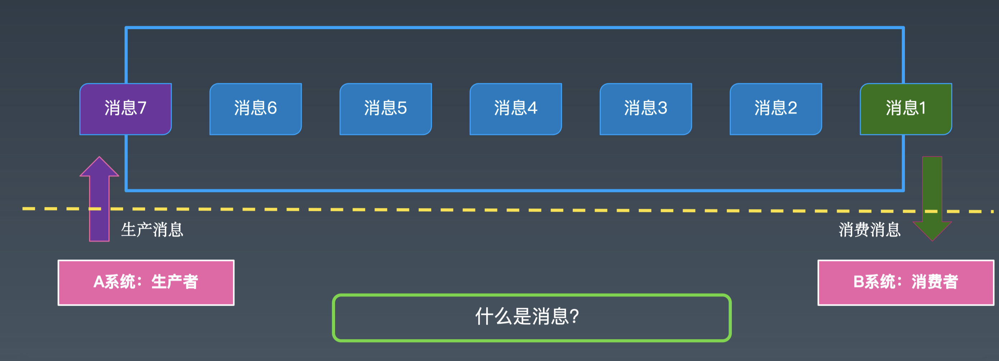

和系统间的通信，几乎一摸一样，区别在于内存中的Queue是在单个进程里使用的。（一个JVM的内部）。

- 消息服务

  当我们把这个队列从当前的进程内，提取出来，单独放到一个服务里，作为一个服务节点，我们有很多的应用程序，很多的进程，不同的JVM，大家可以通过Socket，或RPC等某种机制，集中式的访问它，那我们这个时候就提供了一个消息服务。

  对于使用方来说，消息服务具体怎么实现的，已经不需要知道，只需要知道可以往里面存消息，然后从里面拿出消息。就可以了。

  在这个通用JVM内部，我们称它为数据。到了消息服务这块，我们把它叫做消息。

- 什么是消息？

  一个数据是不是消息？比如，一个数据1是不是消息。很明确的说，1不是消息。

  用来传递信息的数据，才是消息。所以消息服务中的消息是动词Messaging。

- 生产消息、生产者

  往消息服务里写消息的动作，叫生产消息。对应往消息服务里写消息的系统叫生产者。

- 消费消息

  同样的，有系统要从消息服务里获取消息，并处理消息。

  主动过来拿消息，叫拉（取数据）。MQ发送给它的，叫推（实时性比较好）。

  我们把这块叫消费消息。消费消息的系统，叫消费者。

- 生产者和消费者 是针对消息服务中的某个队列来说的。

  一个MQ上可能有很多队列。那么所谓的生产者、消费者角色，都是针对某些队列来说的。

假如现在有很多系统，MQ中有很多Queue（以三个为代表），每一个Queue都是上面那样更具体的结构。

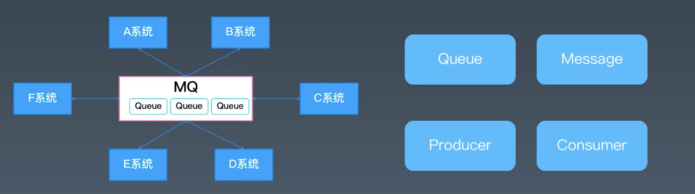

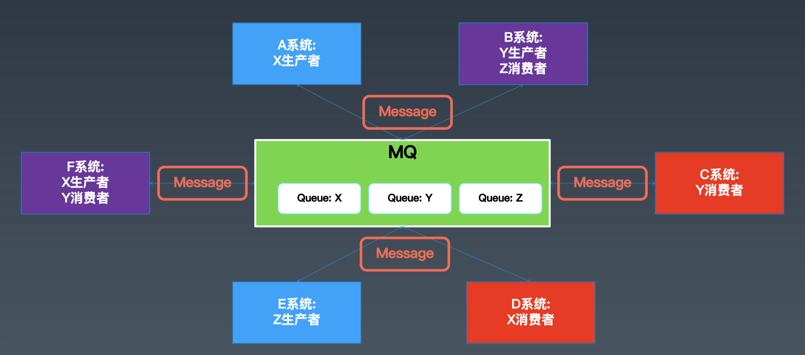

每个系统（比如A系统），订阅了其中一个Queue，从这个Queue中读消息，那这个系统就是这个Queue的消费者。同时向另外一个Queue中写数据，那么它就是另一个Queue的生产者。

那这样，这个A系统，既可以接收到其他系统发给他的数据或请求，同时也能通过这个MQ发数据和请求给其他的系统。特别是，系统在发送数据的时候，只需要关心它的Queue是什么，不需要关心系统。那它就真的和其他系统没有关系了。同时，它发送数据对其他系统来说，都是异步的。这样就解决了前两个问题。

MQ中间件，不管是使用内存来堆积消息，还是使用文件来堆积消息，甚至数据库来堆积消息，都可以把一部分还没有消费的数据（没有发给消费系统之前），缓冲下来。这样就实现了缓冲。

在这个过程中，它可以添加很多的策略，它就实现了，它说的第四条。

所以，总结一下，MQ最核心的概念：

- Queue（队列）
- Message（消息）
- Producer（生产者）
- Cnsumer（消费者）

### 3.3 MQ的四大作用

我们总结一下，MQ用来解决跨进程、跨系统、跨机器的，这样分布式场景中通信时，MQ相对于其他的通信模式，它的一些优势时什么。

四大优势：异步、解耦、削峰、可靠。

#### （1）异步通信

> 异步通信，减少线程等待，特别是处理批量等大事务、耗时操作。

适合大批量的、大事务的耗时操作。同步操作，变成异步操作。

#### （2）系统解耦

> 系统不直接调用，降低依赖，特别是不在线也能保持通信最终完成。

系统解耦，不需要知道目标机器，是不是好的，当前是不是在线。都可以保证最终的通信时可以完成的。

#### （3）削峰平谷

> 压力大的时候，缓冲部分请求消息，类似于背压处理。

压力大的时候，能够缓冲部分的请求，类似于背压。

#### （4）可靠通信

> 提供多种消息模式、服务质量、顺序保障等。

可靠主要体现在：消息模式、服务质量、顺序保障。

### 3.4 问答

- 消费者有推和拉两种方式，监听时那种？

  MQ服务器推过来的。

- DLQ：Dead Letter Queue 死信队列

  消息被连续处理了多次，还是失败，为了不卡住后面的消息处理，就可以把这个消息丢到DLQ中。这个是系统自己做的，不需要人工干预。

  另外就是超时，我每个消息都定一个时间，比如有效期是一个小时，一个小时这个消息还未被处理，它也会进入DLQ中。

  DLQ也是一个队列，你可以像使用正常队列一样使用它，可以把它的数据拿出来，人工的干预去处理。

  是MQ保障消息的一种机制。消息整体来说，没有丢。

  DLQ一般在两种情况下用：

  第一种，一个消息被处理失败，并连续多次都处理失败了（比如ActivityMQ 重试默认是三次），都失败了以后，假如我们业务要求，不能因为前面的失败，卡住业务处理，那么我们就可以把这种消息丢到DLQ中。

  第二种，消息上面加了超时，某种订单，有效期是一个小时，如果一个小时都没有处理，直接挪到DLQ中。这样也不会影响消息队列本身的稳定性。

  DLQ 是ActiveMQ、RabbitMQ上自带的。

  DLQ来源于EIP（企业集成模式）

  第一代的MQ一般都有DLQ，是给业务用的，通用设施，本身没有业务语义。

- MQ的消息迁移和升级

  迁移：是作业

  升级：如果消息不在内存中，重启消息不会丢。快和可靠性要有所取舍。

  线上升级MQ：camel 工具

- 重复消费的消息要怎么处理

  QIS

- RabbitMQ为啥搞了一个exchange

  exchange是一个通用概念，下面会讲解。

  exchange 相当于是Spring MVC、网关（gateway）中的路由。

- MQ选型

  关于性能：吞吐量/延迟

  关于选型：场景与指标

  关于开发：抽象与封装

  关于维护：稳定性/高可用

## 四、（重点）消息模式与消息协议

### 4.1 典型的消息处理模式

常见的消息处理模式有两种：点对点（P-to-P）、发布订阅（PUb-Sub）。

他们区别是，一个是单点投递，和多点投递。

**在MQ中，这两种模式，除了策略不同，本质上没有任何区别。**

#### （1）点对点： PTP，Point-To-Point

**把这种消息处理的模式对应的是Queue，它对应的消息模式叫点对点。**

我们刚刚讲了，对于一个MQ来说。肯定有多个系统给他发消息。也可以有多个系统从它这里接受消息。

那么点对点的消息处理模式，就是说，里面的任何一个消息只能最终发给一个消费者。

> 举例：我有一个苹果，我拿到这个苹果，不管班里有多少个人，我只能给其中一个人。

甚至根据负载均衡算法，或投递策略决定。但是只能给一个人。

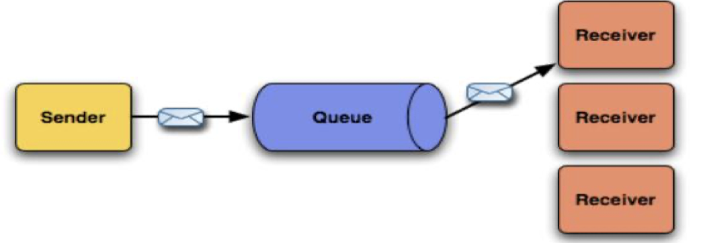

#### （2）发布订阅：PubSub，Publish-Subscribe

假如，我有一个故事或笑话，就不一样，可以讲给更多的人。这个模式是个广播的模式。

**这种模式对应的是主题（Topic）。**

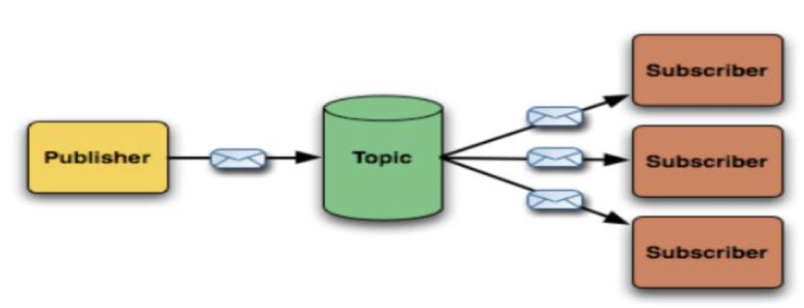

### 4.2 消息处理的保障

#### （1）三种QoS（Quality of service， 服务质量）

> 这是消息语义的，不是业务语义的。

要保障我们消息的可靠，就要在我们的性能和可靠上做选择，这就是消息的服务质量。

几乎所有的MQ都会有这三个东西，用来平衡我们的性能和可靠性的。

> 有时候我们不需要那么高的可靠性，但是我们希望性能尽可能的好。有时候我们需要严格的可靠性，性能可以低一些。
>
> 就用它来平衡。

- At most once，至多一次。消息可能会丢，但不会重复发。

  不管处理是成功还是失败。发一次就不管了。

- At least once，至少一次。消息不会丢失，但可能会重复。

  假如判断超时了，会重复发。至少一次，就意味着，会发多次。这样性能就没有第一种高。

  重复的策略：

  第一种，幂等（两次都能执行，执行两次的效果和执行一次的效果是一样的）。

  第二种，在数据库之外，我们的业务系统里做去重。这里再次推荐Roaringbitmap。

  >  比如，拿到订单数据，订单的ID，然后把它放到bitMap里做去重。如果判断是重复的，就不调用后面的业务处理办法了。

- Exactly once，精确一次，每条消息肯定会被传输一次且仅一次

  是消息语义的，不是业务语义的。通过消息被消费处理的代码，这个方法完整的被处理完，没有报异常，代表消息就被成功处理了。

  但是业务上处理失败了，消息中间件是不知道的。所以从业务上来说，有且仅有一次，是不现实的。

  

所以，在对业务数据处理，非常建议大家选择At least once，让它在某些情况下去做重复。重复比丢失要好。

#### （2）消息处理的事务性

消息中间件都实现了事务（或类似事务）的机制。

- 通过确认机制实现事务性

  在一个会话中，打开一个事务选项，然后执行这一批操作，比如：拿到这一批消息。假如手工的处理这批消息的事务性。典型的是手动的确认消息处理成功了没有。这批业务都处理完了，我们再ack。这时候MQ会认为这批消息成功投递给了我们。就不会再投递了。

  假如处理过程中抛出异常，MQ会重新给我们发这一批消息。

- 可以被事务管理器管理，甚至可以支持XA

  第一代的MQ，除了实现事务性，还可以用Spring的事务管理器来管理。特别是，它还实现了XA（强一致性的分布式事务）。

  这样就可以把MQ的处理，数据库的处理，绑定成一个大的事务。

### 4.3 消息的顺序性

- 同一个Topic或Queue的消息，保障按顺序投递。

  所有的消息进来的时候，消息都排好队了，所以，经过同一个MQ的消息，最终投递给消费者（不管是一个消费者，还是多个消息者）的时候，是按照顺序投递的。


- 消息分区

  注意：如果做了消息分区，或者批量预取之类的操作，可能就没有顺序了。

  有时候，我们为了一些消息的容量、分布式、性能做批处理，可能会破坏这种模式。

  比如，做了分区，同样一个topic，分了多个partition，每个partition相当于一个子topic，每个partition是有序的，但多个partition放在一块就不是有序的了。

### 4.4 集成领域的圣经：《企业集成模式》

一般我们认为它是SOA/ESB/MQ的理论基础。

> 有时间了，可以看看。

看技术书，不用从头到尾看。

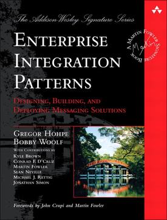

### 4.5 消息协议

具体在使用的时候，还是要通过协议来操作各种东西。不管API层，封装了什么东西，底层走的都是消息协议。

我们的MQ相当于一个服务器了，我们的业务相当于一个客户端。不管他们是发消息，还是接受消息。这个时候MQ相当于一个数据库或Redis。

客户端和我们的服务器进行交互，就需要有一种交互的协议。跟前面讲的RPC、Redis还不太一样。这些交互的协议，决定了消息处理的特性。

同时，服务端和客户端通信，要考虑一些东西：

第一：中间走TCP、还是走HTTP等底层通信等协议是什么。

第二：消息中间要不要序列化，序列化是什么格式的。

第三：我们可以给服务器端发送哪些操作命令，进行交互，影响双方的行为。

把这些东西抽象一下，就变成消息的协议。

- STOMP（Simple text Object Message Protocol）：简单的文本对象协议

  相当于JSON走HTTP一样，所有的交易通过文本。很简单

- JMS（Java Message Service）：Java消息服务

  很长一段时间，J2EE的标准。是J2EE的一部分，很长时间，是业内的标准。

  但它不是一个完善的消息协议。它只是个客户端的协议（类似JDBC），需要厂商自己实现。

  没有规定如何序列化，如何传输。

  比较完善的，实现各种模式的协议。对服务器要求只有一点：往服务器发送消息的时候，如果消息是持久化的（加一个持久化的参数），必须把消息持久化到本地。不管是本地日志文件，还是数据库。**必须持久化完了，再返回给客户端。**

- （完整）AMQP：高级的消息队列协议

  规定了消息如何序列化，跟服务器交互有哪些命令，报文怎么走。

- （完整）MQTT（Message Queuing Telemetry Transport）：消息队列遥测传输

  专门给遥感传输使用的。

  AMQP和MQTT是完整的协议。

  规定了消息如何序列化，跟服务器交互有哪些命令，报文怎么走，同时描述了客户端和服务端的行为。

  这样的好处是：不管MQ怎么实现，我作为一个客户端，发出去的报文，都是一样的。一个驱动包，可以连多个MQ。这样的包具有一致性和通用性。

- XMPP：专门给IM（聊天）

  用这种协议，可以非常方便搭建一个聊天软件

- Open Messaging：框架性的协议

  类似一个壳子，是阿里弄出来的。

JMS、AMQP、MQTT最常用。

JMS用在J2EE环境；

AMQP是RabbitMQ默认支持的协议，是搞金融的人搞出来的。

MQTT：是IBM搞出来的，主要用于做物联网。包非常精简（最小的包只有2个字节）。在网络不稳定下，比较有优势。

### 4.6 JMS（Java Message Service）

#### （1）关注于应用层的API协议（类似JDBC）。

JMS 协议和JDBC非常像，从连接工厂、到连接、到Session（这个Session相当于ORM，Mybatis中的Session，在JDBC中相当于Statement），然后可以通过Session创建生产者 生产消息，创建消费者消费消息。

> JDBC中Connection创建了Statement，JMS中Connection创建了Session。

然后抽象出了一个Destination，这个是真的队列。Destination有两个实现：Queue和Topic。

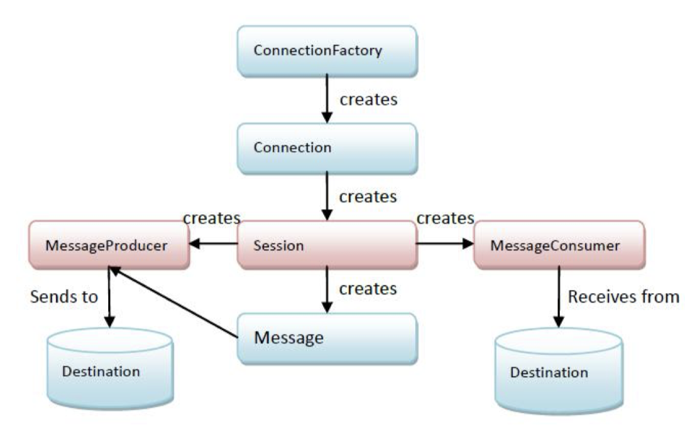

#### （2）Message结构与Queue概念

##### Body\Header\Property，messages types

除了这一套机制外，因为JMS处理的是消息，所以它额外定义了一个消息的结构，一个Message接口的结构。消息中又定义了消息头、消息体、消息的属性三个主要的字段。

- 消息体就是这个消息的实际数据

> 消息就相当于一个邮件或者一个快递的包裹，我们在邮件的信封上写了很多信息（寄件人、收件人、发件人、邮编……）这些通常写到Header里。

- 在Header里写，比如路由信息、消息要不要持久化、过期时间、优先级、重试次数……

- 如果想使用自定义的头key-value，我们一般放到property里

- JMS中定义了五种消息类型：文本消息、Map消息、对象的消息、字节的消息、流的消息。

  如果消息太大，可以把消息放到流中，不断往流里写，那边不断从流里读。相当于MySQL的Blob。

##### Queue\Topic\TemporaryQueue\TemporaryTopic

除了Queue和Topic，还定义了临时的TemporaryQueue，和临时的TemporaryTopic。

临时用完了，就没了。相当于数据库的临时表。

在JMS中，Queue一般是持久化的，Topic一般是不持久化的。

Topic不持久化，意味着，消息都放到内存里。如果当前有一个订阅者不在线，它没消费到，它重启后，消息也就丢了。

##### Connection\Session\Producer\Consumer\DurableSubscription

怎么把Topic数据不丢呢，这就需要把Topic变成持久化的。

换句话说，我们把Topic上的订阅者，消费者变成可持久化的。所以它有一个持久化订阅的概念（DurableSubscription）。

如果我们启用了持久化订阅，那么这个topic的数据，都是要跟Queue一样，要写进磁盘里。

持久化下来，保证不丢，而且我们要记录一个订阅者，现在订阅的位置。这样的话，等它掉线了，再启动，我们就从上一次它订阅的位置开始，把它缺的数据全给它。

另外，在Queue中，所有的消费者都消费完了。在Topic中，所有持久化订阅者都消费完了。默认会不定期的把数据全部清除掉。

> 在Queue中，一个消息只能给一个消费者。

为什么这么干？因为第一代的消费消费者都是通过把消息存到内存中实现高性能的。所以，我们堆积的消息越少，系统处理得越快。堆积消息对了，内存爆了或磁盘爆了，会影响MQ的稳定性。

##### Messaging行为

JMS这块对于消息的传递，基本上把我们前面说的很多机制，都已经规定好了。所以JSM作为客户端的消息是比较完善的。

- PTP&Pub-Sub
- 持久化
- 事务机制
- 确认机制
- 临时队列

### 4.7 消息队列的通用结构

JMS协议和JDBC比较类似，我们可以根据MQ内部的实现，看一下消息的机制。和我们在外部使用JMS时，它的机制时什么样的。

#### （1）内部体系

内部体系，有一个Exchange负责接受消息。然后把消息投递到具体的Queue里（这会有成百上千个不同的Queue或Topic），前面监听拿到发来的消息（把它具体的放到对应的Queue或Topic里）。在队列的外面会有一个分发的模块（Dispatch），把消息投递给订阅了Queue或Topic的系统里。

如果指定了消息的持久化，消息一进来需要先持久化（Storage），这样才保险。

很像网关。

> 很多东西，底层都是想通的。

另外，可以把异步的封装称同步的，JMS和ActiveMQ是一样的。

RR模式：请求响应模式

> 利用JMS实现一个远程调用。

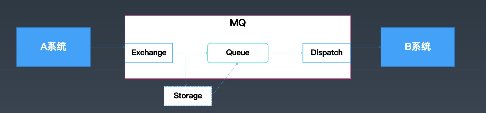


常用的模式：

- One-Way：只调用，不返回
- RR，请求响应：有请求，有响应

#### （3）外部体系

从外部使用来看，看MQ封装了多少个不同的层级。

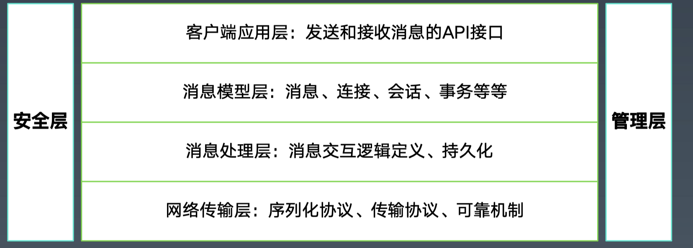

第一层：就是我们使用的各种接口；

JMS里，就是JMS规范里提供的接口。

第二层：订阅的消息是什么等

第三层：消息处理：消息是怎么发的，要不要持久化。

第四层：网络传出层：消息的序列化

安全层：消息的安全，用户的权限，要不要加密

管理层：怎么查看队列有多少消息，有多少队列，发了多少消息、处理了多少消息等，怎么去更好的管理我们的MQ。

### 4.8 开源消息中间件/消息队列

上面讲的所有东西，最终我们要使用MQ，还是要拿一个真实的MQ实现。

我们认为，开源的MQ发展了三代：

1. Apache ActiveMQ/RabbitMQ；

ActiveMQ大概05年开始，09年国内已经在大规模使用ActiveMQ了。

JMS的参考实现，我们一般认为是Active MQ。AMQP 的参考实现，是Rabbit MQ，但Rabbit MQ的参考实现，其实是Apache的一个项目，叫Qpid。Qpid是AMQP的参考实现。

2. Kafka/RocketMQ

淘宝早起也用ActiveMQ，后来参考Kafka创建出了RocketMQ。

kafka被认为是第二代MQ的事实标准。

3. Apache Pulsar

它是第三代。

第一代基于JMS和Rabbit MQ；第二代是kafka，以及参考Kafka的RocketMQ；第三代是Apache Pulsar。

这三代的区别：

第一代：不支持堆积，主要是靠内存的；这样内存卡满了，消息堆积了，就不能用了。所以第一代内存是最大的问题。

第二代：是基于磁盘，可堆积的。默认消息是不会删除的。可以不断的往里面发消息，利用一个WAL的技术，把所有的消息追加性的不断往里面写。

只要磁盘够用，有多少消息，都能堆积上去。

第三代：计算和存储分离。计算节点和存储节点不是一个节点。

计算和存储可以不断扩展，互补影响。

第一代都支持Queue和topic；第二代一般只支持topic。第三代，又支持了Queue和Topic了。

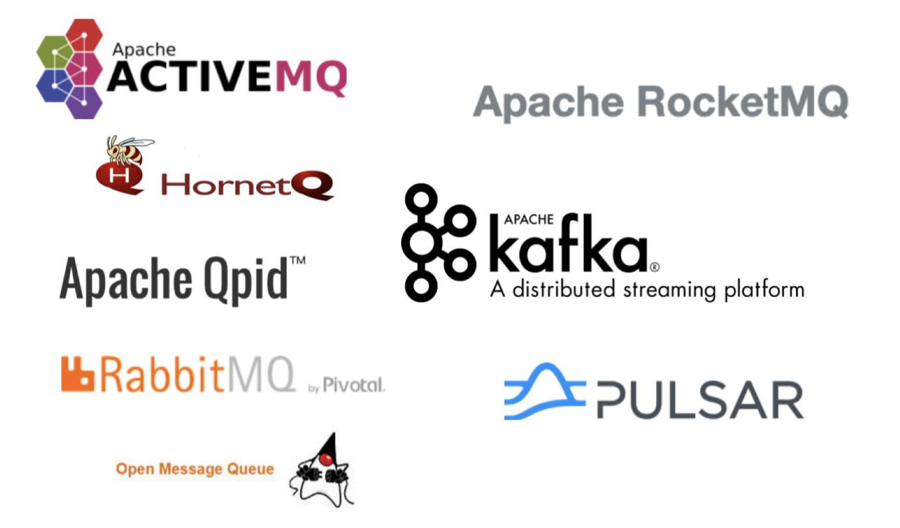

### 4.9 问答

- spring-amqp是robbitmq吗

  amqp是可移植的通用协议，服务端是RabbitMQ或者ActiveMQ（ActiveMQ需要开amqp协议）、Qpid都可以。

- ZMQ，我们认为是一个通信库

  它把底层的通信重写了，可以跑几十上百万。

  虽然叫MQ的名字，但我们不认为它是MQ。

- ActiveMQ的历史

  ActiveMQ从05、06年开源给Apache。

  随着数据量越来越大，数据需要堆积处理，就出现了Kafka。很快kafka就成了第二代互联网MQ的事实标准。

  这个时候ActiveMQ想在5.x的版本上演化出来一个6.x的版本，来集成第二代kafka的特性，起名叫apollo，但很多年都没有出来。

  同时，jboss团队 hornetq，发现市场越来越小，就和ActiveMQ合并成一个团队了。他们废弃了apollo，现在还在孵化状态，叫artemis。

  artemis作为ActiveMQ的6.0。

  所以，我们说ActiveMQ是 5.0 ， artemis是6.0 版本。

## 五、ActiveMQ消息中间件

对于常见的量不大，非常建议使用ActiveMQ，简单、好用、功能全。

### 5.1 ActiveMQ介绍

- 高可靠的、事务性的消息队列
- 当前应用最广泛的开源消息中间件
- 项目开始与2005年CodeHaus、2006年成为Apache项目

后来与HornetQ合并，新的消息队列叫：Artemis，目前是ActiveMQ的子项目。

作为一个功能最全的瑞士军刀产品，ActiveMQ的功能都已经有五六百个。

常见的消息协议、通信协议，它都支持。

它相当于MQ的鼻祖。

功能最全的开源消息队列：https://activemq.apache.org/

### 5.2 主要功能

1. 多种语言和协议编写客户端

   语言: Java, C, C++, C#, Ruby, Perl, Python, PHP等

   > 常见的语言环境，基本都支持它，而且支持的特别好。

   应用协议: OpenWire,Stomp REST,WS Notification,XMPP,AMQP,MQTT

   > 协议有Stomp协议（简单文件对象协议）REST等。它还自己创建了一个协议，叫OpenWire。

   为什么有OpenWire？因为最初ActiveMQ只支持JMS，但JMS是语言相关的，需要自己实现驱动包，并且是Java特有的。所以ActiveMQ为了让它跨平台，那么JMS就不行了（就像我们在C#中没法使用JDBC一样），为了避免在各个语言中都去做一个驱动包，它就自己创建了一个跟语言无关的一套消息协议（包括消息怎么通信，消息怎么序列化等），在这个协议里定义好了。

   这个协议就跟AMQP、MQTT类似的。

2. 完全支持JMS1.1和J2EE 1.4规范 (持久化,XA消息,事务)

3. 与Spring很好地集成，也支持常见J2EE服务器

4. 支持多种传送协议:in-VM,TCP,SSL,NIO,UDP,JGroups,JXTA

   in-VM：当前在同一个JVM内部，可以简化操作。

   可以走TCP，走SSL（安全的TCP）。

5. 支持通过JDBC和journal提供高速的消息持久化

   通过JDBC或日志的形式，支持消息的持久化，消息的不丢。

6. 实现了高性能的集群模式

### 5.3 使用场景

1. 所有需要使用消息队列的地方，都可以使用ActiveMQ；

   [KimmKing的技术博客](https://kimmking.blog.csdn.net/)：ActiveMQ技术详解

2. 订单处理、消息通知、服务降级等等；

   举例，淘宝用户下单要填，订单要不要加保险、配送信息。双十一的时候，整个流程处理完，就会特别慢，就会加一个开关，把它降级掉。让保险、配送信息的处理只发个消息到MQ里，当前不处理，当半小时后压力不大了，再把他们打开，再处理。

   通过MQ的方式，实现消息降低。

   分布式事务那块，可以异步发消息，回头通过补偿或撤销处理的操作，最终实现操作完整性。

3. 特别地，纯java实现，支持嵌入到应用系统。

   ActiveMQ有一个其他ActiveMQ没有的特性。因为它是纯java实现的，所有它有一个activemq-all的jar包，它把server端代码也封装到jar包。

   可以把我们应用本身变成MQ。

   就像Jetty和Tomcat，Tomcat默认需要单独启动，后来SpringBoot把Tomcat剥离出来，开发出一个嵌入式的tomcat。Jetty是天然的，它很完善，它的版本发布、对新特性的支持比Tomcat还快。

   Jetty是Eclipses团队的。

### 5.4 问答

- 如何选型

  要考虑这些事情：

  - 性能：

    如果数据量不大，但对MQ处理这一块策略要求比较高（重试、超时），这个时候可以考虑ActiveMQ，并使用JDBC把数据持久化到数据库。

    假如希望性能足够高，全部都走内存，又通过内存做集群，做高可用，又保证数据不丢，可以考虑用RabbitMQ，它非常的快。

    再比如，你处理的是大数据的场景，或跑批的场景，或者处理日志的场景，也比如，也是处理业务订单，但MQ放在前面做订单的接收，再往后丢，到后面做真正的处理，这个时候可以用Kafka和RabbitMQ。

    > 先收单，一秒钟10万条，也先收单。再真正的把订单推送到业务交易系统，再告诉用户一个消息，你这个订单下成功了。收单的时候，还没成功，真正受理了，再告诉你成功了。

  - 强事务的话，就需要能保证事务、消息不丢的MQ来做。比如RabbitMQ，或ActiveMQ。

  总结，MQ的选型，要根据你的场景，吞吐量、性能，延迟的要求，可靠性的要求，是否有强堆积的要求，来考虑用哪一种类型的MQ。

  具体到某一个MQ，还是建议大家，数据量大的情况下，做好POC测试（Proof of concept，概念验证）：

  把业务里使用到的场景，简化成一个很简单的需求，用代码去实现好，然后去验证，压测你们考虑的那几种MQ。通过压测看看哪些满足你们的需求，哪些不满足你们的需求。最终根据压测的数据和场景下的表现（这种指标的数据），最终做选项的判断。

  > 拍脑袋，简单的情况下是可以的，复杂的情况下，肯定是不行的。

### 5.5 Active MQ 使用演示

#### （1）启动ActiveMQ

> rabbitmqctl stop

````shell
-- 通过 `activemq status` 查看activemq的状态
lifeideMacBook-Pro:apache-activemq-5.16.2 lifei$ ./bin/activemq status
INFO: Loading '/Users/lifei/Downloads/dev/servers/apache-activemq-5.16.2//bin/env'
INFO: Using java '/Library/Java/JavaVirtualMachines/jdk/Contents/Home/bin/java'
ActiveMQ not running
````

启动activemq：

```shell
lifeideMacBook-Pro:bin lifei$ pwd
/Users/lifei/Downloads/dev/servers/apache-activemq-5.16.2/bin
-- 通过`activemq start`启动activemq
lifeideMacBook-Pro:apache-activemq-5.16.2 lifei$ ./bin/activemq start
INFO: Loading '/Users/lifei/Downloads/dev/servers/apache-activemq-5.16.2//bin/env'
INFO: Using java '/Library/Java/JavaVirtualMachines/jdk/Contents/Home/bin/java'
INFO: Starting - inspect logfiles specified in logging.properties and log4j.properties to get details
INFO: pidfile created : '/Users/lifei/Downloads/dev/servers/apache-activemq-5.16.2//data/activemq.pid' (pid '7036')
lifeideMacBook-Pro:apache-activemq-5.16.2 lifei$ ./bin/activemq status
INFO: Loading '/Users/lifei/Downloads/dev/servers/apache-activemq-5.16.2//bin/env'
INFO: Using java '/Library/Java/JavaVirtualMachines/jdk/Contents/Home/bin/java'
ActiveMQ is running (pid '7036')
```

启动之后，可以通过界面访问MQ：http://localhost:8161/index.html

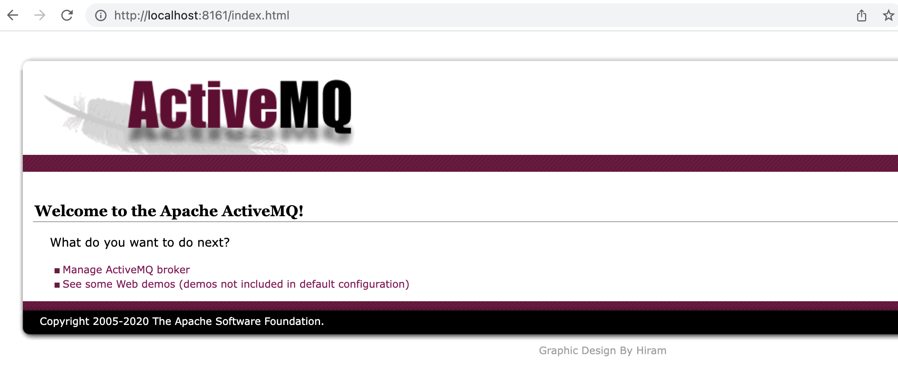

#### （2）代码操作MQ

创建一个消费者：

```java
// 创建一个一个Queue，queue的名称叫 test.queue
Destination destination = new ActiveMQQueue("test.queue");
// 创建一个连接工厂，连接到TCP的61616
ActiveMQConnectionFactory factory = new ActiveMQConnectionFactory("tcp://127.0.0.1:61616");
// 有了连接工厂后，（就可以）用连接工厂创建一个连接
ActiveMQConnection conn = (ActiveMQConnection) factory.createConnection();
// 表示真正的物理上连接了MQ的服务器
conn.start();
// 创建一个Session，并把事务先关掉，这就相当于我们JDBC里的自动确认事务，每次执行的东西，自动变成一个事务提交掉
Session session = conn.createSession(false, Session.AUTO_ACKNOWLEDGE);
// 创建一个consumer，并为这个consumer添加一个监听器
MessageConsumer consumer = session.createConsumer( destination );
// 这个监听器，很简单，就是把获取到的消息打印出来。
// 这样consumer 启动之后，会自动监听服务器的数据。只要有消息，MQ就会把消息推给consumer
consumer.setMessageListener((Message message)->{
  try {
    // 打印所有的消息内容
    // Thread.sleep();
    System.out.println(count.incrementAndGet() + " => receive from " + destination.toString() + ": " + message);
    // message.acknowledge(); // 前面所有未被确认的消息全部都确认。    
     } catch (Exception e) {
    e.printStackTrace(); // 不要吞任何这里的异常，
 }
});

// 其实，我们也可以调用 receive() 方法去拉取consuemr。它返回一个消息
//consumer.receive()
// 还可以添加等待时间
//consumer.receive(long l)
```

创建一个生产者：

```java
// 创建一个生产者
MessageProducer producer = session.createProducer(destination);
int index = 0;
while (index++ < 100) {
  // 生产者去生产消息，消息的内容是一个数字加一个文本。
   TextMessage message = session.createTextMessage(index + " message.");
  // 让producer，把消息发给MQ
   producer.send(message);
}

// 为了让线程暂停，暂停2秒后，关闭会话，关闭连接
// 如果把下面都注释掉，线程不会停：因为监控都在
Thread.sleep(20000);
session.close();
conn.close();
```

执行上面代码，可以打印100条消息：

```
100 => receive from queue://test.queue: ActiveMQTextMessage {commandId = 203, responseRequired = true, messageId = ID:lifeideMacBook-Pro.local-53349-1647869723268-1:1:1:1:100, originalDestination = null, originalTransactionId = null, producerId = ID:lifeideMacBook-Pro.local-53349-1647869723268-1:1:1:1, destination = queue://test.queue, transactionId = null, expiration = 0, timestamp = 1647869723519, arrival = 0, brokerInTime = 1647869723519, brokerOutTime = 1647869723519, correlationId = null, replyTo = null, persistent = true, type = null, priority = 4, groupID = null, groupSequence = 0, targetConsumerId = null, compressed = false, userID = null, content = org.apache.activemq.util.ByteSequence@3447fa1f, marshalledProperties = null, dataStructure = null, redeliveryCounter = 0, size = 0, properties = null, readOnlyProperties = true, readOnlyBody = true, droppable = false, jmsXGroupFirstForConsumer = false, text = 100 message.}
```

可以看到上面的操作和JDBC操作一样。

我们提到过，在消息模型里面，Queue除了消息模式和Topic不一样外，其他的地方几乎是一样。所以，消费者还可以这样写：

```java
-- 创建一个Topic，其他代码都不变
Destination destination = new ActiveMQTopic("test.topic");
```

然后重新执行，这时候，程序也执行完了，执行结果和刚是一样的：

```
100 ===> receive from topic://test.topic: ActiveMQTextMessage {commandId = 178, responseRequired = true, messageId = ID:lifeideMacBook-Pro.local-53414-1647870004060-1:1:1:1:100, originalDestination = null, originalTransactionId = null, producerId = ID:lifeideMacBook-Pro.local-53414-1647870004060-1:1:1:1, destination = topic://test.topic, transactionId = null, expiration = 0, timestamp = 1647870004297, arrival = 0, brokerInTime = 1647870004297, brokerOutTime = 1647870004297, correlationId = null, replyTo = null, persistent = true, type = null, priority = 4, groupID = null, groupSequence = 0, targetConsumerId = null, compressed = false, userID = null, content = org.apache.activemq.util.ByteSequence@640ab9a4, marshalledProperties = null, dataStructure = null, redeliveryCounter = 0, size = 0, properties = null, readOnlyProperties = true, readOnlyBody = true, droppable = false, jmsXGroupFirstForConsumer = false, text = 100 message.}
```

所以，Queue和Topic除了行为模式不一样，其他的几乎一样。

#### （3）查看执行效果

入队200个消息，出队200个消息

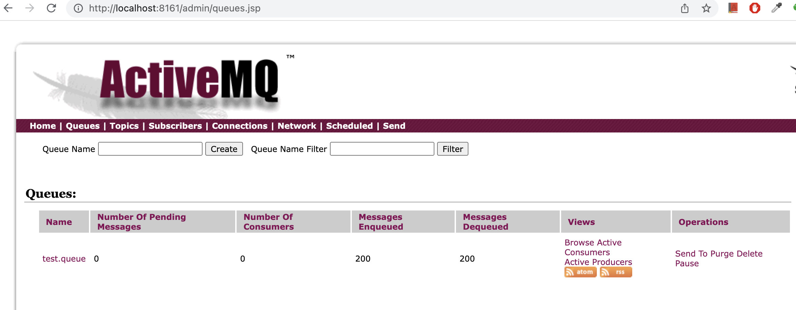

Topic 界面：

下面界面中，除了“test.topic”，其他topic是元数据的广播消息。

activeMQ里可以做集群，集群里有一种模式，叫network集群：

activeMQ的network模式，我们叫NC模式，可以把多个server（或叫broker）连起来，当作一个大的整体server对外提供服务。这个时候把消息发到那个server上都一样，会把消息路由到你连到那个server上，再转发给你。

这些borker连在一块，是如何感知又哪些生产者、消费者呢？就是通过这些，通知消息的机制，把这些Queue、topic、Connection等这些东西作为元数据广播出去。

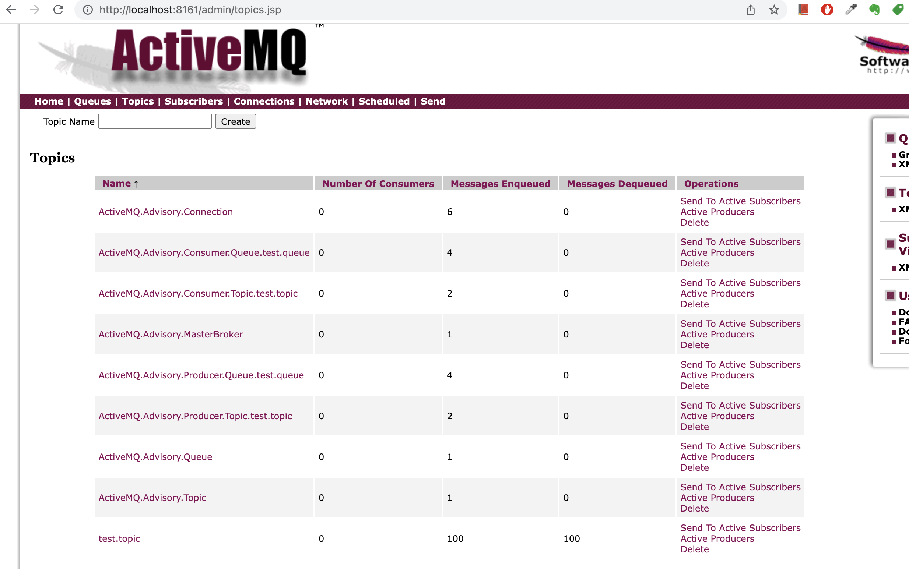

#### （4）在控制台发消息

我们把下面三行代码注释掉，程序运行完，还不停：

```java
//            Thread.sleep(20000);
//            session.close();
//            conn.close();
```

这个时候可以测试在控制台发消息：

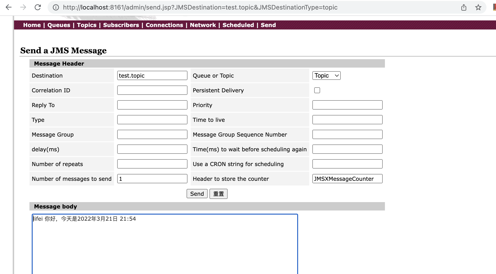

并收到了消息内容：

```
101 ===> receive from topic://test.topic: ActiveMQTextMessage {commandId = 5, responseRequired = false, messageId = ID:lifeideMacBook-Pro.local-52052-1647868067644-4:1:1:1:1, originalDestination = null, originalTransactionId = null, producerId = ID:lifeideMacBook-Pro.local-52052-1647868067644-4:1:1:1, destination = topic://test.topic, transactionId = null, expiration = 0, timestamp = 1647870910854, arrival = 0, brokerInTime = 1647870910854, brokerOutTime = 1647870910855, correlationId = , replyTo = null, persistent = false, type = , priority = 0, groupID = null, groupSequence = 0, targetConsumerId = null, compressed = false, userID = null, content = org.apache.activemq.util.ByteSequence@37efcfdf, marshalledProperties = null, dataStructure = null, redeliveryCounter = 0, size = 0, properties = null, readOnlyProperties = true, readOnlyBody = true, droppable = false, jmsXGroupFirstForConsumer = false, text = lifei 你好，今天是2022年3月21日 21:54}
```

此时再来看管理界面的变化：

由于有一个客户端在后台挂着，所以这里Number of Consumers 是1。

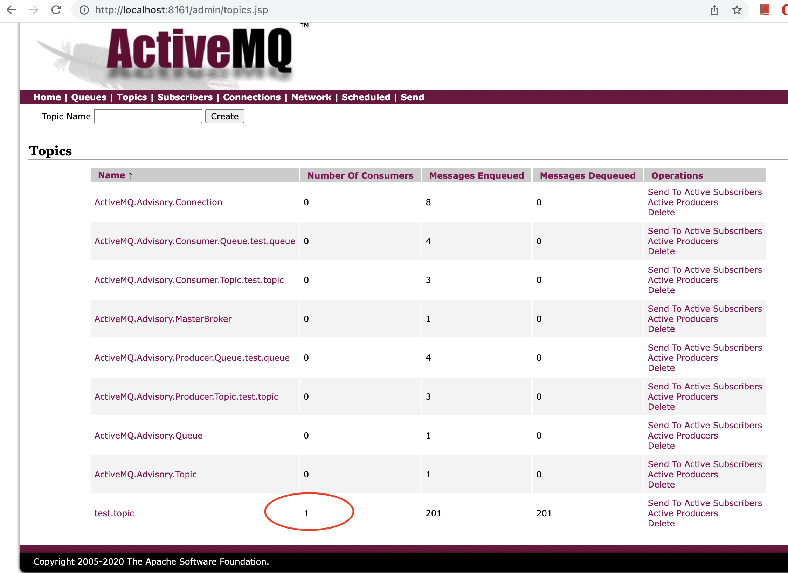

### 5.6 ActiveMQ的配置文件

#### （1）activemq.xml

配置文件在 `apache-activemq-5.16.2/conf/activemq.xml`

这个配置文件是一个Spring的Bean文件：

> 前面Spring中，讲过，可以使用Spring-xml-bean的方式，自动生成Spring的Schema。activemq就是这么干的，它的这些Schema，xsd不是手工写的，都是自动生成的。
>
> 这里面的配置格式和具体源代码里的POJO格式是一样的，这样就能自动的生成Schema的配置文件。

```xml
<beans
  xmlns="http://www.springframework.org/schema/beans"
  xmlns:xsi="http://www.w3.org/2001/XMLSchema-instance"
  xsi:schemaLocation="http://www.springframework.org/schema/beans http://www.springframework.org/schema/beans/spring-beans.xsd
  http://activemq.apache.org/schema/core http://activemq.apache.org/schema/core/activemq-core.xsd">

    <!-- Allows us to use system properties as variables in this configuration file -->
    <bean class="org.springframework.beans.factory.config.PropertyPlaceholderConfigurer">
        <property name="locations">
            <value>file:${activemq.conf}/credentials.properties</value>
        </property>
    </bean>
```

里面可以配置，queue或topic的使用策略，

比如限制，里面没有被消费的（pending）的消息又多少个。达到了这个数据，我就卡住它，不让它往里面发消息了。相当于背压。

```xml
        <destinationPolicy>
            <policyMap>
              <policyEntries>
                <policyEntry topic=">" >
                    <!-- The constantPendingMessageLimitStrategy is used to prevent
                         slow topic consumers to block producers and affect other consumers
                         by limiting the number of messages that are retained
                         For more information, see:

                         http://activemq.apache.org/slow-consumer-handling.html

                    -->
                  <pendingMessageLimitStrategy>
                    <constantPendingMessageLimitStrategy limit="1000"/>
                  </pendingMessageLimitStrategy>
                </policyEntry>
              </policyEntries>
            </policyMap>
        </destinationPolicy>
```

我们可以设置，默认用JMS的方式访问MQ，可以直接查看消息队列的数量、甚至执行一些操作：

- 添加“useJMS=true”
- 将createConnector，改为true

```xml
<broker xmlns="http://activemq.apache.org/schema/core" brokerName="localhost" dataDirectory="${activemq.data}" useJMS="true">
      <managementContext>
          <!-- 默认是false，这里改为true -->
            <managementContext createConnector="true"/>
        </managementContext>
```

默认持久化，保证消息不丢：不仅放到内存里，还放到磁盘上。这个地方也可以配置JDBC，指向数据库的连接：

> 这样就可以把消息写到数据库表里。

```xml
        <persistenceAdapter>
            <kahaDB directory="${activemq.data}/kahadb"/>
        </persistenceAdapter>
```

还可以限制资源的使用：

- 内存的使用
- 本地持久化
- 临时文件的使用

```xml
          <systemUsage>
            <systemUsage>
                <memoryUsage>
                    <memoryUsage percentOfJvmHeap="70" />
                </memoryUsage>
                <storeUsage>
                    <storeUsage limit="100 gb"/>
                </storeUsage>
                <tempUsage>
                    <tempUsage limit="50 gb"/>
                </tempUsage>
            </systemUsage>
        </systemUsage>
```

最重要的是，在这里配置对外提供服务协议，监听的接口：

- 默认使用openwire协议，就是刚刚配置的61616
- 默认还配置了amqp的协议，就跟RabbitMQ的协议是一样的，是5672端口
- stomp协议，是61613端口
- mqtt协议（遥感），物联网里使用，1883
- ws协议，61614

默认这些都是打开的，都可以连。

> 也就是说，在本地可以配置5672 就可以连接activeMQ了

```xml
        <transportConnectors>
            <!-- DOS protection, limit concurrent connections to 1000 and frame size to 100MB -->
            <transportConnector name="openwire" uri="tcp://0.0.0.0:61616?maximumConnections=1000&amp;wireFormat.maxFrameSize=104857600"/>
            <transportConnector name="amqp" uri="amqp://0.0.0.0:5672?maximumConnections=1000&amp;wireFormat.maxFrameSize=104857600"/>
            <transportConnector name="stomp" uri="stomp://0.0.0.0:61613?maximumConnections=1000&amp;wireFormat.maxFrameSize=104857600"/>
            <transportConnector name="mqtt" uri="mqtt://0.0.0.0:1883?maximumConnections=1000&amp;wireFormat.maxFrameSize=104857600"/>
            <transportConnector name="ws" uri="ws://0.0.0.0:61614?maximumConnections=1000&amp;wireFormat.maxFrameSize=104857600"/>
        </transportConnectors>
```

默认我们可以通过8161端口访问ActiveMQ的Web控制台，这是因为它嵌入了一个Jetty。

```
    <import resource="jetty.xml"/>
```

#### （2）内嵌jetty

在`apache-activemq-5.16.2/conf/jetty.xml`中，

前面配置权限和用户，我们默认通过admin/admin就可以登录进来。

比如可以改它的端口：

```xml
    <bean id="jettyPort" class="org.apache.activemq.web.WebConsolePort" init-method="start">
             <!-- the default port number for the web console -->
        <property name="host" value="127.0.0.1"/>
        <property name="port" value="8161"/>
    </bean>
```

#### （3）自带的配置示例

activemq自带了一些配置示例：`apache-activemq-5.16.2/examples`

- jdbc 的配置示例：`conf/activemq-jdbc.xml`

  需要额外配置一个数据源。

  引用数据源，用"#"加数据源的名字。

- network集群的配置：`conf/activemq-dynamic-network-broker1.xml`

- camel配置：`conf/camel.xm`

  非常建议去试试用下camel。

### 5.7 问答

- 在IM场景下，为什么没有听说用前端直连MQ来做消息传递的呢？

  自己下载一个MQ的二进制。官方有个例子，通过网页端ajax+js访问mq server 实现聊天室的例子。

  另外一个，我经常用mqtt之类的协议做简单的IM，或者android消息通知的例子。

  > 安卓可以直接用java写代码的。这样用安卓client的包，去连接activemq的server，就可以做到消息的来回通知了。

  [使用ActiveMQ+MQTT实现Android点对点消息通知](https://blog.csdn.net/KimmKing/article/details/17449019?ops_request_misc=%257B%2522request%255Fid%2522%253A%2522164787357716780261986548%2522%252C%2522scm%2522%253A%252220140713.130102334.pc%255Fblog.%2522%257D&request_id=164787357716780261986548&biz_id=0&utm_medium=distribute.pc_search_result.none-task-blog-2~blog~first_rank_ecpm_v1~rank_v31_ecpm-1-17449019.nonecase&utm_term=%E5%AE%89%E5%8D%93%E6%B6%88%E6%81%AF%E9%80%9A%E7%9F%A5&spm=1018.2226.3001.4450)

- 配置jdbc，会不会导致数据库压力特别大

  是的，如果量非常大，有高并发的时候不建议这么用。

- 推模式怎么保证客户端来得及处理消息，不会因为消息太多崩溃

  默认有背压的，可以这样测试：

  添加sleep，发现消息还能正常有序推送。

  ```java
  consumer.setMessageListener((Message message)->{
    try {
      // 打印所有的消息内容
      Thread.sleep(1000*60*3);
      System.out.println(count.incrementAndGet() + " => receive from " + destination.toString() + ": " + message);
      // message.acknowledge(); // 前面所有未被确认的消息全部都确认。    
       } catch (Exception e) {
      e.printStackTrace(); // 不要吞任何这里的异常，
   }
  });
  ```

- 消息的可靠性如何保证

  生产者：如果`send`成功，并不报错，就证明消息一定写入成功了；

  消费者：默认onMessage方法不抛异常。所以生产环境不要抛异常，这样MQ就知道这个消息处理失败了。

  可以每次都调用：`message.acknowledge();`这个时候一次，确认一个消息

  也可以多次之后调用一次：`message.acknowledge();`它会把前面所有未被确认的消息都确认了。
