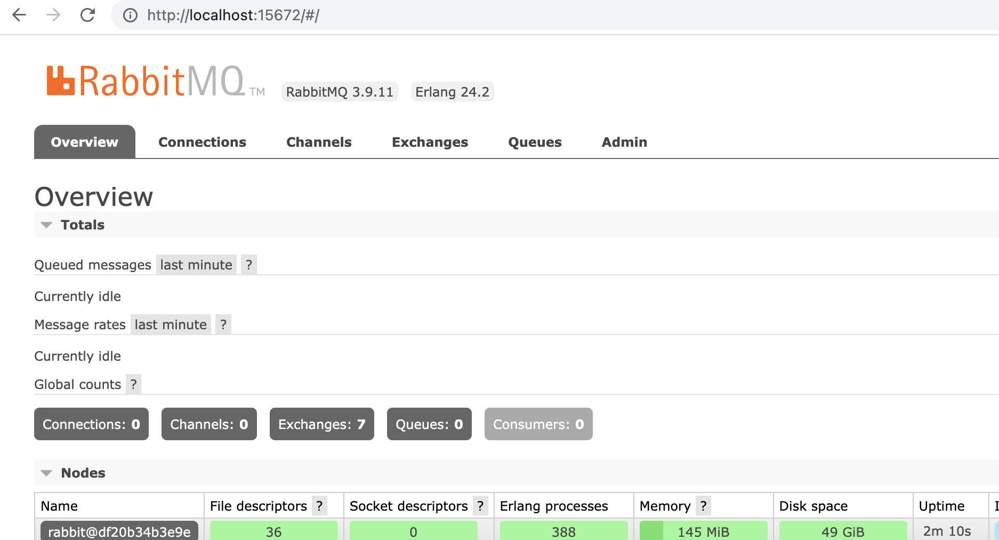
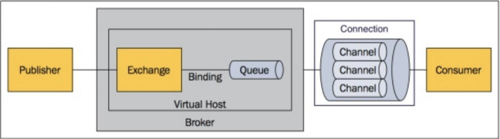
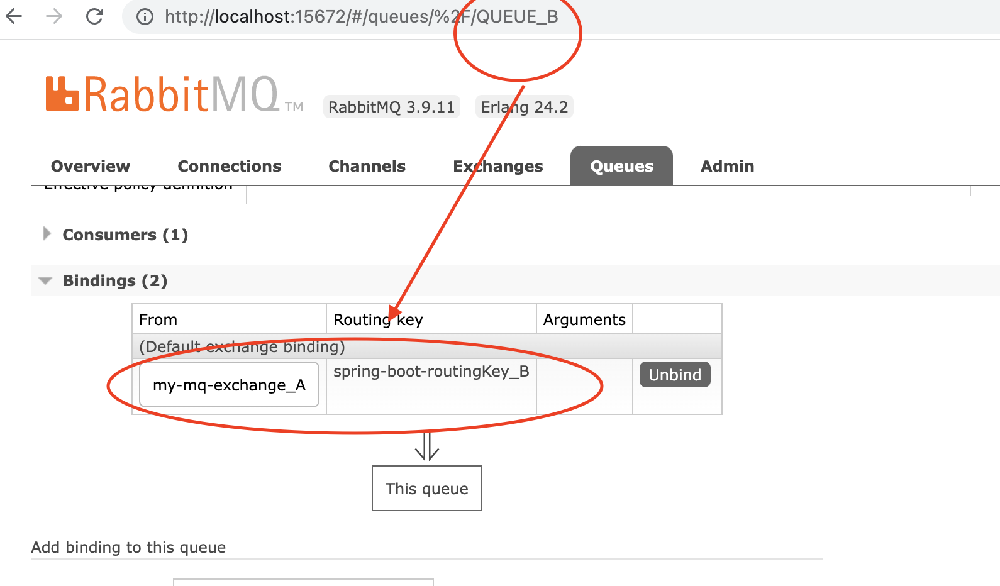

# 分布式消息：其他MQ介绍与动手写MQ

[toc]

## 一、概览

- 主流的MQ：RabbitMQ、RocketMQ
- Pulsar、EIP
- 动手写一个MQ

## 二、RabbitMQ

目前大家熟悉的最多的就是RabbitMQ，因为RabbitMQ作为第一代MQ里，性能相对比较好的。早期的业务系统，用activeMQ，然后发现ActiveMQ性能不行。好多人都选择了基于erlang的RabbitMQ。

旧的业务系统，RabbitMQ存量比较大。近十年，大家使用Kafka比较多。

> kafka应该是全世界，使用量最大的MQ。

### 2.1 安装RabbitMQ

#### （1）第一种安装方式，直接在电脑上安装：

在windows上安装一个chocolatey： https://chocolatey.org/，它和mac上的brew，linux上的yum是一样的。

```shell
-- macos 
brew install rabbitmq

-- linux
apt/yum install rabbitmq-server

-- windows
choco install rabbitmq
```

如果是自己安装的，可以（通过命令）把这个管理控制台打开：

> rabbitmq-plugins enable rabbitmq_management

#### （2）第二种安装方式，docker方式

注意：dockder拉取的时候，如果不带“:management”，就是个纯的server，这个server没有可以看到的管理控制台的界面。

还需要注意，在启动rabbitmq的时候，需要做两个端口的映射，一个是5672，一个是15672。

> 5672 是rabbitmq的，15672 是控制台的端口。

```shell
-- 注意不带后缀就不会有web控制台 
sudo docker pull rabbitmq:management
-- 运行一个rabbitmq的容器，指定两个端口映射，并且可以指定用户名和密码
sudo docker run -itd --name rabbitmq-test -e RABBITMQ_DEFAULT_USER=admin -e RABBITMQ_DEFAULT_PASS=admin -p 15672:15672 -p 5672:5672 rabbitmq:management 
```

在docker上启动了rabbitmq，就可以登录管理界面了：http://localhost:15672/#/

就可以在上面进行一些操作了。



如果不使用管理控制界面，我们可以直接使用命令行的方式：

```shell
-- 进入容器
$ sudo docker exec -it rabbitmq-test /bin/bash
-- 查看队列
root@df20b34b3e9e:/# rabbitmqctl list_queues
Timeout: 60.0 seconds ...
Listing queues for vhost / ...

-- 查看mq的状态
rabbitmqctl status

-- 通过命令行创建队列
root@df20b34b3e9e:/# rabbitmqadmin declare queue name=lf01 -u admin -p admin
queue declared

-- 查看队列是否已经完全创建出来
root@df20b34b3e9e:/# rabbitmqctl list_queues
Timeout: 60.0 seconds ...
Listing queues for vhost / ...
name	messages
lf01	0

-- 查看队列里的信息（现在队列里没有数据，有数据就可以看到了）
root@df20b34b3e9e:/# rabbitmqadmin get queue=lf01 -u admin -p admin
No items
root@df20b34b3e9e:/#
```

### 2.2 RabbitMQ 的核心概念

#### （1）RabbitMQ的整体架构

queue/exchange/routekey/binding

- 消息的生产者（Publisher）把消息发送到一个交换器里（Exchange）

  > Exchange， 交易所

- 再通过Exchange路由到具体的Queue里；

- Queue里的数据，然后再给我们的消费者；



#### （2）RabbitMQ和ActiveMQ、Kafka在概念上的区别

queue/exchange/routekey/binding

对于所有的生产者（Publisher）来说，它不是按照Queue或Topic的维度来组织的。上面的图中，虽然叫Queue，但它实际上Queue和Topic都支持，默认是Queue。

另外，为什么RabbitMQ里有一个Exchange的概念？它早期做了一些EIP等集成等事情在里面。

- 它定义了这几个东西，生产者（Publisher）在发送消息的时候，需要制定你发送到哪个Exchange里，如果不指定，会有一个默认的Exchange。

- 每个Exchange背后可以绑定一堆的Queue（或topic）。

- 然后它会根据你在Exchange上指定的条件（比如Exchange的类型，或Routing的key），根据这些条件分发到对应的queue里。

  > 这个东西相当于kafka里多个partition。

相当于它做了一些路由分发，集成的策略，在这个borker的内部。

我们现在，一般情况下，我们更倾向于，把这些路由的策略（怎么做哈希的策略），或者说是决定最终要去的那个最终提供服务的队列，这个路由操作放在客户端（消息生产者这里来做）。

这是RabbitMQ和现代MQ最大的不同。

### 2.3 spring-amqp操作rabbitmq演示

amqp 的客户端是通用的，只要开了amqp端口的mq，都可以访问。

```xml
        <dependency>
            <groupId>org.springframework.boot</groupId>
            <artifactId>spring-boot-starter-amqp</artifactId>
        </dependency>
```

配置：

> 四大块：ip、端口、用户名、密码

```yaml
spring:
  rabbitmq:
    host: localhost
    username: admin
    password: admin
    port: 5672
```

1、spring-amqp 封装好了 Template

根据exchange和routingKey 来匹配到对应的queue上。

也就是说，

- 我指定不同的exchange（不指定routingkey），就能把消息发送到不同的queue上；
- 我也可以指定同一个exchange，但指定不同的routingKey，也可以把消息发送到不同的queue上；

```java
    @Bean
    public Binding bindingA() {
        return BindingBuilder.bind(queueA()).to(defaultExchange()).with(RabbitConfig.ROUTINGKEY_A);
    }
```

具体详细点内容可以参考：

> https://blog.csdn.net/qq_38455201/article/details/80308771
>
> https://www.cnblogs.com/handsomeye/p/9135623.html

演示将消息发送给EXCHANGE_A + ROUTINGKEY_B。

运行控制台，发现名称为QUEUE_B的queue接收到了消息，可以看到QUEUE_B和路由的绑定关系如下：



还可以看到一些语法糖：

> @RabbitListener， 相当于EventBus的语法糖。

可以在管理界面，手动添加绑定信息。

RabbitMQ想要做的事情是，让发送消息和接收消息完全解耦，消息都发送到交换区，但消息具体会到哪些Queue里，通过管理控制台就能控制的。

所以开发者、运维者、和管理控制这个MQ中间件消息关系的人，可以指定不同的人。

程序代码不用改，改一下管理控制台，一些行为和状态就变了。

可以把RabbitMQ是对ActiveMQ的改造。

交互区这个东西，完全是个工具人，消息过来后，它负责在broker（server）内部把消息丢到对应的内部去，它的使命就完成了。

> 消息只要到队列里，消息就和exchange、RoudingKey没任何关系了。

