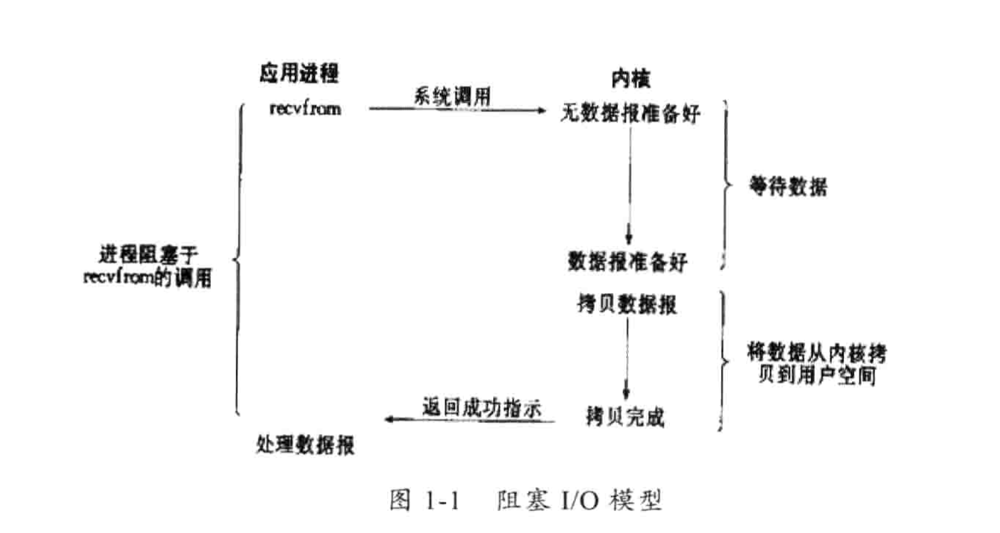
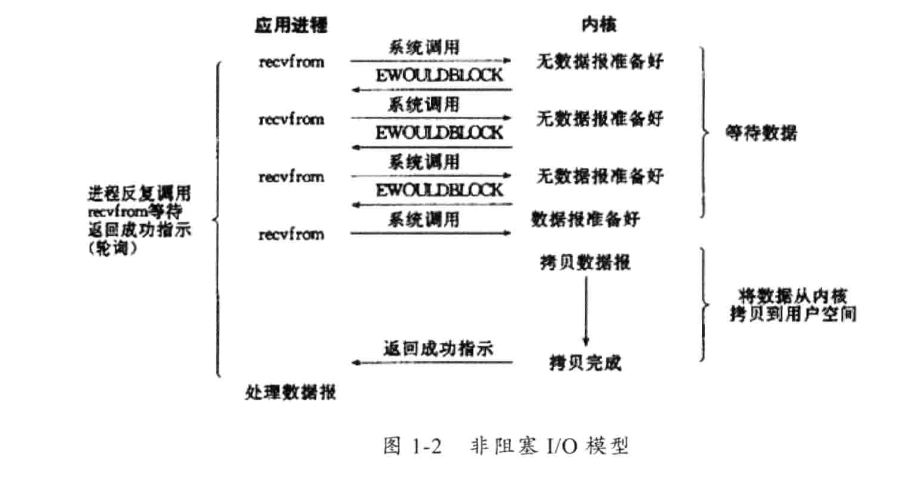
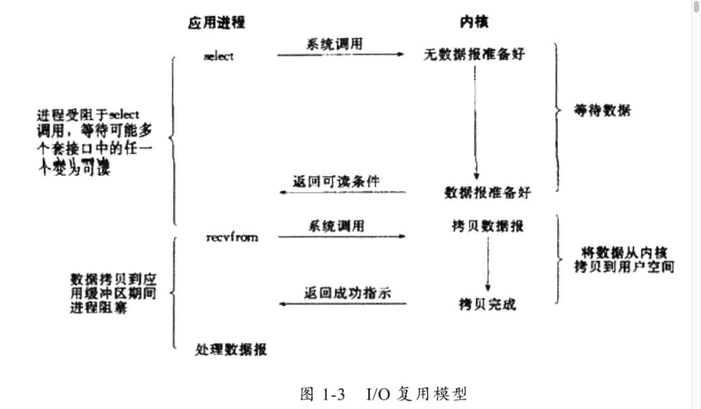
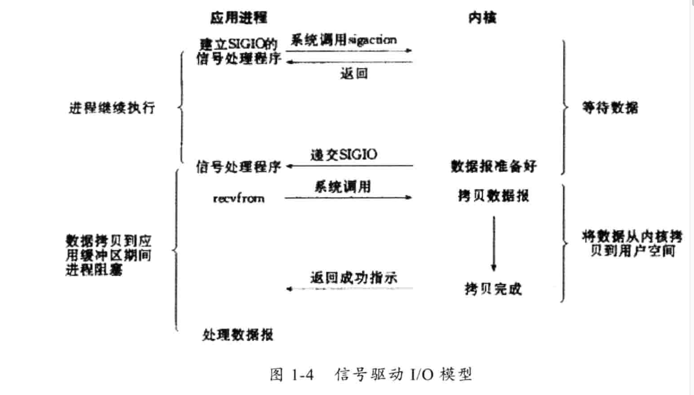
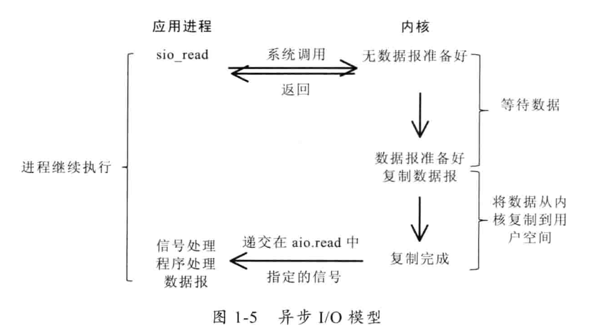

# Unix 网络IO模型

[toc]

## 一、几个重要的概念

在Unix网络IO模型中，有几个比较重要的概念：用户空间、内核空间、用户态、内核态、文件描述符。

### 1.1 文件描述符

文件描述符在形式上是一个非负整数。实际上，它是一个索引值，指向[内核](https://zh.wikipedia.org/wiki/内核)为每一个[进程](https://zh.wikipedia.org/wiki/进程)所维护的该进程打开文件的记录表。

### 1.2 内核空间、用户空间、用户态、内核态

Linux系统中，为了进程之间互不影响，不让进程直接操作真实的物理内存，而是为每个进程分配虚拟内存地址（虚拟地址空间、寻址空间）。这个虚拟地址空间又被分为两部分：内核空间（四分之一）、用户空间（四分之三），内核空间是所有进程公用的。

所有的系统资源管理都是在内核空间完成。比如读写磁盘文件，分配回收内存，从网路接口读取数据等等。

内部输入--->内核空间---->用户空间---->用户进程

用户进程输入--->  用户空间----> 内核空间----> 外部

## 二、Unix网络IO模型

Unix提供了5种IO模型：阻塞IO、非阻塞IO、IO多路复用、信号驱动IO、异步IO。前四种都是同步IO、最后一个是异步IO。

### 2.1 阻塞IO

阻塞IO的工作流程：

1. 应用进程发起系统调用；
2. 阻塞等待内核准备好数据，直到数据在内核空间准备好，应用进程继续等待系统调用执行；
3. 系统调用将数据从内核空间拷贝到用户空间后，应用进程开始处理其他任务；

### 2.2 非阻塞IO

非阻塞IO的工作流程：

1. 应用进程发起系统调用，如果内核没有准备好数据，**不阻塞**立刻返回；
2. 返回后应用进程可以做其他事情，但应用进程需要不断发起系统调用，询问数据是否准备好；
3. 当某次系统调用得知数据准备好了，应用进程就会等待系统调用执行，直到数据从内核空间拷贝到用户空间，之后进程可以继续其他工作；

### 2.3 IO多路复用

IO多路复用（又叫事件驱动IO），工作流程如下：

> 当应用进程自己不再发起系统调用，而是把系统调用交给select/poll/epoll 机制。

1. 应用进程把一个或多个**文件描述符**交给select/poll/epoll；
2. select/poll/epoll 通过文件描述符帮助应用进程检测数据报是否准备好，这个过程应用进程可以去干其它事情；
3. 当select/poll/epoll监测到某个文件描述符有数据包准备好了，会通知应用进程；
4. 然后应用进程等待系统调用执行，执行完成之后，应用进程再去干其他事情；

select、poll、epoll的区别：

|            | select                                                   | poll                                                   | epoll                                                        |
| ---------- | -------------------------------------------------------- | ------------------------------------------------------ | ------------------------------------------------------------ |
| 操作方法   | 遍历                                                     | 遍历                                                   | 回调                                                         |
| 底层实现   | 数组                                                     | 链表                                                   | 哈希表                                                       |
| IO效率     | 每次调用都进行线性遍历， 事件复杂度为O(n)           | 每次调用都进行线性遍历， 事件复杂度为O(n)         | 事件通知方式，每当fd就绪， 系统注册的回调函数就会被通知， 将就绪fd放到rdlist里面。 事件复杂度O(1) |
| 最大连接数 | 1024（x86）或2048（x64）                                 | 无上限                                                 | 无上限                                                       |
| fd拷贝     | 每次调用select， 都需要把fd集合从用户态拷贝到内核态 | 每次调用poll， 都需要把fd集合从用户态拷贝到内核态 | 调用epoll_ctl时拷贝进内核并保存， 之后每次epoll_wait不拷贝。 |

### 2.4 信号驱动IO

信息驱动IO到工作流程：

1. 应用进程发出一个信号，后直接返回，等待内核准备好数据；
2. 数据准备好后，应用进程收到一个信号；
3. 应用进程等待数据从内核空间拷贝到用户空间，然后再干其他事儿；

### 2.5 异步IO

异步IO的工作流程如下：

1. 应用进程发起系统调用后，立刻返回去干其他事情；
2. 内核等待数据准备好，并将数据从内核空间拷贝到用户空间，然后发信号通知应用进程数据已经拷贝完成；
3. 应用进程收到信号后，继续其他任务；

