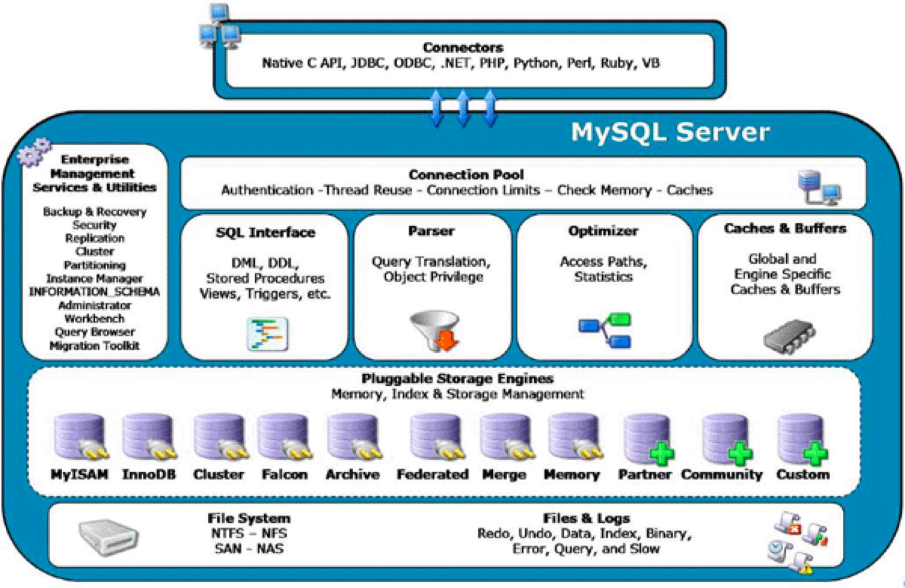
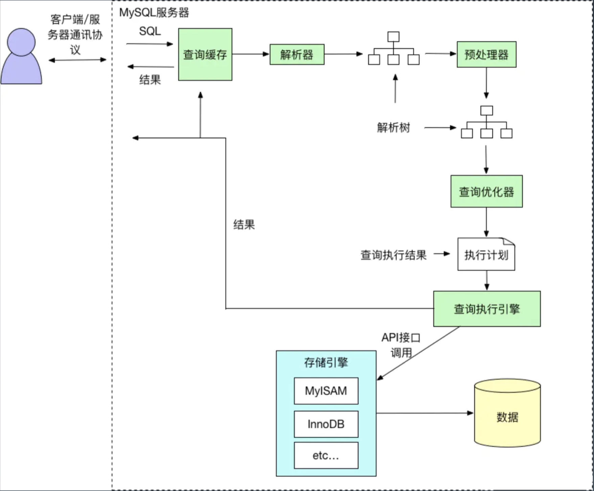
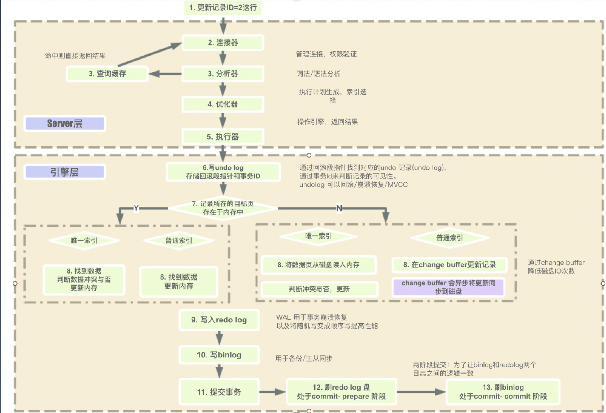
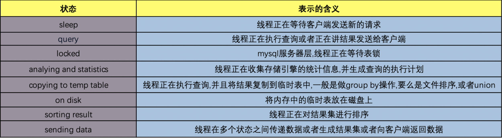
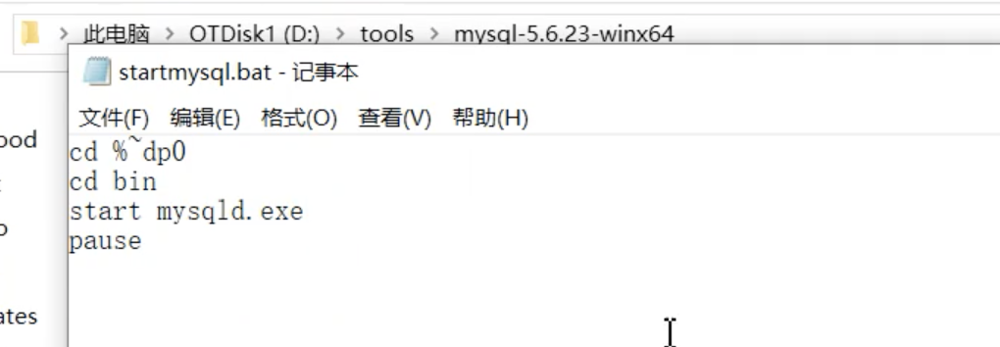

# SQL和性能优化

[toc]

## 一、性能

### 1.1、什么是性能

高可用、稳定性、可维护性(开发成本高低)

#### (1) 吞吐和延迟

#### (2) 没有量化就没有改进

很多时候要从客户的角度定指标。

#### (3) 80/20原则

数据库SQL/缓存的优化就是那重要的20%。

#### (4) 过早的优化是万恶之源

优化要考虑其带来的收益

#### (5) 脱离场景谈性能都是耍流氓

### 1.2 业务系统

**DB/SQL优化是业务系统优化的核心。**

举例：传统软件改成SaaS软件

从单机变成web多租户，难度指数级升级。

> Saas：功能软件从单机版变成web多租户；
>
> Paas：平台即服务，谷歌的GAE、新浪的SAE。可以自己去部署应用
>
> Laas：云平台，公有云或私有云；拿到的就是一台机器
>
> Faas： ServeLess，写一个代码片段，丢过去，就能跑起来；（大趋势）
>
> Daas： 数据即服务。 还在发展中

## 二、MySQL数据库

### 2.1 什么是关系型数据库

### （1）以关系代数理论为数学基础。

关键概念：元组

关系模型、关系代数、E-R图

### （2）什么是数据库的范式

数据库设计范式（怎么来设计数据库）：

- 1NF:   每一列都是原子性，即每一列都是不可再分的基本数据项；
- 2NF：消除部分依赖。（每一行都有主键，其他列都与主键有关联）；
- 3NF：表与表之间都用主键关联。
- BCNF：拆表
- 4NF：消除非平凡的多值依赖
- 5NF：消除不合适的依赖。（比如：学生）

有时候适当的冗余有助于查询效率。

### 2.2 常见的关系型数据库

开源的：MySQL、PostgreSQL

内存数据库：H2

NoSQL数据库：MongoDB

分布式数据库：TiDB（国内）

### 2.3 SQL 语言

#### （1）六部分

- DQL 数据查询语言
- DML 数据操作语言： INSERT、UPDATE、DELETA
- TCL 事务控制语言
- DCL 数据控制语言
- DDL 数据定义语言: CREATE、ALERT、DROP
- CCL  指针控制语言

> 典型的SQL 解析：
>
> 1. 手写：druid；mycat用的就是druid
> 2. antlr4：shardingsphere
> 3. yacc：mysql自己，tidb

《千亿数据的潘多拉魔盒：从分库分表到分布式数据库.pdf》中提到了很多比较实用的分库分表的技术，有空的时候多看看。

```
作业：

语法树，AST
```

### 2.4 MySQL的演化

- 4.0 支持事务
- 5.6 历史使用最多的版本
- 5.7 近期使用最多的版本
- 8.0  最新和功能完善的版本

5.6/5.7区别

5.7支持：

- 多主
- MGR高可用
- 分区表
- json
- 性能
- 修复XA等

5.7/5.8 区别：

- 通用表达式
- 窗口函数：专门用来做分组和聚合
- 持久化参数
- 自增列序列化
- 默认编码为utf8mb4
- DDL原子性
- JSON增强
- 不再对group by进行隐式排序？

## 三、深入数据库的原理

### 3.1 MySQL架构图



### 3.2 MySQL存储：数据库的文件结构

#### 独占模式

1）日志组文件：ib_logfile0 和ib_logfile1，默认均为5M；

2）表结构文件：*.frm

3）独占表空间文件：*idb

4）字符集和排序规则文件：db.opt

5）binlog 二进制日志文件：记录主数据库服务器的DDL和DML操作

6）二进制日志索引文件：master-bin.index

#### 共享模式`innodb_file_per_table=1`

1）数据都在ibdata1

#### 其他

##### `information_schema` mysql的元数据库

```
库：information_schema 里面存放的相当于mysql的元数据
```

 `create database lf1;` 等价于`create schema lf2;`

`select table_name from information_schema.TABLES;` 可以看到所有库中，所有的表

##### 其他任意一个库，比如：test

默认不共享表空间的话，库的文件夹下的文件和表名是一一对应的。

tablenname.frm/tablename.idb/tablename.opt

##### 查看表结构

```mysql
show columns from edmers;
```

##### 查看表的创建语句

```
show create table edmers;
```

### 3.3 MySQL 执行流程

MySQL 简化版执行流程



MySQL详细执行流程



### 3.4 MySQL执行引擎和状态

| 存储引擎 | myisam | innodb | memory               | archive              |
| -------- | ------ | ------ | -------------------- | -------------------- |
| 存储限制 | 256TB  | 64TB   | 有（和内存大小有关） | 无（和磁盘大小有关） |
| 事务     | -      | 有     | -                    | -                    |
| 索引     | 支持   | 支持   | 支持                 | -                    |
| 锁的粒度 | 表锁   | 行锁   | 表锁                 | 行锁                 |
| 数据压缩 | 支持   | -      | -                    | 支持                 |
| 外键     | -      | 支持   | -                    | -                    |




### 3. 5 MySQL对SQL执行顺序


### 3.6 MySQL的索引原理

MySQL的数据是存在文件中的，默认每个表一个数据文件。有一个开关可以共享表空间，这个时候会把很多表放到一个数据文件中。

磁盘上，文件是有最小单位的，比较4k是文件系统的最小单位。

数据库设计有个原子的东西，假如，id=5这条数据被使用了，那么和它相临的id=4，id=6 的数据也很有可能被使用（这是个经验规律）。为了效率最高，我们一般不只单捞取条数据，而是把一个块的数据都捞出来。所以数据库里面的数据也是分块的，我们叫页。

默认数据的存储叫聚集索引（Innodb使用B+树实现聚集索引）。按照主键方式进行聚集存储到数据文件中的，这样的话，使用主键效率最高，也最快。

```
B树是一个改良版的红黑树；
B+树，在mysql中，节点存主键
```

思考：为什么一般表数据不超过2000万？

理想情况下，B+树的层级不超过3层。

```mysql
mysql> show variables like 'innodb_page_size';
+------------------+-------+
| Variable_name    | Value |
+------------------+-------+
| innodb_page_size | 16384 |
+------------------+-------+
1 row in set (0.02 sec)
```

```
1. bigint 在mysql中占8个字节，指针大小在mysql中是6个字节，这样在B+树中，页的一个单元占14个字节。
2. 一个页在mysql中，默认是16k。16k/14 = 1170，这样一个页最多放1170个主键。
单个叶子节点（页）中的记录数=16K/1K=16。（这里假设一行记录的数据大小为1k，实际上现在很多互联网业务数据记录大小通常就是1K左右）
一棵高度为2的B+树，这样可以放 16 * 1170 = 18720 条数据。也就是说，不超过18720条数据，B+树的索引只有两层，超过了就得三层。
三层的B+树可以放多少数据呢？
1170 * 1170 * 16 = 21902400
```

详细可以看《千亿数据的潘多拉魔盒：从分库分表到分布式数据库.pdf》

### 3.7 MySQL 的安装方式

#### （1）安装的几种方式：

安装文件或命令，免安装的解压包，docker

```
-- 拉取mingsql
docker pull mysql
```


#### （2）操作工具

mysql-cli、IDE(DataGrip、MySQL-WorkBench、MySQL-Front、Navicat等)

#### （3）mysql的操作命令

```
mysql -hlocalhost -P3306 -uusername -p
```


mysql有免安装的解压包

> mysqld 

docker



### 3.7 MySQL  参数

能动小规模动，但不要大规模动。

关于这些参数，要看《千亿数据的潘多拉魔盒：从分库分表到分布式数据库.pdf》

将mySQL所有参数打印出来

```mysql
mysql -hlocalhost -P3306 -uroot -p -e "show variables;">./mysql_variables.txt
```

#### （1） my.cnf

```
[mysqld]
mysql服务端参数

[mysql]
mysql客户端参数
```

####（2）连接请求的变量

- 【重要】`max_connections` 最大连接数，最最关键的。不建议开太大，5000或10000已经非常大了
- `back_log`
- `wait_timeout`和`interative_timeout`

#### （3）缓冲区参数，涉及性能

- `key_buffer_size`
- 【重要】`query_cache_size` （查询缓存简称QC）查询能缓存的大小，和这个参数直接相关
- `max_connect_errors`
- `sort_buffer_size`
- `max_allowed_packet=32M`

- `join_buffer_size=2M`
- `thread_cache_size=300`

#### （4）配置Innodb的几个变量

- 【重要】`innodb_buffer_pool_size`
- `innodb_flush_log_at_trx_commit`
- 【重要】`innodb_thread_concurrency=0`
- 【重要】`innodb_log_buffer_size`
- `innodb_log_file_size`
- `innodb_log_files_in_group=3`
- `read_buffer_size=1M`
- `read_rnd_buffer_size=16M`
- `bulk_insert_buffer_size=64M` 批量写的缓存
- `binary_log`

思考：为什么MySQL，内存越大、CPU核数越高，性能越好？

> CPU越大，并发操作效果更好；内存越大，缓存可以开得更大

MySQL技术内幕

《数据库系统全书》

《数据密集型应用系统设计》

### 3.8 数据库设计优化

《mysql规范》

#### （1）引擎的选择

#### （2）表名如何命名？

#### （3）如何合理拆分宽表？

#### （4）如何恰当选择数据类型：明确（长度固定）、尽量小

越明确，数据库引擎越知道该怎么处理它

- char、varchar的选择：
- （text/blob/clob）的使用问题？这三个字段尽量少用，因为它们非常影响性能
- 文件、图片是否存入数据库？不建议将文件、图片存入数据库。会打破B+树块的存储
- 时间日期的存储问题？一定注意时区，默认UTC。建议存储时间戳，对计算友好
- 数值的精度问题？ float不精确，解决精度丢失的问题：可以将浮点数*10的倍数 转化成int，用的时候再除以10的倍数

#### （5）是否使用外键、触发器？

绝大时候都不建议使用外键和触发器。通过程序来保证。

触发器引入了不确定性。

#### （6）唯一约束和索引的关系

唯一约束本身就是索引

#### （7）是否可以冗余字段

适当加冗余字段是可以的

#### （8） 是否使用游标、变量、视图、自定义函数、存储过程？

不建议使用

#### （9）自增主键的使用问题？

自增主键在单表中可以使用，但在分布式数据库中不建议使用

#### （10）在线修改表结构（DDL）？

夜深人静的时候做

#### （11）逻辑删除还是物理删除？

重要数据都只建议逻辑删除

#### （12）要不要加`create_time`、`update_time`

非常建议加

#### （13）数据库碎片问题

通过mysql优化命令进行压缩，建议夜深人静了做

#### （14）如何快速导入导出，备份数据？

使用原生命令

先把索引、外键、约束去掉