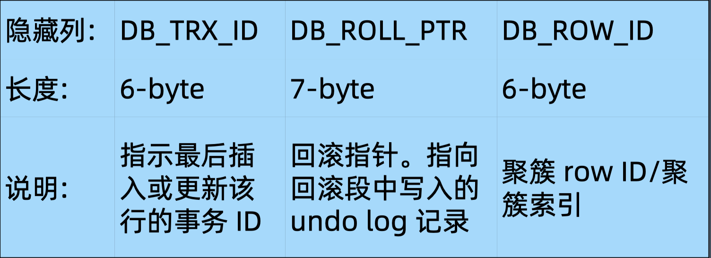

# MySQL事务

[toc]

## 一、MySQL事务与锁

### 1.1 事务可靠性模型 ACID

- Atomicity: 原子性, 一次事务中的操作要么全部成功, 要么全部失败
- Consistency: 一致性, 跨表、跨行、跨事务, 数据库始终保持一致状态
- Isolation: 隔离性, 可见性, 保护事务不会互相干扰, 包含4种隔离级别
- Durability:, 持久性, 事务提交成功后,不会丢数据。如电源故障, 系统崩溃

> MySQL的事务，主要由InnoDB来保证


### 1.2 锁

### （1）表级锁

意向锁: 表明事务稍后要进行哪种类型的锁定

•共享意向锁(IS): 打算在某些行上设置共享锁

排他意向锁(IX): 打算对某些行设置排他锁

Insert 意向锁: Insert 操作设置的间隙锁

其他
自增锁(AUTO-IN)

LOCK TABLES/DDL

查看锁的状态：

```
SHOW ENGINE INNODB STATUS;
```


### （2）行级锁(InnoDB)

记录锁(Record): 始终锁定索引记录，注意隐藏的聚簇索引;

间隙锁(Gap):
临键锁(Next-Key): 记录锁+间隙锁的组合; 可“锁定”表中不存在记录

谓词锁(Predicat): 空间索引

> 间隙锁：锁的是范围。  update、delete 尽量不要加范围，否则产生间隙锁。

### （3）死锁

-阻塞与互相等待

-增删改、锁定读

-死锁检测与自动回滚

-锁粒度与程序设计

### 1.3 四种常见的隔离级别

-  读未提交: READ UNCOMMITTED

- 读未提交: READ UNCOMMITTED

- 可重复读: REPEATABLE READ
- 可串行化: SERIALIZABLE

事务隔离是数据库的基础特征。

> 隔离级别的选择，影响“并发性、可靠性、一致性、可重复性”。

MySQL:

- 可以设置全局的默认隔离级别

- 可以单独设置会话的隔离级别

- InnoDB 实现与标准之间的差异

  > MySQL默认的隔离级别是 REPEATABLE READ， 而其他数据库默认隔离级别是 READ UNCOMMITTED。

### （1）读未提交: READ UNCOMMITTED

- 很少使用

- 不能保证一致性
- 脏读(dirty read) : 使用到从未被确认的数据(例如: 早期版本、回滚)

锁:

- 以非锁定方式执行
- 可能的问题: 脏读、幻读、不可重复读

### （2）读已提交: READ COMMITTED

- 每次查询都会设置和读取自己的新快照。
- 仅支持基于行的 bin-log
- UPDATE 优化: 半一致读(semi-consistent read)
- 不可重复读: 不加锁的情况下, 其他事务 UPDATE 或 DELETE 会对查询结果有影响
- 幻读(Phantom): 加锁后, 不锁定间隙, 其他事务可以 INSERT。

锁:

- 锁定索引记录, 而不锁定记录之间的间隙
- 可能的问题: 幻读、不可重复读

### （3） 可重复读: REPEATABLE READ

- MySQL InnoDB 的默认隔离级别
- 使用事务第一次读取时创建的快照
- 多版本技术

锁:

- 使用唯一索引的唯一查询条件时, 只锁定查找到的索引记录, 不锁定间隙。

- 其他查询条件, 会锁定扫描到的索引范围, 通过间隙锁或临键锁来阻止其他会话在这个 范围中插入值
- 可能的问题: InnoDB 不能保证没有幻读, 需要加锁

### （4）串行化: SERIALIZABLE

最严格的级别，事务串行执行，资源消耗最大；


问题回顾:

- 脏读(dirty read) : 使用到从未被确认的数据(例如: 早期版本、回滚)
- 不可重复读: 不加锁的情况下, 其他事务 update 或 delete 会对结果集有影响
- 幻读(Phantom): 加锁之后, 相同的查询语句, 在不同的时间点执行时, 产生不同的 结果集

怎么解决?

>  提高隔离级别、使用间隙锁或临键锁

### 1.4 事务的支撑

### （1）undo log: 撤消日志

> 分布式事务的原理也是这个

- 保证事务的原子性
- 用处: 事务回滚, 一致性读、崩溃恢复。
- 记录事务回滚时所需的撤消操作
- 一条 INSERT 语句，对应一条 DELETE 的 undo log
- 每个 UPDATE 语句，对应一条相反 UPDATE 的 undo log

保存位置:

- system tablespace (MySQL 5.7默认)  系统表空间
- undo tablespaces (MySQL 8.0默认)  单独放置

回滚段(rollback segment) ：后面会说

### （2）redo log: 重做日志

> 保证数据即持久化，又速度比较快

- 确保事务的持久性，防止事务提交后数据未刷新到磁盘就掉电或崩溃。
- 事务执行过程中写入 redo log,记录事务对数据页做了哪些修改
- 提升性能: WAL(Write-Ahead Logging) 技术, 先写日志, 再写磁盘
- 日志文件: ib_logfile0, ib_logfile1
- 日志缓冲: innodb_log_buffer_size
- 强刷: fsync()


### （3）MVCC 多版本并发控制

- 使 InnoDB 支持一致性读: READ COMMITTED 和 REPEATABLE READ
- 让查询不被阻塞、无需等待被其他事务持有的锁，这种技术手段可以增加并发性能
- InnoDB 保留被修改行的旧版本
- 查询正在被其他事务更新的数据时，会读取更新之前的版本
- 每行数据都存在一个版本号, 每次更新时都更新该版本
- 这种技术在数据库领域的使用并不普遍。 某些数据库, 以及某些 MySQL 存储引擎都不支持


聚簇索引的更新 = 替换更新

二级索引的更新 = 删除+新建


#### MVCC 实现机制

- 隐藏列

  > 每个事务需要有一个不断变化的版本号（时钟），比我版本高的数据，我不应该看到。

- 事务链表， 保存还未提交的事务，事务提交则会从链表中摘除

- Read view: 每个 SQL 一个, 包括 rw_trx_ids, low_limit_id, up_limit_id, low_limit_no 等

- 回滚段: 通过 undo log 动态构建旧版本数据

  > 类比：每个事务都是git上的一个commit，通过commit先后确定数据版本



### 1.5 事务和锁的演示

#### 第一个客户端

```
create table test.lockt(
id int(11) primary key,
col1 int(11),
col2 int(11)
) engine=InnoDB;

insert into lockt(id, col1, col2) values(1,1,1),(2,2,2),(3,3,3),(4,4,4),(5,5,5),(6,6,6),(7,7,7),(8,8,8);

-- 将自动事务关掉
set autocommit=0;
-- 开启一个事务
begin;

-- 第一个客户端先执行，查询上锁
select * from lockt where id=8 for update;

-- rollback, 去掉锁
rollback;

-- 第二次
update lockt set col2=133 where col2<5;

select from lockt;

-- 第三次，尝试锁范围
select * from lockt where id>7 for update;

-- 死锁演示
select * from lockt where id=8 for update;
update lockt set id=11 where id=7;
```

#### 第二个客户端

```
set autocommit=0;

begin;
--第二个客户端执行，发现被锁住了
update lockt set id=10 where id=8;

-- 第二次，同样被卡住
update lockt set col2=131 where col2<5;

-- 第三次
update locket set id=11 where id=8;

-- 死锁演示
select * from lockt where id=7 for update;
update lockt set id=12 where id=8;
```

#### 第三个客户端

```
-- 查看锁的状态
show engine innodb status\G;


```

