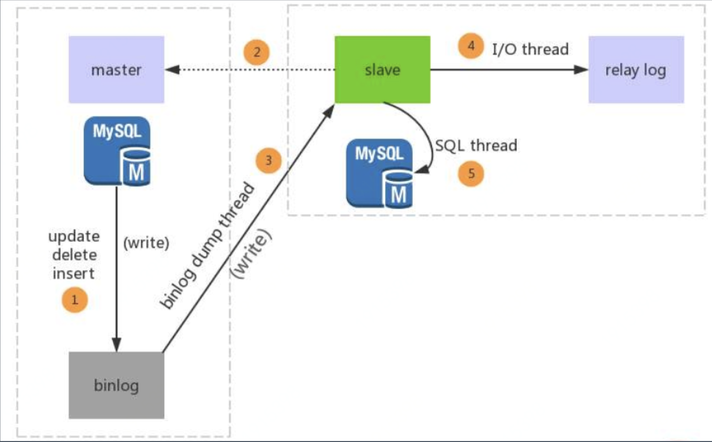
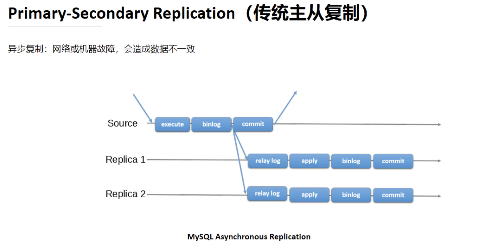

# MySQL 高可用和读写分离

[toc]

##  一、从单机到集群

### 1.1 单机MySQL数据库到几个问题

随着数据量的增大，读写并发的增加，系统可用性要求的提升，单机 MySQL 面临：

1. 容量有限，难以扩容；

2. 读写压力，QPS 过大，特别是分析类需求会影响到业务事务；

   - QPS 每秒查询率。

   - TPS 吞吐量，指系统在单位时间内处理请求的数量

     > 一般业务系统，要求TPS能达到5k～8k

3. 可用性不足，宕机问题

   不可靠

### 1.2 单机MySQL到技术演进

（1）读写压力==》多机机群==》主从复制

（2）高可用===》故障转移==》MHA/MGR/Orchestrator

（3）容量问题=》数据库拆分=》分库分表

> 垂直拆分、水平拆分

**通过操作N个数据库，如何保证数据库多一致性？**

（通过上面的技术演进带来的副作用）

（4）一致性问题=》分布式事务=》XA/柔性事务

解决方案：分布式事务，

具体做法：XA/柔性事务

> 如果XA对性能影响太大，可以考虑用柔性事务

再往后就是分布式数据库了。

## 二、MySQL的主从复制

### 2.1 核心

1. 主库写binlog；
2. 从库relay log；

> 2000年，MySQL 3.23.15版本引入了复制
>
> 2002年，MySQL 4.0.2版本分离 IO 和 SQL 线程，引入了 relay log
>
> 2010年，MySQL 5.5版本引入半同步复制
>
> 2016年，MySQL 在5.7.17中引入 InnoDB Group Replication

### 2.2 binlog

binlog 的格式有三种形式：

（1）Row

第一种方式，记录行内容，非常精确，但可能会导致日志变得特别大。不仅包含需要改的信息，还包含上下文信息。

（2）Statement

第二种方式，记录SQL（insert、update、delete）。

（3）Mixed

第三种方式，混合上面两种形式。

怎么查看binlog？

mysql文件夹下，有很多类型mysql-bin.000005这样的文件，通过命令行：`mysqlbinlog -vv mysqlbin.000005`进行查看。

### 2.3 方案一，异步复制：传统主从复制

异步复制：传统主从复制--2000年，MySQL 3.23.15版本引入了 Replication

Primary-Secondary Replication 传统主从复制：

主库（Source）：执行SQL（execute）----->（在事务提交(commit)之前）记录binlog------>提交（commit）

从库（Replica1）：relay log（从主库拉取binlog，有偏移量，类似消息队列）----->应用(apply)--->binlog--->提交

**异步复制（这个都是异步的）：网络或机器故障，会造成数据不一致。**

