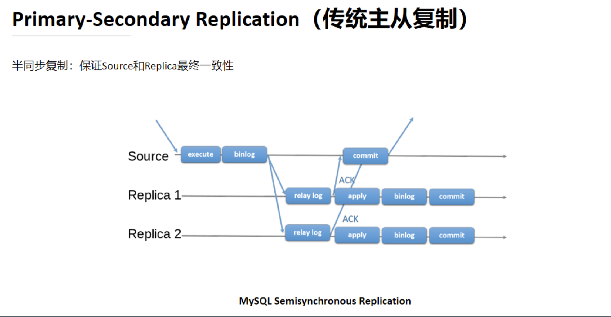
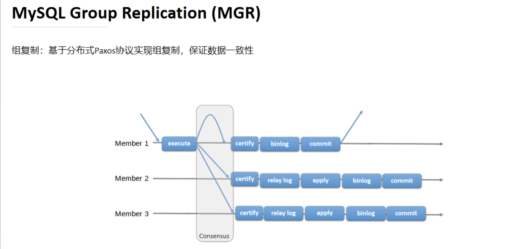
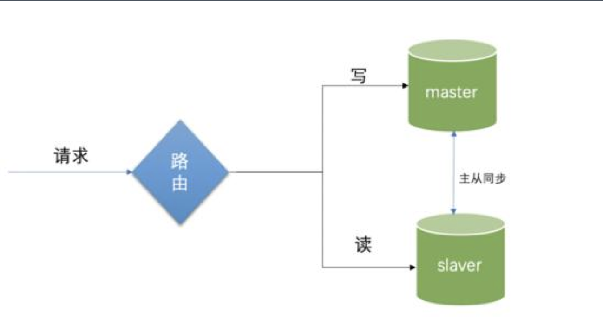

# MySQL 高可用和读写分离

[toc]

##  一、从单机到集群

### 1.1 单机MySQL数据库到几个问题

随着数据量的增大，读写并发的增加，系统可用性要求的提升，单机 MySQL 面临：

1. 容量有限，难以扩容；

2. 读写压力，QPS 过大，特别是分析类需求会影响到业务事务；

   - QPS 每秒查询率。

   - TPS 吞吐量，指系统在单位时间内处理请求的数量

     > 一般业务系统，要求TPS能达到5k～8k

3. 可用性不足，宕机问题

   不可靠

### 1.2 单机MySQL到技术演进

（1）读写压力==》多机机群==》主从复制

（2）高可用===》故障转移==》MHA/MGR/Orchestrator

（3）容量问题=》数据库拆分=》分库分表

> 垂直拆分、水平拆分

**通过操作N个数据库，如何保证数据库多一致性？**

（通过上面的技术演进带来的副作用）

（4）一致性问题=》分布式事务=》XA/柔性事务

解决方案：分布式事务，

具体做法：XA/柔性事务

> 如果XA对性能影响太大，可以考虑用柔性事务

再往后就是分布式数据库了。


## 二、MySQL的主从复制

### 2.1 核心

1. 主库写binlog；
2. 从库relay log；

> 2000年，MySQL 3.23.15版本引入了复制
>
> 2002年，MySQL 4.0.2版本分离 IO 和 SQL 线程，引入了 relay log
>
> 2010年，MySQL 5.5版本引入半同步复制
>
> 2016年，MySQL 在5.7.17中引入 InnoDB Group Replication


### 2.2 binlog

binlog 的格式有三种形式：

（1）Row

第一种方式，记录行内容，非常精确，但可能会导致日志变得特别大。不仅包含需要改的信息，还包含上下文信息。

（2）Statement

第二种方式，记录SQL（insert、update、delete）。

（3）Mixed

第三种方式，混合上面两种形式。


怎么查看binlog？

mysql文件夹下，有很多类型mysql-bin.000005这样的文件，通过命令行：`mysqlbinlog -vv mysqlbin.000005`进行查看。

### 2.3 方案一，异步复制：传统主从复制

异步复制：传统主从复制--2000年，MySQL 3.23.15版本引入了 Replication

Primary-Secondary Replication 传统主从复制：

主库（Source）：执行SQL（execute）----->（在事务提交(commit)之前）记录binlog------>提交（commit）

从库（Replica1）：relay log（从主库拉取binlog，有偏移量，类似消息队列）----->应用(apply)--->binlog--->提交

**异步复制（这个都是异步的）：网络或机器故障，会造成数据不一致。**


### 2.4 方案二，半同步复制，需要启用插件

半同步：不管有多少个从库在复制，每个事务只要有一个从库告诉我 它已经拿到了我发给它的log，这个时候主库就提交了。也就是说，主库把提交延迟到至少有一个从库拿到了我发给它的消息（ACK）。

> 保证Source和Replica最终一致性（保证至少有一个从库和主库是同步的）



### 2.5 方案三：组复制，MySQL Group Replication（MGR）

组复制：基于分布式Paxos协议实现组复制，保证数据一致性。

通过协议的方式，保证主从一致。



### 2.6 主从复制的演示:Ubuntu

[windows系统演示](https://gitee.com/lf-ren/JavaRebuild/blob/main/Week_07_MySQL%E9%AB%98%E5%8F%AF%E7%94%A8%E5%92%8C%E8%AF%BB%E5%86%99%E5%88%86%E7%A6%BB/document/ms.md)

[从官网查询下载Ubuntu平台的mysql入口](https://cdn.mysql.com/archives/mysql-5.7/mysql-community-server_5.7.35-1ubuntu18.04_amd64.deb)

#### (1) 第一种方案：在一台ubuntu服务器上启动两个mysql

[在一台ubuntu服务器上启动两个mysql服务进行演示](https://gitee.com/lf-ren/JavaRebuild/blob/main/Week_07_MySQL%E9%AB%98%E5%8F%AF%E7%94%A8%E5%92%8C%E8%AF%BB%E5%86%99%E5%88%86%E7%A6%BB/2021-11-24-MySQL%E4%B8%BB%E4%BB%8E%E5%A4%8D%E5%88%B6%E6%BC%94%E7%A4%BA-%E5%9C%A8ubuntu%E4%B8%8A%E5%90%AF%E5%8A%A8%E4%B8%A4%E4%B8%AAmysql%E6%9C%8D%E5%8A%A1.md)，最终并没有演示成功，自己才想，原因是启动服务的时候，需要指定-S参数。尝试第二种方案，使用docker。

> 后来发现，失败的原因是配置副本节点的时候忘了执行 `START SLAVE; `, 执行之后就能成功了

#### (2) 第二种方案，在ubuntu服务器上利用docker启动两个mysql服务

[MySQL主从复制演示-在ubuntu服务器上利用docker启动两个mysql服务](https://gitee.com/lf-ren/JavaRebuild/blob/main/Week_07_MySQL%E9%AB%98%E5%8F%AF%E7%94%A8%E5%92%8C%E8%AF%BB%E5%86%99%E5%88%86%E7%A6%BB/2021-11-25-MySQL%E4%B8%BB%E4%BB%8E%E5%A4%8D%E5%88%B6%E6%BC%94%E7%A4%BA-%E5%9C%A8ubuntu%E6%9C%8D%E5%8A%A1%E5%99%A8%E4%B8%8A%E5%88%A9%E7%94%A8docker%E5%90%AF%E5%8A%A8%E4%B8%A4%E4%B8%AAmysql%E6%9C%8D%E5%8A%A1.md)。

补充：

> 数据库的标准实现中，有三层级：catelog、schema、database

### 2.7 MySQL的GTID

[**MySQL 设置基于GTID的复制**](https://blog.51cto.com/yueyinsha/2086045) ：是为了让所有 relay log，有个像链表一样的顺序；

> 在上面2.6 的演示中，relay log每一段之间没有任务联系，那么它在执行的时候，是否会严格按照事务的顺序，是不知道的。
>
> GTID的机制是：每次发送的一条事务，都会带一个，我下一个ID是啥。这样我的从库在做relay的时候，就会知道我这些事务相互之间的关系。

自己实践后，也补充了一篇博客：[MySQL主从复制：设置GTID复制](https://gitee.com/lf-ren/JavaRebuild/blob/main/Week_07_MySQL%E9%AB%98%E5%8F%AF%E7%94%A8%E5%92%8C%E8%AF%BB%E5%86%99%E5%88%86%E7%A6%BB/2021-11-27-MySQL%E4%B8%BB%E4%BB%8E%E5%A4%8D%E5%88%B6%EF%BC%9A%E8%AE%BE%E7%BD%AEGTID%E5%A4%8D%E5%88%B6.md)

### 2.8 半同步复制，以插件形式存在

参考：[MySQL 5.7半同步复制技术 ](https://www.cnblogs.com/zero-gg/p/9057092.html)

```
-- 查看插件
show plugins;
```

> /usr/local/mysql/lib/plugin/semisync_master.so
>
> /usr/local/mysql/lib/plugin/semisync_slave.so

自己也通过实践，写了一遍半同步复制的博客：[MySQL半同步复制的演示](https://gitee.com/lf-ren/JavaRebuild/blob/main/Week_07_MySQL%E9%AB%98%E5%8F%AF%E7%94%A8%E5%92%8C%E8%AF%BB%E5%86%99%E5%88%86%E7%A6%BB/2021-11-27-MySQL%E5%8D%8A%E5%90%8C%E6%AD%A5%E5%A4%8D%E5%88%B6%E6%BC%94%E7%A4%BA.md)

### 2.9 全同步复制，组复制（MGR），以插件形式存在

参考：[MGR安装配置](https://www.cnblogs.com/lvxqxin/p/9407080.html)

> /usr/local/mysql/lib/plugin/group_replication.so

### 2.10 主从复制的问题

- 主从延迟问题

  解决方案：数据分片，扩充整个数据库集群的容量，降低每个数据库的量，把数据库拆分，变小

- 应用侧需要配合读写分离框架；

- 不解决高可用问题

## 三、主从复制在业务系统里的应用——读写分离

### 3.1（实践）v1.0：读写分离 - 动态切换数据源

（1）、基于 Spring/Spring Boot，配置多个数据源(例如2个，master 和 slave)

（2）、根据具体的 Service 方法是否会操作数据，注入不同的数据源,1.0版本

（3）、改进一下1.1：基于操作 AbstractRoutingDataSource 和自定义注解 readOnly 之 类的，简化自动切换数据源

（4）、改进二下1.2：支持配置多个从库；

（5）、改进三下1.3：支持多个从库的负载均衡



这个版本的缺点：

- 侵入性强；
- “写完读”不一致问题，server方法，先向主库insert语句，然后立刻select，却查不出数据；

### 3.2（实践）v2.0：读写分离 - 数据库框架

改进v1.0，ShardingSphere-jdbc 的 Master-Slave 功能

1）SQL 解析和事务管理，自动实现读写分离

- 第一，将事务都管理起来；
- 第二，做SQL解析，自动实现读写分离；

2）解决”写完读”不一致的问题

- 如果在一个事务中，先写后读，该框架有个优化；在一个事务里，前几个都是毒，正常读就行，只要碰到一个写，后面不管有多少条读，都走主库。这样就完美解决了“写完读”不一致的问题。

这个版本的缺点：

- 对业务还是有侵入性（这一套东西，需要配置到业务代码中）；
- 对已存在的旧系统改造不友好；

### 3.3（实践）v3.0：读写分离 - 数据库中间件

改进v2.0， MyCat/ShardingSphere-Proxy 的 Master-Slave 功能

1）需要部署一个中间件，规则配置在中间件

2）模拟一个 MySQL 服务器，对业务系统无侵入

## 四、MySQL高可用

### 4.1 什么是高可用

高可用意味着，更少不可服务的时间，SLA

- SLA，服务水平协议，99.95%
- SLO

系统能够按照一定水平，提供服务的时间99.95

```
把计划内停机的时间排除掉：
1年 = 365 天 = 8760小时
99 = 8760 * 1% = 8760 * 0.01 = 87.6小时
99.9 = 8760 * 0.1% = 8760 * 0.001 = 8.76小时
99.99 = 8760 * 0.0001 = 0.876小时 = 0.876 * 60 = 52.6分钟
（很难做到）
99.999 = 8760 * 0.00001 = 0.0876小时 = 0.0876 * 60 = 5.26分钟
```

### 4.2 为什么要高可用（HA）

（1）、读写分离，提升读的处理能力；

（2）、故障转移，提供 failover 能力

容灾：热备与冷备

常见的一些策略：

1. 多个实例不在一个主机/积架上；

2. 跨机房和可用区部署；

3. “两地三中心”容灾搞可用方案：

   两地至少间隔800km，三中心：本地、同城、异地。

### 4.3 MySQL高可用版本0：主从手动切换

如果主节点挂掉，将某个从改成主； 重新配置其他从节点。 修改应用数据源配置。

问题：

1. 可能数据不一致；

   > 需要人工去检查数据一致性。如果主节点挂了，binlog又没同步过来，这个时候如果磁盘又挂了，数据就彻底丢失了；

2. 需要人工干预；

3. 代码和配置的侵入性

### 4.4 MySQL高可用版本1：主从手动切换

用 LVS+Keepalived 实现多个节点的探活+请求路由

配置 VIP 或 DNS 实现配置不变更（通过配置实现负载均衡）。

问题：

- 手工处理主从切换；
- 大量的配置和脚本定义；

### 4.5 MySQL高可用版本2：MHA

数据库中间件。

问题：

1. 需要配置 SSH 信息；
2. 至少3台；

### 4.6 MySQL高可用版本3：MGR *

如果主节点挂掉，将自动选择某个从改成主； 无需人工干预，基于组复制，保证数据一致性。

MGR插件。

> 不需要依赖外部东西。

需要读取数据库的方式，拿到主从信息。

好处：弹性扩展，可以不断添加节点。

我们需要做的事儿：

1. 观察mysql主从配置的表是否写数据了；
2. 去实验，直接把主库给停掉，再去看数据库的表里，是不是把主库信息改了；

### 4.7 MySQL高可用版本4：MySQL Cluster

在MGR的基础上，MySQL自己又做了一个MySQL Cluster。它内部除了MGR之外，提供了好多数据库管理的工具。

命令行工具、可视化工具、内置的中间件（MySQL router）

- MySQL Router上面可以配置路由、和负载均衡的策略。

  > 相当于 Shardingsphere-prexy


### 4.8 MySQL高可用版本5：Orchestrator

拓扑，可以拖拽。对自己做了高可用。


## 五、实践

[进阶实战-MySQL的高可用和读写分离](https://github.com/hefrankeleyn/JAVARebuild/blob/main/Week_07_MySQL%E9%AB%98%E5%8F%AF%E7%94%A8%E5%92%8C%E8%AF%BB%E5%86%99%E5%88%86%E7%A6%BB/2022-01-11-%E8%BF%9B%E9%98%B6%E5%AE%9E%E6%88%98-MySQL%E7%9A%84%E9%AB%98%E5%8F%AF%E7%94%A8%E5%92%8C%E8%AF%BB%E5%86%99%E5%88%86%E7%A6%BB.md)。

