# MySQL分布式事务

[toc]

## 一、为什么需要分布式事务

常用的分布式事务场景：

（1）进入分布式时代，我们数据库“横切竖割”进行拆分，在一个大的事务操作过程中，可能就会操作到几个不同的数据库实例的几个不同的表。这个时候我们就需要一种方案，解决不同数据库实例间的数据库一致性问题。

（2）对业务系统进行了服务化改造之后，各系统之间的访问走RPC，不是像以前那样走数据库了；

（3）有时候，是两个或多个服务用同一套数据库，有一个更大的系统同时调用这两个或多个服务，也会用到分布式事务；

## 二、如何实现分布式下的一致性

典型情况下是两个思路

1. 【强一致性事务】理想状态：直接想单机数据库事务一样，多个数据库自动通过某种协调机制，实现 了跨数据库节点的一致性。

   使用场景：要求严格的一致性，比如金融交易类业务。

2. 【柔性事务】一般情况：可以容忍一段时间的数据不一致，最终通过超时终止，调度补偿，等等 方式，实现数据的最终状态一致性。

   使用场景：准实时或非实时的处理，比如T+1的各类操作，或者电商类操作。（冲正）

数据库之外的事务。

1. 强一致性：XA

2. 弱一致性事务：柔性事务

   （1）不用事务，业务侧补偿冲正（比如：晚上跑数据，对数据进行修正。）；

   （2）所谓的柔性事务，使用一套事务框架保证最终一致的事务

**这两种都是在数据库基础上进一步做的封装和增强。**

## 三、XA分布式事务

### 3.1 XA分布式事务协议

- 基于第一个强一致的思路，就有了基于数据库本身支持的协议，XA分布式事务。

- XA整体设计思路可以概括为，如何在现有事务模型上微调扩展，实现分布式事务

> X/Open，即现在的 open group，是一个独立的组织，主要负责制定各种行 业技术标准。X/Open 组织主要由各大知名公司或者厂商进行支持，这些组 织不光遵循 X/Open 组织定义的行业技术标准，也参与到标准的制定。

（1）资源管理器（RM）：本地事务

这里的资源指的就是能执行本地事务的数据库。比如：单个本地的mysql数据库。

（2）全局的事务管理器（TM）

管理和协调事务。

（3）应用程序（AP）

三者之间的管理：

- 应用程序需要使用数据库，如果不是分布式事务，那就直接操作本地事务就可以了；
- 如果应用程序需要使用分布式事务，那就需要借助全局事务管理器（事务的边界、要做哪些操作）；
- 全局事务事务器来协调多个本地事务进行统一的提交或失败；

### 3.2 XA接口

XA和本地事务的操作流程很像。

本地事务的边界：begin........commit/rollback，中间的操作都在这个事务的上下文里。

- xa_start ：负责开启或者恢复一个事务分支

  启动一个XA事务

- xa_end： 负责取消当前线程与事务分支的关联

  表明事务中间的SQL操作执行完了。

- xa_prepare：询问 RM 是否准备好提交事务分支

  表明要开始做commit和rollback了。

- xa_commit：通知 RM 提交事务分支

  提交XA事务

- xa_rollback： 通知 RM 回滚事务分支

  回滚XA事务

- xa_recover : 需要恢复的 XA 事务

  因为多个本地事务间需要，协调，需要等，就出现了恢复事务的机制（重新做提交或回滚）。

XA有个中间状态。 单机事务不需要依赖外部资源，事务要么提交，要么回滚，没有第三种选择了。但XA不太一样，要等别的都准备好。这样就意味着，我开启一个事务，开启完了，通过xa_end 告诉mysql我事务中间的SQL操作都执行完了。

思考：为什么XA事务又叫两阶段事务？2PC

因为所有的SQL（insert、update、delete）是在xa_end之前执行的，多个本地的数据库都进行了xa_prepare后，这个时候大家都处于一个可提交的状态。这个时候再通过TM（全局事务管理器）通知大家都去做commit（或者中间出现了什么问题，让大家统一回滚），这样分布式事务就实现了。


mysql 的驱动非常问题，不管mysql的版本是5.6 、5.8 还是8.0， 都可以使用mysql 5.1.47 的版本。

查看是否支持XA：

```mysql
mysql> show engines;
+--------------------+---------+----------------------------------------------------------------+--------------+------+------------+
| Engine             | Support | Comment                                                        | Transactions | XA   | Savepoints |
+--------------------+---------+----------------------------------------------------------------+--------------+------+------------+
| InnoDB             | DEFAULT | Supports transactions, row-level locking, and foreign keys     | YES          | YES  | YES        |
| MRG_MYISAM         | YES     | Collection of identical MyISAM tables                          | NO           | NO   | NO         |
| MEMORY             | YES     | Hash based, stored in memory, useful for temporary tables      | NO           | NO   | NO         |
| BLACKHOLE          | YES     | /dev/null storage engine (anything you write to it disappears) | NO           | NO   | NO         |
| MyISAM             | YES     | MyISAM storage engine                                          | NO           | NO   | NO         |
| CSV                | YES     | CSV storage engine                                             | NO           | NO   | NO         |
| ARCHIVE            | YES     | Archive storage engine                                         | NO           | NO   | NO         |
| PERFORMANCE_SCHEMA | YES     | Performance Schema                                             | NO           | NO   | NO         |
| FEDERATED          | NO      | Federated MySQL storage engine                                 | NULL         | NULL | NULL       |
+--------------------+---------+----------------------------------------------------------------+--------------+------+------------+
9 rows in set (0.00 sec)
```

### 3.3 演示XA

```

-- 第一次演示
-- 开启一个XA 事务，命名为 xa01
xa start 'x01';
-- 插入一条记录
insert into test values(10, '001', now());
-- 修改一条记录
update test set name='008' where id=8;
-- 告诉mysql SQL执行完了
xa end 'x01';
-- 进入prepare 状态
xa prepare 'x01';
-- 事务完结
xa commit 'x01';

-- 第二次演示
-- 开启一个XA 事务，命名为 xa01
xa start 'x01';
-- 插入一条记录
insert into test values(11, '002', now());
-- 告诉mysql SQL执行完了
xa end 'x01';
-- 进入prepare 状态
xa prepare 'x01';
-- 列出所有在prepare状态下xa中的事务
xa recover;
-- gtrid: g 全局、tr 事务、id
-- bqual：b 分支，分支事务
-- 事务完结
xa rollback 'x01';


-- 第三次演示
-- 开启一个XA 事务,全局事务名称为 x01, 分支事务名称为 b01
xa start 'x01','b01';
-- 插入一条记录
insert into test values(11, '002', now());
-- 告诉mysql SQL执行完了
xa end 'x01', 'b01';
-- 进入prepare 状态
xa prepare 'x01', 'b01';
-- 列出所有在prepare状态下xa中的事务
xa recover;
-- gtrid: g 全局、tr 事务、id
-- bqual：b 分支，分支事务
-- 事务完结
xa commit 'x01', 'b01';

-- 如果只有一个节点可以退化成 一阶段提交

-- 第四次演示
-- 开启一个XA 事务，命名为 xa01
xa start 'x01';
-- 插入一条记录
insert into test values(12, '002', now());
-- 告诉mysql SQL执行完了
xa end 'x01';
-- 事务完结
xa one phase commit 'x01';


```

### 3.4 XA 事务的执行过程

- `xa start` ： 使用 `XA START` 来启动一个XA事务，并把它置于ACTIVE状态；

  进入active状态后，我们就可以执行各种SQL。这些SQL会放到事务的过程中。

- `xa end`   ：告诉数据库，我们执行完SQL了；

- `xa prepare`  ：进入第一个阶段

  多个本地事务进入第一阶段之后，全局事务管理器，可以通知大家都提交；

  这个阶段之前任何步骤出现问题，xa事务通知大家会滚。

- 

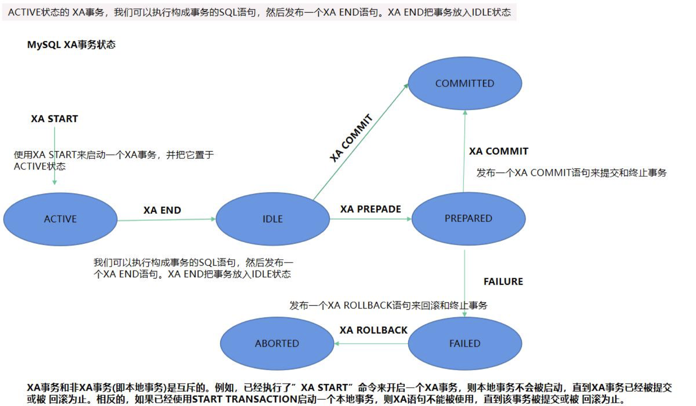

完整的事务处理过程：

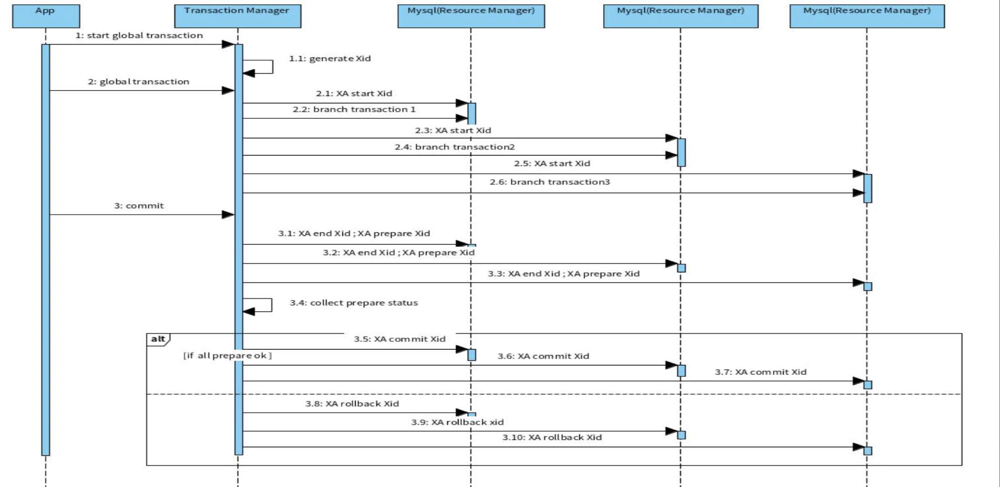

### 3.5 思考：XA过程中，事务失败怎么办？

#### （1）业务SQL执行过程，某个 RM 崩溃怎么处理？

在执行SQL过程中，也就是在`xa start` 和`xa end` 之间，某个资源管理器（RM）挂掉了。这个时候事务管理器TM就知道了，那么就可以把大家都回滚掉；

#### （2）全部prepare后，某个 RM 崩溃怎么处理？

这个时候得区分mysql的版本，

5.7以后是好的，5.7之前会有问题：

演示mysql5.6下，XA的bug：

```
-- 开启一个XA 事务，命名为 xa01
xa start 'x01';
-- 插入一条记录
insert into test values(11, '002', now());
-- 告诉mysql SQL执行完了
xa end 'x01';
-- 进入prepare 状态
xa prepare 'x01';
-- 列出所有在prepare状态下xa中的事务
xa recover;
-- 退出mysql连接
exit;

-- 重新连接mysql
mysql -uroot -p

-- 列出所有在prepare状态下xa中的事务
-- 这个时候发现 xa事务已经不见了。mysql5.7把这个问题修复了。
xa recover;
```

#### （3）commit时，某个 RM 崩溃怎么办？

这个时候，只能通过重试几次，如果还不行，就只能让人工来干预了。

### 3.6 主流支持XA的框架

- atomikos ： 最流行

  性能、多线程，都比较好。默认本地使用xa.log 存储事务信息。

  因为它把事务信息放到本地，所以用它来做高可用就不是很好做。

  它有去中心化设计的功能，但这个没有开源。

  它在协议里写了，不让任何人重写它写XA事务信息的接口。

- narayana

  大平台，协议比较友好。支持我们通过文件或数据库的方式来存全局的事务日志。这样就可以支持**集群模式的事务恢复**

- SEATA

  不建议使用XA

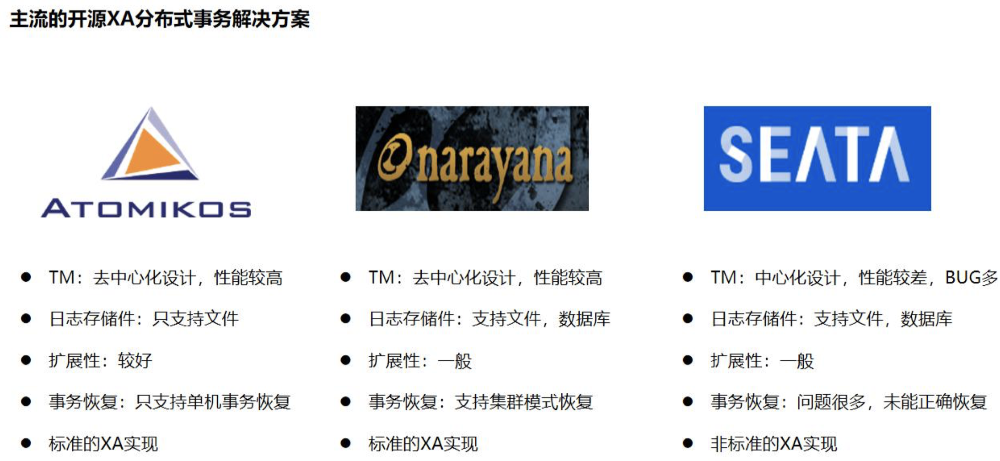

### 3.7 XA事务存在的问题

**注意：**XA默认不会改变隔离级别

#### （1）同步阻塞问题

1. XA事务比不使用XA事务的性能低很多；
2. XA事务，如果想要保证项目的各种隔离级别，那么当XA执行的时候，需要把当前的会话改为串行化Serializable。因为默认除了TM（事务管理器）可以知道各个数据的状态，数据库之间，没有任何办法做相互之间的感知。这样会导致操作一半的数据可能会被看到（有的执行了commit，有的没有执行commit），

查看默认的隔离级别：

```mysql
mysql> show variables like '%iso%';
+-----------------------+-----------------+
| Variable_name         | Value           |
+-----------------------+-----------------+
| transaction_isolation | REPEATABLE-READ |
| tx_isolation          | REPEATABLE-READ |
+-----------------------+-----------------+
```

#### （2）单点故障

如果TM宕机了，XA事务就玩不转了。所以要考虑TM的高可用。

#### （3）数据一致性

极端情况下，一定有事务失败问题，需要监控和人工处理。

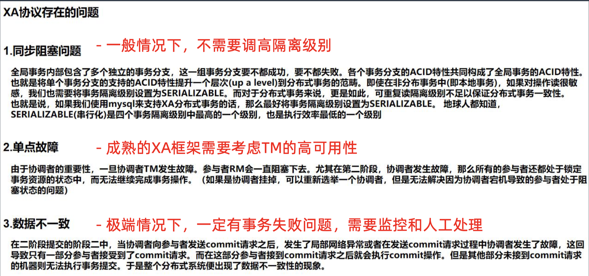

## 四、BASE柔性事务

### 4.1 BASE

BA：Basically Available 基本可用

S：Soft state  柔性状态，系统状态更新有一定的延时

E：Eventually consistent 最终一致性，通常是通过消息传递的方式保证系统的最终一致性

**通过放宽对强一致性要求， 来换取系统吞吐量的提升**。

### 4.2 对比 本地事务、XA事务、柔性事务


### 4.3 BASE柔性事务常见模式

#### （1）TCC

通过手动补偿处理

#### （2）AT

通过自动补偿处理

### 4.4 TCC： Try-confim-cancel

**TCC对业务本身对设计有非常大的影响，要修改原来的业务设计。**

TCC模式即将每个服务业务操作分为两个阶段，第一个阶段检查并预留相关资源，第二阶段根据所有服务业 务的Try状态来操作，如果都成功，则进行Confirm操作，如果任意一个Try发生错误，则全部Cancel。

（1）Try：准备操作

完成所有业务检查，预留必须的业务资源。（一般不用做业务事务那部分操作。）

（2）confim： 确认操作

真正执行的业务逻辑，不做任何业务检查，只使用 Try 阶段预留的业务资源。因此， 只要 Try 操作成功，Confirm 必须能成功。另外，Confirm 操作需满足幂等性，保证一笔分布式事务能且 只能成功一次。（一般将真正的业务操作放到confim。）

（3）cancel：取消操作

释放 Try 阶段预留的业务资源。同样的，Cancel 操作也需要满足幂等性。

TCC 不依赖 RM 对分布式事务的支持，而是通过对业务逻辑的分解来实现分布式事务， 不同于AT的是就是需要自行定义各个阶段的逻辑，**<u>对业务有侵入</u>**。

**TCC核心思想**：Try 是一个事务，在try阶段发生的异常，这个事务是可以回滚掉的。当进入confirm阶段，try的事务已经提交。如果confirm阶段发生异常，confirm这个小事务是可以回滚的，但不能把try阶段的事务回滚掉，这个时候就需要，通过实现cancel接口把try的提交给纠正过来。

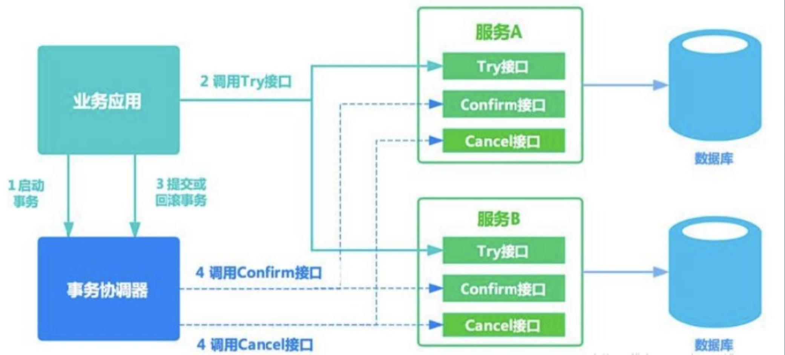

### 4.5 TCC 需要注意的几个问题

#### （1）允许空回滚

判断try是没有成功的，这个时候cancel可以做空回滚（不做任何操作）。

#### （2）防悬挂控制

由于网络抖动、系统卡顿等原因，cancel请求先触发，之后才开始执行try的请求，从而导致try悬挂问题（资源没有释放）。

怎么办：

方案一：想一些方案一定让try先执行，其他的操作在try之后执行；

方案二：在cancel里面设计一个id，存起来，try请求进来的时候判断一下，是否这个try将会被悬挂，如果会就不在执行这个try了（不再锁定资源）。

#### （3）幂等设计

confim操作可能会被重试。假如一段业务代码由于网络抖动被confim了两次（在MQ中这个问题更常见）。比如，由于超时执行失败了，但数据库那边正的执行成功了，那么第二次再做confirm所做的效果和第二次是一样的。

### 4.6 SAGA

Saga模式没有try阶段，直接提交事务。

复杂情况下，对回滚操作的设计要求较高。

> 多个小事务顺序提交了，又遇到一个小事务提交失败的，每个小事务都需要cancel。要求每个小事务都需要实现自己的cancel。
>
> 所有的业务操作和撤销操作都要保证幂等性。

### 4.7 AT

AT 模式就是两阶段提交，自动生成反向SQL。

多了一个SQL解析的性能。

**AT核心思想**：在第一个阶段把事务相关的SQL执行完，并且在第一个阶段会强制插入一个SQL解析引擎。把这次SQL拿出来，分析其影响了多少数据（插入：插入了几条数据，插入的id是什么；update：update之前的数据是什么，之后是什么；）保留现在的状态，把这些变化单独存起来，存在一个单独的数据库里。如果发生了现场，通过我们保存的现场，拼出来一个reverseSQL的组合（生成反向的SQL）。

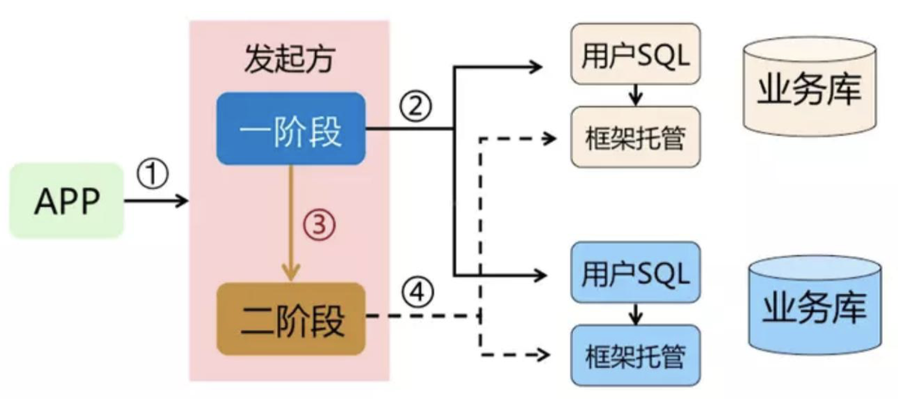

### 4.8 柔性事务下隔离级别

事务特性：

- 原子性（Atomicity）：正常情况下保证。

  要么提交，要么回滚。

- 一致性（Consistency），在某个时间点，会出现A库和B库的数据违反一致性要求的情况，但是最终是一 致的。

  只要没有加全局的锁，就一定有人先提交，也一定有人后提交。

- 隔离性（Isolation），在某个时间点，A事务能够读到B事务部分提交的结果。

- 持久性（Durability），和本地事务一样，只要commit则数据被持久。

隔离级别：

一般情况下都是读已提交（全局锁）、读未提交（无全局锁）。

反常规的事情：

从柔性事务全局来看，过程中的本地提交都是脏数据。

如果如果没有全局锁，柔性事务的隔离级别是读未提交。

## 五、分布式事务框架

### 5.1 Seata-TCC/AT 柔性事务

Seata 是阿里集团和蚂蚁金服联合打造的分布式事务框架。 其 AT 事务的目标是在微服 务架构下，提供增量的事务 ACID 语意，让开发者像使用本地事务一样，使用分布式事 务，核心理念同 Apache ShardingSphere 一脉相承。

Seata AT 事务模型包含TM (事务管理器)，RM (资源管理器) 和 TC (事务协调器)。 TC 是一个独立部署的服务，TM 和 RM 以 jar 包的方式同业务应用一同部署，它们同 TC 建 立长连接，在整个事务生命周期内，保持远程通信。 TM 是全局事务的发起方，负责全 局事务的开启，提交和回滚。 RM 是全局事务的参与者，负责分支事务的执行结果上报， 并且通过 TC 的协调进行分支事务的提交和回滚。

- TM 要求 TC 开始一个全新的全局事务

  > 在系统中发起事务；

- TC 生成一个代表该全局事务的 XID，（事务的协调器）

  生成的XID会分发给本地的各个事务。通过XID将各个分支事务串起来。

  > 对每个本地事务进行发命令操作；所以TC是一个单独部署的服务。
  >
  > 通知和连接本地的事务取干活。TC中可以配置一个数据库，里面保存着事务执行的状态。

Seata 管理的分布式事务的典型生命周期：

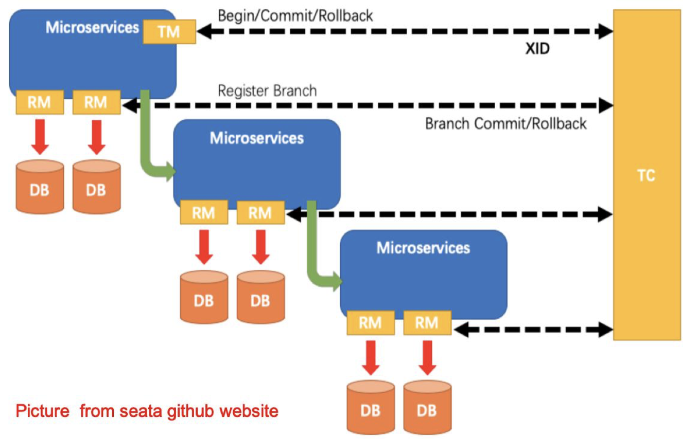

Seata-TCC生命周期：

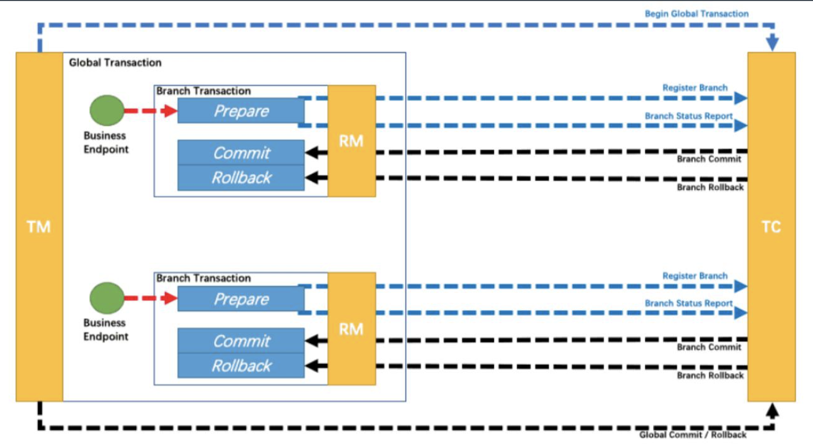

### 5.2 Seata - AT 原理

#### （1）通过本地锁，来分离本地并发的粒度

这样可以不长期对数据占用，保证了并发。

一阶段：业务数据和回滚日志记录在同一个本地事 务中提交，释放本地锁和连接资源。

二阶段：提交异步化，非常快速地完成。 回滚通过一阶段的回滚日志进行反向补偿。

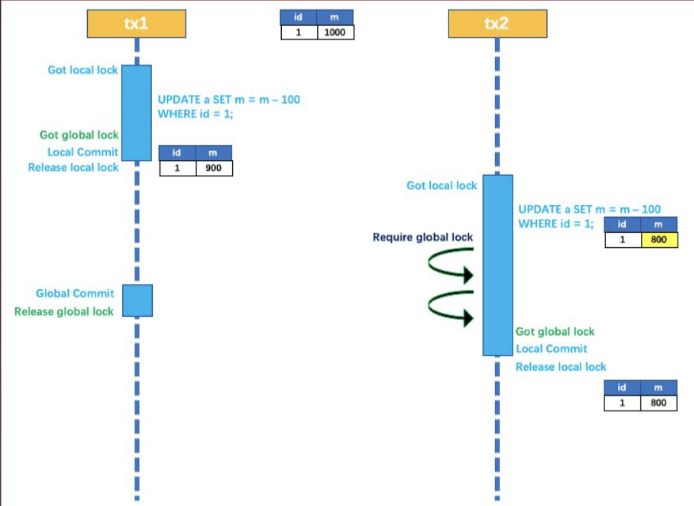

#### （2）通过全局锁控制全局状态

通过全局锁的方式，实现读写隔离。

1、本地锁控制本地操作；

2、全局锁控制全局提交。

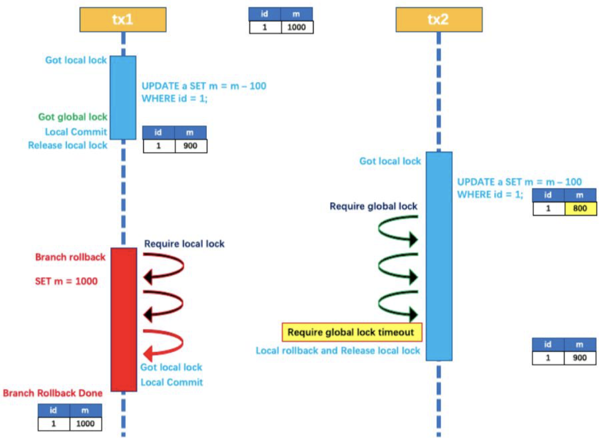

### 5.3 hmily

Hmily 是一个高性能分布式事务框架，开源于2017年，目前有2800个 Star，基于 TCC 原理实现，使用 Java 语言开发（JDK1.8+），天然支持 Dubbo、SpringCloud、 Motan 等微服务框架的分布式事务。

- 支持嵌套事务；
- 扩展性比较强；
- 本地事务的多种存储支持 : redis/mongodb/zookeeper/file/mysql

hmily 的架构：是为微服务定制的非常完善的分布式事务架构

- 根据TCC来设计
- 有个整体的事务管理器（MainService--->TxManager）。和Seata不同的是，不需要单独部署一个TC server，它的事务管理器同时就把TC做了。这样不仅简单，而且没有Seata TC那样的单点（单点存在的问题：如果TC宕了，分布式事务就不能用了。）
- 事务管理器TM部署在我们的业务系统里面，这样在分布式系统中有多少个业务系统在部署，就有多少个事务管理器（TM），同时将状态存到数据库里，这样便于解决高可用问题；
- 又控制台，可以看到哪些事务执行失败了，进而进行手动干预；

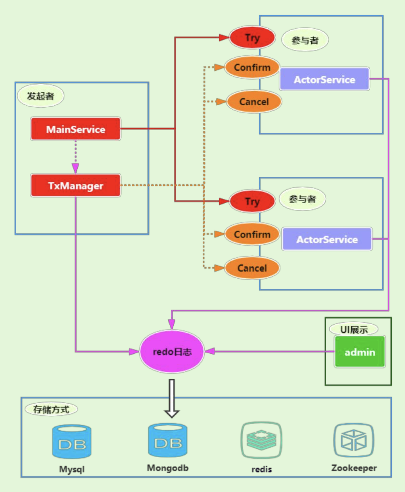

hmily功能上的整体架构：

- 支持各种微服务；
- 中间是hmily的实现机制；
- 底层是事务日志和状态存储；

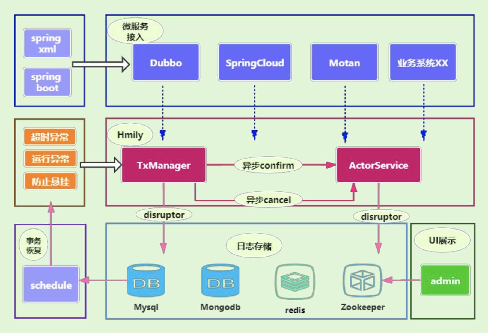

柔性事务：在数据库之外，通过牺牲强一致性，来提升系统的性能。适合在高并发下，业务系统比较复杂的情况下。

> 但我们要注意，我们需要打破这种百分之百可靠的思维，用了分布式事务，在出现了各种异常的情况下，还是需要手工去处理；

## 六、ShardingSphere对分布式事务的支持

### 6.1  Apache ShardingSphere 分布式事务模块的主要设计目标

- 由于应用的场景不同，需要开发者能够合理的在性能与功能之间权衡各种分布式事务。
- 强一致的事务与柔性事务的 API 和功能并不完全相同，在它们之间并不能做到自由的透明切换。在开发决策 阶段，就不得不在强一致的事务和柔性事务之间抉择，使得设计和开发成本被大幅增加。
- 基于XA的强一致事务使用相对简单，但是无法很好的应对互联网的高并发或复杂系统的长事务场景；柔性事 务则需要开发者对应用进行改造，接入成本非常高，并且需要开发者自行实现资源锁定和反向补偿。
- 整合现有的成熟事务方案，为本地事务、两阶段事务和柔性事务提供统一的分布式事务接口，并弥补当前方 案的不足，提供一站式的分布式事务解决方案是 Apache ShardingSphere 分布式事务模块的主要设计目标。

### 6.2 ShardingSphere支持XA事务的常见几个开源实现

特别需要注意的是，proxy这里做了一个神奇的操作：

假如在proxy背后是多分片的数据，一个本地事务进来，会自动的将这个本地事务转成XA事务，再去访问不同的分库分表。proxy想保证的是，在proxy前看到的事务，跟操作多个数据库、表整体是一致的。

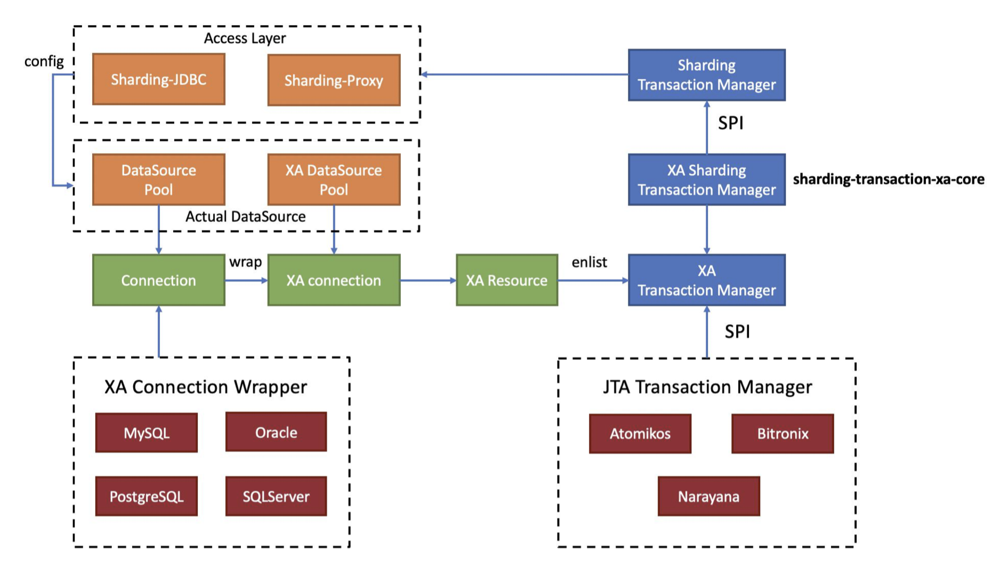

### 6.3 ShardingSphere支持Seata的柔性事务

对于柔性事务，ShardingSphere直接支持了Seata：

对业务有侵入性。

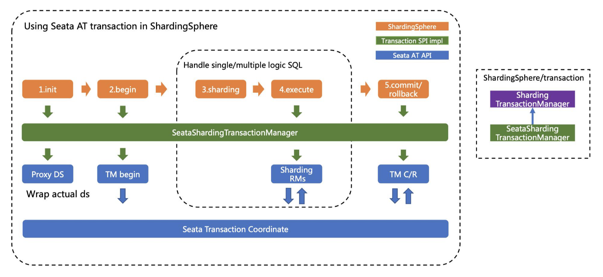

### 6.4 案例

在shardingSphere项目中执行下面的maven命名之后，就可以在IDEA中直接打开example项目

> mvn clean package install -Dmaven.test.skip=true -Dmavn.javadoc.skip=true -Drat.skip=true -Dcheckstyle.skip=true

[shardingsphere的中文文档](https://gitee.com/lf-ren/JavaRebuild/blob/main/Week_08_MySQL%E5%88%86%E5%BA%93%E5%88%86%E8%A1%A8-%E8%BF%81%E7%A7%BB-%E5%88%86%E5%B8%83%E5%BC%8F%E4%BA%8B%E5%8A%A1/document/shardingsphere_docs_cn.pdf)

shardingsphere的缺点：

1. 项目太大，60+w行代码；
2. 代码，抽象层次太多；
3. 以功能为设计维度（有了灵活度，少了透明性）；
4. 文档，examples，对新手不友好；
5. 每个版本都不兼容；
6. 配置太复杂，使用成本太高；

sharding-jdbc 使用的公司有 1000+以上；

复杂的SQL sharding-proxy支持不了；

数据脱敏：脱敏后，在业务上仍然是完整的，脱敏后的数据和原来的数据没有任何关系，没有办法还原；

## 七、练一练

1. （选做）列举常见的分布式事务，简单分析其使用场景和优缺点。 

2. （必做）基于hmily TCC或ShardingSphere的Atomikos XA实现一个简单的分布式 事务应用demo（二选一），提交到github。 

3. （选做）基于ShardingSphere narayana XA实现一个简单的分布式事务demo。

4. （选做）基于seata框架实现TCC或AT模式的分布式事务demo。 

5. （选做☆）设计实现一个简单的XA分布式事务框架demo，只需要能管理和调用2 个MySQL的本地事务即可，不需要考虑全局事务的持久化和恢复、高可用等。 

6. （选做☆）设计实现一个TCC分布式事务框架的简单Demo，需要实现事务管理器， 不需要实现全局事务的持久化和恢复、高可用等。 

7. （选做☆）设计实现一个AT分布式事务框架的简单Demo，仅需要支持根据主键id 进行的单个删改操作的SQL或插入操作的事务。
