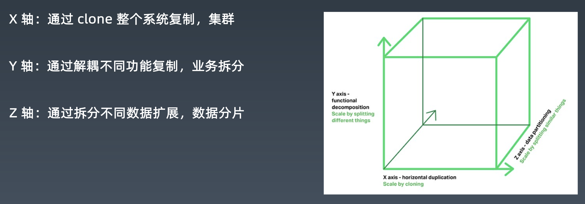

# MySQL分库分表

[toc]

## 一、为什么要做数据库拆分

### 1.1 数据量过大，带来的问题：

1. 性能：单库单表数据量过超过一定容量水位的情况下，索引树层级增加，磁盘IO也和可能出现压力，会导致很多问题；
2. 应用：单机数据库，一旦挂掉，会导致应用都不能使用；
3. 运维：单机数据量太大，会导致备份和恢复的时间成本变大；
4. 数据量大，主从数据同步的延迟时间会变大；

思考：主从复制是否能解决容量问题？

> 主从复制解决了读写压力的问题，不能解决容量问题。
>
> 主从复制，每个节点上，数据都是全量的，并没有把数据本身减小。

### 1.2 例子

（1）无法执行 DDL，比如添加一列，或者增加索引，都会直接影响线上业务，导致长时 间的数据库无响应。

DDL修改，会导致锁表、索引重建。

>  案例：有个金融业务，有个很大的表，默认分了150个库，每个库一张表。150个表，现在要把表中某个字段的类型从int改为bigint。评估了一下，每改一张表，需要执行2小时，把这些表都执行完需要300多个小时。这是件非常恐怖的事情。

（2）无法备份，与上面类似，备份会自动先 lock 数据库的所有表，然后导出数据，量 大了就没法执行了。

MySQL dump的原理：先锁表，再导出数据。保证数据一致性。数据量大，锁表的时间就非常长。

（3）影响性能与稳定性，系统越来越慢，随时可能会出现主库延迟高，主从延迟很高， 且不可控，对业务系统有极大的破坏性影响

数据量大了，影响性能，稳定性也会受到影响，高可用也会受到影响。

最简单粗暴的方式是升级内存、磁盘，但这种方式，瓶颈很快就会出现。

### 1.3 总结

数据库拆分，主要帮我们解决容量问题，顺带提升了写的能力。

### 1.4 扩展立方体

X轴：集群

Y轴：业务拆分

> 按照业务数据领域来拆分。

Z轴：partiton

分区（partition）、分片（sharding）

### 1.5 数据库/数据的扩展

主从结构、备份与高可用：能够顺便解决读写压力的问题。

分布式服务化、微服务：解决容量、以及部分读写压力的问题。**改变了库的结构和表的结构**

分布式结构、任意扩展：不改变库和表结构，只是把同一个库，同一个表一部分数据拿出来，丢在另一个库、表里（这个库、表的结构和前面的一模一样）

## 二、数据库垂直拆分

没有做服务化之前，出现的问题：

1. 数据库连接数不够；

   都需要用户数据。

2. 各种服务相互之间不能服用

   因为没有封装成服务，比如用户功能，写到jar里，jar包里面是直接调用数据库的。如果业务升级，需要引用心的jar包，所有的业务系统真的要配合他去引用心的jar包。

针对这两个问题，做了分布式的服务化。

为了做分布式服务化，就要做两件事情：

1. 把不同的数据给拆了；

   用户中心UC（user）、产品中心IC（item）、交易中心TC（trade）

   拆成三个，每个都是单独的一套数据库。

2. 在这个基础上，通过接口和RPC（远程调用）的方式暴露出去，这就是所谓的分布式服务化。再进一步就是服务治理，就变成微服务架构了。