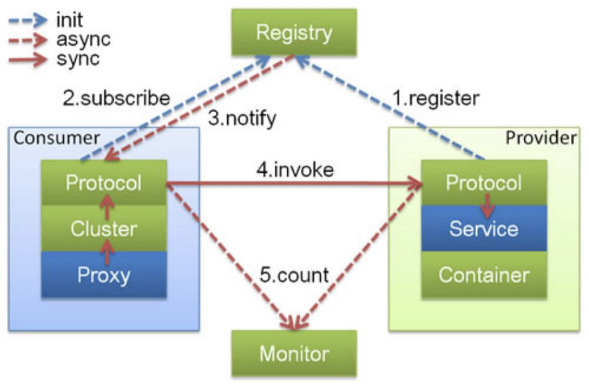
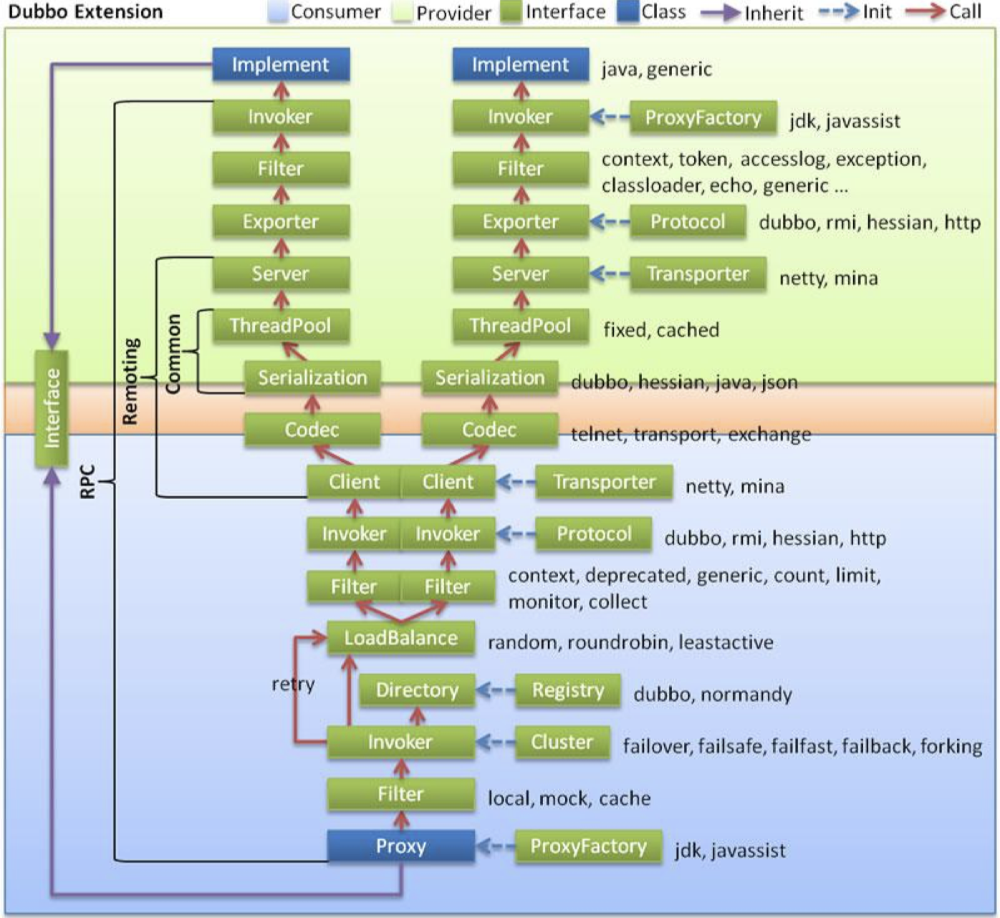

# 分布式服务：Dubbo技术详解

[toc]

## 一、先看一个使用Dubbo的案例

## 二、Dubbo框架介绍

Dubbo存量用户比较多。在增量系统中，大量用Spring Cloud。

京东JSF用的就是Dubbo。

Dubbo六个功能：

- 高性能RPC
- 负载均衡
- 服务自动注册与发现
- 高度可扩展能力：做得非常好
- 运行期流量调度
- 服务治理和运维

Dubbo的基础功能：

基础功能的内核是服务化（或者我们叫RPC）。主要就是下面这张图：

- 客户端的消费者可以调用服务端的提供者：可以直接调，也可以通过注册中心去找服务端在哪里再去调；

  > 和ESB中的SOA相比，Dubbo效率更高。

- 下面这个图，虚线都是异步的；

Dubbo的扩展功能：集群、高可用、管控

Dubbo成功的秘诀：灵活易用+简单易用。

## 三、Dubbo技术原理

### 3.1  整体架构

横的分层。

API：在Dubbo中直接调用；

SPI：需要先实现，塞到服务中；

Service层：是业务

Config层：ServiceConfig服务暴露时的配置，ReferenceConfig是服务引用时的配置；

proxy层：代理层，

Registry层：注册

Cluster层：分为查找目录（查找所有机器）、路由（从机器中找服务调用的范围）、负载均衡（最终决定调用哪个机器）

Monitor层：

Protocol层：协议

Exchange层

Transport层

Serialize层

最后三层时网路传输层。

Dubbo中三个核心概念：

- Invoker：暴露服务本身。是Dubbo里面核心东西，代表一次服务调用。

- Protocol：协议，
- URL：在Dubbo内部，所有东西的流转都是通过URL实现的。包含描述服务的信息。

Dubbo中另一个重要的东西是Filter。

### 3.2 架构设计

集群的功能都是在客户端实现。

### 3.3 SPI的应用

API：在Dubbo中直接调用；

SPI：需要先实现，塞到服务中；

SPI的实现方式：通过[JDK里面ServiceLoader机制](https://blog.csdn.net/hefrankeleyn/article/details/123218329?spm=1001.2014.3001.5502)实现。

因为Dubbo中实现的类特别多，Dubbo里面重新实现了ServiceLoader机制，不同的地方在于：

（shadingSphere中也有类似的应用。）

- 将配置路径改为：`META-INF/dubbo/internal`
- 配置文件中改为：`名称=实现类`

这样做的好处是：实现依赖反转。例如，在只有接口模块中调用另一个模块的实现，但接口模块中又没有引入实现模块。

还有两种机制可以达到同样的效果：Callback和EventBus。

**在dubbo中，SPI实现的加载是通过ExtensionLoader来实现的，SPI实现在Dubbo中默认是单例的。**
