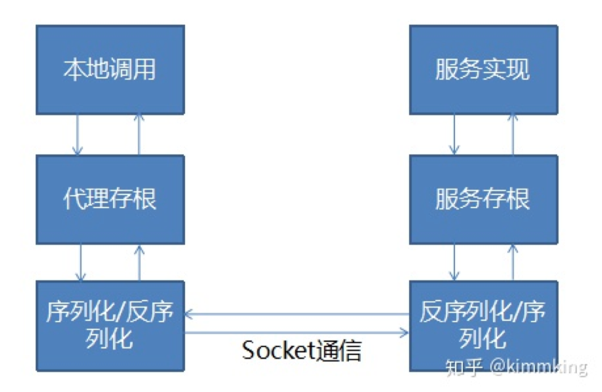

# 分布式服务-RPC与分布式服务化

[toc]

## 一、RPC基本原理

### 1.1 什么是RPC

- 三方库：在项目中引入的第三方依赖，例如通过maven引入spring框架相关Jar包；
- 二方库：组织内自己开发的jar包。例如，公司内部开发了userService的jar，将其推到nexus（私服）上，公司内部的其他项目组可以通过maven引入这些jar在项目中使用。

没有RPC之前，一个接口（业务的定义）及其实现类（业务的实现）都在一个项目中。

RPC：远程过程调用。像调用本地方法一样调用远程方法。

```java
// 通过new出来
UserService service = new UserService();
User user = service.findById(1);

UserService service = Rpcfx.create(UserService.class, url);
User user = service.findById(1);
```

只要是本地调用远程的，都可以称为RPC。

扩展：DWR

> DWR是一个 Java 开源库，帮助你实现 Ajax 网站。它可以让你在浏览器中的 Javascript 代码调用 Web 服务器上的 Java，就像在 Java 代码就在浏览器中一样。

### 1.2 RPC的原理

- 本地调用：调用哪些方法，最终走的远程，但我们要像使用远程方法一样使用它。所以我们需要有一个机制让我们知道现在调用的是哪个方法；
- 代理存根（Stub）：哪个类的哪个方法，传递了哪些参数。拿到这些信息之后
- 序列化/反序列化：通过远程对机制将信息序列化传给远程真正有那个实现的服务进程；
- 反序列化/序列化：将远程传过来的信息（方法、参数等）进行反序列化，就知道了要调用哪些方法；
- 服务存根：根据要调用的方法和参数去本地找相应实现；
- 服务实现：找到实现之后，就调用本地的方法实现。然后再把结果传输过去。

核心点：

1. 必须有一个服务方法调用的拦截机制：

   AOP、Java动态代理

2. 注意处理异常；



### 1.3 RPC的设计

#### （1）本地（client端）和远程（service端）都需要有POJO实体类定义，接口定义

如果我们用REST/PB/WS，我们的client端可以什么都没有。那它怎么拿到实体类和接口的。REST/PB/WS这三种确实不需要像Java中那样的API定义，因为这三都是跨平台的（也就是说在非Java平台中引用），需要用与平台无关的方式来描述它的实体类和接口。

在REST里面，我们用接口文档来描述接口定义、方法名、参数；WADL

在PB里面，我们用IDL，接口定义语言来描述；

在WS中，我们用WSDL，XML的SOAP协议。

> 也就是说REST/PB/WS还是有接口定义和描述的，只是在外部的方式。

#### （2）代理

- Java下，代理可以选择动态代理，或者AOP实现。

> 将方法拦截掉，然后返回一个我们想要返回的值。

- C#直接有远程代理

  Flex可以使用动态方法和属性

#### （3）序列化

1. 语言原生的序列化，RMI，Remoting

   Java自带的序列化方式RMI（包括在其上面再封装一层JMX）只能在Java中使用。

   .net 中序列化的方式remoting，也只能在.net中使用。

   因为其中间传输的对象和数据都是用与平台有关的做的序列化。

2. 平台无关方式一：二进制，Hessian，avro，kyro，fst等；

3. 平台无关方式二：文本，JSON、XML等

   文本是最简单的方式。但其反序列化出的内容占用空间很大。

   XML描述能力非常强，其两套格式的定义：XSD、DTD

#### （4）网络传输

需要选定一种网路传输方式。

常见的传输方式：

- TCP/SSL

  复杂一些，但效率高

- HTTP/HTTPS

  http的方式比较简单，只需要搞一个webService，例如：启动一个springboot。

如果考虑安全，可以使用SSL和HTTPS

#### （5）查找实现类

对应着服务器端端骨架技术：Skeleton。

通过接口查找服务端的实现类。

一般是注册方式， 例如 dubbo 默认将接口和实现类配置到Spring

## 二、常见的RPC框架

很多语言都内置了RPC技术：

- Java RMI
- .NET Remoting

RPC技术演进：

- Corba/RMI/.NET Remoting

  > corba 是一项远古的技术。这三个技术要么非常古老，要么与平台是相互绑定的。

- JSON RPC, XML RPC，WebService(Axis2, CXF)

  > 很长一段时间WebService是RPC的标准。WebService的两种实现：Axis2, CXF，CXF更好用，更人性化。

- Hessian, Thrift, Protocol Buffer, gRPC

  二进制的序列化协议。更紧凑、传输的数据量更小。序列化和解析的成本更低，因为精确。

  Hessian：基于Http

  Thrift：基于IDL，IDL是平台无关的，这样就可以通过它，用代码生成工具，生成对应平台的接口调用和实体类的代码。

  > 现代化的RPC技术

常用的RPC技术

（作为练习）

- Hessian
- Thrift
- gRPC

扩展：开发中，Dao层、service层中，同一层之间不建议相互调用。也就是service层不调用service，只调用dao。

## 三、如何设计一个RPC框架

### 3.1 考虑哪些方面

- 基于共享接口还是IDL?
- 动态代理 or AOP？
- 序列化用什么？文本 or 二进制？
- 基于TCP还是HTTP?
- 服务端如何查找实现类？
- 异常处理

> RPC三要素：接口名、方法、参数。

### 3.2 实例：设计一个RPC

