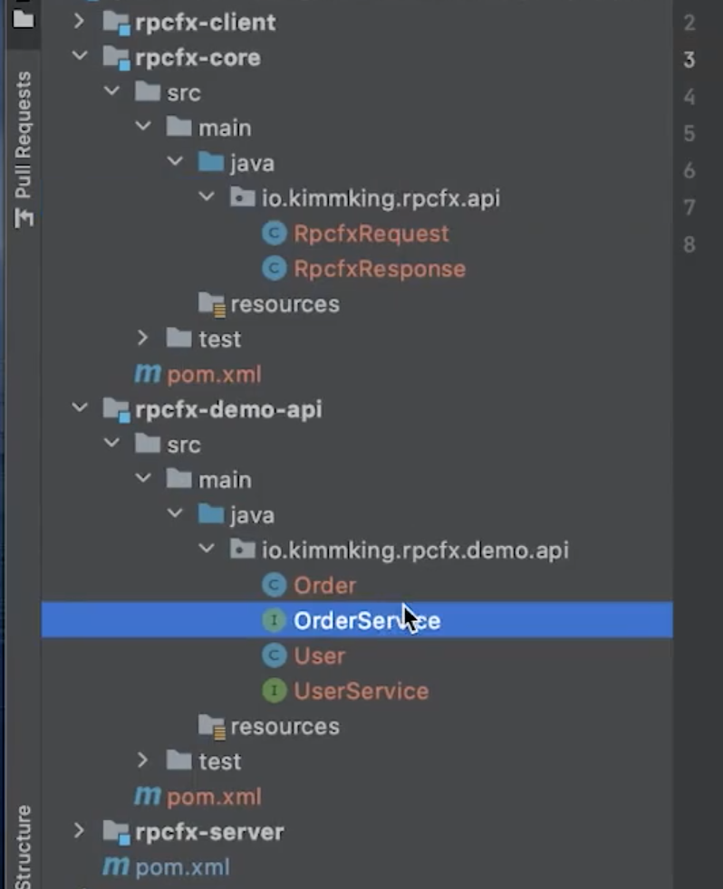
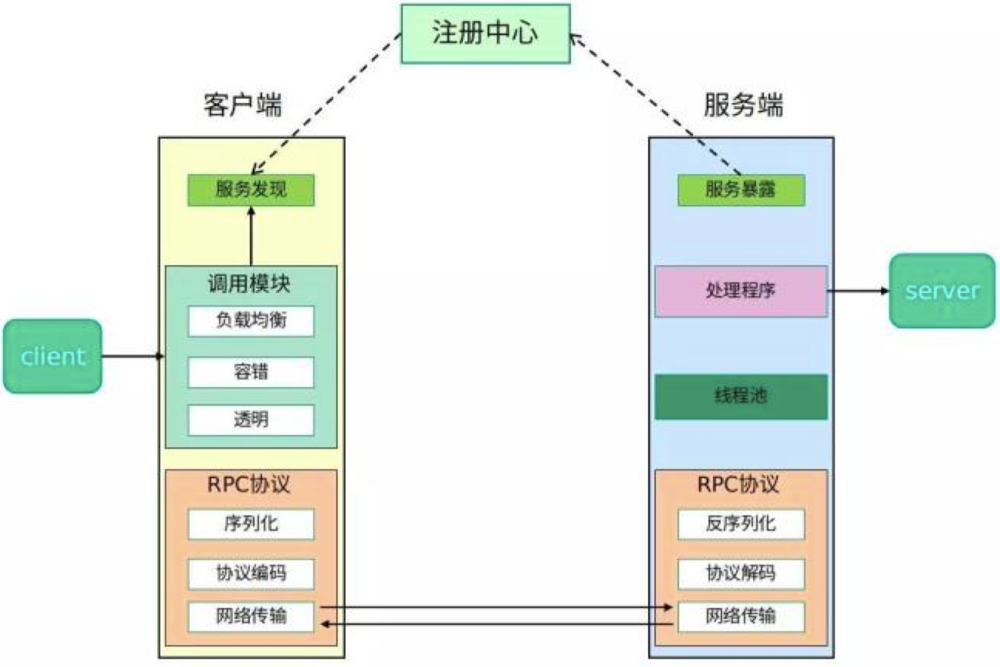

# 分布式服务-RPC与分布式服务化

[toc]

## 一、RPC基本原理

### 1.1 RPC的背景知识

> RPC和MQ是分布式底层的通信基础。

没有RPC之前，一个接口（业务的定义）及其实现类（业务的实现）都在一个项目中。

大公司里，常常说一个词“二方库”。

我们都知道“三方库”。

- 三方库：在项目中引入的第三方依赖，例如通过maven引入spring框架相关Jar包；
- 二方库：组织内自己开发的jar包。例如，公司内部开发了userService的jar，将其推到nexus（私服）上，公司内部的其他项目组可以通过maven引入这些jar在项目中使用。

### 1.2 什么是RPC

**RPC：远程过程调用**。像调用本地方法一样调用远程方法。

为什么叫远程过程调用？

六七十年代，有了机器和网络之后，两台机器交互，直接通过发报文都方式，报文里是什么数据，只有报文定义的双方知道。每次都需要创建一个SocketServe和SocketClient都是为这次通信使用的，而不是为了复用。

```java
// 通过new出来
UserService service = new UserService();
User user = service.findById(1);

UserService service = Rpcfx.create(UserService.class, url);
User user = service.findById(1);
```

只要是本地调用远程的，都可以称为RPC。

扩展：DWR

> DWR是一个 Java 开源库，帮助你实现 Ajax 网站。它可以让你在浏览器中的 Javascript 代码调用 Web 服务器上的 Java，就像在 Java 代码就在浏览器中一样。

### 1.2 RPC的原理

- 本地调用：调用哪些方法，最终走的远程，但我们要像使用远程方法一样使用它。所以我们需要有一个机制让我们知道现在调用的是哪个方法；
- 代理存根（Stub）：哪个类的哪个方法，传递了哪些参数。拿到这些信息之后
- 序列化/反序列化：通过远程对机制将信息序列化传给远程真正有那个实现的服务进程；
- 反序列化/序列化：将远程传过来的信息（方法、参数等）进行反序列化，就知道了要调用哪些方法；
- 服务存根（Skeleton）：根据要调用的方法和参数去本地找相应实现；
- 服务实现：找到实现之后，就调用本地的方法实现。然后再把结果传输过去。

核心点：

1. 必须有一个服务方法调用的拦截机制：

   AOP、Java动态代理

2. 注意处理异常；


### 1.3 RPC的关键设计

#### （1）本地（client端）和远程（service端）都需要有POJO实体类定义，接口定义

如果我们用REST/PB/WS，我们的client端可以什么都没有。那它怎么拿到实体类和接口的。REST/PB/WS这三种确实不需要像Java中那样的API定义，因为这三都是跨平台的（也就是说在非Java平台中引用），需要用与平台无关的方式来描述它的实体类和接口。

在REST里面，我们用接口文档来描述接口定义、方法名、参数；WADL

在PB里面，我们用IDL，接口定义语言来描述；

在WS中，我们用WSDL，XML的SOAP协议。

> 也就是说REST/PB/WS还是有接口定义和描述的，只是在外部的方式。

#### （2）代理

- Java下，代理可以选择动态代理，或者AOP实现。

> 将方法拦截掉，然后返回一个我们想要返回的值。

- C#直接有远程代理

  Flex可以使用动态方法和属性

#### （3）序列化

1. 语言原生的序列化，RMI，Remoting

   Java自带的序列化方式RMI（包括在其上面再封装一层JMX）只能在Java中使用。

   .net 中序列化的方式remoting，也只能在.net中使用。

   因为其中间传输的对象和数据都是用与平台有关的做的序列化。

2. 平台无关方式一：二进制，Hessian，avro，kyro，fst等；

   序列化后占空间小，但不易读。

3. 平台无关方式二：文本，JSON、XML等

   文本是最简单的方式。但其反序列化出的内容占用空间很大。

   XML描述能力非常强，其两套格式的定义：XSD、DTD

#### （4）网络传输

需要选定一种网路传输方式。

常见的传输方式：

- TCP/SSL

  复杂一些，但效率高

- HTTP/HTTPS

  http的方式比较简单，只需要搞一个webService，例如：启动一个springboot。

如果考虑安全，可以使用SSL和HTTPS

#### （5）查找实现类

对应着服务器端端骨架技术：Skeleton。

通过接口查找服务端的实现类。

一般是注册方式， 例如 dubbo 默认将接口和实现类配置到Spring

## 二、常见的RPC框架

很多语言都内置了RPC技术：

- Java RMI
- .NET Remoting

RPC技术演进：

- Corba/RMI/.NET Remoting

  > corba 是一项远古的技术。这三个技术要么非常古老，要么与平台是相互绑定的。

- JSON RPC, XML RPC，WebService(Axis2, CXF)

  > 基于文本。
  >
  > 很长一段时间WebService是RPC的标准。WebService的两种实现：Axis2, CXF，CXF更好用，更人性化。

- Hessian, Thrift, Protocol Buffer, gRPC

  二进制的序列化协议。更紧凑、传输的数据量更小。序列化和解析的成本更低，因为精确。

  Hessian：基于Http，走的是二进制。

  Thrift：基于IDL，IDL是平台无关的，这样就可以通过它，用代码生成工具，生成对应平台的接口调用和实体类的代码。

  > 现代化的RPC技术

常用的RPC技术

（作为练习）

- Hessian
- Thrift
- gRPC，基于Go语言。

扩展：开发中，Dao层、service层中，同一层之间不建议相互调用。也就是service层不调用service，只调用dao。

## 三、如何设计一个RPC框架

### 3.1 考虑哪些方面

- 基于共享接口还是IDL?

  > IDL: 接口描述语言。

- 动态代理 or AOP？

- 序列化用什么？文本 or 二进制？

- 基于TCP还是HTTP?

- 服务端如何查找实现类？

- 异常处理

> RPC三要素：接口名、方法、参数。

### 3.2 实例：

#### （1）设计一个RPC

使用共享Java接口类和实体类定义的方式：rpcfx-api

例如:

- 实体类：`User`
- 接口类：`UserService`

客户端（rpcfx-client）和服务端（rpcfx-server）都依赖：rpcfx-api。

#### （2）实例：代理

使用动态代理。

#### （3）序列化

使用JSON。

可以尝试使用XStream进行序列化。

```
为了fastJson反序列化的安全：
ParseConfig.getGlobalInstance().addAccept("com.hef");
```


#### （4）网络传输

网络传输使用OKHttp

#### （5）查找实现类

借助Spring 容器进行查找。

#### （6） 扩展

- 将OkHttp替换成httpClient或nettyClient。
- 替换AOP；

挑战：自定义的序列化和反序列化。

>  补充：webSocket是

### 3.3 从脚手架到框架

- rpcfx-api中`RpcfxRequest`和`RpcfxResponse` 是框架级别的东西，不会暴露给用户，是RPC具体的实现细节。
- 而`Order`、`OrderService`、`User`、`UserService`是利用框架写的业务代码。
- rpcfx-client中的Rpcfx也是框架的部分，因为里面没有业务代码。
- rpcfx-server中`OrderServiceImpl`和`UserServiceImpl`也是业务。`RpcfxServerApplication`中除了装配Bean的代码是业务，其余部分是框架的内容。

接下里重构，就是把框架代码重构出来。



## 四、从RPC到分布式服务化

当我们的系统复杂了，调用量增加，TPS变多（并发变高），这个时候对我们整个系统分布式要求变高。具体体现：

> 我们部署了一大堆service，如何管理这一大堆service机器。老版本和新版本同时启动如何管理。有n套环境。那么这个时候就需要我们有什么机制对这些多机服务进行管理。多版本、多环境、动态配置，另外就是服务多了，我们到底调用的是哪个服务。

1. 我们希望能做到自动把新的机器加进去；

2. 如果现在有机器不可用了，自动从可用列表中踢出；

3. 不同机器的TPS能力不同，我们希望能进行动态的分发与调控；

   > 复杂环境下的管理，和流量分发处理。

4. 我们期望无论流量再大，都能保证一定的工作能力；

   > 系统过载保护（系统级）、降级（服务级）、限流（用户级）

5. 重试和失败策略；

6. 高可用、监控、性能等等

一个典型的分布式服务化架构:



## 五、实践

[进阶实战-分布式服务RPC](https://github.com/hefrankeleyn/JAVARebuild/blob/main/Week_09_%E5%88%86%E5%B8%83%E5%BC%8F%E6%9C%8D%E5%8A%A1/2022-02-01-%E8%BF%9B%E9%98%B6%E5%AE%9E%E6%88%98-%E5%88%86%E5%B8%83%E5%BC%8F%E6%9C%8D%E5%8A%A1RPC.md)。

