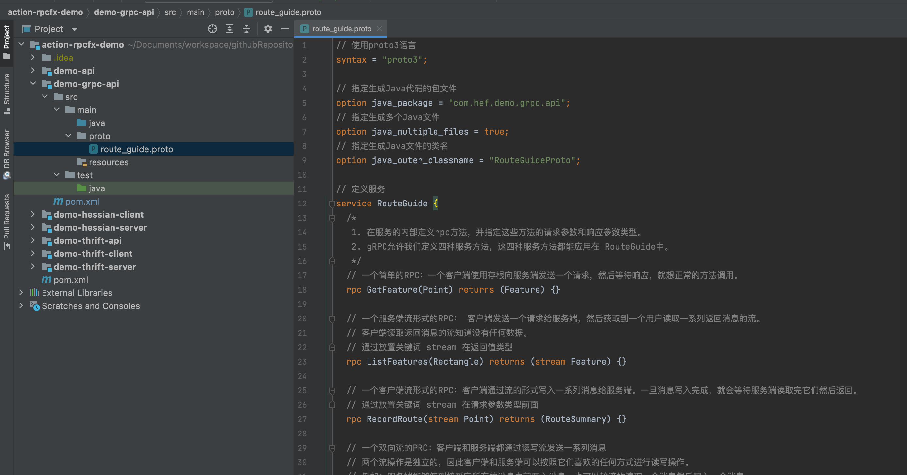
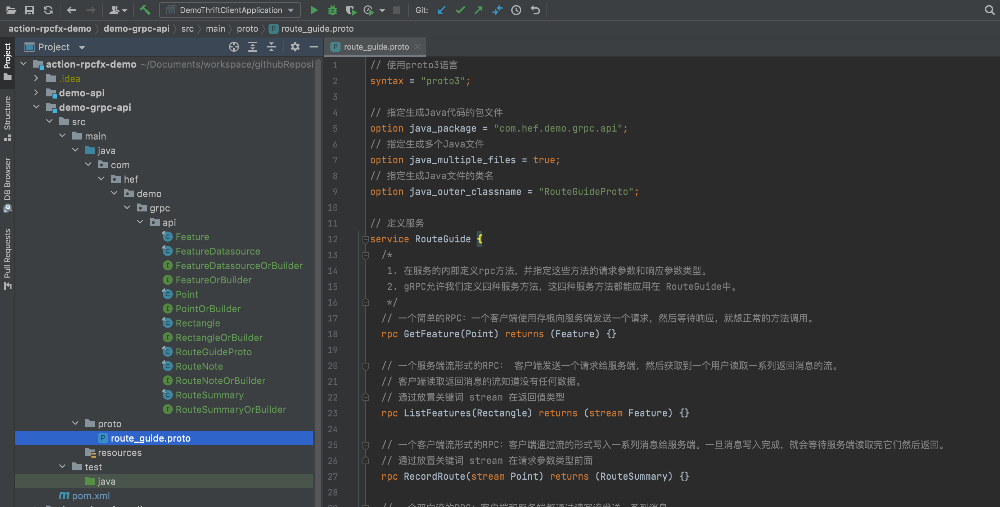
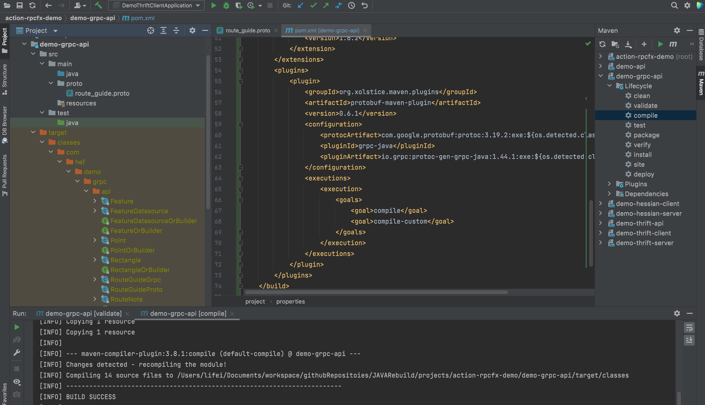

# 实践常见的RPC框架：gRPC

[toc]

## 一、gRPC介绍

gRPC是现代开源能运行在任意环境上的高性能的远程程序调用框架（RPC）。它能有效的连接数据中心内外的服务，并且插件式的支持负载均衡、跟踪、健康检查和身份校验。它也能应用在分布式计算的最后一英里，将设备、手机应用程序、浏览器连接到后台服务。

- 简单的服务定义：通过Protocol Buffers定义服务。Protocol Bufffers是一个强大的二进制序列化工具集和语言。

  [Protocol Buffers语法及使用](https://github.com/hefrankeleyn/JAVARebuild/blob/main/Week_09_%E5%88%86%E5%B8%83%E5%BC%8F%E6%9C%8D%E5%8A%A1/2022-02-23-ProtocolBuffer%E8%AF%AD%E6%B3%95.md)。

- 启动迅速并且可扩展：使用一行代码就能安装在运行时环境和开发环境，也能扩展到每秒数百万个RPC框架。

- 能够跨语言和跨平台的工作：为你在各种语言和平台下的服务自动生成公用的客户端和服务端存根代码。

- 双向流并且融合了用户检验：双向的流，并且完全融合了基于HTTP/2-based通信的插件式的用户认证。

## 二、第一步：gRPC服务的定义（四种RPC服务方法）

第一步是用Protocol Buffers定义gRPC服务和方法上使用的request和response类型。

gRPC允许我们定义四种服务方法：

### （1）简单RPC服务

```protobuf
  // 一个简单的RPC：一个客户端使用存根向服务端发送一个请求，然后等待响应，就想正常的方法调用。
  rpc GetFeature(Point) returns (Feature) {}
```

### （2）服务端流形式的RPC

```protobuf
  // 一个服务端流形式的RPC： 客户端发送一个请求给服务端，然后获取到一个用户读取一系列返回消息的流。
  // 客户端读取返回消息的流知道没有任何数据。
  // 通过放置关键词 stream 在返回值类型
  rpc ListFeatures(Rectangle) returns (stream Feature) {}
```

### （3）客户端流形式的RPC

```protobuf
  // 一个客户端流形式的RPC：客户端通过流的形式写入一系列消息给服务端。一旦消息写入完成，就会等待服务端读取完它们然后返回。
  // 通过放置关键词 stream 在请求参数类型前面
  rpc RecordRoute(stream Point) returns (RouteSummary) {}
```

### （4）双向流的PRC

```protobuf
  // 一个双向流的PRC：客户端和服务端都通过读写流发送一系列消息
  // 两个流操作是独立的，因此客户端和服务端可以按照它们喜欢的任何方式进行读写操作。
  // 例如：服务端能够等到接受完所有的消息之前写入消息，也可以轮流的读取一个消息然后写入一个消息。
  // 消息的顺序被保存在每个流中
  // 通过在请求参数类型和返回参数类型前放置stream关键词：
  rpc RouteChat(stream RouteNote) returns (stream RouteNote) {}
```

示例：[src/main/proto/route_guite.proto](https://github.com/hefrankeleyn/JAVARebuild/blob/main/projects/action-rpcfx-demo/demo-grpc-api/src/main/proto/route_guide.proto)

```protobuf
// 使用proto3语言
syntax = "proto3";

// 指定生成Java代码的包文件
option java_package = "com.hef.demo.grpc.api";
// 指定生成多个Java文件
option java_multiple_files = true;
// 指定生成Java文件的类名
option java_outer_classname = "RouteGuideProto";

// 定义服务
service RouteGuide {
  /*
   1. 在服务的内部定义rpc方法，并指定这些方法的请求参数和响应参数类型。
   2. gRPC允许我们定义四种服务方法，这四种服务方法都能应用在 RouteGuide中。
   */
  // 一个简单的RPC：一个客户端使用存根向服务端发送一个请求，然后等待响应，就想正常的方法调用。
  rpc GetFeature(Point) returns (Feature) {}

  // 一个服务端流形式的RPC： 客户端发送一个请求给服务端，然后获取到一个用户读取一系列返回消息的流。
  // 客户端读取返回消息的流知道没有任何数据。
  // 通过放置关键词 stream 在返回值类型
  rpc ListFeatures(Rectangle) returns (stream Feature) {}

  // 一个客户端流形式的RPC：客户端通过流的形式写入一系列消息给服务端。一旦消息写入完成，就会等待服务端读取完它们然后返回。
  // 通过放置关键词 stream 在请求参数类型前面
  rpc RecordRoute(stream Point) returns (RouteSummary) {}

  // 一个双向流的PRC：客户端和服务端都通过读写流发送一系列消息
  // 两个流操作是独立的，因此客户端和服务端可以按照它们喜欢的任何方式进行读写操作。
  // 例如：服务端能够等到接受完所有的消息之前写入消息，也可以轮流的读取一个消息然后写入一个消息。
  // 消息的顺序被保存在每个流中
  // 通过在请求参数类型和返回参数类型前放置stream关键词：
  rpc RouteChat(stream RouteNote) returns (stream RouteNote) {}


}

message Point {
  int32 latitude = 1;
  int32 longitude = 2;
}

message Feature {
  string name = 1;
  Point location = 2;
}

message Rectangle {
  Point lo = 1;
  Point hi = 2;
}

message RouteSummary {
  int32 point_count = 1;
  int32 feature_count = 2;
  int32 distance = 3;
  int32 elapsed_time = 4;
}

message RouteNote {
  Point location = 1;
  string message = 2;
}

// 在RPC中未使用。相反，这个是序列化到磁盘的格式
// 本案例中：读取带有Feature列表的JSON文件数据，创建出Feature数据列表
message FeatureDatabase {
  repeated Feature feature = 1;
}
```

## 三、第二步：生成客户端和服务端代码

接下来我们要根据`.proto`文件中对服务的定义生成gRPC的客户端和服务端代码。我们使用带有特定gRPC Java插件protocol buffer编译器做这件事情。我们使用proto3编译器（proto3同时支持proto2和proto3语法）生成服务代码。

当使用Gradle或Maven的时候，protoc构建插件能作为构建的一部分来产生需要的代码，可以参考[grpc-java README](https://github.com/grpc/grpc-java/blob/master/README.md)。

为项目添加maven依赖：

```xml
<dependency>
  <groupId>io.grpc</groupId>
  <artifactId>grpc-netty-shaded</artifactId>
  <version>1.44.1</version>
  <scope>runtime</scope>
</dependency>
<dependency>
  <groupId>io.grpc</groupId>
  <artifactId>grpc-protobuf</artifactId>
  <version>1.44.1</version>
</dependency>
<dependency>
  <groupId>io.grpc</groupId>
  <artifactId>grpc-stub</artifactId>
  <version>1.44.1</version>
</dependency>
<dependency> <!-- necessary for Java 9+ -->
  <groupId>org.apache.tomcat</groupId>
  <artifactId>annotations-api</artifactId>
  <version>6.0.53</version>
  <scope>provided</scope>
</dependency>
```

项目的初始状态：



### 3.1 方式一：手动执行protoc命令生成服务代码

```shell
protoc -I=/Users/lifei/Documents/workspace/githubRepositoies/JAVARebuild/projects/action-rpcfx-demo/demo-grpc-api/src/main/proto --java_out=/Users/lifei/Documents/workspace/githubRepositoies/JAVARebuild/projects/action-rpcfx-demo/demo-grpc-api/src/main/java route_guide.proto
```

执行上面的命令后生成的代码结构为：



### 3.2 方式二：通过protobuf-base的代码生成器，直接生成编译后的class文件，不生成源代码

这种方式需要将`.proto`文件放在`src/main/proto`和`src/test/proto`目录下，并在`pom.xml`中引入插件：

```xml
<build>
  <extensions>
    <extension>
      <groupId>kr.motd.maven</groupId>
      <artifactId>os-maven-plugin</artifactId>
      <version>1.6.2</version>
    </extension>
  </extensions>
  <plugins>
    <plugin>
      <groupId>org.xolstice.maven.plugins</groupId>
      <artifactId>protobuf-maven-plugin</artifactId>
      <version>0.6.1</version>
      <configuration>
        <protocArtifact>com.google.protobuf:protoc:3.19.2:exe:${os.detected.classifier}</protocArtifact>
        <pluginId>grpc-java</pluginId>
        <pluginArtifact>io.grpc:protoc-gen-grpc-java:1.44.1:exe:${os.detected.classifier}</pluginArtifact>
      </configuration>
      <executions>
        <execution>
          <goals>
            <goal>compile</goal>
            <goal>compile-custom</goal>
          </goals>
        </execution>
      </executions>
    </plugin>
  </plugins>
</build>
```

然后执行mvn compile，发现在`target/classes`下生成了编译后的class文件，而`src/main/java`下并没有源代码：



### 3.3 从服务定义文件生成的classes

- `Feature.java`、`Point.java`、`Rectangle.java`和其他的，它们都包含了填充、序列化和接受请求和响应消息类型的代码。
- `RouteGuideGrpc.java`包含的内容有：
  - 一个基于`RouteGuid`服务的实现，`RouteGuideGrpc.RouteGuideImplBase`中包含了所有`RouteGuid`服务中定义的方法；
  - stub类是让客户端和服务端进行通信；

### 3.4 API的稳定性

带有`@Internal`注解的APIs，它们是被gRPC库内部使用的，不应该被gRPC的用户使用。带有`@ExperimentalApi`注解的APIs它们主要是为了改变将来发布的版本，其他项目依赖的库代码不应该使用这些APIs。

推荐使用[grpc-java-api-checker](https://github.com/grpc/grpc-java-api-checker)（一个Erro Prone插件）在任何依赖gRPC的库代码中检查`@ExperimentalApi`和`@Internal`注解的使用。它也能用于在非库代码中检查`@Internal`的使用或者意外使用了`@ExperimentalApi`。

### 3.5 高级组件

对库代码的高层有三个明显的层级：存根（Stub）、管道（Channel）、传输（Transport）。

#### （1）存根（Stub）层

存根层（Stub）是暴露给广大开发者，提供类型安全的你正在适配的数据绑定（datamodel）、接口定义（IDL）、接口。gRPC带有一个protocol-buffers编译器插件，能通过`.proto`文件生成存根接口，并且绑定其他的数据模型和接口定义也很容易并且是鼓励的。

#### （2）管道（Channel）层

管道层是传输（Transport）处理之上的抽象，它用于拦截、装饰，并且它暴漏出比存根层更多的行为给应用。它故意让应用框架的使用者容易使用这一层去解决横切问题，例如日志、监控、身份验证等等。

#### （3）传输（Transport）层

传输层（Transport）用于完成从线路上放置和提取字节的工作。那个接口刚好足够插入不同的实现，注意传输层的API是被考虑用于gRPC内部，其保证比核心包`io.grpc`下面的接口代码更弱。

gRPC提供了三种传输的实现：

- 基于Netty的传输，这种方式是基于Neety的主要传输实现。既可以用于客户端，也可以用于服务端；
- 基于OkHttp的传输，这种方式是基于OkHttp的轻量级传输实现。它主要用于安卓并且仅仅用于客户端；
- 内部进程传输，当服务端是和客户端在同一个进程的时候使用。它用于测试，同时也可以安全的用于生产；

## 四、第三步：创建服务

为了创建我们自己的`RouteGuide`服务，有两部分工作要做：

- 覆盖从我们服务定义产生的基础服务类：在我们的类中去做真正的工作；
- 运行一个gRPC服务去监听来自客户端的请求，并返回服务响应；

下面是自己定义的服务案例：[src/main/java/com/hef/demo/grpc/server/RouteGuideService.java]()。

### （1）实现`RouteGuideService`

`RouteGuideService`继承`RouteGuideGrpc.RouteGuideImplBase`,并实现了我们所有的服务方法。

```java
/**
 * 一个简单的服务实现
 * @Date 2022/2/26
 * @Author lifei
 */
public class RouteGuideService extends RouteGuideGrpc.RouteGuideImplBase{
    private final Collection<Feature> features;


    public RouteGuideService(Collection<Feature> features) {
        this.features = features;
    }
    // ......
}
```

### （2）简单的RPC

```java
    /**
     * 从客户端获取Point，并从Feature数据库返回相应的Feature信息
     * @param request 请求参数
     * @param responseObserver 一个响应的观察者，它是一个特定的接口为了让服务端去调用传递它的响应
     */
    @Override
    public void getFeature(Point request, StreamObserver<Feature> responseObserver) {
        responseObserver.onNext(checkFeature(request));
        responseObserver.onCompleted();
    }

    private Feature checkFeature(Point location) {
        for (Feature feature : features) {
            if (feature.getLocation().getLatitude() == location.getLatitude()
                    && feature.getLocation().getLongitude()==location.getLongitude()) {
                return feature;
            }
        }
        return Feature.newBuilder().setName("").setLocation(location).build();
    }
```

`getFeature()`方法获取两个参数：

- `Point`：请求参数
- `StreamObserver<Feature>`：一个响应的观察者，它是一个特定的接口为了让服务端去调用传递它的响应

为了返回响应给客户端，并且完成调用：

1. 就像我们在服务定义中指定的一样，为了返回给客户端我们构造并填充了一个`Feature`响应对象。在这个例子中，为了做这个我们单独定义了一个私有的`checkFeature()`方法。
2. 我们使用响应观察者的`onNext()`方法去返回一个`Feature`。
3. 我们使用响应观察者的`onCompleted()`方法去说明我们已经完成了这次RPC调用。

### （3）服务端流形式的RPC

```java
    /**
     * 服务端流形式端RPC
     * @param request 请求对象
     * @param responseObserver 响应的观察者
     */
    @Override
    public void listFeatures(Rectangle request, StreamObserver<Feature> responseObserver) {
        int left = Math.min(request.getLo().getLongitude(), request.getHi().getLongitude());
        int right = Math.max(request.getLo().getLongitude(), request.getHi().getLongitude());
        int top = Math.max(request.getLo().getLatitude(), request.getHi().getLatitude());
        int bottom = Math.min(request.getLo().getLatitude(), request.getHi().getLatitude());

        for (Feature feature : features) {
            if (!RouteGuideUtil.exists(feature)) {
                continue;
            }
            int latitude = feature.getLocation().getLatitude();
            int longitude = feature.getLocation().getLongitude();
            if (longitude>=left && longitude<=right && latitude>=bottom && latitude<=top) {
                responseObserver.onNext(feature);
            }
        }
        responseObserver.onCompleted();
    }
```

服务端流形式端RPC和简单RPC一样，需要获取两个参数：一个参数代表请求参数，一个对象是响应的观察者。

通过遍历features集合，判断是否在请求的范围内，获取多个Feature对象返回给客户端。并且使用观察者的`onNext()`方法将它们轮流写入响应观察者中。

最后像我们简单的RPC一样，我们使用响应观察者的`onCompleted()` 方法告诉gRPC我们完成了写入响应。

### （4）客户端流形式的RPC

```java
    /**
     * 客户端流形式的RPC
     * @param responseObserver
     * @return
     */
    @Override
    public StreamObserver<Point> recordRoute(final StreamObserver<RouteSummary> responseObserver) {
        return new StreamObserver<Point>() {
            int pointCount;
            int featureCount;
            int distance;
            Point previous;
            final long startTime = System.nanoTime();
            @Override
            public void onNext(Point point) {
                pointCount++;
                if (RouteGuideUtil.exists(checkFeature(point))) {
                    featureCount++;
                }
                if (previous!=null) {
                    distance = calcDistance(previous, point);
                }
                previous = point;
            }

            @Override
            public void onError(Throwable t) {
                logger.log(Level.WARNING, "在recordRoute()方法中遇到一个错误", t);
            }

            @Override
            public void onCompleted() {
                long seconds = TimeUnit.NANOSECONDS.toSeconds(System.nanoTime() - startTime);
                responseObserver.onNext(RouteSummary.newBuilder().setPointCount(pointCount)
                        .setFeatureCount(featureCount).setDistance(distance)
                        .setElapsedTime((int)seconds).build());
                responseObserver.onCompleted();
            }
        };
    }

    /**
     * 根据"正半矢"公式来计算两点之间的距离
     * 半正矢公式是一种根据两点的经度和纬度来确定大圆上两点之间距离的计算方法，在导航有着重要地位。
     * @param start
     * @param end
     * @return
     */
    private static int calcDistance(Point start, Point end) {
        // 地球的半径，单位是米
        int r = 6371000;
        // 将角度转化为弧度
        double lat1 = Math.toRadians(RouteGuideUtil.getLatitude(start));
        double lat2 = Math.toRadians(RouteGuideUtil.getLatitude(end));
        double lon1 = Math.toRadians(RouteGuideUtil.getLongitude(start));
        double lon2 = Math.toRadians(RouteGuideUtil.getLongitude(end));
        double deltaLat = lat2 - lat1;
        double deltaLon = lon2 - lon1;
        double a = Math.sin(deltaLat/2) * Math.sin(deltaLat/2)
                + Math.cos(lat1) * Math.cos(lat2) * Math.sin(deltaLon/2) * Math.sin(deltaLon/2);
        double c = 2 * Math.atan2(Math.sqrt(a), Math.sqrt(1-a));

        return (int) (r * c);
    }
```

就像上面的方法，我们获取一个响应流的观察者参数，同时为客户端返回一个用于写入`Point`的流观察者。

在方法中，我们示例化一个匿名的流观察者作为返回值，在这个匿名流观察者中：

- 覆盖了`onNext()`方法，每当客户端写入`Point`消息流的时候，我们获取特征等信息；
- 覆盖了`onCompleted()`方法（当客户端完成写入信息之后调用）去填充构建`RouteSummary`对象，然后我们调用响应观察者带有`RouteSummary`对象参数的`onNext()`方法，再然后从服务端调用`onCompleted()`方法去完成本次方法调用。

### （5）双向流形式的RPC

最后让我们看双向流的RPC调用：

```java
    /**
     * 双向流的RPC
     * @param responseObserver
     * @return
     */
    @Override
    public StreamObserver<RouteNote> routeChat(StreamObserver<RouteNote> responseObserver) {
        return new StreamObserver<RouteNote>() {
            @Override
            public void onNext(RouteNote routeNote) {
                List<RouteNote> notes = getOrCreateNotes(routeNote.getLocation());
                // 返回一个点之前所有点信息
                for (RouteNote prevNote : notes.toArray(new RouteNote[0])) {
                    responseObserver.onNext(prevNote);
                }
                // 添加新的note到列表中
                notes.add(routeNote);
            }

            @Override
            public void onError(Throwable t) {
                logger.log(Level.WARNING, "在routeChat()方法上发生错误", t);
            }

            @Override
            public void onCompleted() {
                responseObserver.onCompleted();
            }
        };
    }

    /**
     * 根据传入的Point信息获取RouteNote列表，如果不存在就创建
     * @param location
     * @return
     */
    private List<RouteNote> getOrCreateNotes(Point location) {
        List<RouteNote> notes = Collections.synchronizedList(new ArrayList<>());
        List<RouteNote> prevNotes = routeNotes.getOrDefault(location, notes);
        return prevNotes!=null?prevNotes:notes;
    }
```

就像客户端流方法一样，我们获取和返回都是一个流观察者，除此之外，在客户端写入消息到它们消息流的同时我们也通过方法的响应观察者返回值。这里的读写方法与我们“客户端流形式的RPC方法”和“服务端流形式的RPC方法”是一样的。

尽管每一边总是能按照写入顺序读取另一边的消息，但客户端和服务端可以按照任意顺序进行读取和写入——它们的流操作是完全独立的。

## 五、第四步：启动服务

当我们实现了我们的方法之后，我们也需要启动gRPC服务，以便客户端能够真正的使用这些服务。下面的代码片段展示了如何使用这些服务，完整代码[src/main/java/com/hef/demo/grpc/server/RouteGuideServer.java](https://github.com/hefrankeleyn/JAVARebuild/blob/main/projects/action-rpcfx-demo/demo-grpc-server/src/main/java/com/hef/demo/grpc/server/RouteGuideServer.java)

```java
/**
 * 启动服务入口
 * @Date 2022/2/27
 * @Author lifei
 */
public class RouteGuideServer {

    private static final Logger logger = Logger.getLogger(RouteGuideServer.class.getName());

    private final int port;
    private final Server server;

    public RouteGuideServer(int port) {
        this(port, RouteGuideUtil.getDefaultFeaturesFile());
    }

    /**
     * 通过监听port端口，并使用featureFile数据库创建 RouteGuideServer
     * @param port
     * @param featureFile
     */
    public RouteGuideServer(int port, URL featureFile) {
        this(ServerBuilder.forPort(port), port, RouteGuideUtil.parseFeatures(featureFile));
    }

    /**
     * 使用serverBuilder作为基础，features作为数据去创建RouteGuide
     * @param serverBuilder
     * @param port
     * @param features
     */
    public RouteGuideServer(ServerBuilder<?> serverBuilder, int port, Collection<Feature> features) {
        this.port = port;
        this.server = serverBuilder.addService(new RouteGuideService(features)).build();
    }

    /**
     * 开始服务请求
     * @throws IOException
     */
    public void start() throws IOException {
        server.start();
        logger.info("服务启动， 监听的端口为：" + port);
        Runtime.getRuntime().addShutdownHook(new Thread(()->{
            System.err.println("*** shutting down gRPC server since JVM is shutting down ***");
            try {
                RouteGuideServer.this.stop();
            } catch (InterruptedException e) {
                e.printStackTrace(System.err);
            }
            System.err.println("*** server shut down");
        }));
    }

    /**
     * 关闭服务并关闭资源
     * @throws InterruptedException
     */
    public void stop() throws InterruptedException {
        if (server!=null) {
            server.shutdown().awaitTermination(30, TimeUnit.SECONDS);
        }
    }

    /**
     * 因为grpc 库是一个守护线程，因此要等待主线程终止
     * @throws InterruptedException
     */
    private void blockUntilShutdown() throws InterruptedException {
        if (server!=null) {
            server.awaitTermination();
        }
    }


    public static void main(String[] args) throws IOException, InterruptedException {
        RouteGuideServer server = new RouteGuideServer(8980);
        server.start();
        server.blockUntilShutdown();
    }
}
```

就像你看到的那样，我们创建并启动服务使用`ServerBuilder`。为了做这样的事情，我们：

- 指定地址并使用构造器的`forPort()`方法为客户端请求提供我们想让其监听的端口；
- 创建一个`RouteGuideService`类的示例将其传递到构造器的`addService()`方法中；
- 在构造器上调用`builder()`和`start()`方法去为我们的服务创建并启动一个RPC服务器；

## 六、第五步：创建客户端

在这一部分我们将看到为我们的`RouteGuide`服务创建客户端，可以在[RouteGuideClient]()上面看到完整的代码：

### （1）两种存根

为了调用服务方法，我们需求创建一个存根，更确切的说，是两个存根：

- 一个阻塞（或同步）的存根：这意味着RPC调用将等待服务响应，直到其要么返回一个响应，要么抛出一个异常；
- 一个非阻塞（或异步）的存根：这将创建一个对服务端非阻塞的调用，在那儿响应将以异步的方式返回。只有使用异步存根你才能创建确定类型的流；

### （2）创建存根

首先我们需要为我们的存根创建一个grpc的管道（channel），指定我们想要创建连接的服务地址和端口：

```java
/**
 * 客户端
 * @Date 2022/2/27
 * @Author lifei
 */
public class RouteGuideClient {

    private static final Logger logger = Logger.getLogger(RouteGuideClient.class.getName());
    private final RouteGuideBlockingStub blockingStub;
    private final RouteGuideStub asyncStub;

    /**
     * 通过指定服务的端口和地址来创建客户端
     * @param host 地址
     * @param port 端口
     */
    public RouteGuideClient(String host, int port) {
        this(ManagedChannelBuilder.forAddress(host, port).usePlaintext());
    }

    /**
     * 通过管道（channel）构造器客户端
     * @param channelBuilder
     */
    public RouteGuideClient(ManagedChannelBuilder<?> channelBuilder) {
        this(channelBuilder.build());
    }

    /**
     * 使用存在的管道（channel）构建客户端，为了能访问RouteGuide 服务
     * @param channel
     */
    public RouteGuideClient(Channel channel) {
        this.blockingStub = RouteGuideGrpc.newBlockingStub(channel);
        this.asyncStub = RouteGuideGrpc.newStub(channel);
    }

//    private final ManagedChannel channel;
//    public RouteGuideClient(ManagedChannel channel) {
//        this.channel = channel;
//        this.blockingStub = RouteGuideGrpc.newBlockingStub(channel);
//        this.asyncStub = RouteGuideGrpc.newStub(channel);
//    }
  
}
```

我们通过`ManagedChannelBuilder`创建管道（channel），我们再使用管道（channel）通过调用从我们`.proto`文件生成的`RouteGuideGrpc` 类的`newStub()`和`newBlockingStub()`方法创建存根。

## 七、第六步：调用服务方法

现在让我们看如何调用服务方法，可以在[RouteGuideClient]()上面看到完整的代码：

```java
    public static void main(String[] args) throws InterruptedException {
        String host = "localhost";
        int port = 8980;

        ManagedChannel channel = ManagedChannelBuilder.forAddress(host, port)
                .usePlaintext().build();
        try {
            RouteGuideClient client = new RouteGuideClient(channel);
            // 调用简单RPC方法
            client.getFeature(409146138, -746188906);
            // 调用服务端流形式的RPC方法
            client.listFeatures(400000000, -750000000, 420000000, -730000000);
        }finally {
            channel.shutdownNow().awaitTermination(5, TimeUnit.SECONDS);
        }
    }
```


### （1） 调用简单RPC的方法

通过阻塞存根调用简单RPC的`getFeature()`方法是相当的容易，就像调用本地方法一样：

```java
   /**
     * 调用简单RPC的方法
     * @param lat 纬度
     * @param lon 经度
     */
    public void getFeature(int lat, int lon) {
        logger.info(String.format("*** GetFeature: lat=%d lon=%d", lat, lon));
        Point point = Point.newBuilder().setLatitude(lat).setLongitude(lon).build();
        Feature feature;
        try {
            feature = blockingStub.getFeature(point);
        }catch (StatusRuntimeException e) {
            warning("RPC 调用出错： {0}", e.getStatus());
            return;
        }

        if (RouteGuideUtil.exists(feature)) {
            info("发现了 feature 通过调用 \"{0}\" 参数为 {1}, {2}",
                    feature.getName(),
                    RouteGuideUtil.getLatitude(feature.getLocation()),
                    RouteGuideUtil.getLongitude(feature.getLocation()));
        }else {
            info(String.format("在 {0}, {1}上没有发现 feature",
                    RouteGuideUtil.getLatitude(feature.getLocation()),
                    RouteGuideUtil.getLongitude(feature.getLocation())));
        }
    }

    private void info(String msg, Object... params) {
        logger.log(Level.INFO, msg, params);
    }

    private void warning(String msg, Object... params) {
        logger.log(Level.WARNING, msg, params);
    }
```

我们创建并填充一个protocol buffer 请求对象（在这个例子里是Point），将这个对象传递给存根的`getFeature()`方法，我们将得到一个`Feature` 对象。

如果发生错误，这个错误会有一个状态编码，通过`StatusRuntimeException`异常能捕获到这个状态。

### （2）调用服务端流形式的RPC方法

接下来我们看一个服务端流形式的RPC方法调用`ListFeatures`，其返回一个Feature的流对象：

```java
    /**
     * 服务端流形式的RPC方法调用
     * @param lowLat
     * @param lowLon
     * @param hiLat
     * @param hiLon
     */
    public void listFeatures(int lowLat, int lowLon, int hiLat, int hiLon) {
        info("*** ListFeatures: {0}, {1}, {2}, {3}", lowLat, lowLon, hiLat, hiLon);

        Rectangle rectangle = Rectangle.newBuilder()
                .setLo(Point.newBuilder().setLatitude(lowLat).setLongitude(lowLon).build())
                .setHi(Point.newBuilder().setLatitude(hiLat).setLongitude(hiLon).build())
                .build();
        Iterator<Feature> features;
        try {
            features = blockingStub.listFeatures(rectangle);
            for (int i=1; features.hasNext(); i++) {
                Feature feature = features.next();
                info("Result #{0}: {1}", i, feature);
            }
        }catch (StatusRuntimeException e) {
            warning("RPC调用出错：{0} ", e.getStatus());
        }
    }
```

就像你看到的那样，它和简单RPC调用非常相似，除了将返回单个的Feature对象替换成Feature的迭代器对象，以便我们能获取到所有的Features。

### （3）调用客户端流形式的RPC方法

现在我们看一点稍微复杂一点的东西：客户端流形式RPC方法的调用。在那儿我们发送一个Point的流给服务端，然后得到一个`RouteSummary`。对于这个方法，我们需要使用异步存根。调用客户端流形式的RPC方法和在服务端创建客户端流形式的RPC方法很相似：


