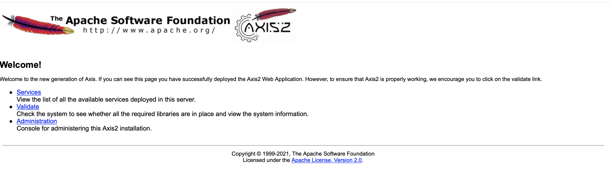

# Web Service Apache Axis2实践

[toc]

## 一、Axis2介绍

阿帕奇的Axis2是一个Web服务JSON（JavaScript的对象符号）/SOAP（简单对象访问协议）/WSDL（web服务描述语言）的引擎，是广泛应用在阿帕奇Axis简单对象访问堆栈的继承者。阿帕奇Axis2Web服务引擎有两个实现：Apache Axis2/Java、Apache Axis2/C。

## 二、环境准备

- 安装JDK，最小的版本是JDK1.5；

- [下载Axis2](https://www.apache.org/dyn/closer.lua/axis/axis2/java/core/1.8.0/axis2-1.8.0-bin.zip)，并将它解压到一个目标目录；

  并将`$AXIS_HOME\bin`和`$AXIS_HOME\lib`添加在环境变量上

- [下载Axis2.war]()文件，并将其放到tomcat的webapps目录下。

测试`Axis2.war`，启动tomcat，访问：`http://localhost:8080/axis2/`



看到Welcome,安装Axis2服务成功，欢迎页面中上的Services:服务列表，Validate:检验系统环境，Administration:Axis2安装管理控制台（登录的默认用户密码在：axis2\WEB-INF\conf\axis2.xml下）：

```xml
    <parameter name="userName">admin</parameter>
    <parameter name="password">axis2</parameter>
```


## 参考：

[**从无到有，WebService Apache Axis2初步实践**](https://blog.51cto.com/aiilive/1385563)。

