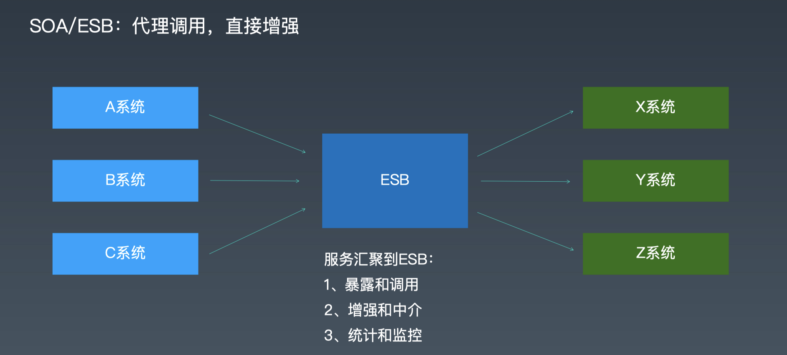
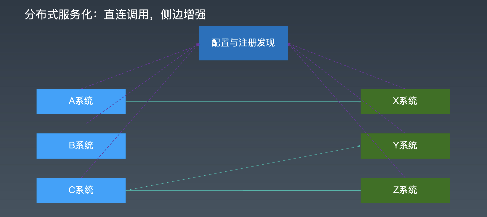
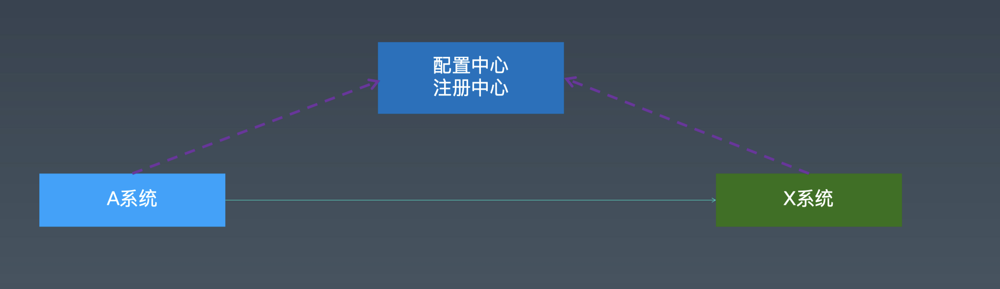
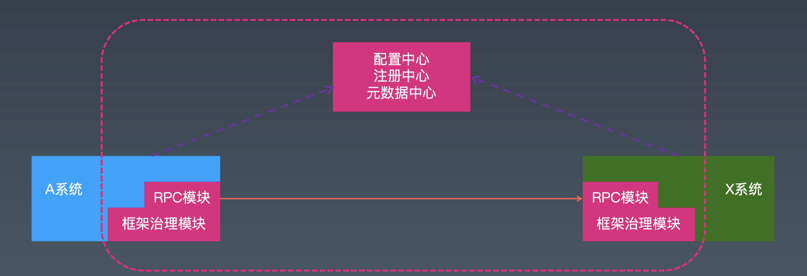
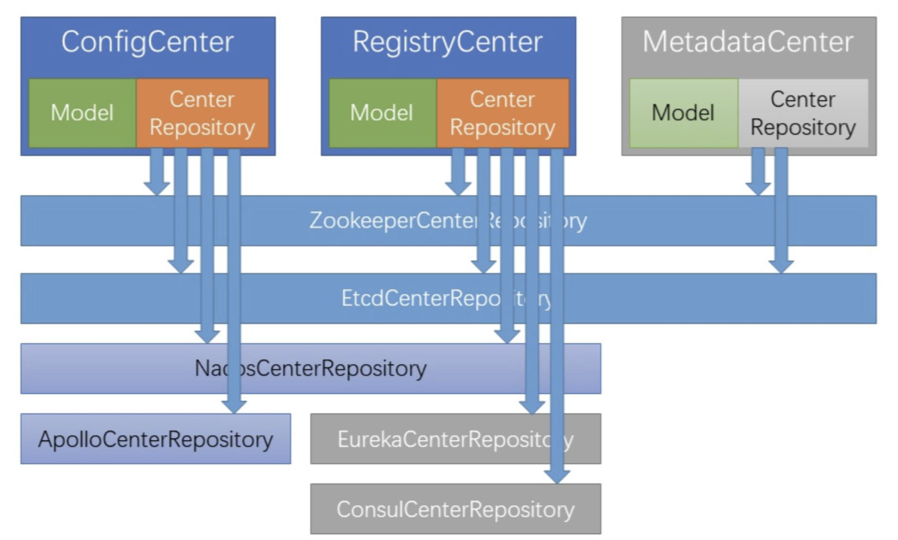

# 分布式服务化

[toc]

## 一、概要

对一个技术人员对考察：

1. （看你的过去）看下学历及过去的工作经验，看你待过的公司及所做的项目。如果技能匹配，所做的业务匹配就更好了；（这些都满足了之后，进行第二步）
2. （面试过程中）首先会聊，你做过的项目，你研究过的技术，这些技术你到底懂不懂。你用起来到底有没有经验，有没有变成自己的东西。还是一直都是别人的，都是道听途说的（一问就问出来了）。第二个会聊，跟我这个岗位相关的（我招你进来，肯定是一个坑在等你，有很多问题需要你来处理，等着你来填坑。）。另一方面聊这个岗位相关的，都是我基于这个岗位的了解，我懂的一些东西跟你聊。看你有什么认知。能不能基于我的一些提示，想出一些办法来。在这个过程中在间接地考察你的一些软实力。这里面就有很重要一点，在你软实力里面，你的学习能力，你的沟通能力。以及你的思维方式。你的潜力够不够大。

3. 招一个人我最终写的面试评价理由，就会写：过往的经验怎么样、现在的能力怎么样、软实力怎么样、这个人有没有接下来发展的潜力（比如面试一个高级开发，看你有没有能力到资深；面试一个资深，看你有没有能力到专家）

一个非常重要的，需要学习的能力：

> 工作流、状态机

**能把自己接触的新的项目里、新的工程里、新的人交流、和从网上学习的资料里了解的各种东西，能立马应用到自己的实际里，来提升自己。**

> 把学到的新的东西，举一反三应用到自己的实践中。就像一个电视剧《女王的棋局》里面，女主能从她经历的人和事情里面所得到的成长应用到自己的生活或下棋里。（遇到一些糟糕的人和糟糕的事也能成长）

## 二、分布式服务化

我们经常说dubbo是一个分布式服务化框架，它的核心处理能力事RPC，但我们很少说它是一个RPC框架。为什么呢？因为dubbo里面可以支撑很多种不同的RPC框架，它超出了一个RPC框架的范围。

分布式服务化：

（1）一个分布式服务化框架首先要考虑分布式的服务化治理，而单独的RPC框架是不考虑这些的。

（2）RPC和分布式服务化和传统的SOA的框架或技术（SOA这些技术，我们通过叫ESB），跟它的一些区别相比我们就能得到一些新的组件，就是我们所说的（XX中心）：配置中心、注册中心、元数据中心；

这些东西是怎么来的？为什么需要这些东西？我应该怎么使用它们才是最合理的？

（3）基于XX中心，就讲到服务本身的注册和发现；

这背后到底是什么？

（4）服务中一个很重要的概念：集群的集群和路由（包括负载均衡）；

现在的互联网应用跟传统的企业级应用有一个很大的区别：规模特别大。一个服务少说部署三台，多的话可能部署三百台。大规模集群下我怎么去管理它——怎么做路由和负载。

（5）最后一块讲服务的过滤（服务的filter机制），加上在上面做的流控（为什么做流控，怎么做流控，常见的流控有什么样的框架和技术）。就着流控再讲一讲响应式。

## 三、分布式服务治理

### 3.1 从RPC走向分布式服务化

从RPC走向分布式服务化，多了很多非业务性的东西在里面。

（1）多个相同的服务如何管理？集群/分组/版本，分布式与集群

- 集群/分组：有一大堆的分布式服务提供者提供同样的服务，我们怎么管理这一大堆的集群。假如我们要对不同的业务使用这一大堆的集群，我们要不要针对这不同的业务进行集群分组的划分（一部分给它用，一部分给另外的一方用）。

- 版本：随着服务本身的升级，我们要版本化，升级新的版本。新的版本和老的版本，怎么来共存。

- 在这里特别要强调一个概念——分布式和集群的关系：

（很多人把这个概念搞混，有人说分布式就是集群、集群就是分布式。也有人说集群比分布式的范围大，也有人说分布式比集群范围大）

我们一般认为这两个概念是有区别的，在一般的场景下，我们会把这两个概念搞混了。

什么是集群：在没有分布式的时候，就有集群了。一个典型的场景：后端是一个数据库，前面是一个Nginx或apache或F5之类的负载均衡，中间部署着业务系统的App（Web应用）。这个Web应用我们部署一个就是一个最简单的单体，一个撑不住了我们部署十个，前面就做一个简单的rebalance。那么这整个是一个集群。

> 集群的定义是：一堆的服务器，大家都在提供服务。但是大家都是对等的。一个节点和另一个节点没有任何区别。大家也都没有任何的分工。就是无脑的但启一台，复制一台。这就是我们所谓的集群。

什么是分布式：首先也是一大堆的集群（但我们不叫集群了，我们叫分布式）一组，里面的每个机器，或者再分的小组，每个小组与小组之间大家的角色是不一样的。比如说我们的微服务肯定就是一个分布式的，因为有一组集群处理订单，有一组机器处理用户，还有一组机器在处理我们的商品系统。这样的话我们就把原本一个大的系统，拆成了很多小的处理单元。大家通过相互之间的协作（比如商品先下了订单，下订单的过程中需要处理下用户信息，校验下用户的余额，扣下用户的钱，相互之间是有协作关系的），这种处理我们叫分布式。

集群：之间无脑的复制，没有协作关系。

（2）服务的注册和发现机制？注册中心/注册/发现

分布式下我们每一个模块，就像流水线一样。之前没有做分布式，每个机器处理所有的东西。相当于从一个工厂接一个需求的订单（比如做十双袜子，这个人就开始种棉花、纺线、织布，最后把袜子编好，染色，一个人把这些事情都干完，交给别人）。分布式下就有几波人就像流水线一样去干不同的东西，在这个流水线上一段的输出是另一段的输入，最后拼起来。这样每一段都可以随时加人。

微服务的思想跟（流水线）这个事儿事非常像的，每一段都可以随时加人，新加的人怎么能在这个协作体系里加进去能立马工作，而且能跟我们的上下游都无缝的衔接上（大家能一块的玩耍）。所以就需要有一种机制把新来的人注册成处理某个模块或某个功能的工人（worker），同时，如果需要干活的时候能够及时的找到它。这就是服务的注册和发现机制。而不是写死的，不像我们之前，RPC调用方只有两个，A必须调用B，没了，那就不需要这种（服务注册和发现）机制。但如果多了，调用者有10个，提供者有100个，那么这个时候其中一个调用者去调用的时候，到底去调谁，需要有某种机制。

（3）如何负载均衡，路由等集群的能力？路由/负载均衡

在如此复杂的局面，如果让n个人调用另一方的m个人，大家的工作量事相互匹配的，不能让某些人累死，某些人闲死。就跟我们工作里面分配任务一样，如果你分配的任务太不均匀了，这样就导致我们一组机器（或者我们泛化的时候，我们叫一大堆集群）它们之间的利用率是不足的。

（4）熔断，限流等治理能力？过滤/流控

假如我们现在流量特别大的时候，我们该怎么办。就像有秒杀功能，一瞬间过来（就如发洪水一样，我们的堤坝拦不住了），我们应该怎么样。这些东西我们都需要处理。

因此，我们的系统在服务的过程中是很复杂的。

（5）心跳、重试等策略

假如一次调用失败了，可能是网络抖动，也可能是我们负载均衡切换了一下等，导致这次请求失败了，也许再调用一次，我们就会成功，要不要重试一下。

很多时候，一台机器和另外一台机器，它们之间是不是通的，一般情况下我们不知道，如果我们有一种心跳机制，一直去ping它（就跟网络一样），我们的数据库连接池就有这样的机制。如果ping通了，它给我一个正常的响应，那就是通的。这块也可以做优化：如果一段时间有正常的服务调用，那么这次正常的服务调用，就相当于我们ping了一次，我就可以不额外的启动线程去ping它。如果没有服务的调用，就需要一直去ping它，保证服务的可用。

（6）高可用、监控、性能等等。

这块也很重要。DevOps（开发运维）和SRE（系统稳定性工程师），这两者是配套的。

把我们一般理解的运维拆分成两块，一块叫业务运维，一块叫基础运维。

- 业务运维（DevOps）：正常线上出现了bug（客户说他线上的钱不对，少钱了），业务上的，正常的运维没法搞定，那这块业务谁开发的，谁去处理。把一部分接客的工作丢给开发，让其自己搞；
- 基础运维（SRE）：底下基础设施的搭建、网络、服务器、一些基础的中间件，包括高可用等底层的东西交给所谓的SRE去干。

业务相关的交给开发人员监控，大部分底层的东西交给SRE。

### 3.2 RPC和分布式服务化的区别

- RPC主要是一个技术概念（就是远程调用），具体调用啥它不关心。

  如果做一个RPC，很简单，主要两步：1.  参考前面的自定义RPC；2. 再考虑一下性能的优化，使用Spring-boot等封装下其易用性。

- 但如果上升到分布式服务化这样的高度，就完全不一样了。因为分布式服务化里的**服务**是一个业务语义，不是一个技术语义的东西。

  分布式服务化里的服务其实指的是我们为了完整的做一个业务，我们所提炼出来或者抽象出来的那样的功能河在一起的合集叫服务。

  所以，一句话来说：服务不是一个接口。虽然我们经常用一个接口或一个接口文档来描述服务，但服务不是一个接口。

- 服务!=接口

  我们可以用接口来表达服务，也可以用其他的东西表达服务。但服务本身不是一个技术。就像转账本身代表一种业务能力，它是服务，可以把A的钱转给B。我们如果把这个转账的操作用一个接口和这个接口各种相关的描述文档、图等合起来去表达一个服务，这是可以的。但是我们任意的写一个接口，它肯定不是服务。

  如果我们以分布式服务化框架的角度来看RPC，从RPC到分布式服务化差两块东西：

  - 第一个，我们一个大的业务系统它要做拆分，要做分布式服务化了，那么规模大了，我们就要考虑前面提的与集群相关的各种非功能性的需求（稳定性、可用性）；
  - 第二个，就是我们在做具体的服务化方案的时候，我们的服务到底应该怎么设计，应该怎么划分，并不是我们摆放几个接口我们就完成了服务化。而是我们要设计好，在我们的分布式服务化的体系里，哪些是需要独立做成接口的。哪些是要做成子系统的。

  就像淘宝早期，那三个子系统：TC（交易中心）、IC（商品item中心）、UIC（用户中心），这三个中心里面再有一些接口和服务，做一些这样的设计，再配套上我们的RPC，和我们的RPC上面长出来的非功能性需求。它们整个合起来就是我们的分布式服务化框架。

>  在基督教里，JHWH（这个词是上帝），上帝这个词太大了，没有任何人能说出它的名字，因为它的能量太大了，任何人，甚至天使都承受不了。所以大家就用一个代号来表示 耶和华。但是JHWH代表上帝，但上帝不是JHWH，因为JHWH只是一个代号。

### 3.3  分布式服务化和SOA/ESB的区别

#### （1）基于ESB实现SOA

基于ESB（企业服务总线）实现的SOA（面向服务架构）是这样的：



ESB是一个容器：我们一般基于“WebServer或J2EE Server，再加上一个内置的MQ“作为骨架，在上面实现很多EIP（企业集成服务模式）的东西，将它们串起来形成一个容器，在里面能干任何事情（部署一个war包就行）。

然后我们可以把后面的（比如某个企业里面有30个系统）系统，这30个系统的核心能力做成RPC（早期的话都叫WS，WebService。就是XML 、SOAP），然后将它们注册到ESB上面。ESB上面有一个UDDI（统一描述、发现和集成协议）的东西（就是一个大的目录），在这个目录上就可以看到所有的业务服务（一个一个在上main列出来）。这个时候我们所有的服务就被ESB管理起来了。

这个时候，不管是内部系统还是外部系统都可以通过ESB来调用这些服务（这样ESB就像一个网管）。这些请求都是由ESB接入进来的，ESB就能将这些RPC的东西转发到后面去（早期只支持WebService，后期ESB基本能支持各种协议）。

可以在ESB中加一些增强或过滤的处理。我们常说计算机里面的任何问题都可以通过加一个中间层来解决，ESB就是一种最大可能的去应用了这种模式。

对ESB来讲：

- 第一，服务能够注册进来，然后暴露出去；
- 第二，可以做增强和中介，比如ESB自己去调用两个服务，然后给你组装一下，也就是服务的编排、服务的流程等，这些在ESB中统一叫中介处理。
- 第三，因为所有的调用都经过ESB，所以ESB可以做统计和监控。

ESB很强大，但也有缺点：

- 如果ESB宕了，服务的调用就不能用了；
- 如果的调用都要经过ESB（经过中间这一跳），如果网络比较好，那么这一跳可能也就多了2毫秒；

早期为什么大家都要用ESB：

- 对电信和金融类的，它们的核心系统来说，我们不希望它接收任何的请求，它只接受一些指令，比如8007代表转账、8010代表记息。不希望任何的业务系统直接调我，他们就在前面加了一层前置系统，后来业务系统发展得越来越复杂，就需要核心系统支持更多的东西，但这个时候核心系统不想改动，因为核心系统的技术比较老，该动起来太费劲，而且万一改动出问题了，上面上百个系统都会收到影响。所以就在前置系统上改，后来就有了安全验证（tocken，mk）、协议报文转换（比如将REST转换成MQ的调用），这样前置越来越复杂，前置就演变成为**综合前置**、**综合大前置**，再演变就成了**ESB**。所以ESB天生和网管有非常大的关系。
- 在ESB上，可以做到对调用者是没有侵入的，对于服务提供者可能需要侵入（因为这些都是老系统，根本没有提供对外开发的接口），但通过改造银行和电信还是使用这些老系统，因为这些系统都不是银行自己做的，都是其他公司做的（第一个系统是神码公司做的，第二个系统是长亮公司做的，第三个系统是宇信公司做的，还有一个是文思海辉做的），这些公司所用的技术栈都不同，并且这些厂商之间都不是不通的，所以早期它们之间就遇到一个问题，叫“信息孤岛”，每套系统都有自己的数据库。在用IDAP技术将其打通之前，它们都是孤立的。所以在早期它们就有一个强烈的需求，在各个系统上开放一个口子接入ESB上，然后通过ESB来互相访问。那么企业的整个IT服务能力都在ESB上，这就是早期ESB流行的原因。

互联网上这么搞，就会出现：第一，太重；第二，多一跳（代表着性能会下降）。所以对于这么复杂的东西，在银行、电信上面还用的不少，但在互联网上几乎没人用了。互联网偏金融支付的公司还在用ESB这套东西，比如支付宝（蚂蚁金服），他们有一套ESB。

#### （2）分布式服务化：互联网化的SOA实现



- 引入旁路及旁路的局限

  **使用XX中心（配置中心、注册中心、元数据中心）替换ESB组件，原本的增强功能放哪里？**

  

  在互联网上，我们期望的是服务之间是能够直接调用的，不走中间层。想调用谁直接把地址指向它就行。但是我们又想支持大规模的、动态的调用者集群和服务提供者的集群。我们就需要在旁边做一个旁路，在旁路上做ESB的事情。

  但将ESB上所有事情都在旁路上做，还做不到：在旁路上做，好处是少一跳。问题是，旁路上好多都是异步的。需要有某种机制，将旁路上的东西能分别拿到客户侧和服务侧。所以，基于旁路的这种设计，我们有时候也把它称为互联网化的SOA实现。

  这个时候我们需要在旁路上做：配置中心、注册中心、元数据中心。但光靠旁路，调用方和服务方没有直接的关系，旁路没办法干预它们的调用，那么这个时候就需要有一些额外的处理。

- 在调用侧和服务侧做增强

  

  除了旁路之外，我们还需要在框架这一侧的里面做一些事情，比如：控制服务走向的RPC、服务治理模块。这些模块来做增强的部分，增强的规则从旁路上来。

  我们做的管控体现在旁路里，通过修改旁路，旁路将这些信息传递给业务侧。业务侧再拿到我们同步给它的配置、注册、元数据等信息来确定调用的链路该怎么走。

  将上面的东西合起来，其实就是原来ESB的功能。

  为什么要有旁路，主要是因为调用侧和服务侧是无状态的，而放在旁路上的东西都是有状态的。这样拆分之后，我们也做到了尽量不影响业务代码（影响了业务系统，但没有影响业务代码。因为增强的部分我们可以做成一个jar包，业务系统只需要引入我们的jar包就可以了）。

#### （3）SOA是什么

SOA这个概念产生于2004年左右，国内在2006年发行。刚开始有的人认为ESB就是SOA，也有人说SOA是一种架构风格。后来大家统一了说法——**SOA是一种架构风格**。

SOA是一种架构风格：它是一种企业级系统（不是针对单个系统）的架构风格，不管是新系统还是老系统。（如果有人说他做了一个单个系统是分布式的，这就有点扯淡了。）

**我们把整个企业所有的业务能力，变成可复用的，基于RPC的服务和接口，这就是SOA。**

再往后演变，因为现在做ESB的越来越少了，所以现在很多人做API的管理器（API Manager），比如：WSO2ESB。

#### （4）问答

- SOAP和SOA什么关系

SOA（架构）----ESB（早期一种SOA的实现）---WebService（在ESB中常用的技术）----WSDL（WebService的描述语言）---SOAP（是WSDL中重要的部分）

> 这种关系，关联不大，因为世界上任何两个人，中间不超过6个人，一定能关联上。

- 预付卡

  互联网最值钱的业务：支付牌照、互联网支付、预付卡、收单。

- RPC和服务

  RPC是一个纯技术语言的东西，服务是有业务语义的。

## 四、配置/注册/元数据中心

**这三个中心的划分时逻辑概念：很多时候我们会把config+meta放在一块。**

- 配置中心：管理系统需要的配置参数信息。

- 注册中心：管理系统的服务注册、提供发现和协调能力。

  如果我们注册一个服务式框架，那么注册中心就是RPC的服务。还有什么？

- 元数据中心：管理元数据信息。（在之前是没有这个东西，那它到底是个什么？）

这三个中心的共同点：都需要保存和读取数据或状态（三个中心都是有状态的），同时需要变化通知（比如我们配置的线程池原来大小是20，后来改为40。所以需要能对配置进行变成，并将变更都让知道。）

这三个中心的不同点：

- 配置是全局的非业务参数（比如端口号、线程池大小，这些东西不影响业务，关键是用不用得好的问题），那么配置里面的东西可以分为两大类：一类是系统启动时候需要用的东西，比如端口号，没有启动不了）、另一类是运行中用到的东西（比如业务逻辑的开关，这个东西本身没有业务属性，是我们给它附加上的。比如：log原本配置的输出级别是error，后来我们配置成debug，去看更详细的东西）；
- 注册中心一般我们认为里面配置的是整个系统在**运行期**各个节点大家当前的**临时**状态信息，而且在随时变化；
- 元数据：我们的核心业务模型，我们称之为元数据。比如用来描述服务的。

### 4.1 为什么要有配置中心

为什么要有配置中心？没有配置中心的时候我们是怎么干的？

- 大规模集群下，如何管理配置信息，特别是批量更新问题。

  在没有配置中心的时候，一种方式是我们的ip和端口会直接写到配置文件中，最后打成一个jar包。但这种方式对于大公司不大好管理（机器太多，不好更新）。

- 在大公司和金融行业，一般要求开发、测试、运维分离（物理隔离）

  项目启动的时候能自动根据环境类型（开发环境、测试环境、运维环境）来使用不同的配置。

- 运行期的一些开关控制，总不能不断重启？

  希望配置修改后能实时生效。

基于上面的诉求，有了我们现在的技术：Zookeeper（前期用Zookeeper来做配置管理）、etcd（后来基于Go语言/云原生的框架有了etcd，注意etcd是小写）、还有两个常用的配置中心：Nacos（阿里的）、Apollo（携程的）……

### 4.2 为什么需求注册中心？

有了配置中心，我们可以把服务化的一千台机器的配置统一管理起来。这一千台机器运行起来之后，每天都会有新的补丁或新版本发布，一直在动态变化，怎么让这些动态的变化相互之间不影响别人。当集群里，当有服务的提供者发生变动的时候，能够立马被哪些服务的消费者立马能感知到，它们能不再去调用哪些死掉的、老的生产者。

所以，基于这些问题，就有了一些办法：

1. “hello.htm===>ok”：早期通过这种机制做一个心跳检测，判断这台机器能不能用

   淘宝早期，会在每个服务下的“ip+web暴露的端口”的根目录下提供一个hello.htm的页面或一个文件，文件里面就有两个字符“ok”。

   首先由运维通过一系列脚本部署服务，然后利用脚本直接在web服务的根目录下，通过echo命令，把“ok”两个字符写到这个hello.htm文件里。

   也就是说，在服务提供者的这台机器启动之前（比如这台服务的ip是`10.1.1.1`，端口是88），然后访问这个hello.htm文件，如果直接错误，代表访问不了。直到能访问到这个文件，并且返回ok结果的时候，才会为这台机器分配流量。

2. DNS层、VIP层、LVS层：负载均衡策略

   后来有了DNS层，或VIP层，甚至更底层的LVS层的负载均衡策略。就可以做得不这么简单粗暴了。当机器启动之后，就自动把机器的域名加载某个域名管理器（一个域名可以绑定多个ip）。

   这种方式不好的地方在于：依赖外部地方网络配置，实时性不好。

3. 主动报告+心跳

   不依赖外部的东西，每一个不管是consumer（访问者）还是provider（提供者）我们都可以建立一种机制，不断给我们县相关的机器做一种心跳，如果心跳在代表大家是通着的。

   无论是消费者还是提供者，我们在启动的时候，都把我们的信息注册到一个单独的服务器上。然后大家需要感知其他机器的时候，都去这台机器上拿。这个机器最好实现一种功能，当某台机器下线了（网络断开、超时），它能自动把我去掉，也就是把服务都管理起来。

### 4.3 为什么需求元数据中心

一般来说，没有元数据中心问题也不大。比如，我们所有来回调用的服务里面都是带了自己的描述信息的（描述自己服务的定义的），那么不用元数据中心也行。

有元数据中心会更好，因为有了元数据中心，我们可以看到所有服务的定义。

如果RPC间的调用，这些调用信息和元数据信息绑定了，就可以进一步简化RPC间数据的传递（原来需要带的信息就不要带了，因为可以通过元数据中心拿到这些定义）。

### 4.4 如果实现XX中心

这三个中心最重要的两个要素是：

1. 需要有存取数据的能力，特别是临时数据的能力。

   要有保持状态的能力，特别是临时节点上的状态数据。存取数据这块需要持久化的主要是配置中心（CC）和元数据中心（MC），中间状态的是注册中心（RC）。

   在注册中心，当有新的节点是，新的节点能在注册中心发现。如果超时了，这个临时节点信息需要能直接去掉。这就是临时数据的能力。这就是大家比较喜欢用zookeer来实现注册中心的原因：zookeeper 天生支持我们创建临时节点。

2. 需要有数据变化的实时通知机制，全量或增量。

   如果没有这种机制，我们需要每隔30秒或一分钟去把配置信息拉取一下，和对应版本的配置信息作对比，看是否变化，将变化了的内容应用到我们当前的节点上。

   如果没有这种机制，我们修改的东西不起作用，那就白搭了。

为了在顶层隔离不同的环境，我们通常基于某个组件（称之为基座）在其上面包装一层来作为我们的XX中心。包装之后我们有个概念叫namespace/group。

> 比如我们基于zookeeper上面做一些业务的东西，引入namespace概念，就可以天然的把某些东西隔离。节点相同，但包名不同，那就是不同的东西。
>
> 我们通常在zookeeper中目录的第一层作为我们的namespace。在dubbo中，如果我们没有配置namespace，那么它会把配置内容写在一个"/dubbo"的路径下。如果我们配置了组（group）或namespace，配置信息就是放在group/namespace路径下面。

一个经典的案例（为某科研软件设置的配置中心、配置中心）：

> 通过使用各种基座来实现配置中心、注册中心、元数据中心。

配置中心可以使用的基座有：Zookeeper、etcd、Nacos、Apollo（阿波罗）

- Apollo是一个完善的配置中心，但它对注册中心支持的不够友好，因为它没有临时节点的概念。
- Nacos有两套API，一套是对配置中心使用的，一套是为服务里面定制化的注册中心使用；

元数据中心，一般能用来做配置中心，做持久化的，就可以做元数据中心，因为它和配置中心相比只有业务的不同，是人为分开的。

注册中心：除了Zookeeper、etcd之外，Eureka和Consul是专门用来做注册中心的，特别方便用来保存微服务的注册信息的。

> 作业实践：用Zookeeper来实现一个注册中心。



### 4.5 问答

- 本地配置的备份

配置中心这种场景，一般的设计思路是本地得保留一份数据持久化，万一重新启动时连不上配置中心，可以读取本地文件保证本地能启动。

- 注册中心的缓存

  比如在使用zookeeper的时候，通过curator client操作zookeeper的时候，里面默认带一个guava cache。因为zookeeper的所有变动都会通过广播传到客户端去。那么第一次访问zk数据的时候，我们在本地cache住。当zk上有任何变动，我们只需要同步更新一下本地的cache。这样就能一直把本地的cache当作实际的数据。

  ignite  hazalcast就是这么玩儿的。

- zookeeper的客户端

  zookeeper自己提供了客户端，但我们一般使用apache curator，因为apache curator里面添加了内存缓存机制，这样就减少了对zookeeper的交互。

- 元数据的应用

  （1）dubbo-admin中让其像rpc swagger一样做线上单元测试，就必须开启元数据的配置。

  如果不开启元数据配置，zookeeper上就没有元数据信息，那么就没办法做微服务的测试。

  ```
  dubbo:
     metadata-report:
        address: zookeeper://localhost:2181
  ```

  （2）如果有了元数据信息，我们就可以不依赖任何的consumer和provider去描述一个服务本身的结构。甚至可以基于它做代码生成。这些元数据信息就相当于Web Service的WSDL、IDL。

## 五、服务的注册和发现

上面提到注册中心有两个基本的能力：一个是存储数据，一个是变更通知。那么怎么具体去做呢？

### 5.1 服务的注册

#### （1）服务何时注册

服务提供者启动的时候：

- 将自己注册到注册中心上（比如zk实现的）的临时节点里；
- 停止或宕机时，临时节点消失；

#### （2）需要设计的点：注册的数据格式

在zookeeper上，我们可以写一段字符串或写一段数据，但我们写什么东西能表示我们当前的服务，需要一个小小的设计。

设计思路：我们定义一个对象，用json对其序列化了，就变成一个大的字符串，然后把它塞到zookeeper里面。

（1）节点key，代表当前服务（或者服务+版本）

（2）多个子节点，每一个为一个提供者的描述信息

**所有的设计，都是从简单的搞起，慢慢叠加和进化到复杂。**

#### （3）代码实现

我们最好写两个注解（@RpcfxService、@RpcfxReference），在这里注解的处理里面，把我们要配置的Bean、服务提供者的ip和端口信息序列化之后写进zookeeper里面。

> 前提是我要引入curator-client

- 定义一个Bean，表示服务的表示信息

  ```java
  public class ServiceProviderDesc {
      private String host;
      private int port;
      private String serviceClass;
      // group
      // version
  }
  ```

- 在服务启动的时候，将服务的描述信息写入zk里面

  ```java
  public class ProviderApplication {
     // 先简单粗暴的实现，再做调整
     public static void main(String[] args) {
       ServiceProviderDesc desc = new ServiceProviderDesc();
       desc.setHost(InetAddress.getLocalHost().getHostAddress());
       desc.setPort(8080);
       desc.setServiceClass("com.hef.service.OrderService");
       // ......
     }
  }
  ```

### 5.2 服务的发现

我们将服务注册到注册中心之后，如何让服务的调用者知道并拿到这些服务信息呢？

思路：先访问zookeeper，拿到服务的注册列表，拿出来之后从里面确定服务提供者的具体URL。

#### （1）获取服务提供者URL列表

从注册中心代表服务的主节点拿到多个代表提供者的临时节点列表，并本地缓存。

#### （2）从列表中选择一个

根据router和loadbalance算法从其中的某一个执行调用。

#### （3）进一步进化：监听服务提供者节点的动态变化

如果可用的提供者集合发生变化时，注册中心通知消费者刷新本地缓存的列表。

#### （4）代码实现

在`Rpcfx.java`代码中写固定的服务url，改成zkurl。

```java
 */
public class Rpcfx {

    public static <T> T createFromRegistry(final Class<T> serviceClass, final String zkUrl) {
        // 利用curator获取到zookeeper到服务提供者列表
        // 优化：每次调用这个方法都要从zookeeper上拿一些这个列表，显然不合适，
        // 最好的办法是，这个列表是我们第一次从zookeeper拿到这个列表后，缓存到本地。然后监听zk上的临时节点，当临时节点有变化的时候，会主动给我发事件，根据事件更新这个列表。
        List<String> urls = new ArrayList<>(); 
      
        // 根据route、loadbalance获取到一个url
        String url = urls.get(0);
        return create(serviceClass, url);
    }
  
    public static <T> T create(final Class<T> serviceClass, final String url) {
      //......
    }

}
```

## 六、服务的集群和路由

### 6.1 服务的集群

如果有多个服务提供者，这个时候我们该怎么做？

> 前面提到很多方案：分到不同的namespace，用不同的组、划分不同的环境隔离、加版本。

对于完全能力相同的多个服务，我们希望它们能一起协同工作，分摊处理流量，有两种方案：

- 路由：从一个列表中选出一部分。调用路由的接口，传入是一个url的list，传出也是一个url的list。
- 负载均衡：多对一，只能选择其中一个。传入一个url的list，传出一个url。

### 6.2 服务路由（Service Route）

路由的基本原理跟网关的路由是一样的，常见的方案有：

（1）基于IP段的过滤，或者基于整个IP段的过滤；

比如，如果这次选用10.1.1.5~10.1.1.7段内的IP，10.1.1.7的ip就会被过滤掉。

（2）再比如服务都带上tag，用tag匹配这次调用的范围。

dubbo里面就有tag，tag如果没有配置，就会忽略这个tag。

```java
@DubboService(version="1.0.0", tag="red")
```

### 6.3 服务的负载均衡（Service LoadBalance）

路由先故意把流量偏移到某几台机器上。负载均衡，就是字面意思，故意让其均衡。

#### （1）四种常见的负载均衡策略

多个不同策略，原理不同，目的基本一致（尽量均匀）：

1. Random（带权重）：不需要记录状态。dubbo默认的策略

   比如从0～100随机出一个数，如果这个数组在1～20内，就选用第一个url。

   **随机的好处是，我们可以根据机器的性能为其添加权重参数。**

2. RoundRobin（轮询）：需要记录状态，要知道上次访问了谁。

   轮询就是比如有五台机器，轮流访问。

   **轮询的随机性是最好的，但如果每台机器的性能不一样，轮询就不好了。**

3. LeastActive（快的给多）：通过一个算法来实现对不同性能的机器实现随机访问。

   为每一个机器设定一个active数，当为它分配一个任务这个active数加1，当一个任务处理完了这个active数减1。

   每次选择active数最小的那台机器，为其分配任务。

4. ConsistentHashLoadBalance（一致性哈希）：同样参数请求到一个提供者

   对一个请求做一次hash，看这个hash值能匹配和那一段匹配。每一段都对应一台机器。

   默认分成160段，将服务提供者对应到160段，几十个段对应一台机器。这样的划分能让我们的流量分配的更加均匀。

### 6.4 代码实现

和ESB不同的是，分布式服务化的负载均衡策略是在客户端（服务的消费端）进行的。

```java
public class RpcfxClientApplication {
    public static void main(String[] args) {
        UserService userService = Rpcfx.create(UserService.class, "http://localhost:8088", new TagRouter(), new RandomLoadBalance());
        User user = userService.findUser(1);
        System.out.println("find user id=1 from server: " + user.getName());
    }
}
```

```java
public class TagRouter {
  List<String> route(List<String> urls);
}

public class RandomLoadBalance{
  String select(List<String> urls);
}
```

```java
 */
public class Rpcfx {

    public static <T> T createFromRegistry(final Class<T> serviceClass, final String zkUrl, Router router, LoadBalance loadBalance) {
        // 利用curator获取到zookeeper到服务提供者列表
        // 优化：每次调用这个方法都要从zookeeper上拿一些这个列表，显然不合适，
        // 最好的办法是，这个列表是我们第一次从zookeeper拿到这个列表后，缓存到本地。然后监听zk上的临时节点，当临时节点有变化的时候，会主动给我发事件，根据事件更新这个列表。
        List<String> invokers = new ArrayList<>(); 
        
        // 通过 route 获取一个子集
        List<String> urls = router.route(invokers);
      
        // 通过loadbalance获取到一个url
        String url = loadBalance.select(urls);
      
      
        return create(serviceClass, url);
    }
  
    public static <T> T create(final Class<T> serviceClass, final String url) {
      //......
    }

}
```

## 七、服务的过滤和流控

这块非常的重要。

### 7.1 服务的过滤

举例，可以添加filter对三个地方：

- 通过filter跳过Route和loadBalance；
- 通过filter代替真实的远程调用；
- 通过filter对远程调用对返回结果进行包装；

### 7.2 服务的流控（Flow Control）

#### （1）为什么需求流控？

我们每个系统的容量都是有限的，这样当我们系统流量特别大的时候，我们可以做一个选择：是让部分服务能力继续提供工作，还是直接不提供服务（直接崩掉）。

这两个选择选一个，一般情况下我们选择让服务能够部分工作是比较靠谱的。这样，只要他没有死掉，还能继续工作，等系统的服务压力解除了，他能自动恢复到原来的服务能力，这就是回弹性。

> 大家可以搜“背压”。

#### （2）流控的三个级别

通过三个级别的处理办法来应对流控：

- 第一个级别的办法：限流（内部线程数，外部调用数或数据量）。

  比如：让大家排队办业务， 或者限制每个人每次只需提取一万，每天最多提取100万。

  通过三个角度考虑限流：内部线程数（排队窗口的数量）、外部调用数（限制用户数）、数据量（限制业务能力）

- 第二个级别的办法：服务降级（去掉不必要的业务逻辑，只保留核心逻辑）

  只保证核心业务的服务能力，比如银行只保留提取现金的业务，暂停理财业务。

- 第三个级别的办法：过载保护（系统段时间不提供新的业务处理服务，积压处理完后再恢复输入请求）

  比如银行提前关门，处理积压工作。

这三个级别的办法的共同点是，服务还在工作。

有个特别好的框架：sentinel，先定义资源，再定义针对资源的规则。

Shiro，框架比较类似。

## 八、实践

[进阶实践-分布式服务化]()

