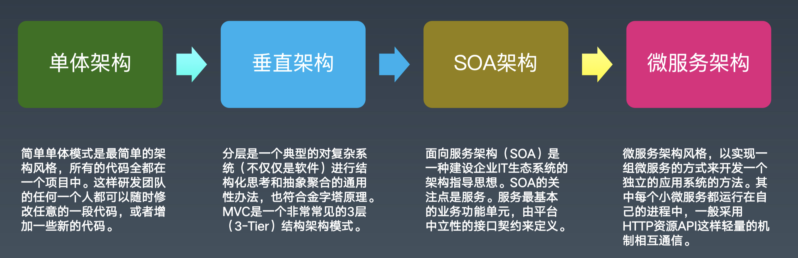
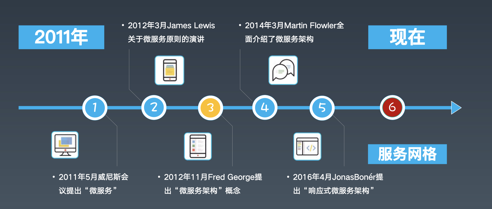
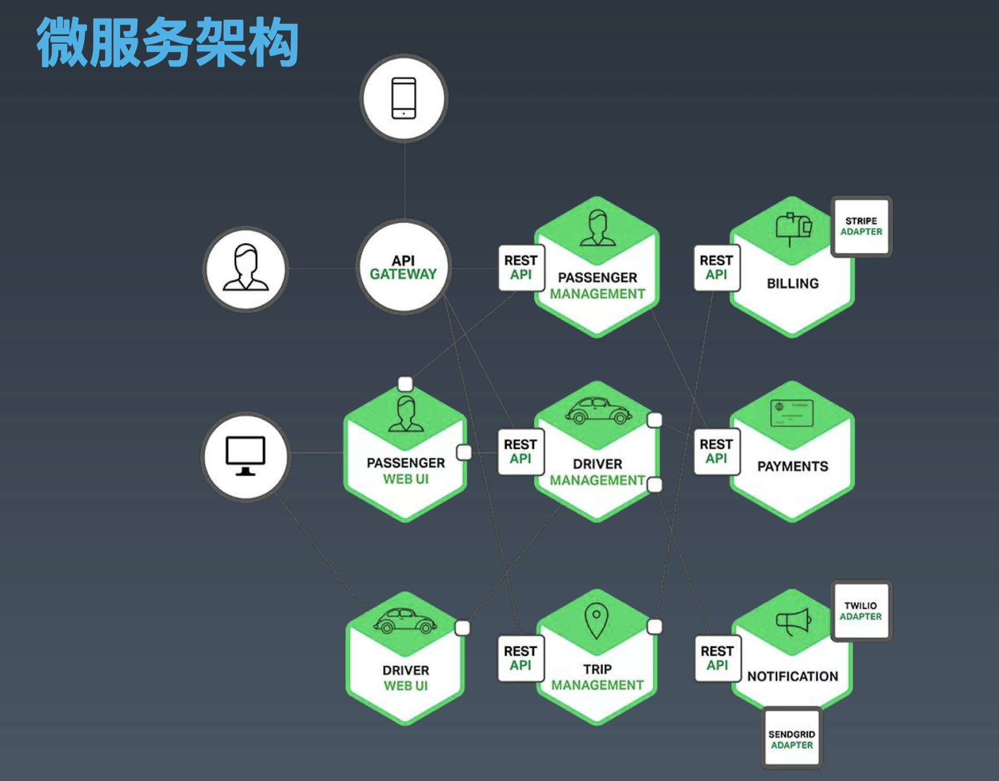
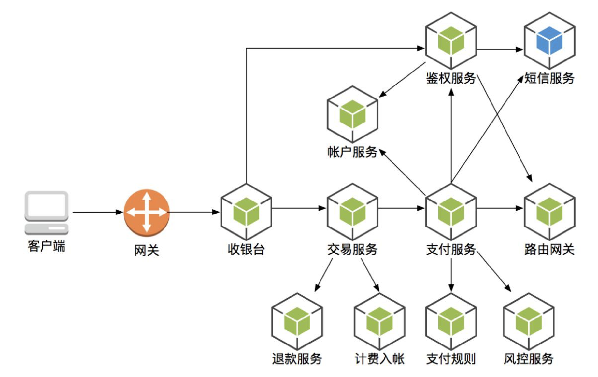
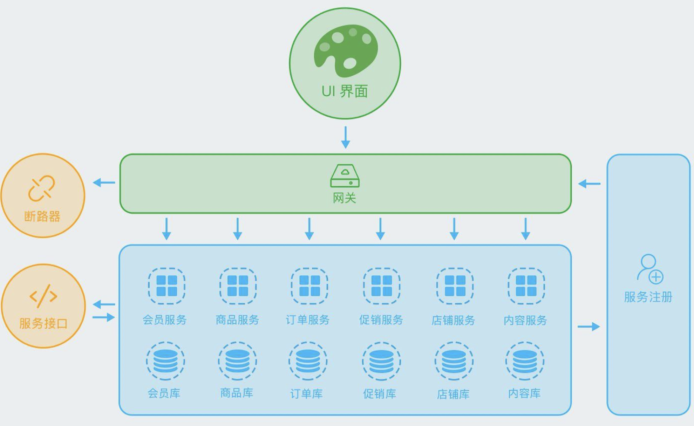

# 分布式服务：SpringCloud与微服务架构

[toc]

## 一、概述

（1）微服务架构发展历程；

微服务是怎么来的？你不知道它是怎么来的，你就不知道它现在是什么样子。

（2）微服务架构的应用场景；

（3）微服务架构的最佳实践；

六个微服务的最佳实践。

（4）SpringCloud技术体系；

（5）微服务相关框架与工具；

## 二、历史：微服务架构发展历程

### 2.1 微服务的发展历程

- 1999～2008 是国内大公司（别是金融、银行、证券、保险）这些业务的电子信息化时代；

  在之前都是手工记账。

  所谓的电子化，就是取代手工操作的事情。

- 2008～2014 是网络化和移动化的时代

  很多大的公司在04到08年，或再晚点到10年，基本实现了IT系统的全部大集中。

  随着手机、pad的普及，把网络迁移到手机端和移动端。让几乎所有的人都接入互联网。

- 2014年至今  数字化智能化

  目前最常用的词儿”数字化转型“——数据驱动业务。用IT技术本身，驱动业务的变化。

在这个发展的过程中，发现我们的业务越来越复杂，数据越来越多。同时，很多业务系统，对各种非功能需求要求越来越高、越来越严（比如对性能要求，一致性）：性能、稳定性、一致性、可用性、扩展性、可维护性（可以不断在上面改）。

当这些业务的需求不断升级，而在之前架构基础上进行开发又做不到的时候，矛盾就出来了。这些矛盾和这些实际的需求在推动IT架构的整体变革。特别是软硬件的发展，推动者架构的发展。

- 单体架构：早期的单体架构，简单，打一个war就可以部署运行；
- 垂直架构：当引入Spring之后，开始对系统分层，部署的时候还是一个单体，但我们在开发过程中就有了一个开发拆分的层级；
- SOA架构：再往后，对于大公司，有了很多孤立的子系统，它们相互之间没有连通，形成了“数据孤岛”。就有了基于ESB的SOA架构，将各个系统打通。
- 微服务架构：不按照系统划分，而是按照业务服务划分，每个服务开发成单独的项目，部署成一个进程，然后它可以独立扩展，并且使用独立的数据库，由一个团队或一个人来维护它。每个人只需要维护一小片业务。

- 2014年是微服务爆发的一个时间点；
- 当前比较新的概念是：服务网格、云原生；

### 2.2  微服务架构图

#### （1）微服务架构图：出行

- 在下面的图中：每个六边形代表一个服务
- billing（计费）、passenger（乘客）、driver（司机）、payments（支付）等这些微服务通过RESTAPI对外提供服务‘；
- 服务和服务之间是可以相互调用的；
- 服务通过一个APIGATEWAY（网关）对终端外部提供服务；
- 在内部可以直接通过Web系统访问微服务（不需要经过网关）；
- Web系统可以访问微服务；

#### （2）微服务架构图：银行

####（3）微服务架构图：电商

- 将业务划分成各种微服务，UI界面经过网关访问微服务；
- 在两侧加上服务治理：注册发现、服务控制（断路器、限流等）

### 2.4 现在正在发展的四种微服务趋势

#### （1）响应式微服务

“响应式微服务”这个词儿来源于“响应式编程”，“响应式编程”这个词儿来源于“响应式宣言”。

- 响应式编程

响应式编程或反应式编程是一种面向**数据流**和**变化传播**的声明式编程范式

- 响应式宣言

**即时响应性**：系统任何时候都应该对用户的输入产生响应，而不是死掉；

**回弹性（可恢复性）**：当压力大的时候，可能服务能力需要降级。当压力消耗得差不多的时候，整个系统能恢复到当初的健康状态；

**弹性**：就是伸缩性，当系统压力特别大的时候，可以通过添加机器来解决，表示系统的可扩展性。

**消息驱动**：通过消息触发请求，屏蔽了线程池等技术细节。

常见的响应式编程框架：[vert.x](https://vertx.io/)、webflux等。

### （2）服务网格

微服务如何从微服务变成服务网格的：[预习材料：Spring-03.pdf]()

