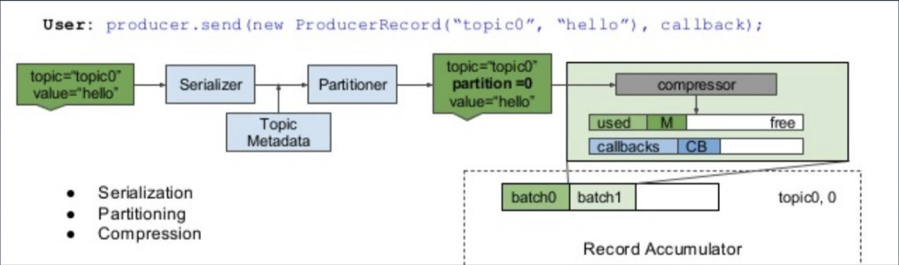
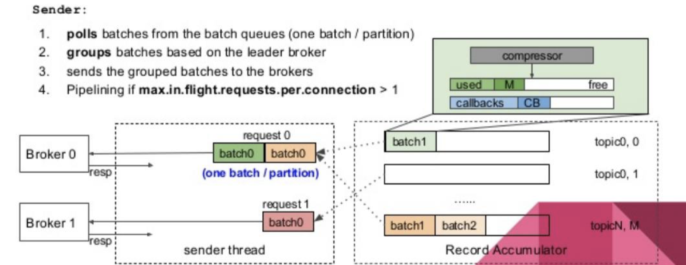

# 分布式消息：Kafka消息中间件

[toc]

## 一、什么是Kafka

Kafka 是一种分布式的，基于发布 / 订阅的消息系统

> 所有消息都是基于Topic。

kafka被设计的目标：

1. 持久化和性能；

    不管持久化多少数据，都不会影响其性能。但这不是绝对的。

2. 高吞吐率

   顺序写，无论是写还是读性能非常高。

3. 顺序

   保证消息传递到消费者那里，能够顺序传输。有序就可以保证业务上的有序。

4. 支持离线和实现数据处理

5. 支持水平扩展（与partition相关）

## 二、kafka的基本概念

- broker：代理、经纪人

  Kafka 集群包含一个或多个服务器，这种服务器被称为 broker。

- Topic：每条发布到 Kafka 集群的消息都有一个类别，这个类别被称为 Topic

  物理上不同 Topic 的消息分开存储，逻辑上一个 Topic 的消息虽然保存于一个或 多个 broker 上，但用户只需指定消息的 Topic 即可生产或消费数据而不必关心数 据存于何处

- partition：Partition 是物理上的概念，每个 Topic 包含一个或多个 Partition

- Producer：负责发布消息到 Kafka broker

- Consumer：消息消费者，向 Kafka broker 读取消息的客户端

- Consumer Group：每个 Consumer 属于一个特定的 Consumer Group

  > 可为每个 Consumer 指定 group name，若不指定 group name 则属于默认的 group

  每个消费者组拿到的都是全量消息，一个组内所有Consuner拿到的消息总和为全量消息，也就是一个组内多个Consumer协同处理一个topic消息。

## 三、kafka消息处理

### 3.1 单机模式和集群模式

- 生产者把消息发送到某个具体的topic partition上（partition默认只有一个）；

- 多个partition意味着可以并发操作；
- 集群的时候，通过zookeeper把机器的状态信息记录在上面；

kafka单机信息处理：


集群kafka信息处理：


### 3.2 Topic 和 partition

多Partition支持水平扩展和并行处理，顺序写入提升吞吐性能。

Topic 是逻辑概念，Partition是物理概念，在创建topic的时候可以指定partition的数目：

（1）每个partition都相当于一个子的队列；

（2）我们发送一条信息到底写到哪个partition，这是在客户端完成的，跟borker没关系；

（3）如果我们想要拿到topic上面所有的数据，我们就需要订阅topic对英的所有partition；

（4）单个机器上不建议有大量partition，也不建议有大量topic，因为一个partition对应一个数据文件；

单个机器上，数据文件太多，意味着随机IO读写。建议单机上topic+partition在十个以内。加磁盘可以缓解这个问题。

单机partition越多，随机读写就越多。

（5）单个partition是有序的，多个partition就没有顺序了。

- topic  可以理解成数据库的表（table）；
- message可以理解成数据库的行（row）；
- partition可以理解成 sharding/partition；

### 3.3 Partition和Replica

我们在创建topic时，除了可以指定partition，还可以指定副本个数的参数。

### 3.4 topic特性

（1）通过partition提升性能；

topic创建之后，还可以人为改变partiton和副本数，但这样会导致性能抖动。

（2）通过顺序写入达到高吞吐；

（3）通过多副本，增加容错性；

### 3.5 真实案例：kafka性能问题解决方案

随着业务发展，在kafka上面建立几万个partition，优化方案如下：

（1）把一个topic下面20多个partition合成一个，通过加tag来区分不同消息的逻辑处理

此时partition减少了一个数量级，但是还有一千多个，还需要继续优化。

（2）把磁盘都换成SSD（成本一下子都上去了）；

（3）降低当前kafka集群中热数据的数量：

- 一方面把kafka中一部分数据放到普通磁盘中，另一方面将kafka日志过期策略从原来一个月改为一个星期；
- 将特别热的数据过期策略改为2～3天，降低kafka本身在磁盘中的容量

## 四、单机kafka

### 4.1 配置

修改`config/server.properties`:

```
打开 listeners=PLAINTEXT://localhost:9092
```

### 4.2 启动zookeeper和kafka服务

```
-- 启动zookeeper
nohup bin/zookeeper-server-start.sh config/zookeeper.properties 1>zookeeper.out 2>&1 &
-- 启动kafka
nohup bin/kafka-server-start.sh config/server.properties 1>kafka.out 2>&1 &

-- 通过命令行进入zookeeper
./bin/zookeeper-shell.sh localhost:2181
```

### 4.3 基本的操作命令

```
-- 查看topic列表
bin/kafka-topics.sh --zookeeper localhost:2181 --list 
-- 创建topic名称为 testk 
bin/kafka-topics.sh --zookeeper localhost:2181 --create --topic testk --partitions 4 -replication-factor 1 
-- 查看topic的描述
bin/kafka-topics.sh --zookeeper localhost:2181 --describe --topic testk 
-- 在命令行 开启一个consumer
bin/kafka-console-consumer.sh --bootstrap-server localhost:9092 --from-beginning -topic testk 
-- 在命令行 开启一个producer
bin/kafka-console-producer.sh --bootstrap-server localhost:9092 --topic testk

-- 简单的性能测试
-- 测试生成者的性能
bin/kafka-producer-perf-test.sh --topic testk --num-records 100000 --record-size 1000 --throughput 2000 --producer-props bootstrap.servers=localhost:9092
-- 测试消费者的性能
bin/kafka-consumer-perf-test.sh --bootstrap-server localhost:9092 --topic testk -fetch-size 1048576 --messages 100000 --threads 1
```


## 五、kafka集群

 模拟在单台服务器上，启动三节点的kafka集群：

### 5.1 配置

`kafka/` 文件夹下

```
cp config/server.properties kafka9001.properties
```

```
-rw-r--r--    1 lifei  staff  29975 12 16  2020 LICENSE
-rw-r--r--    1 lifei  staff    337 12 16  2020 NOTICE
drwxr-xr-x   36 lifei  staff   1152 12 16  2020 bin
drwxr-xr-x   17 lifei  staff    544 12 16  2020 config
-rw-r--r--    1 lifei  staff   7006 12 11 13:15 kafka9001.properties
-rw-r--r--    1 lifei  staff   7006 12 11 13:16 kafka9002.properties
-rw-r--r--    1 lifei  staff   7006 12 11 13:17 kafka9003.properties
drwxr-xr-x  103 lifei  staff   3296 12 16  2020 libs
drwxr-xr-x    3 lifei  staff     96 12 16  2020 site-docs
```


```
$ cat kafka9001.properties | grep -v '^$' | grep -v '^#'
broker.id=1   # 三个文件分别改为 1、2、3
listeners=PLAINTEXT://localhost:9001   # 三个文件分别改为 9001、9002、9003
num.network.threads=3
num.io.threads=8
socket.send.buffer.bytes=102400
socket.receive.buffer.bytes=102400
socket.request.max.bytes=104857600
log.dirs=/tmp/kafka/kafka-logs1    # 三个文件分别改为 1、2、3
num.partitions=1
num.recovery.threads.per.data.dir=1
offsets.topic.replication.factor=1
transaction.state.log.replication.factor=1
transaction.state.log.min.isr=1
log.retention.hours=168
log.segment.bytes=1073741824
log.retention.check.interval.ms=300000
zookeeper.connect=localhost:2181
zookeeper.connection.timeout.ms=18000
group.initial.rebalance.delay.ms=0
delete.topic.enable=true
message.max.bytes=5000000
replica.fetch.max.bytes=5000000
broker.list=localhost:9001,localhost:9002,localhost:9003
```


### 5.2 启动zookeeper和kafka

注意搭建kafka集群的时候，需要到zookeeper上，把之前zookeeper清空(否则启动后数据无法传递)：

```
-- 通过命令行进入zookeeper
./bin/zookeeper-shell.sh localhost:2181
-- 第一次执行 ls 命令的效果
ls /
[zookeeper]
```

启动zookeeper和kafka:

```
-- 启动 zookeeper
nohup bin/zookeeper-server-start.sh config/zookeeper.properties 1>zookeeper_nohup.out 2>&1 &
-- 启动 kafka 集群
nohup ./bin/kafka-server-start.sh ./kafka9001.properties 1>kafka9001.log 2>&1 &
nohup ./bin/kafka-server-start.sh ./kafka9002.properties 1>kafka9002.log 2>&1 &
nohup ./bin/kafka-server-start.sh ./kafka9003.properties 1>kafka9003.log 2>&1 &
```

###  5.3 基本的操作命令

```
-- 通过命令行进入zookeeper
./bin/zookeeper-shell.sh localhost:2181
-- 第一次执行 ls 命令的效果
ls /
[zookeeper]

-- 查看topic列表
./bin/kafka-topics.sh --zookeeper localhost:2181 --list

-- 创建一个带有两个副本的topic
./bin/kafka-topics.sh --zookeeper localhost:2181 --create --topic test32 --partitions 3 --replication-factor 2

-- 查看topic描述
./bin/kafka-topics.sh --zookeeper localhost:2181 --describe --topic test32

-- 启动一个消费者
./bin/kafka-console-consumer.sh --bootstrap-server localhost:9001,localhost:9002,localhost:9003  --from-beginning --topic test32


-- 启动一个生产者
./bin/kafka-console-producer.sh --bootstrap-server localhost:9001,localhost:9002,localhost:9003 --topic test32

-- 简单的生产者测试
bin/kafka-producer-perf-test.sh --topic test32 --num-records 100000 --record-size 1000 --throughput 2000 --producer-props bootstrap.servers=localhost:9002

-- 简单的消费者测试
bin/kafka-consumer-perf-test.sh --bootstrap-server localhost:9002 --topic test32 -fetch-size 1048576 --messages 100000 --threads 1

```

### 5.4 集群与多副本说明

查看带有两个副本的topic描述：

```
$ ./bin/kafka-topics.sh --zookeeper localhost:2181 --describe --topic test32
Topic: test32	PartitionCount: 3	ReplicationFactor: 2	Configs:
	Topic: test32	Partition: 0	Leader: 1	Replicas: 1,2	Isr: 1,2
	Topic: test32	Partition: 1	Leader: 2	Replicas: 2,3	Isr: 2,3
	Topic: test32	Partition: 2	Leader: 3	Replicas: 3,1	Isr: 3,1
```

- ISR：In-Sync Replica

  broker1  上有 partitions  0 、 2

  broker2  上有 partitions  0 、 1

  broker3   上有 partitions 1、  2

  broker1 是partitin0 的leader，broker2 是partition1的leader，broker3是partition2的leader，这样写的压力就被平摊到三台机器上。

- Rebalance：broker和consumer group的rebalance

  Rebalance 本质上是一种协议，规定了一个 Consumer Group 下的所有 consumer 如何达成一致，来分配订阅 Topic 的每个分区。

  > 例如：某 Group 下有 20 个 consumer 实例，它订阅了一个具有 100 个 partition 的 Topic 。正常情况下，kafka 会为每个 Consumer 平均的分配 5 个分区。这个分配的过程就是 Rebalance。

  参考：[Kafka Rebalance机制分析](https://www.cnblogs.com/yoke/p/11405397.html)

  - 创建topic后，手动调整partitions、Replicas 会导致rebalance
  - Consumer Group中consumer数量多变化，也会导致rebalance

## 六、简单的生产者和消费者Java程序

开发一个[极简的Java程序来测试kafka集群](https://gitee.com/lf-ren/JavaRebuild/tree/main/projects/kafka-demo/src/main/java/com/hef/kafkademo/server)：

### 6.1 引入Maven依赖

```
		<dependency>
			<groupId>org.apache.kafka</groupId>
			<artifactId>kafka_2.13</artifactId>
			<version>${kafka.version}</version>
		</dependency>
		<dependency>
			<groupId>org.apache.kafka</groupId>
			<artifactId>kafka-clients</artifactId>
			<version>${kafka.version}</version>
		</dependency>

		<dependency>
			<groupId>com.alibaba</groupId>
			<artifactId>fastjson</artifactId>
			<version>${fastjson.version}</version>
		</dependency>
```

### 6.2 简单的生产者程序

```java
    public static void main(String[] args) {
        MySimpleKafkaProducer producerMain = new MySimpleKafkaProducer();
        producerMain.producerSend();
    }

    public void producerSend() {
        Properties props = new Properties();
        props.setProperty("key.serializer", "org.apache.kafka.common.serialization.StringSerializer");
        props.setProperty("value.serializer", "org.apache.kafka.common.serialization.StringSerializer");
        props.setProperty("bootstrap.servers", "localhost:9001,localhost:9002,localhost:9003");
        String topic = "test32";

        KafkaProducer<String, String> producer = new KafkaProducer<>(props);
        // 发送消息
        for (int i = 0; i < 10; i++) {
            Order order = new Order();
            order.setAmount(new BigDecimal(1000+i));
            order.setId(i);
            order.setType(System.currentTimeMillis());
            String value = JSON.toJSONString(order);
            ProducerRecord<String, String> record = new ProducerRecord<>(topic, value);
            producer.send(record);
        }
        producer.close();
    }
```

### 6.3 简单的消费者程序

```java
    public static void main(String[] args) {
        MySimpleKafkaConsumer consumer = new MySimpleKafkaConsumer();
        consumer.consumerPoll();
    }


    public void consumerPoll() {
        Properties props = new Properties();
        props.setProperty("key.deserializer", "org.apache.kafka.common.serialization.StringDeserializer");
        props.setProperty("value.deserializer", "org.apache.kafka.common.serialization.StringDeserializer");
        props.setProperty("bootstrap.servers", "localhost:9001,localhost:9002,localhost:9003");
        // kafka group id 的配置
        props.setProperty("group.id", "group1");

        String topic = "test32";
        //  构建一个Consumer
        KafkaConsumer<String, String> consumer = new KafkaConsumer<>(props);
        consumer.subscribe(Arrays.asList(topic));
        while (true) {
            ConsumerRecords<String, String> poll = consumer.poll(Duration.ofMillis(1000));
            poll.forEach(item->{
                ConsumerRecord<String, String> record = (ConsumerRecord) item;
                Order order = JSON.parseObject(record.value(), Order.class);
                System.out.println(order);
            });
            try {
                Thread.sleep(1000 * 10);
            } catch (InterruptedException e) {
                e.printStackTrace();
            }
        }
    }
```

## 七、kafka的高级特性

### 7.1 生产者——执行步骤

客户端实现序列化，分区，压缩操作





### 7.2 生产者——确认模式

ack=0 : 只发送不管有没有写入到broker

ack=1：写入到leader就认为成功

ack=-1/all：写入到最小的复本数则认为成功

**多接点、多副本、多确认**

分配案例：5个节点、至少3个副本、2确认。

> 为了避免脑裂：当ISR小于一定数量，不支持写入。

### 7.3 生产者特性-同步发送

同步发送的两种方式：

1. futrue；
2. flush

```
KafkaProducer kafkaProducer = new KafkaProducer(pro); 
ProducerRecord record = new ProducerRecord("topic", "key", "value"); 
Future future = kafkaProducer.send(record); 
//同步发送方法1 
Object o = future.get();

//同步发送方法2 
kafkaProducer.flush();
```

### 7.4 生产者特性-异步发送

- 直接send就是异步发送；

- 发送过程中，如果出现异常，可以加一个异常回调；

- 可以用批量来平衡发送的性能；

  > pro.put("batch.size", "10240");

- 开启批量发送后，有时候接收的消息很少，却迟迟不能发送。为了让小的消息也能发送出去，设置时间窗口，到了时间窗口也发送消息。

```
pro.put("linger.ms", “1"); 
pro.put("batch.size", "10240"); 
KafkaProducer kafkaProducer = new KafkaProducer(pro); 
ProducerRecord record = new ProducerRecord("topic", "key", "value"); 
Future future = kafkaProducer.send(record); 
//异步发送方法1 
kafkaProducer.send(record, (metadata, exception) -> { 
    if (exception == null) System.out.println("record = " + record); 
}); 
//异步发送方法2 
kafkaProducer.send(record);
```

### 7.5 生产者特性-顺序保证

要想保证发送的顺序，就要：

（1）保证同步发送；

（2）设置参数；

> pro.put("max.in.flight.requests.per.connection", “1");

```
//顺序保证
pro.put("max.in.flight.requests.per.connection", “1");

KafkaProducer kafkaProducer = new KafkaProducer(pro); 
ProducerRecord record = new ProducerRecord("topic", "key", "value");
Future future = kafkaProducer.send(record);

//同步发送 
kafkaProducer.send(record); 
kafkaProducer.flush();
```

### 7.6 生产者特性-消息可靠性传递（消息队列的事务）

什么是消息的事务：

生产者往里面加消息（比如写十个消息），要么都写入进去，要么都没有写入进去；

消费者，消费消息到的位置。

开启消息队列的事务：

（1）把ack设置为all；

（2）开启幂等操作（只要幂等开了，回自动把ack设置为all）；

> *幂等*操作的特点是其任意多次执行所产生的影响均与一次执行的影响相同

（3）设置事务id；

事务的用法和数据库的用法类似。

```
pro.put("enable.idempotence","true"); // 此时就会默认把acks设置为all 
pro.put("transactional.id","tx0001"); 
try {
   // 事务只需要初始化一次
   kafkaProducer.initTransactions();
   kafkaProducer.beginTransaction(); 
   ProducerRecord record = new ProducerRecord("topic", "key", "value");
   for (int i = 0; i < 100; i++) {
   kafkaProducer.send(record, (metadata, e)->{
     if (e!=null) {
       producer.abortTransaction();
       throw new KafkaException(e.getMessage()+" ,data " + record);
     }
   });
   kafkaProducer.commitTransaction(); 
} catch (Throwable e) {
   kafkaProducer.abortTransaction(); 
}
```

### 7.7 消费者-Consumer Group

每个partition都相当于一个节点，它们是有顺序的。

一个Consumer group 会消费完整的消息。

假设有一个topic有四个partition：

- 如果一个消费者组里有2个Consumer，这2个Consumer会分别消费2个partitions；
- 如果一个消费者组里有4个Consumer，这4个Consumer会分别消费1个partitions；
- 如果一个消费者组里有3个Consumer，其中1个consumer会消费2个partition，另外2个Consumer会分别消费1个partitions；
- 如果一个消费者组里有5个Consumer，其中4个Consumer会分别消费1个partition，另外1个consumer会闲置；

说明：消费者数量不要大于partition数量，大了也没有用。

消费者上一次消费的offset，决定了下次从哪里消费。

### 7.8 消费者特性-Offset同步提交

默认情况下，offset自动提交开关是打开的，我们可以把这个开关关闭：

> props.put("enable.auto.commit","false");

同步提交： `consumer.commitSync();`

```
props.put("enable.auto.commit","false");

while (true) {
            //拉取数据 
            ConsumerRecords<String, String> poll = consumer.poll(Duration.ofMillis(1000));
            poll.forEach(item->{
                ConsumerRecord<String, String> record = (ConsumerRecord) item;
                Order order = JSON.parseObject(record.value(), Order.class);
                System.out.println(order);
            });
            consumer.commitSync();
}
```

### 7.9 消费者特性-Offset异步提交

关闭自动提交：

>  props.put(“enable.auto.commit","false");

异步提交：`consumer.commitAsync();`

```
props.put(“enable.auto.commit","false");
while (true) {
            //拉取数据 
            ConsumerRecords<String, String> poll = consumer.poll(Duration.ofMillis(1000));
            poll.forEach(item->{
                ConsumerRecord<String, String> record = (ConsumerRecord) item;
                Order order = JSON.parseObject(record.value(), Order.class);
                System.out.println(order);
            });
            consumer.commitAsync();
}
```

### 7.10 消费者特性-Offset自动提交

可以设置时间，让其走批量的自动提交：

> props.put("enable.auto.commit","true"); 
>
> props.put(“auto.commit.interval.ms”,”5000");

```
while (true) {
//拉取数据 
ConsumerRecords poll = consumer.poll(Duration.ofMillis(100)); 
poll.forEach(o -> {
ConsumerRecord<String, String> record = (ConsumerRecord) o;
Order order = JSON.parseObject(record.value(), Order.class);
System.out.println("order = " + order); });
}
```

### 7.11 消费者特性-Offset Seek （offset的手动管理）

props.put("enable.auto.commit","true");

场景一，负载平衡时调用：在订阅一个或一堆topic时，添加一个监听器Listener，当有consumer和partition断掉的时候，或者有新的partition添加到这个consumer的时候：

```
props.put("enable.auto.commit","true"); 
//订阅topic 
consumer.subscribe(Arrays.asList("demo-source"), new ConsumerRebalanceListener() { 
// 该方法会在再均衡开始之前和消费者停止读取之后被调用。
@Override 
public void onPartitionsRevoked(Collection<TopicPartition> partitions) { 
  commitOffsetToDB(); 
} 
// 该方法会在再均衡之后和消费者读取之前被调用
@Override 
public void onPartitionsAssigned(Collection<TopicPartition> partitions) { 
   partitions.forEach(topicPartition -> consumer.seek(topicPartition, getOffsetFromDB(topicPartition))); } 
});
```

场景二：我们可以把partition上面的offset写到我们认为保险的地方：

```
while (true) {
//拉取数据 
ConsumerRecords poll = consumer.poll(Duration.ofMillis(100)); 
poll.forEach(o -> {
ConsumerRecord<String, String> record = (ConsumerRecord) o;
processRecord(record);
saveRecordAndOffsetInDB(record, record.offset()); });
}
```

### 7.11 rebalance 有两种

第一种rebalance： 消费者组的rebalance

- 一个consumer挂掉；
- 新加入一个consumer；
- 新的partitin加入一个topic；
- 一个新的topic匹配已有的订阅正则（subscribed regx）；

另一种rebalance是broker端端：

- 一个节点掉了；
- 一个partition不可用了；
- 或者通过命令对partition进行了扩容或缩容；

### 八、扩展

业务处理前的去重：RoaringBitmap

## 九、实践练习

[kafka进阶实战](https://github.com/hefrankeleyn/JAVARebuild/blob/main/Week_13_%E5%88%86%E5%B8%83%E5%BC%8F%E6%B6%88%E6%81%AF/2021-12-24-%E8%BF%9B%E9%98%B6%E5%AE%9E%E6%88%98-kafka.md)。
