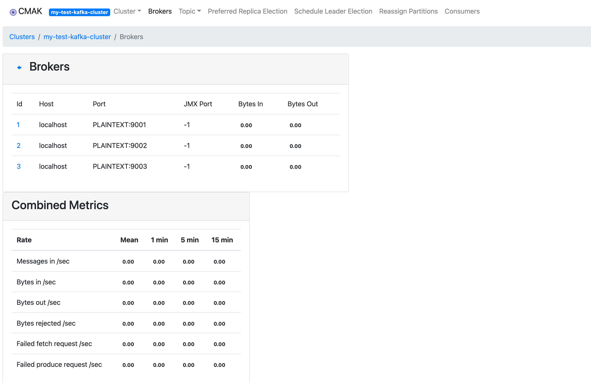

# CMAK安装和使用（之前叫kafka-manager）

[toc]

## 一、安装和启动

### 1.1 安装CMAK

参考：[安装和使用cmak（原名为kafka manager）](https://cloud.tencent.com/developer/article/1651137)

Java环境：需要jdk11+

```
$ java -version
java version "11.0.5" 2019-10-15 LTS
Java(TM) SE Runtime Environment 18.9 (build 11.0.5+10-LTS)
Java HotSpot(TM) 64-Bit Server VM 18.9 (build 11.0.5+10-LTS, mixed mode)
```

官网上已经提供了编译好的压缩包：[cmak-3.0.0.5.zip](https://github.com/yahoo/CMAK/releases/download/3.0.0.5/cmak-3.0.0.5.zip)。直接下载使用即可

### 1.2 启动cmak

修改配置`conf/application.conf`：

```
kafka-manager.zkhosts="localhost:2181"
kafka-manager.zkhosts=${?ZK_HOSTS}
cmak.zkhosts="localhost:2181"
cmak.zkhosts=${?ZK_HOSTS}

-- jmx 相关
basicAuthentication.username="admin"
basicAuthentication.username=${?KAFKA_MANAGER_USERNAME}
basicAuthentication.password="km^20211222"
basicAuthentication.password=${?KAFKA_MANAGER_PASSWORD
```

启动cmak：

```
nohup bin/cmak -Dhttp.port=10010 1>nohup.out 2>&1 &
```

## 二、使用CMAK

登陆CMAK：


### 2.1 添加kafka集群


### 2.2 topic 概述


- brokers Spread: broker 使用率，某个topic的partitions/brokers
- brokers Skew：broker的分配倾斜率
  - 失衡的broker：该broker上的partition数超过平均的partition，则该broker算失衡；
  - 失衡倾斜率：失衡的broker/所有的broker


### 2.3 broker概述




### 2.4 其他操作

添加分片：Add Partitions

分片重分配：Manaual Partition Assignments

