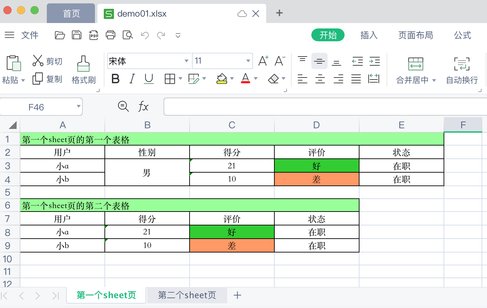

# Java工具总结：将数据内容写入excel文件

[toc]

## 一、背景

Java项目开发中，经常会遇到这样的需求：将数据内容写入excel文件。这里开发了一个将数据内容[写入excel文件的工具类](https://github.com/hefrankeleyn/JAVARebuild/tree/main/projects/mypoi-excel)，直接调用工具方法即可实现这样的需求。

> 市面上也有其他类似的工具，但大多理解起来很困难，封装得太完美，很难基于它进行定制改造。

该工具类是基于`org.apache.poi`开发出来了，理解起来非常容易。该工具类做得也非常灵活，能够实现常见的需求，比如：设置列宽、对列合并单元格、设置背景颜色等等。

## 二、功能描述

使用该[工具类](https://github.com/hefrankeleyn/JAVARebuild/blob/main/projects/mypoi-excel/src/main/java/com/hef/util/MyExcelUtil.java)将数据内容写入excel文件的过程中能够做下面这些事情：

- 创建一个不存在的excel文件；
- 在写入内容前，如果要写入的excel文件已经存在，会将该excel文件删除；
- 可以创建出多个sheet页，并向这多个sheet页写入内容；
- 每个sheet页，可以写入多个表格内容，每个表格之间会有一个空行；
- 可以基于rgb(三原色)为单元格设置特定的颜色；
- 可以设置表格列的宽度，设置的值，会被乘以256；
- 可以设定值，代表前多少列，为前几列的每一列进行合并单元格；

例如：



## 三、使用该工具类：Java代码演示

完整的演示代码：[MyExcelUtilTest](https://github.com/hefrankeleyn/JAVARebuild/blob/main/projects/mypoi-excel/src/test/java/com/hef/util/MyExcelUtilTest.java)。

```java
    /**
     * 将数据内容写入excel文件
     */
    @Test
    public void createNewExcelWriteContentTest() {
        String excelFilePath = "/Users/lifei/Documents/opt/doc/demo01.xlsx";
        ExcelContent excelContent = new ExcelContent();
        List<ExcelSheetContent> sheetContentList = new ArrayList<>();
        // 添加第一个sheet页的内容
        sheetContentList.add(createFirstSheet());
        // 添加第二个sheet页内容
        sheetContentList.add(createSecondSheet());
        // 添加多个sheet页的内容
        excelContent.setSheetContentList(sheetContentList);
        MyExcelUtil.createNewExcelWriteContent(excelContent, excelFilePath);
    }

    /**
     * 创建第一个sheet
     * @return
     */
    private ExcelSheetContent createFirstSheet() {
        // 第一个sheet页
        ExcelSheetContent firstSheetContent = new ExcelSheetContent();
        // 设置sheet页的名称
        firstSheetContent.setSheetName("第一个sheet页");
        List<TableContent> firstSheetTableList = new ArrayList<>();
        // 第一个sheet页里的第一个表格
        TableContent tableContent1 = createSheetFirstTable();
        // 第一个sheet页里的第二个表格
        TableContent tableContent2 = createSheetSecondTable();
        // 添加表格
        firstSheetTableList.add(tableContent1);
        firstSheetTableList.add(tableContent2);
        // 往第一个sheet页中，添加多个表格
        firstSheetContent.setTableContentList(firstSheetTableList);
        return firstSheetContent;
    }
    /**
     * 创建第一个表格
     * @return
     */
    private TableContent createSheetFirstTable() {
        TableContent tableContent = new TableContent();
        tableContent.setTitle("第一个sheet页的第一个表格");
        // 创建一个2行5列的表格
        int rowNum = 3, colNum = 5;
        CellContent[][] table = new CellContent[rowNum][colNum];
        table[0] = new CellContent[]{
                new CellContent.Builder().cellValue("用户").builder(),
                new CellContent.Builder().cellValue("性别").builder(),
                new CellContent.Builder().cellValue("得分").builder(),
                new CellContent.Builder().cellValue("评价").builder(),
                new CellContent.Builder().cellValue("状态").builder()
        };
        table[1] = new CellContent[]{
                new CellContent.Builder().cellValue("小a").builder(),
                new CellContent.Builder().cellValue("男").builder(),
                new CellContent.Builder().cellValue("21").builder(),
                new CellContent.Builder().cellValue("好").myCellBGColor(new MyCellColor(51, 204, 51)).builder(),
                new CellContent.Builder().cellValue("在职").builder()
        };
        table[2] = new CellContent[]{
                new CellContent.Builder().cellValue("小b").builder(),
                new CellContent.Builder().cellValue("男").builder(),
                new CellContent.Builder().cellValue("10").builder(),
                new CellContent.Builder().cellValue("差").myCellBGColor(new MyCellColor(255, 153, 102)).builder(),
                new CellContent.Builder().cellValue("在职").builder()
        };
        tableContent.setTable(table);
        // 添加标题颜色
        tableContent.setTitleBGColor(new MyCellColor(153, 255, 153));
        // 设置列宽
        tableContent.setColumnWidthsBase256(new int[]{20, 20, 20, 20, 20});
        // 设置标题居左
        tableContent.setTitleAlignment(HorizontalAlignment.LEFT);
        // 前两列的每一列，合并单元格
        tableContent.setMergeBeforeColNums(2);
        return tableContent;
    }
```

## 四、分析代码

完整的代码：[mypoi-excel](https://github.com/hefrankeleyn/JAVARebuild/tree/main/projects/mypoi-excel/src/main/java/com/hef)

### 4.1 几个重要的JavaBean：

- [`ExcelContent`](https://github.com/hefrankeleyn/JAVARebuild/blob/main/projects/mypoi-excel/src/main/java/com/hef/domain/ExcelContent.java)：代表excel的所有内容数据，里面包含多有sheet页内容；
- [`ExcelSheetContent`](https://github.com/hefrankeleyn/JAVARebuild/blob/main/projects/mypoi-excel/src/main/java/com/hef/domain/ExcelSheetContent.java) ：代表一个sheet页的内容，一个sheet页里面可以有多个不同“行数*列数”的二维表格；
- [`TableContent`](https://github.com/hefrankeleyn/JAVARebuild/blob/main/projects/mypoi-excel/src/main/java/com/hef/domain/TableContent.java)：代表sheet页中，一个“行数*列数”的二维表格；
- [CellContent](https://github.com/hefrankeleyn/JAVARebuild/blob/main/projects/mypoi-excel/src/main/java/com/hef/domain/CellContent.java)：单元格的内容；
- [MyCellColor](https://github.com/hefrankeleyn/JAVARebuild/blob/main/projects/mypoi-excel/src/main/java/com/hef/domain/MyCellColor.java)：单元格的背景颜色，基于rgb三原色；

### 4.2 工具类的调用入口

工具类的调用入口为：[`MyExcelUtil.createNewExcelWriteContent(excelContent, excelFilePath)`](https://github.com/hefrankeleyn/JAVARebuild/blob/main/projects/mypoi-excel/src/main/java/com/hef/util/MyExcelUtil.java)。

传入两个参数：

- `excelContent`：就是[`ExcelContent`](https://github.com/hefrankeleyn/JAVARebuild/blob/main/projects/mypoi-excel/src/main/java/com/hef/domain/ExcelContent.java)对象。
- `excelFilePath`：要生成的excel文件路径。文件所在的文件夹路径必须存在。如果文件已经存在会被删除后重建。

## 五、更多实用的工具类

作者会不断总结出更多实用的Java开发工具类，可以在这里看到：[Java开发中总结的非常实用的工具代码](https://github.com/hefrankeleyn/JAVARebuild/blob/main/document/2022-01-22-Java开发中总结的非常实用的工具代码.md)。

